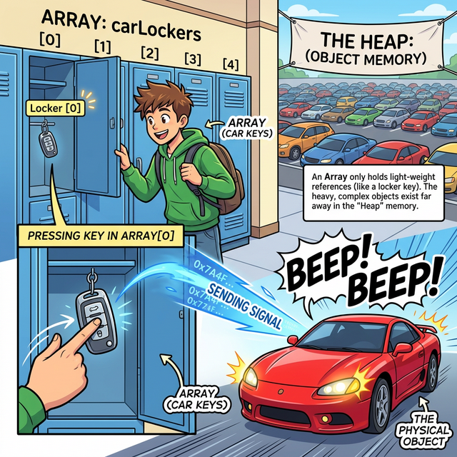
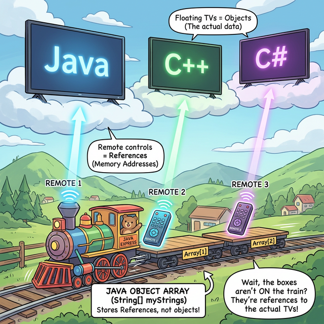
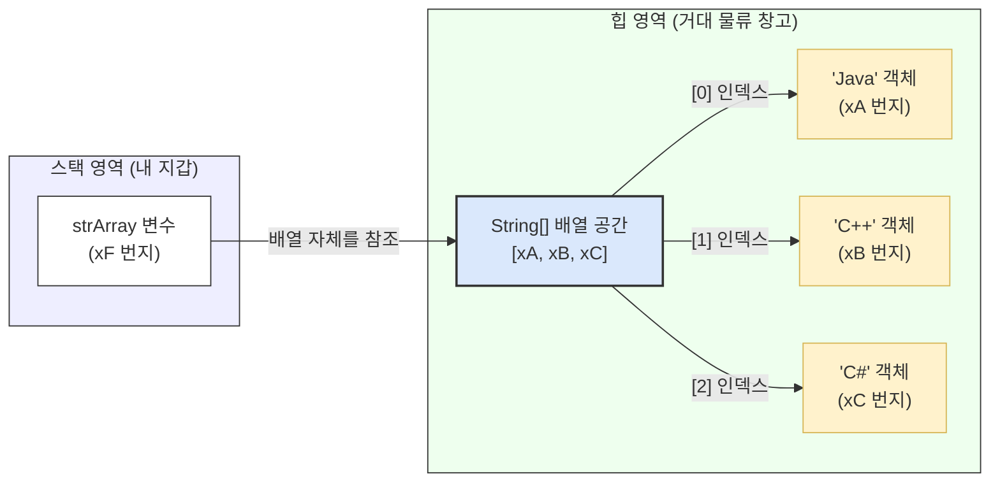

# 8.8 객체를 참조하는 배열 (Object Array)

## 1. 리모컨만 가득 실은 기차 📱🚂

이전 장에서 배운 `int`, `double` 같은 **기본 타입 배열**은 마치 "진짜 현금이 들어있는 금고"가 연달아 붙어있는 기차와 같았습니다. 기차 객실을 열어보면 진짜 값(숫자)이 들어있었죠.

하지만 `String`(문자열)이나 기타 객체를 담는 객체 배열(참조 타입 배열)은 완전히 다릅니다!
객체 배열의 각 칸에는 진짜 거대한 `String` 문자열 객체가 들어가는 것이 아니라, **그 객체가 위치한 다른 창고의 주소(리모컨)**만 들어갑니다.

### 🚗 사물함과 스마트 키(Key) 비유로 완벽 이해하기!

"배열 안에 객체를 직접 넣지 않고 왜 굳이 주소(리모컨)를 보관할까?" 라고 혼동하시는 분들이 많습니다. 이렇게 상상해 보세요!

여러분이 헬스장에 가서 3칸짜리 **사물함(배열)**을 배정받았습니다. 그리고 여러분은 3대의 **자동차(객체)**를 가지고 있습니다.
사물함 안에 그 거대한 진짜 자동차 3대를 욱여넣을 수 있을까요? 절대 불가능합니다! 사물함이 다 부서져 버리겠죠.




그래서 현실 세계에서도 우리는 넓은 야외 **주차장(Heap 영역)**에 진짜 자동차를 안전하게 주차해 두고, 사물함 안에는 오직 가볍고 자그마한 **'스마트 키(참조 주소)'**만 보관합니다. 

자바의 객체 배열도 똑같습니다! `String`이나 `Car` 같은 객체들은 크기가 제각각이고 매우 거대할 수 있기 때문에, 배열이라는 좁은 칸 안에는 **메모리 주소가 적힌 리모컨(스마트 키)**만 쏙 넣어두는 것입니다. 배열 인덱스 `[0]`번을 꺼내 쓴다는 것은, 0번 사물함에서 꺼낸 스마트 키의 버튼을 눌러 저 멀리 주차장에 있는 진짜 차(객체)를 조종하는 것과 완벽하게 동일한 원리입니다!



위 그림처럼 객체 배열은 `[0]`번 칸에서 버튼을 띠딕! 하고 누르면, 저 멀리 둥둥 떠 있는 "Java" TV(객체)가 켜지는 구조를 가지게 됩니다.

---

## 2. 힙(Heap) 안에서 일어나는 화살표 파티 🧠

다음과 같이 `String[]` 배열을 생성하고 값을 넣어봅시다.

```java
String[] strArray = new String[3];
strArray[0] = "Java";
strArray[1] = "C++";
strArray[2] = "C#";
```

이 코드가 실행되면 메모리 내부에서는 엄청난 일이 벌어집니다. `strArray` 배열 자체도 힙 영역에 생성되는 '객체'이고, त्या 안에서 가리키는 "Java", "C++" 등도 모두 독립적인 힙 영역의 '객체'입니다. 즉, 힙 안에서 배열이 또 다른 객체들을 레이저 화살표로 쏘며 참조하게 됩니다.





---

## 3. 🎧 Vibe 코딩 : 주소 비교(`==`) vs 알맹이 비교(`.equals()`)

우리가 8.3절과 8.5절에서 배웠던 무시무시한 사실 하나를 기억하시나요?
참조 타입은 `==` 로 비교하면 **집 껍데기(주소)**가 같은지 비교하고, `.equals()` 로 비교해야 **집 안방의 쌍둥이(내용)**가 같은지 비교하게 됩니다. 배열 안의 `String` 요소를 비교할 때도 이 원칙은 100% 똑같이 적용됩니다.

> **🗣️ 학생 프롬프트 (AI에게 이렇게 명령해 보세요):**
> "자바의 String 객체 배열에 똑같은 글자라도 리터럴로 넣은 것과 `new String()`으로 넣은 것이 섞여 있을 때, `==` 연산자로 비교한 결과와 `.equals()`로 비교한 결과가 어떻게 다르게 나오는지 증명하는 코드를 작성해 줘."

```java
public class VibeObjectArray {
    public static void main(String[] args) {
        
        System.out.println("🤖 객체 배열 비교 시뮬레이션 시작!");
        
        String[] languages = new String[3];
        languages[0] = "Java";               // 문자열 리터럴 (상수풀 XZ 주소 발급됨)
        languages[1] = "Java";               // 문자열 리터럴 (어? XZ에 "Java" 있네? 같은 주소 사용!)
        languages[2] = new String("Java"); // new 키워드 (내 돈 내산! 강제로 XY 라는 새 주소에 집 지음!)

        System.out.println("\n[0]번 객실 리모컨: " + System.identityHashCode(languages[0]));
        System.out.println("[1]번 객실 리모컨: " + System.identityHashCode(languages[1]));
        System.out.println("[2]번 객실 리모컨: " + System.identityHashCode(languages[2]));

        System.out.println("\n--- 🛑 잘못된 비교법 (==: 리모컨 주파수 비교) ---");
        System.out.println("0번과 1번 주소가 같습니까? " + (languages[0] == languages[1])); // true (상수풀 공유)
        System.out.println("0번과 2번 주소가 같습니까? " + (languages[0] == languages[2])); // false (완전히 다른 번지!)
        
        System.out.println("\n--- ✅ 올바른 비교법 (.equals(): 실제 TV 화면 비교) ---");
        System.out.println("0번과 2번 글자가 똑같습니까? " + languages[0].equals(languages[2])); // true ("Java"로 똑같음!)
    }
}
```

**[실행 결과 해석]**
`new String()` 을 사용해서 넣은 `languages[2]` 요소를 보면, 안에 써진 글자는 `"Java"` 로 완벽히 똑같음에도 불구하고 `==` 검사에서 가차없이 `false` 가 나옵니다. 힙 영역에 완전히 새로운 집(새 번지)을 지어버렸으니까요!

> **💡 핵심 정리:** 배열 안에 들어있는 문자열들이 전부 다 똑같은 글자인지 확인하고 싶다면 **절대로 `==` 를 쓰지 말고 무조건 `.equals()` 를 사용하여 꼼꼼하게 검사해야 합니다.**

---

## 코딩 영단어 학습 📝

코딩에서 영어 단어의 의미만 정확히 이해해도 절반은 성공입니다! 오늘 배운 핵심 영단어들을 다시 한번 짚고 넘어가 볼까요?

*   **`Object`**: 객체, 사물.
*   **`Array`**: 배열. (데이터를 나란히 줄 세워 놓은 구조)
*   **`Null`**: 널. (비어있음, 아무런 메모리 주소도 참조하지 않고 있음을 나타내는 특수 단어)
*   **`Literal`**: 리터럴. (코드에 변수 없이 글자 그대로 박아 넣은 고정 값)
*   **`Identity`**: 아이덴티티, 동일성. (완전히 똑같은 메모리 주소/주민번호를 가지는지 판별)
