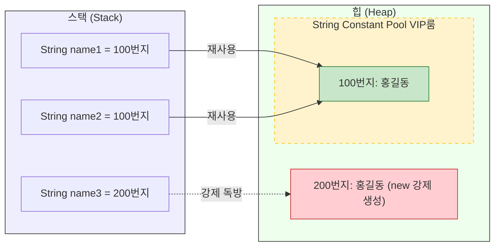
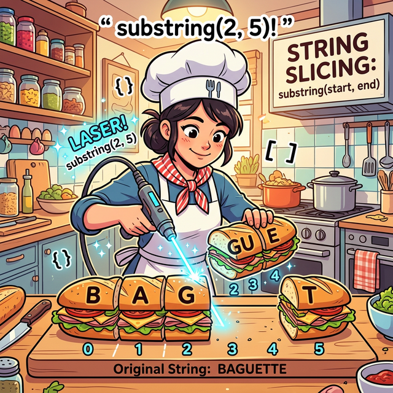

# 8.5 문자열(String) 타입

## 1. 문자열도 '객체(TV)' 입니다 📺

우리가 자바를 처음 배울 때부터 가장 편하게 쓰던 `String`은 기본 타입(`int`, `double` 등)이 아니라 시그니처 대문자로 시작하는 **참조 타입(클래스)**입니다.
즉 변수 안에는 진짜 글자가 아니라 힙 영역을 가리키는 **주소(리모컨)**가 저장됩니다.

## 2. 문자열 리터럴의 비밀 (String Constant Pool) ✨

자바에서 쌍따옴표(`""`)를 이용해 문자열을 만들면 재미있는 일이 벌어집니다.

```java
String name1 = "홍길동";
String name2 = "홍길동";
```

자바는 메모리를 아끼기 위해 똑같은 문자열 리터럴("홍길동")이 스크립트에 여러 번 등장하면 **힙 영역 내의 특별한 VIP 룸(String Constant Pool)**에 딱 1개만 만들어두고, 여러 변수가 **같은 주소를 재사용(공유)**하도록 유도합니다. (마치 도서관에서 같은 책을 여러 명이 돌려보는 것과 같습니다!)




하지만 `new String("홍길동")`으로 만들면 VIP룸을 무시하고, 강제로 힙 영역에 자기만의 '독방'을 새로 지어버리기 때문에 주소가 달라집니다.

---

## 3. String 비교의 모든 것: `==` vs `.equals()` ⚔️

참조 타입에서 **`==` 연산자**는 TV 화면(내용)을 비교하는 것이 아니라, 들고 있는 **리모컨(주소값)이 같은 건지**만 무식하게 비교합니다.
따라서 글자가 같더라도 `new`로 강제 생성하여 주소가 달라졌다면 `==`는 `false`를 뿜어냅니다.



> **💡 절대 규칙**: 자바에서 문자열의 내용(글자)이 똑같은지 검사할 때는, 묻지도 따지지도 말고 무조건 **`.equals()`** 메소드만 사용하세요! 이것이 자바 개발자의 불문율입니다.

**추가 비교 꿀팁:**
- `.equals(다른문자열)` : 대소문자까지 완벽하게 같은지 비교 (ex: "Java" != "java")
- `.equalsIgnoreCase(다른문자열)` : 대소문자를 무시하고 글자만 같은지 비교 (ex: "Java" == "jaVa")

---

## 4. 문자열 내부 탐험: 길이 확인과 문자 추출 🔍

문자열은 사실 내부적으로 '글자(char)'들이 기차처럼 연결된 배열 구조를 가지고 있습니다.
우리는 다양한 내장 메소드를 통해 이 기차의 길이를 재거나, 특정 칸에 탄 승객(문자 하나)을 핀셋으로 집어낼 수 있습니다.




### 1) 문자열 길이 알아내기: `length()`
주민등록번호나 전화번호가 제대로 입력되었는지 확인할 때 필수입니다. 주의할 점은 공백(띄어쓰기)도 1개의 문자로 취급한다는 것입니다.

```java
String subject = "자바 프로그래밍";
int length = subject.length(); // "자바 프로그래밍" -> 총 8글자 (공백 1개 포함)
```

### 2) 특정 위치의 문자만 쏙 뽑아내기: `charAt(인덱스)`
배열과 똑같이 문자열의 자리 번호(인덱스)는 **0번**부터 시작합니다.
주민등록번호에서 성별 부분만 쏙 빼서 남자인지 여자인지 판별할 때 유용합니다.

```java
String ssn = "010624-1230123";
char sex = ssn.charAt(7); // 7번째 자리의 '1' 문자를 뽑아냅니다. (인덱스는 0부터 세기 때문!)

if (sex == '1' || sex == '3') {
    System.out.println("남자입니다.");
} else if (sex == '2' || sex == '4') {
    System.out.println("여자입니다.");
}
```

---

## 5. 다양한 문자열 조작 마술 (`replace`, `substring`, `indexOf`, `split`) 🪄

원본 문자열(`String`)은 절대 내용을 바꿀 수 없다는 **불변성(Immutability)**의 법칙이 있습니다.
따라서 문자열을 자르거나 바꾸는 메소드를 쓰면, 원본이 바뀌는 게 아니라 **새롭게 변형된 새로운 문자열 리모컨을 반환**해 줍니다!

### 1) 마법의 교체 스프레이: `replace(기존문자, 새문자)`
게시판에서 욕설을 필터링하거나, 옛날 단어를 새 단어로 깔끔하게 일괄 교체할 때 사용합니다.
단, 명심해야 할 점은 기존의 문자열이 메모리 상에서 '변신'하는 것이 아닙니다. 자바의 문자열은 불변(Immutable)하므로, 교체된 결과물을 가진 **완전히 새로운 문자열 객체**가 힙 메모리에 탄생하는 것입니다!




```java
String oldStr = "자바는 객체지향 언어입니다. 자바는 풍부한 API를 지원합니다.";
String newStr = oldStr.replace("자바", "Java"); 
// oldStr 원본은 멀쩡히 살아있고, 새로운 "Java는..." 문자열이 newStr 리모컨에 담깁니다.
```

### 2) 원하는 부분만 정밀하게 오려내기: `substring()`
주민등록번호에서 생년월일 6자리만 잘라내거나, 이메일에서 아이디만 빼낼 때 등 매우 자주 쓰는 가위 역할을 합니다. 




- `substring(시작번호, 끝번호)`: 시작번호(포함)부터 **끝번호(미포함) 앞**까지만 싹둑 자릅니다.
- `substring(시작번호)`: 시작번호부터 끝까지 전부 다 통째로 거둬들입니다.

```java
String ssn = "880815-1234567";
String firstNum = ssn.substring(0, 6); // 0은 포함, 6 앞(5번 자리)인 "880815"만 자름
String secondNum = ssn.substring(7);   // 7번 자리('1')부터 끝까지 몽땅 다 자름
```

### 3) 글자 존재 유무 찾기: `indexOf(문자열)`
이 글자 안에 특정 단어가 포함되어 있는지, 위치가 어디인지 스캔(Scan)해줍니다.
만약 주어진 단어와 일치하는 것이 아예 없다면 **`-1`**을 반환합니다.
```java
String subject = "자바 프로그래밍";
int location = subject.indexOf("프로그래밍"); // "프로"가 시작하는 위치인 '3'을 반환

if (subject.indexOf("자바") != -1) {
    System.out.println("자바와 관련된 책이군요.");
}
// 요즘은 포함 여부만 간단히 볼 수 있는 contains() 메소드도 많이 씁니다!
// if (subject.contains("자바")) { ... }
```

### 4) 다진 마늘처럼 잘게 썰기: `split(구분자)`
엑셀 파일인 CSV(쉼표로 구분된 값)나, 여러 개의 이메일 주소가 쉼표 혹은 슬래시 등으로 붙어있을 때 이를 "String 배열" 로 이쁘게 타다닥 썰어서 반환합니다.
```java
String board = "1,자바 학습,참조 타입 String을 공부합니다.,홍길동";
String[] tokens = board.split(","); // 쉼표 기준으로 싹 다 잘라서 4칸짜리 배열 객체로 만듦!
// tokens[0] -> "1"
// tokens[1] -> "자바 학습" 
```

---

## 6. 🎧 Vibe 코딩 예제 1: 텍스트 이메일 주소 추출 및 불건전 단어 필터링

위에서 배운 문자 자르기(`substring`, `indexOf`)와 치환(`replace`)을 응용하여 실전 데이터 정제(Data Cleansing) 과정을 만들어봅시다.

> **🗣️ 학생 프롬프트 (AI에게 이렇게 명령해 보세요):**
> "자바 String 주요 메소드 중 `indexOf`, `substring`, `replace` 를 사용해서, 사용자 이메일에서 아이디 부분과 도메인 부분을 분리해서 출력하고, 만약 도메인에 'badsite.com' 같은 차단된 문자열이 있으면 그걸 'filtered.com'으로 강제로 바꿔주는 필터링 코드를 작성해 줘."

```java
public class VibeStringTransform {
    public static void main(String[] args) {
        
        System.out.println("📧 이메일 훌리건 검열 시스템 가동...");
        
        String userEmail = "hooligan@badsite.com";
        System.out.println("접수된 이메일: " + userEmail);
        
        // 1. 아이디와 도메인을 분리하기 (골뱅이 위치 찾기)
        int atIndex = userEmail.indexOf("@"); 
        
        // 2. 인덱스를 기준으로 앞부분(ID)과 뒷부분(도메인) 자르기
        String extractId = userEmail.substring(0, atIndex);
        String extractDomain = userEmail.substring(atIndex + 1); // 골뱅이 바로 다음부터 끝까지
        
        System.out.println("👤 분리된 ID: " + extractId);
        System.out.println("🌐 분리된 Domain: " + extractDomain);
        
        // 3. 차단된 사이트 필터링 (불변성 원칙 적용!)
        // replace()를 쓴다고 userEmail 원본이 바뀌지 않으므로 반환값을 다시 받아야 합니다!
        String safeEmail = userEmail.replace("badsite.com", "filtered.com");
        
        System.out.println("\n[원본 이메일 유지 여부 확인]");
        System.out.println("해킹 전 원본: " + userEmail); // 절대 안 바뀜!
        System.out.println("필터링된 이메일: " + safeEmail); // 새롭게 창조된 값
    }
}
```

---

## 7. 🎧 Vibe 코딩 예제 2: 가상 로그인 및 중요 개인정보 마스킹기

`length`, `charAt`, `equals`, `replace` 등을 종합 세트로 사용하여 가상의 로그인 검증기와 주민등록번호 별표 처리를 구현하는 실전 프로그램입니다.

> **🗣️ 학생 프롬프트 (AI에게 이렇게 명령해 보세요):**
> "자바 String 주요 메소드를 모두 체험할 수 있게, Scanner로 비밀번호를 쳐서 로그인(`equals`)하고, 성공하면 주어진 주민등록번호 문자열의 길이(`length`)를 잰 다음, 성별을 확인(`charAt`)하고, 뒷자리를 `*` 표시로 마스킹 암호화(`replace`, `substring`) 하는 종합 종합 예제를 하나 세련되게 작성해 줘."

```java
import java.util.Scanner;

public class VibeStringDeepDive {
    public static void main(String[] args) {
        
        System.out.println("🕵️ 철통 보안 시스템 가동 중...");
        
        // 데이터베이스에 저장된 진짜 비밀번호와 주민번호
        String dbPassword = "vibe"; 
        String ssn = "990101-1234567";
        
        Scanner scanner = new Scanner(System.in);
        System.out.print("비밀번호를 입력하세요: ");
        String inputPassword = scanner.nextLine(); 
        
        // 1. == 대신 무조건 .equals() 문자열 비교!
        if (inputPassword.equals(dbPassword)) {
            System.out.println("\n✅ 로그인 성공! 개인정보 데이터에 접근합니다.");
            
            // 2. 문자열 길이 확인 (하이픈 포함 총 14자리여야 정상!)
            if (ssn.length() != 14) {
                System.out.println("❌ 잘못된 주민등록번호 데이터 형식입니다.");
                return;
            }
            
            // 3. 특정 문자 뽑아내서 성별 판별
            char genderCode = ssn.charAt(7); 
            String genderStr = (genderCode == '1' || genderCode == '3') ? "남성" : "여성";
            System.out.println("👤 조회된 회원의 성별: " + genderStr);
            
            // 4. 아주 중요한 부분! 주민번호 뒷자리를 마스킹(***) 처리 (문자열 자르고 붙이기)
            // 우선 앞자리와 성별코드까지만 자른다 (0번 인덱스부터 8 미만까지, 즉 0~7)
            String safePrefix = ssn.substring(0, 8); 
            
            // 그 뒤에 별표 문자열을 강제로 결합 (+)
            String maskedSsn = safePrefix + "******";
            
            // 번외: 하이픈(-) 위치를 찾아보자
            int dashIndex = maskedSsn.indexOf("-");
            System.out.println("🔍 하이픈 위치: " + dashIndex + "번 인덱스");
            
            System.out.println("🛡️ 안전하게 변환된 주민번호: " + maskedSsn);
            
        } else {
            System.out.println("\n🚨 로그인 실패: 비밀번호가 일치하지 않습니다.");
        }
        
        scanner.close();
    }
}
```

이렇듯 **String 클래스**는 우리가 문자 데이터를 다루는 데 필요한 모든 무기(메소드)들을 다수 보유하고 있습니다! 여러분의 상상력에 따라 훨씬 다채로운 문자열 텍스트 분석 로직을 짤 수 있습니다.

---

## 코딩 영단어 학습 📝

코딩에서 영어 단어의 의미만 정확히 이해해도 절반은 성공입니다! 오늘 배운 핵심 영단어들을 다시 한번 짚고 넘어가 볼까요?

*   **`String`**: 스트링, 문자열. (단순한 글자 하나가 아니라 끊어지지 않은 문자들의 나열 묶음. 자바에선 참조 타입 객체!)
*   **`Constant Pool`**: 콘스턴트 풀. (힙 영역 내에서 똑같은 문자열 객체를 중복 생성하지 않고 재사용하기 위해 모아둔 특별한 상수 보관실)
*   **`Length`**: 렝스, 길이. (해당 문자열이 총 몇 개의 글자(공백 포함)로 이루어졌는지 세어주는 마법의 기능)
*   **`Replace`**: 리플레이스, 교체하다. (문자열의 특정 낡은 문자를 새로운 문자로 싹 바꿔주는 스프레이)
*   **`Substring`**: 서브스트링, 부분 문자열. (긴 전체 문자열 안에서 내가 원하는 구간만 가위로 정교하게 싹둑 잘라낸 조각)
