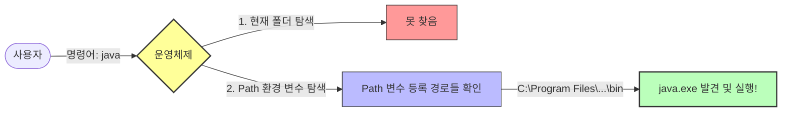

# 2.2 환경 변수 설정

## 1. 왜 설정하나요? (내비게이션 등록) 🗺️

JDK를 설치했지만, 컴퓨터(운영체제)는 아직 **자바 도구가 어디에 있는지 모릅니다.**
그래서 `java`라고 명령하면 "그게 뭐야?"라고 합니다.

환경 변수 설정은 **"자바 도구는 저기 서랍에 있어!"**라고 컴퓨터에게 **위치를 알려주는 작업**입니다.
이걸 해두면 집 안(컴퓨터) 어디서든 `java`라고 부르면 바로 달려옵니다.

## 2. 주요 환경 변수

### 1) `JAVA_HOME`
*   **의미**: "자바 설치된 메인 폴더가 여기야."
*   **값**: `C:\Program Files\Java\jdk-21` (윈도우 기준)

### 2) `Path`
*   **의미**: "명령어 찾을 때 이 길(Path)도 찾아봐."
*   **설정**: `%JAVA_HOME%\bin`을 추가합니다. (`bin` 폴더에 실행 파일들이 들어있거든요.)



## 3. 설정 확인

설정이 잘 됐는지 확인하려면 **터미널(명령 프롬프트)**을 열고 물어보세요.

```bash
java -version
```

**성공 시:**
```
java version "21.0.1" ...
```
(자바 버전이 나오면 성공!)

**실패 시:**
```
'java'은(는) 내부 또는 외부 명령...이 아닙니다.
```
(다시 설정해야 합니다.)
