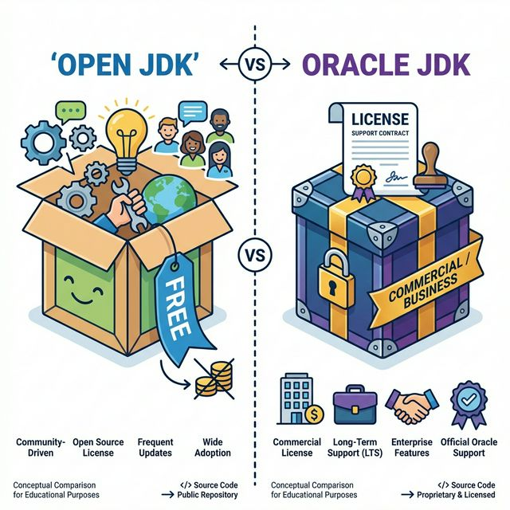
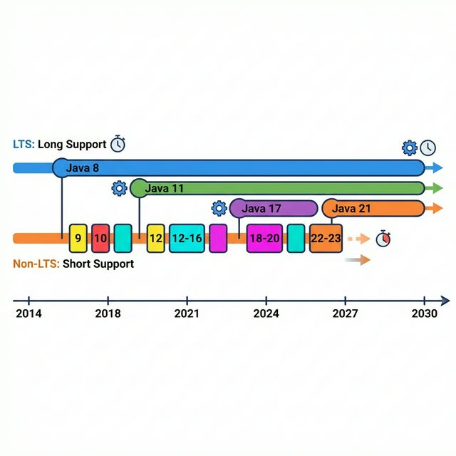
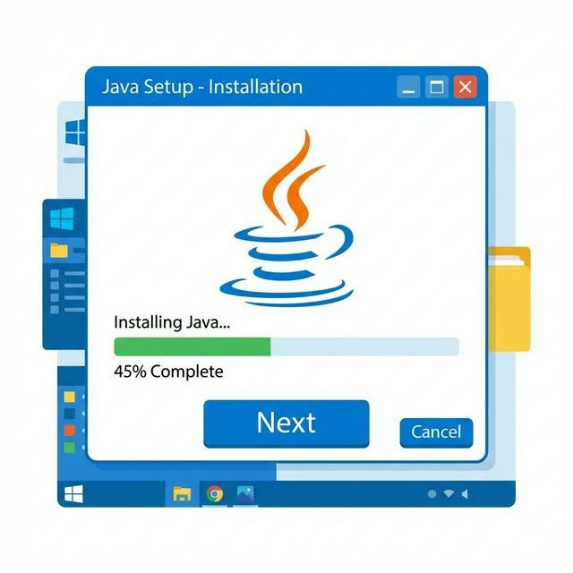
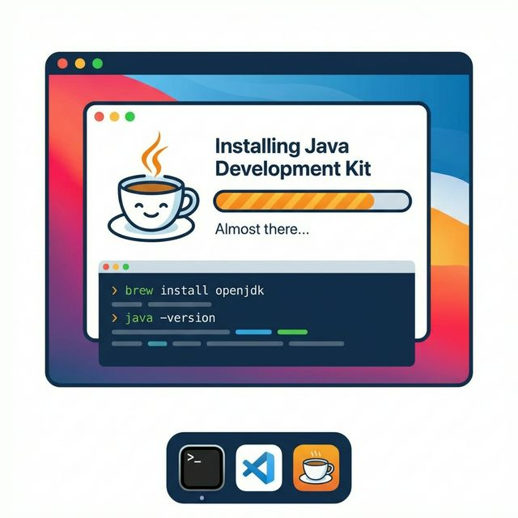

# 1.2 운영체제별 JDK 설치
자바 프로그램을 개발하고 실행하기 위해서는 먼저 Java SE(Standard Edition)의 구현체인 JDK(Java Development Kit)를 설치해야 한다. 

## JDK 종류
자바 개발 키트(JDK)는 라이선스와 배포 주체에 따라 크게 **Open JDK**와 **Oracle JDK**로 나뉜다.

| 구분                | Open JDK          | Oracle JDK                        |
| :------------------ | :---------------- | :-------------------------------- |
| 라이선스            | GNU GPL version 2 | Oracle Technology Network License |
| 사용료              | 무료              | 개발 및 학습: 무료, 상업용: 유료  |
| 개발 소스 공개 의무 | 있음              | 없음                              |

Oracle JDK는 Open JDK보다 응답성과 JVM 성능이 상대적으로 뛰어나다. 하지만 Open JDK의 성능도 지속적으로 향상되고 있으며, 더욱 안정화되었기 때문에 JDK 비용을 고려한다면 Open JDK를 사용하는 것이 유리하다. 

## JDK 다운로드
다음은 JDK를 다운로드할 수 있는 사이트이다.

| 종류       | 다운로드 사이트                                    |
| :--------- | :------------------------------------------------- |
| Open JDK   | https://jdk.java.net https://adoptium.net       |
| Oracle JDK | https://www.oracle.com/java/technologies/downloads |

> Open JDK를 사용하고 싶다면 'https://jdk.java.net' 사이트보다는 이클립스 재단(Eclipse Foundation)에서 관리하는 'https://adoptium.net' 사이트에서 다운로드하는 것이 좋다. 
> 어답티움 사이트에는 다양한 운영체제용 JDK와 LTS(Long Term Support) 버전을 제공하기 때문이다.

## LTS 버전

LTS는 장기간 기술 지원을 받을 수 있다는 뜻이므로 다른 버전보다 안정적으로 사용할 수 있다. LTS를 제공하는 버전은 JDK 8, JDK 11, JDK 17, JDK 21이다. Oracle JDK도 LTS 버전을 제공하기 때문에 우리는 Oracle JDK를 사용할 것이다. 

웹 브라우저에서 다음 사이트를 방문해 보자.

https://www.oracle.com/java/technologies/downloads

우리 책은 자바 21 버전을 사용하므로 JDK 21 버전을 다운로드하기 위해 [Java Downloads] 화면에서 아래로 스크롤한 후 [JDK 21] 탭을 클릭한다.

## 윈도우에서 설치

윈도우 사용자라면 [Windows] 탭을 클릭하고, [x64 Installer]의 다운로드 링크를 선택해 설치 파일 'jdk-21_windows-x64_bin.exe'를 다운로드한다.

파일 탐색기에서 다운로드한 JDK 설치 파일을 더블 클릭해서 실행하고, [사용자 계정 컨트롤] 대화상자에서 디바이스 변경을 허용하도록 [예] 버튼을 클릭한다. 이것은 JDK를 `C:\Program Files\Java`에 설치할 때 필요하다.

그리고 각 화면에서 [Next] 버튼을 클릭해서 기본 설치를 진행한다.
설치를 완료하면 JDK가 `C:\Program Files\Java\jdk-21` 경로에 저장된다.

## 맥OS에서 설치

맥OS 사용자라면 [macOS] 탭을 클릭하고, JDK를 설치할 PC가 애플(M)칩을 사용하면 [ARM64 DMG Installer]의 링크를, 인텔칩을 사용하면 [x64 DMG Installer]의 링크를 클릭해 설치 파일 'jdk-21_macos-aarch64[x64]_bin.dmg'를 다운로드한다.

다운로드한 JDK 설치 파일을 더블 클릭하면 나오는 'JDK 21.0.x.pkg' 파일을 더블 클릭한다. 그리고 나타나는 대화상자에서 다음과 같이 [계속] 및 [설치] 버튼을 클릭해서 설치를 진행한다.
