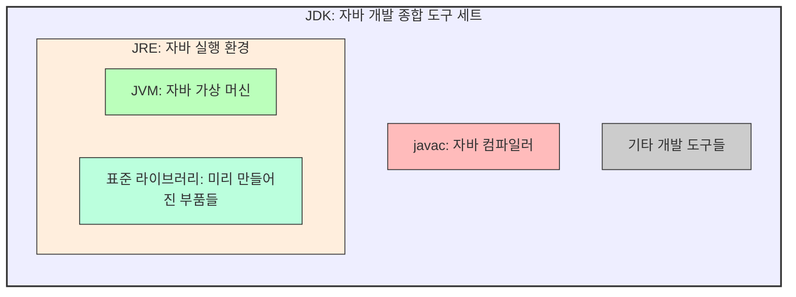

# 2.1 JDK 설치

## 1. JDK란? (요리 도구 세트) 🔪

자바로 요리(프로그래밍)를 하려면 도구가 필요합니다.
**JDK (Java Development Kit)**는 자바 개발에 필요한 모든 도구가 들어있는 **종합 선물 세트**입니다.

*   `javac`: 소스 코드를 번역하는 **컴파일러** (`.java` -> `.class`)
*   `java`: 프로그램을 실행하는 **JVM**
*   각종 라이브러리: 코딩할 때 쓸 수 있는 미리 만들어진 **부품들**

## 2. 어떤 JDK를 써야 하나요?

두 가지 종류가 있습니다.

| 종류           | 비유                | 설명                                                        |
| :------------- | :------------------ | :---------------------------------------------------------- |
| **Oracle JDK** | **프리미엄 브랜드** | 오라클 회사가 만듦. 성능이 좋고 관리가 잘 됨. (학습용 무료) |
| **Open JDK**   | **가성비 브랜드**   | 누구나 쓸 수 있는 무료 오픈소스 버전.                       |

우리는 **Oracle JDK 21 (LTS)** 버전을 사용합니다.
*   **LTS (Long Term Support)**: "오랫동안 AS 해줄게"라는 뜻으로, 안정적인 버전입니다.

## 3. 설치 방법 (요약)

### 사이트 접속
[Oracle JDK 다운로드](https://www.oracle.com/java/technologies/downloads)

### 윈도우 (Windows)
1.  **Windows** 탭 클릭
2.  `x64 Installer` 다운로드
3.  `Next`만 계속 누르면 설치 완료! (`C:\Program Files\Java\jdk-21`)

### 맥 (macOS)
1.  **macOS** 탭 클릭
2.  **M1/M2/M3 (애플 실리콘)**: `Arm64 DMG Installer`
3.  **Intel 맥**: `x64 DMG Installer`
4.  다운로드 후 실행하여 설치 완료!
