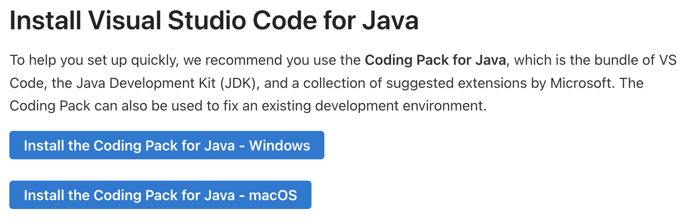

# 7. VS Code 설치 및 설정

최근 자바 개발 환경으로 Visual Studio Code(VS Code)가 많이 사용되고 있습니다.

 특히 'Coding Pack for Java'를 이용하면 JDK와 VS Code, 그리고 필요한 자바 확장 프로그램들을 한 번에 설치할 수 있어 매우 편리합니다.


## 1. Coding Pack for Java 설치

마이크로소프트에서는 자바 개발을 위한 올인원 설치 패키지인 'Coding Pack for Java'를 제공합니다.





1.  **다운로드**: [VS Code Java 페이지](https://code.visualstudio.com/docs/java/java-tutorial) 또는 직접 [Coding Pack for Java - Windows](https://aka.ms/vscode-java-installer-win) / [macOS](https://aka.ms/vscode-java-installer-mac) 링크를 통해 다운로드합니다.
2.  **설치 실행**: 다운로드한 인스톨러를 실행합니다.
    *   이 패키지는 **JDK** (Adoptium Eclipse Temurin 등), **VS Code**, 그리고 **Java Extension Pack**을 자동으로 확인하고, 없으면 설치해줍니다.
    *   이미 설치되어 있다면 해당 단계를 건너뜁니다.
3.  **설치 완료**: 설치가 완료되면 VS Code가 자동으로 실행됩니다.


### 1.1 맥설치

다운로드 pkg 파일을 확인하고 실행을 합니다.


## 2. Java Extensions 확인

Coding Pack을 사용하지 않고 VS Code를 따로 설치했거나, 설치 상태를 확인하려면 다음 확장 프로그램들이 설치되어 있는지 확인합니다. 

VS Code의 'Extensions' 뷰(Ctrl+Shift+X)에서 'Extension Pack for Java'를 검색하여 설치할 수 있습니다.


이 팩에는 다음 6개의 필수 확장이 포함되어 있습니다:

*   **Language Support for Java(TM) by Red Hat**: 코드 탐색, 자동 완성, 리팩토링 및 읽기 지원
*   **Debugger for Java**: 자바 애플리케이션 디버깅
*   **Java Test Runner**: JUnit 및 TestNG 테스트 실행
*   **Maven for Java**: Maven 프로젝트 지원
*   **Project Manager for Java**: 프로젝트 종속성 관리
*   **Visual Studio IntelliCode**: AI 기반 코드 추천


## 3. 프로젝트 생성 및 실행

1.  **명령 팔레트 열기**: `Ctrl+Shift+P` (macOS는 `Cmd+Shift+P`)를 누릅니다.
2.  **프로젝트 생성**: `Java: Create Java Project`를 입력하고 선택합니다


**빌드 도구 선택**: 'No build tools'를 선택합니다 (간단한 학습용).


1.  **폴더 선택**: 프로젝트를 저장할 폴더를 선택합니다.
2.  **프로젝트 이름 입력**: 예: `HelloJava`


**소스 작성**: `src/App.java` 파일이 자동으로 생성됩니다.

```java
public class App {
    public static void main(String[] args) throws Exception {
        System.out.println("Hello, World!");
    }
}
```


---

# 7. VS Code 설치 및 설정

최근 자바 개발 환경으로 Visual Studio Code(VS Code)가 많이 사용되고 있습니다.

 특히 'Coding Pack for Java'를 이용하면 JDK와 VS Code, 그리고 필요한 자바 확장 프로그램들을 한 번에 설치할 수 있어 매우 편리합니다.


## 1. Coding Pack for Java 설치

마이크로소프트에서는 자바 개발을 위한 올인원 설치 패키지인 'Coding Pack for Java'를 제공합니다.


1.  **다운로드**: [VS Code Java 페이지](https://code.visualstudio.com/docs/java/java-tutorial) 또는 직접 [Coding Pack for Java - Windows](https://aka.ms/vscode-java-installer-win) / [macOS](https://aka.ms/vscode-java-installer-mac) 링크를 통해 다운로드합니다.
2.  **설치 실행**: 다운로드한 인스톨러를 실행합니다.
    *   이 패키지는 **JDK** (Adoptium Eclipse Temurin 등), **VS Code**, 그리고 **Java Extension Pack**을 자동으로 확인하고, 없으면 설치해줍니다.
    *   이미 설치되어 있다면 해당 단계를 건너뜁니다.
3.  **설치 완료**: 설치가 완료되면 VS Code가 자동으로 실행됩니다.


### 1.1 맥설치

다운로드 pkg 파일을 확인하고 실행을 합니다.


## 2. Java Extensions 확인

Coding Pack을 사용하지 않고 VS Code를 따로 설치했거나, 설치 상태를 확인하려면 다음 확장 프로그램들이 설치되어 있는지 확인합니다. 

VS Code의 'Extensions' 뷰(Ctrl+Shift+X)에서 'Extension Pack for Java'를 검색하여 설치할 수 있습니다.


이 팩에는 다음 6개의 필수 확장이 포함되어 있습니다:

*   **Language Support for Java(TM) by Red Hat**: 코드 탐색, 자동 완성, 리팩토링 및 읽기 지원
*   **Debugger for Java**: 자바 애플리케이션 디버깅
*   **Java Test Runner**: JUnit 및 TestNG 테스트 실행
*   **Maven for Java**: Maven 프로젝트 지원
*   **Project Manager for Java**: 프로젝트 종속성 관리
*   **Visual Studio IntelliCode**: AI 기반 코드 추천


## 3. 프로젝트 생성 및 실행

1.  **명령 팔레트 열기**: `Ctrl+Shift+P` (macOS는 `Cmd+Shift+P`)를 누릅니다.
2.  **프로젝트 생성**: `Java: Create Java Project`를 입력하고 선택합니다


**빌드 도구 선택**: 'No build tools'를 선택합니다 (간단한 학습용).


1.  **폴더 선택**: 프로젝트를 저장할 폴더를 선택합니다.
2.  **프로젝트 이름 입력**: 예: `HelloJava`


**소스 작성**: `src/App.java` 파일이 자동으로 생성됩니다.

```java
public class App {
    public static void main(String[] args) throws Exception {
        System.out.println("Hello, World!");
    }
}
```


**실행**: `main` 메소드 위에 있는 `Run` 버튼을 클릭하거나, `F5`를 눌러 실행합니다. 

하단 터미널에 "Hello, World!"가 출력되는지 확인합니다.


---

## 코딩 영단어 학습 📝

코딩에서 영어 단어의 의미만 정확히 이해해도 절반은 성공입니다! 오늘 배운 핵심 영단어들을 다시 한번 짚고 넘어가 볼까요?

*   **`VS Code (Visual Studio Code)`**: 브이에스 코드. (마이크로소프트가 만든 전 세계 1위 무료 코드 편집기)
*   **`Extension`**: 익스텐션, 확장 프로그램. (VS Code에 추가로 덧붙여 설치해서 자바, 파이썬 등을 편리하게 쓸 수 있게 해주는 기능팩)
*   **`Package`**: 패키지, 꾸러미. (비슷한 종류의 관련 있는 코드 파일들을 하나로 예쁘게 분류해서 묶어놓은 기능 박스)
