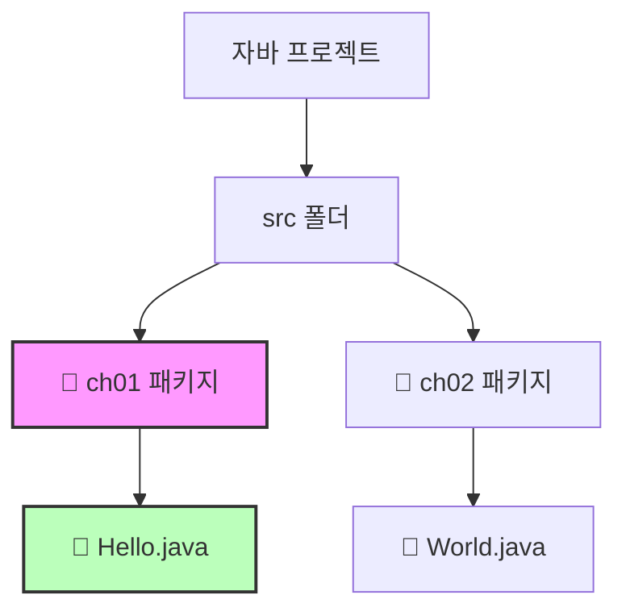
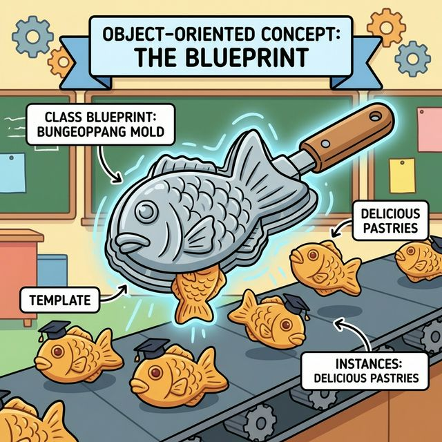
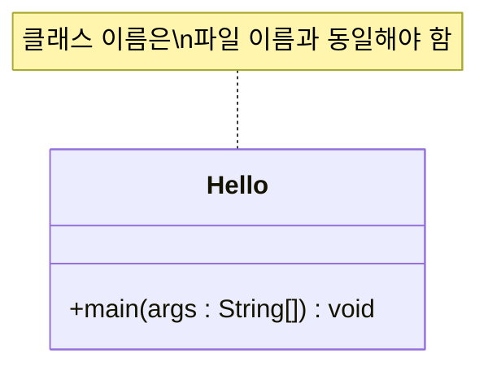
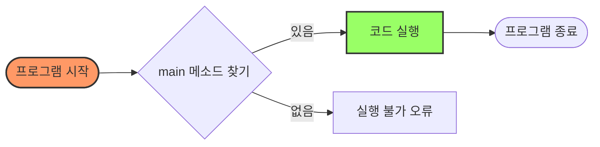
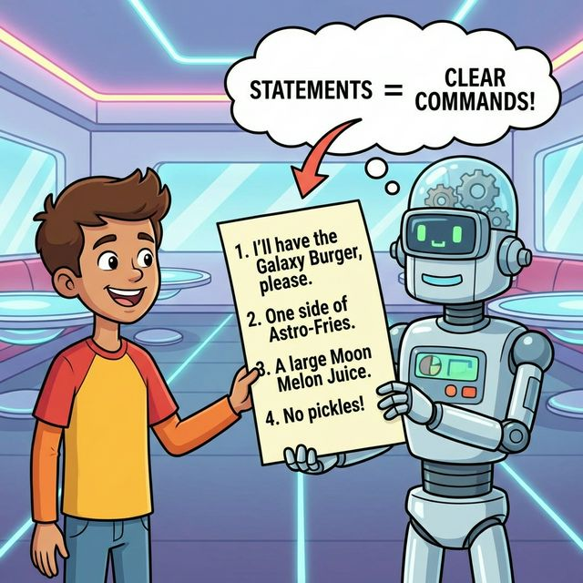

# 3.2 코드 용어 이해

방금 작성한 `Hello.java` 코드를 한 줄씩 뜯어보며, 자바 프로그램의 기본 구성 요소를 완벽하게 이해해 봅시다. 🕵️‍♂️

**예제 코드**

```java
package ch01; // ① 패키지 선언

public class Hello { // ② 클래스 선언
    
    public static void main(String[] args) { // ③ 메인 메소드 선언
        System.out.println("Hello"); // ④ 실행문
    }

}
```

---

## 1. 패키지 (Package) 📂

### 1) 개념
패키지는 **관련된 자바 클래스들을 묶어서 관리하는 폴더**와 같습니다.
컴퓨터에서 파일을 정리할 때 폴더를 만들어서 보관하듯이, 자바에서도 수많은 클래스 파일을 체계적으로 관리하기 위해 패키지를 사용합니다.


### 2) 비유: "컴퓨터의 폴더"
*   우리가 사진을 `사진` 폴더에, 문서를 `문서` 폴더에 정리하듯, 자바 파일도 성격에 맞는 패키지(폴더)에 넣어 관리합니다.
*   `package ch01;`이라는 선언은 **"이 파일은 `ch01`이라는 폴더 안에 소속되어 있다"**는 것을 명시하는 것입니다.


### 3) 구조 시각화



### 4) 상세 설명
*   **물리적 위치**: 실제로 파일 탐색기에서 프로젝트 폴더를 열어보면 `src/ch01` 경로에 `Hello.java` 파일이 있는 것을 확인할 수 있습니다.
*   **이름 충돌 방지**: 만약 다른 회사의 `Hello` 클래스와 내 `Hello` 클래스 이름이 같더라도, 패키지 이름이 다르면 서로 다른 파일로 인식됩니다. (예: `com.companyA.Hello` vs `com.companyB.Hello`)


---

## 2. 클래스 (Class) 📄

### 1) 개념
클래스는 **자바 프로그램의 기본 단위**이자, 객체를 만들기 위한 **설계도**입니다.
자바의 모든 코드는 반드시 클래스 안에 존재해야 합니다.


### 2) 비유: "파일 자체 또는 설계도"
*   `Hello.java`라는 파일을 만들었다면, 그 안에는 반드시 `Hello`라는 이름의 클래스가 있어야 합니다.
*   우리가 붕어빵을 만들기 위해 **붕어빵 틀**이 필요하듯이, 프로그램을 만들기 위해서는 **클래스(설계도)**가 필요합니다.



### 3) 구조



### 4) 상세 설명
*   **Naming Convention (명명 규칙)**: 클래스 이름은 소스 파일명과 **정확히 일치**해야 합니다. (대소문자 구별)
    *   파일: `Hello.java` 👉 클래스: `public class Hello`
*   **블록 `{ }`**: 클래스의 시작(`{`)과 끝(`}`)을 감싸는 중괄호 안에 모든 코드가 작성됩니다.

---

## 3. 메인 메소드 (main method) ▶️

### 1) 개념
메인 메소드는 **자바 프로그램의 시작점(Entry Point)**입니다.
자바 가상 머신(JVM)은 프로그램을 실행할 때 무조건 `main` 메소드를 찾아서 실행합니다.


### 2) 비유: "자동차의 시동 버튼"
*   자동차가 아무리 멋져도 시동 버튼을 누르지 않으면 움직이지 않듯이, 자바 프로그램도 **main 메소드**가 없으면 실행되지 않습니다.
*   프로그램 실행 = `main` 메소드 안의 내용 실행
  


### 3) 실행 흐름



### 4) 상세 설명
*   `public static void main(String[] args)`: 이 긴 문장은 "여기가 바로 시작점입니다!"라고 선언하는 약속된 문법입니다. 글자 하나라도 틀리면 실행되지 않습니다.
*   **진입점**: 프로그램이 시작되면 가장 먼저 호출되는 메소드입니다.

---

## 4. 실행문 (Statement) ✍️

### 1) 개념
실행문은 **컴퓨터에게 내리는 구체적인 명령**입니다.
변수를 선언하거나, 값을 계산하거나, 메소드를 호출하는 등의 작업을 수행합니다.



### 2) 비유: "문장과 마침표"
*   우리가 글을 쓸 때 문장 끝에 마침표(`.`)를 찍듯이, 자바에서는 명령이 끝날 때마다 **세미콜론(`;`)**을 찍어야 합니다.
*   `System.out.println("Hello");` 👉 "화면에 Hello라고 출력해라." (마침표)


### 3) 상세 설명
*   **순차적 실행**: 실행문은 위에서 아래로 순서대로 실행됩니다. (특별한 제어문이 없다면)
*   **세미콜론(`;`) 필수**: 자바 컴파일러는 세미콜론을 보고 "아, 여기까지가 하나의 명령이구나"라고 인식합니다. 빠뜨리면 컴파일 에러가 발생합니다.


