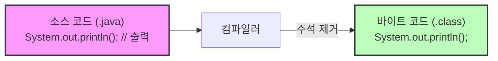

# 3.3 코드 주석 달기

## 1. 개발자를 위한 비밀 메모 📝

### 1) 개념
주석(Comment)은 **프로그램 실행에는 전혀 영향을 주지 않고**, 오직 사람(개발자)만이 읽을 수 있는 메모입니다.
코드를 작성하고 한 달 뒤에 다시 보면 "내가 이걸 왜 이렇게 짰지?" 하고 기억이 나지 않을 때가 많습니다. 이때 주석은 미래의 나, 혹은 동료 개발자에게 남기는 친절한 설명서가 됩니다.

### 2) 비유: "투명 인간 메모"
*   컴파일러(번역기)가 코드를 읽을 때, 주석은 마치 **투명 인간**처럼 취급됩니다. 아예 없는 셈 치고 넘어갑니다.
*   영화 대본에 배우가 할 대사뿐만 아니라 `(슬픈 표정으로)`, `(문을 쾅 닫으며)` 같은 **지문**이 있는 것과 비슷합니다. 관객(사용자)은 대사만 듣지만, 배우(개발자)는 지문을 보고 연기의 의도를 이해합니다.

### 3) 컴파일 과정 시각화



*   위 그림처럼 컴파일러는 주석(`// 출력`)을 싹 지우고 컴퓨터가 이해할 수 있는 코드로 변환합니다.

---

## 2. 주석의 종류

자바에는 크게 3가지 종류의 주석이 있습니다.

### 1) 한 줄 주석 (`//`)
*   `//` 기호가 나타난 시점부터 **그 줄의 끝까지** 주석으로 처리됩니다.
*   주로 짧은 설명이나 코드 바로 옆에 메모할 때 사용합니다.

**예제 코드**
```java
public class CommentExample {
    public static void main(String[] args) {
        // 이 줄은 전체가 주석입니다.
        System.out.println("Hello Java"); // 코드 뒷부분만 주석입니다.
    }
}
```

### 2) 여러 줄 주석 (`/* ... */`)
*   `/*`로 시작해서 `*/`로 끝날 때까지, **줄 바꿈이 있어도 모두** 주석으로 처리됩니다.
*   긴 설명이나 저작권 정보, 또는 코드의 일부분을 임시로 비활성화할 때 사용 유용합니다.

**예제 코드**
```java
/*
  작성자: 홍길동
  작성일: 2024.02.20
  내용: 
  이 프로그램은 자바의 주석 기능을 테스트하기 위해
  만들어진 간단한 예제입니다.
*/
public class Hello { 
    /* 
    System.out.println("이 코드는 실행되지 않습니다."); 
    */
}
```

### 3) 도큐먼트 주석 (`/** ... */`)
*   `/**`로 시작해서 `*/`로 끝납니다.
*   주로 라이브러리나 API를 만들 때 사용하며, `javadoc`이라는 도구를 통해 **공식 문서(HTML)**로 자동 변환될 수 있는 주석입니다. (지금은 몰라도 괜찮습니다!)

---

## 3. 좋은 주석이란?

> "코드는 보석처럼, 주석은 보석함처럼."

*   **나쁜 주석**: 코드를 그대로 읽어주는 주석 (중복)
    ```java
    int a = 10; // 변수 a에 10을 대입
    ```
*   **좋은 주석**: 코드의 **의도**나 **이유**를 설명하는 주석
    ```java
    int limit = 10; // 서버 부하를 방지하기 위해 최대 접속자 수를 10명으로 제한
    ```

**팁**: 가장 좋은 코드는 주석이 없어도 변수 이름과 메소드 이름만 보고도 이해할 수 있는 코드입니다. 주석은 **"무엇(What)"**이 아니라 **"왜(Why)"**를 설명해야 합니다.
