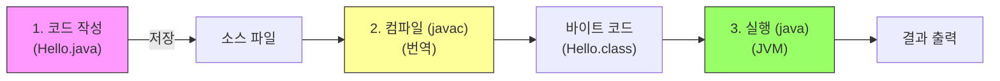

# 3.1 소스 작성부터 실행까지

자바 프로그램이 어떻게 만들어지고 실행되는지, 그 전체 과정을 **요리**에 비유하여 알아봅니다. 🍳

## 1. 전체 과정 한눈에 보기 👁️

자바 개발은 크게 **3단계**로 이루어집니다.



---

## 2. 단계별 상세 설명 📝

### 1단계: 코드 작성 (레시피 적기)
*   **비유**: **요리 레시피**를 종이에 적는 단계입니다.
*   **설명**: 사람(개발자)이 이해할 수 있는 언어(Java)로 명령을 작성하여 파일로 저장합니다. 이때 파일 확장자는 반드시 `.java`여야 합니다.


**작성 예시 (`Hello.java`)**
```java
public class Hello {
    public static void main(String[] args) {
        System.out.println("Hello, Java");
    }
}
```

### 2단계: 컴파일 (번역하기)
*   **비유**: 한국어로 적힌 레시피를 **외국인 요리사(컴퓨터)**가 볼 수 있도록 영어로 **번역**하는 과정입니다.
*   **도구**: `javac.exe` (자바 컴파일러)
*   **명령어**: `javac Hello.java`
*   **결과**: 번역이 성공하면 기계어가 섞인 `Hello.class` (바이트 코드) 파일이 생성됩니다. 이 파일은 사람이 읽을 수 없습니다.


### 3단계: 실행 (요리하기)
*   **비유**: 번역된 레시피를 보고 요리사가 실제로 **요리**를 해서 음식을 내놓는 단계입니다.
*   **도구**: `java.exe` (자바 가상 머신 구동기)
*   **명령어**: `java Hello` (확장자 `.class`는 생략합니다!)
*   **결과**: 화면에 "Hello, Java"라는 결과가 출력됩니다.


---

## 3. 실습: 직접 해보기 💻

### 1. 작업실 만들기 (폴더 생성)
탐색기(Finder)에서 `C:\temp` (또는 원하는 곳) 폴더를 만들고, 그 안에 `Hello.java` 파일을 만듭니다.

### 2. 컴파일 하기
터미널(명령 프롬프트)을 열고, 파일이 있는 곳으로 이동한 후 아래 명령어를 입력합니다.

```bash
javac Hello.java
```

> **성공?** 아무 메시지 없이 다음 줄로 넘어가면 성공입니다! 폴더를 보면 `Hello.class` 파일이 생겼을 것입니다.
> **실패?** 에러 메시지가 뜬다면 오타가 없는지, 대소문자를 정확히 썼는지 확인하세요.

### 3. 실행 하기
이제 번역된 파일을 실행해 봅시다.

```bash
java Hello
```

**실행 결과**
```
Hello, Java
```
화면에 문구가 출력되면 성공입니다! 🎉

---

## 4. 자주 발생하는 실수 ⚠️

1.  **파일명 불일치**: `class Hello`라고 적었으면 파일명도 무조건 `Hello.java`여야 합니다. (`hello.java` ❌)
2.  **확장자 입력**: 실행할 때는 `java Hello.class`가 아니라 `java Hello`입니다.
3.  **세미콜론 누락**: 문장 끝에 `;`를 빼먹지 않았는지 확인하세요.
