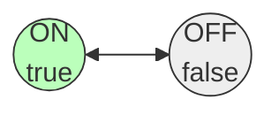
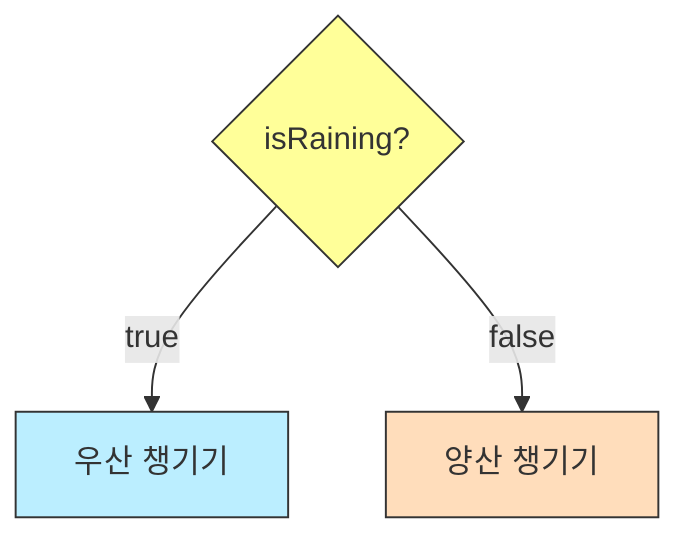

# 4.5 논리 타입 (boolean)

컴퓨터 세상에서의 대답은 오직 **"YES"** 아니면 **"NO"**입니다.
이 둘 중 하나를 저장하는 타입이 바로 **boolean(불리언)**입니다.

---

## 1. 참과 거짓 (True or False) 🚥

### 1) 개념
`boolean` 타입은 오직 두 가지 값만 가질 수 있습니다.
*   **`true`**: 참 (맞다, 켜짐, 성공)
*   **`false`**: 거짓 (아니다, 꺼짐, 실패)

### 2) 비유: "전등 스위치"
*   방의 전등 스위치는 **ON(켜짐)** 또는 **OFF(꺼짐)** 두 가지 상태밖에 없습니다. "반만 켜짐" 같은 건 없습니다.
*   boolean 변수도 마찬가지로 딱 두 가지 상태만 저장합니다.

### 3) 상태 시각화



---

## 2. 사용 예시

### 1) 변수 선언 및 초기화
주로 상태를 나타내는 변수 이름 앞에 `is`, `has`, `can` 등을 붙여서 질문형으로 짓습니다.

```java
boolean isStop = true;   // 멈췄나요? 네(true)
boolean hasApple = false; // 사과가 있나요? 아니요(false)
boolean canRun = true;    // 달릴 수 있나요? 네(true)
```

### 2) 흐름 제어 (Flow Control)
boolean 타입은 주로 **조건문(`if`)**이나 **반복문(`while`)**에서 프로그램의 흐름을 결정할 때 사용됩니다.

```java
boolean isRaining = true;

if (isRaining) {
    System.out.println("우산을 챙기세요! ☔️");
} else {
    System.out.println("양산을 챙기세요! ☀️");
}
```


