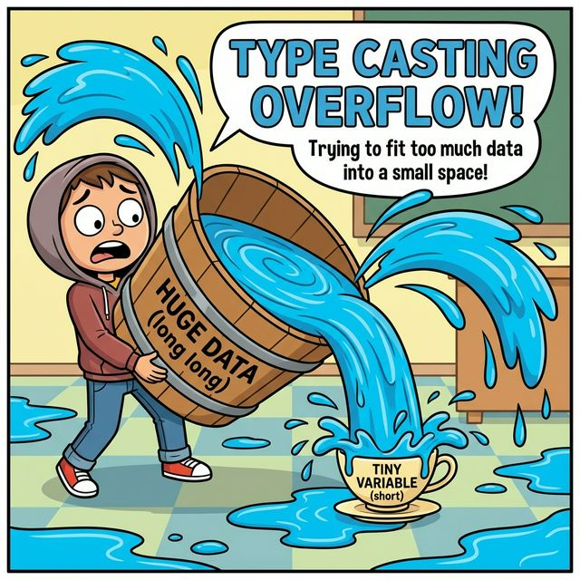

# 4.8 강제 타입 변환

## 1. 큰 양동이 물을 작은 컵에 붓기 🪣 -> 🥛

반대로, **큰 타입**의 값을 **작은 타입**에 넣으려고 하면 어떻게 될까요?
물이 넘칠 수 있습니다(데이터 손실).
그래서 자바는 이걸 말립니다. (컴파일 에러)

하지만 개발자가 "괜찮아, 안 넘쳐! 내가 책임질게!"라고 강제로 넣을 수 있습니다.
이것을 **강제 타입 변환(Casting, 캐스팅)**이라고 합니다.



```mermaid
flowchart LR
    BigBucket[큰 양동이\ndouble\n'3.14'] -->|강제 압축 (캐스팅)| SmallCup[작은 컵\nint\n'3']
    Overflow((💦 \n물 넘침!\n.14 손실)) -.-> SmallCup
    
    style BigBucket fill:#bdf,stroke:#333,shape:cylinder,stroke-width:2px
    style SmallCup fill:#def,stroke:#333,stroke-width:2px
    style Overflow fill:#f99,stroke:#f00,stroke-dasharray: 5 5
```

## 2. 캐스팅 방법

작은 컵 이름(타입)을 괄호 `()` 안에 적어주면 됩니다.

```java
double big = 3.14;
int small = (int) big; // 강제로 int로 바꿈

System.out.println(small); // 3 (소수점 .14는 버려짐)
```

## 3. 문자열을 숫자로 변환하기

문자열(`String`)을 숫자(`int`, `double`)로 바꿀 때는 캐스팅이 아니라 특별한 방법을 씁니다.

*   `String` -> `int`: **`Integer.parseInt("10")`**
*   `String` -> `double`: **`Double.parseDouble("3.14")`**
*   ` 숫자` -> `String`: **`String.valueOf(10)`**

```java
String s = "100";
int value = Integer.parseInt(s);
```
