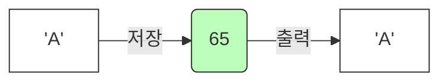

# 4.3 문자 타입 (char)

자바에서 글자 하나를 다루는 방법, **`char` (Character)** 타입에 대해 알아봅니다.

---

## 1. 글자 하나만 저장하기 (' ') 🔤

### 1) 개념
`char`는 **딱 하나의 문자**만 저장할 수 있는 타입입니다.
반드시 **작은따옴표(`' '`)**로 감싸야 합니다.

### 2) 비유: "레고 블록 한 개"
*   `char`가 레고 블록 **한 개**라면, `String`(문자열)은 블록이 여러 개 연결된 **완성품**입니다.
*   블록 한 개(`char`)는 `'A'`, 완성품(`String`)은 `"ABC"`입니다.

### 3) 코드 예시
```java
char grade = 'A';    // (O) 한 글자
char hangul = '가';  // (O) 한 글자
// char error = "A"; // (X) 큰따옴표 안 됨 (String)
// char error2 = 'AB'; // (X) 두 글자 안 됨
```

---

## 2. 컴퓨터가 문자를 기억하는 법 (Unicode) 🔢

### 1) 개념
컴퓨터는 사실 '글자'를 모릅니다. 오직 0과 1(숫자)만 알 뿐입니다.
그래서 전 세계 모든 글자에 고유한 **번호**를 붙여서 약속했습니다. 이것을 **유니코드(Unicode)**라고 합니다.

### 2) 저장 방식 시각화



*   우리가 `'A'`라고 입력하면 컴퓨터는 **`65`**라는 숫자로 기억합니다.
*   우리가 `'가'`라고 입력하면 컴퓨터는 **`44032`**라는 숫자로 기억합니다.

### 3) 코드 확인
```java
char c1 = 'A';      // 문자 'A' 저장
char c2 = 65;       // 'A'의 유니코드 번호 65 저장
char c3 = '\u0041'; // 'A'의 16진수 유니코드 코드값 저장

System.out.println(c1); // A
System.out.println(c2); // A (똑같이 'A'가 출력됨)
System.out.println(c3); // A
```

---

## 3. 자주 하는 실수 ⚠️

### 1) 빈 문자 (Empty Character)
`char` 변수에는 아무것도 없는 빈 값(`''`)을 넣을 수 없습니다. 최소한 **공백(Space)** 하나라도 있어야 합니다.

```java
char c1 = '';   // (X) 에러 발생! (빈 문자 불가)
char c2 = ' ';  // (O) 공백 문자 가능 (Space)
String s = "";  // (O) 문자열은 빈 값 가능
```

### 2) 문자 vs 문자열

| 타입       | 키워드   | 기호             | 예시    | 비유           |
| :--------- | :------- | :--------------- | :------ | :------------- |
| **문자**   | `char`   | 작은따옴표 `' '` | `'A'`   | 벽돌 1개       |
| **문자열** | `String` | 큰따옴표 `" "`   | `"ABC"` | 벽돌로 쌓은 벽 |
