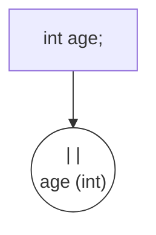

# 4.1 변수 선언과 저장

프로그래밍에서 데이터를 다루는 가장 기본적인 방법, **변수(Variable)**에 대해 알아봅시다.

---

## 1. 변수란 무엇인가? (Data Box) 📦

### 1) 개념
변수는 **하나의 값을 저장할 수 있는 메모리 공간**입니다.
쉽게 말해, 프로그램에서 사용할 데이터를 담아두는 **이름표가 붙은 상자**라고 생각하면 됩니다.

### 2) 비유: "물건 정리 상자"
*   이사할 때 "주방용품", "책", "옷"이라고 쓴 상자를 준비하듯이, 프로그래밍에서도 데이터를 담기 전에 **어떤 데이터를 담을 상자인지** 미리 정해야 합니다.
*   **주의**: "옷" 상자(`int`)에 "물"(`String`)을 담으려고 하면 안 들어갑니다. (타입 일치 필요)

---

## 2. 변수 선언 (상자 준비하기) 🏷️

변수를 사용하려면 먼저 **선언(Declaration)**을 해야 합니다.
"나 이제부터 이 이름으로 된 상자를 쓸 거야!"라고 컴퓨터에게 알리는 것입니다.

```java
// 타입 변수이름;
int age;       // 정수(int)를 담을 상자, 이름은 age
double height; // 실수(double)를 담을 상자, 이름은 height
```

### 상자 만들기 시각화



*   아직 상자 안은 비어있습니다. (정확히는 알 수 없는 쓰레기 값이 들어있을 수 있습니다.)

---

## 3. 값 대입 (상자에 물건 넣기) 📥

준비된 상자에 값을 넣는 것을 **대입(Assignment)**이라고 합니다.
대입 연산자 **`=`**를 사용합니다.

```java
age = 25;      // age 상자에 25를 넣음
height = 175.5 // height 상자에 175.5를 넣음
```

### 1) 대입 연산자 `=` 의 의미
수학에서는 `=`가 "같다"는 뜻이지만, 프로그래밍에서는 **"오른쪽의 값을 왼쪽의 상자에 넣어라"**는 뜻입니다.

```mermaid
graph LR
    Value[25] -->|대입 (=)| Box(("|  25  |<br>age"))
    style Box fill:#bfb,stroke:#333
```

---

## 4. 변수 초기화 (Initialization) 🆕

변수 선언과 동시에 값을 넣는 것을 **초기화**라고 합니다.
가장 많이 사용하는 방식입니다.

```java
int score = 90; // 상자를 만들자마자 90을 넣음
```

### 초기화하지 않은 변수는 사용할 수 없다! 🚫
```java
int value; // 선언만 함 (값 없음)
int result = value + 10; // (X) 에러 발생!
```
*   **비유**: 빈 상자에서 물건을 꺼내려다가 손이 허공을 가르는 것과 같습니다. 반드시 값을 넣은 후에 사용해야 합니다.

---

## 5. 변수 이름 명명 규칙 (Naming Convention) 📜

변수 이름은 개발자가 마음대로 지을 수 있지만, 몇 가지 규칙과 관례가 있습니다.

1.  **영어 대소문양 구분**: `score`와 `Score`는 다른 변수입니다.
2.  **첫 글자는 소문자**: `myScore` (권장), `MyScore` (X - 클래스 이름 같음)
3.  **카멜 표기법(CamelCase)**: 여러 단어를 합칠 때, 두 번째 단어부터 첫 글자를 대문자로 씁니다. (낙타 등처럼 불룩하다는 뜻 🐫)
    *   `mathScore`, `userName`, `maxSpeed`
4.  **예약어 사용 금지**: 자바가 이미 쓰고 있는 단어(`int`, `class`, `public` 등)는 변수 이름으로 쓸 수 없습니다.
