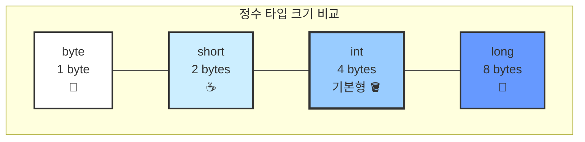

# 4.2 정수 타입

소수점이 없는 숫자(..., -1, 0, 1, ...)를 저장할 때 사용하는 타입입니다.
자바는 숫자의 크기에 따라 4가지 크기의 상자를 제공합니다.


---

## 1. 정수 타입 4총사 📏

### 1) 크기 비교
메모리 공간의 크기에 따라 담을 수 있는 숫자의 범위가 다릅니다.

| 타입      | 메모리 크기 | 비유 (물통 크기) | 저장 가능한 값의 범위 (대략) | 설명                          |
| :-------- | :---------- | :--------------- | :--------------------------- | :---------------------------- |
| `byte`    | 1 byte      | **소주잔** 🍶     | -128 ~ 127                   | 매우 작은 숫자                |
| `short`   | 2 byte      | **머그컵** ☕️     | -32,768 ~ 32,767             | 작은 숫자 (C언어 호환용)      |
| **`int`** | 4 byte      | **물동이** 🪣     | 약 -21억 ~ 21억              | **기본 정수 타입**            |
| `long`    | 8 byte      | **물탱크** 🚛     | 약 -922경 ~ 922경            | 금융, 과학 등 **대용량 숫자** |

### 2) 크기 시각화 (상자 크기 비교)



---

## 2. 기본 타입: int (Integer)

### 1) 개념
자바에서 정수를 다룰 때 가장 **기본**이 되는 타입입니다.
특별한 이유가 없다면 정수는 무조건 `int`를 사용하면 됩니다.

### 2) 왜 int가 기본인가요?
*   CPU가 숫자를 계산할 때 4byte 단위로 처리하는 것이 가장 빠르고 효율적이기 때문입니다.

```java
int score = 95;
int count = 10;
```

---

## 3. 대용량 타입: long

### 1) 개념
`int`가 담을 수 있는 범위(약 ±21억)를 초과하는 숫자를 다룰 때 사용합니다.
*   예: 유튜브 조회수(수십억 회), 은행 잔고, 행성 간 거리 등

### 2) 주의 사항: L 접미사
`long` 타입 변수에 값을 대입할 때는 숫자 뒤에 **`L`** 또는 **`l`**을 붙여야 합니다. (소문자 `l`은 숫자 `1`과 헷갈리므로 대문자 `L` 권장)
컴파일러에게 "이건 int가 아니라 long이야!"라고 알려주는 표시입니다.

```java
long balance = 3000000000L; // 30억 (int 범위 초과)
long distance = 100L;       // int 범위 내라도 L 붙이는 습관
```

---

## 4. 작은 타입: byte, short

### 1) 개념
메모리를 극도로 아껴야 하거나, 파일 전송/이미지 처리처럼 바이너리 데이터를 다룰 때 사용합니다.
일반적인 프로그래밍에서는 잘 사용하지 않습니다.

### 2) 오버플로우 (Overflow) 주의
작은 컵에 물을 너무 많이 부으면 넘치듯이, 변수의 범위를 넘는 값을 넣으면 엉뚱한 값으로 변해버립니다.

```java
byte b = 127; // byte의 최대값
b = b + 1;    // 128이 되는 게 아니라 -128이 됨 (오버플로우)
```
*   **비유**: 자동차 주행거리가 99999km에서 1km 더 달리면 00000km로 돌아가는 현상과 비슷합니다.
