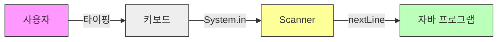

# 4.11 키보드 입력

지금까지는 우리가 코드에 정해놓은 값만 출력했습니다.
이제 막 실행된 프로그램이 사용자와 **대화(입력)**하는 방법을 알아봅니다. ⌨️

---

## 1. 스캐너 (Scanner) 📡

### 1) 개념
자바 프로그램은 기본적으로 **듣는 기능**이 없습니다.
키보드로 입력된 내용을 읽어들이기 위해서는 **`Scanner`**라는 도구(클래스)를 사용해야 합니다.

### 2) 비유: "마이크와 통역사"
*   **키보드**: 사용자의 목소리 (데이터 발신)
*   **System.in**: 마이크 (들어오는 통로)
*   **Scanner**: 통역사 (들어온 소리를 문자나 숫자로 변환해서 프로그램에 전달)

### 3) 입력 흐름 시각화



---

## 2. 사용법 3단계 🛠️

스캐너를 사용하려면 딱 3단계만 기억하면 됩니다.

### 1단계: 도구 꺼내기 (Import)
자바에게 "나 스캐너 쓸 거야!"라고 알려줍니다. (맨 윗줄에 작성)
```java
import java.util.Scanner;
```

### 2단계: 스캐너 켜기 (객체 생성)
`System.in`(입력 장치)에 빨대를 꽂아서 스캐너를 만듭니다.
```java
Scanner scanner = new Scanner(System.in);
```

### 3단계: 입력 받기 (메소드 호출)
변수에 입력받은 값을 저장합니다.
```java
String input = scanner.nextLine(); // 엔터 칠 때까지 기다림
```

---

## 3. 실전 예제: 나이 계산기 🧮

사용자에게 태어난 연도를 입력받아 나이를 계산하는 프로그램입니다.

```java
import java.util.Scanner;

public class AgeCalculator {
    public static void main(String[] args) {
        // 1. 스캐너 생성
        Scanner scanner = new Scanner(System.in);

        // 2. 안내 메시지 출력
        System.out.print("태어난 연도를 입력하세요: ");

        // 3. 문자열로 입력 받기
        String str = scanner.nextLine(); 

        // 4. 숫자로 변환 (Parsing)
        int birthYear = Integer.parseInt(str);
        int age = 2024 - birthYear;

        // 5. 결과 출력
        System.out.println("당신의 나이는 " + age + "세 입니다.");
    }
}
```

---

## 4. 자주 하는 실수: nextInt() 사용 시 주의 ⚠️

숫자를 입력받을 때 `scanner.nextInt()`를 사용하면 편해 보이지만, **줄바꿈 문자(Enter)**가 찌꺼기처럼 남아서 다음 입력을 방해할 수 있습니다.

> **추천 방법**: 무조건 **`nextLine()`**으로 문자열을 모두 읽어들인 후, 필요하면 **`Integer.parseInt()`**로 변환하는 것이 정신 건강에 좋습니다. 👍
