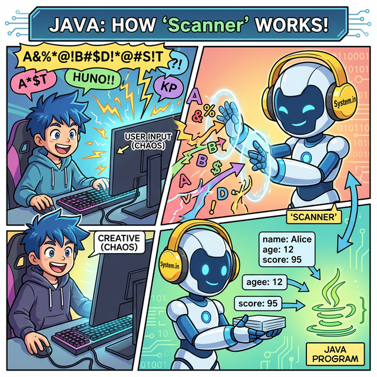
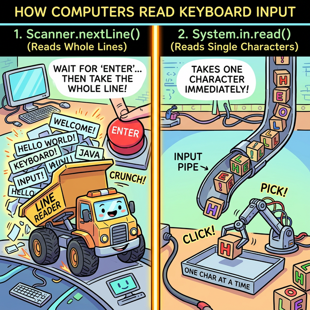
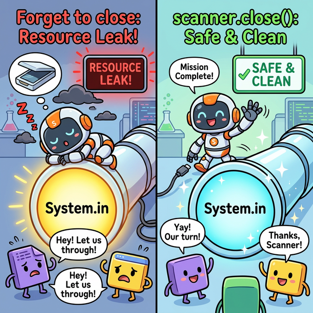

# 4.11 키보드 입력

지금까지는 우리가 코드에 정해놓은 값만 출력했습니다.
이제 막 실행된 프로그램이 사용자와 **대화(입력)**하는 방법을 알아봅니다. ⌨️

---

## 1. 스캐너 (Scanner) 📡

### 1) 개념
자바 프로그램은 기본적으로 **듣는 기능**이 없습니다.
키보드로 입력된 내용을 읽어들이기 위해서는 **`Scanner`**라는 도구(클래스)를 사용해야 합니다.

### 2) 비유: "마이크와 통역사"
*   **키보드**: 사용자의 손가락 (데이터 발신)
*   **System.in**: 마이크 (키보드 입력을 빨아들이는 1차 통로)
*   **Scanner**: 통역사 로봇 (`System.in`으로 들어온 거친 신호를 자바가 알아들을 수 있는 예쁜 문자열(`String`)이나 숫자(`int`)로 번역해서 프로그램에 전달)

<br>


<br>
*▲ 키보드에서 쏟아지는 원시적인 전기 신호들을 Scanner 로봇이 야무지게 받아서, 우리가 읽기 편한 텍스트 블록으로 예쁘게 포장해 넘겨줍니다!*

<br>

### 3) 입력 흐름 시각화


```mermaid
graph LR
    User[사용자] -->|타이핑| Keyboard[키보드]
    Keyboard -->|System.in| Scanner[Scanner]
    Scanner -->|nextLine| Program[자바 프로그램]
    
    style User fill:#f9f,stroke:#333
    style Keyboard fill:#eee,stroke:#333
    style Scanner fill:#ff9,stroke:#333
    style Program fill:#bfb,stroke:#333
```

---

## 2. 사용법 3단계 🛠️

스캐너를 사용하려면 딱 3단계만 기억하면 됩니다.

### 1단계: 도구 꺼내기 (Import)
자바에게 "나 스캐너 쓸 거야!"라고 알려줍니다. (맨 윗줄에 작성)
```java
import java.util.Scanner;
```
> **💡 참고**: `Scanner`는 우리가 앞서 배운 `int`, `double` 같은 자바의 기본 자료형(Primitive Type)이 아닙니다. 자바가 미리 만들어둔 복잡한 도구 상자인 **'클래스(Class)'**이기 때문에, 사용하려면 해당 클래스의 위치(`java.util`)를 코드 맨 위에 `import`문으로 명시해서 불러와야만 타입으로 사용할 수 있습니다. 이 부분에 대한 원리는 뒤에 나올 **객체 지향 파트**에서 아주 상세하게 다룰 예정이니, 지금은 "외부 도구를 가져다 쓰기 위한 주문" 정도로만 알아두시면 됩니다!

### 2단계: 스캐너 켜기 (객체 생성)
`System.in`(입력 장치)에 빨대를 꽂아서 스캐너를 만듭니다.
```java
Scanner scanner = new Scanner(System.in);
```

### 3단계: 입력 받기 (다양한 파트별 도구 사용)
`Scanner` 객체는 목적에 맞게 사용할 수 있는 여러 가지 맞춤형 파싱(Parsing) 도구들을 가지고 있습니다. 

<br>


<br>

| 메소드 | 설명 | 예시 키보드 입력 |
| :--- | :--- | :--- |
| **`nextLine()`** | 문장 전체(스페이스 포함)를 읽고, **엔터까지** 가져옵니다. | `"안녕 하세요\n"` ➔ `"안녕 하세요"` |
| **`next()`** | 띄어쓰기(공백) 전까지만의 **한 단어**만 읽어옵니다. | `"홍길동 25"` ➔ `"홍길동"` |
| **`nextInt()`** | 공백 전까지의 숫자를 찾아 **`int`(정수)** 로 변환합니다. | `"홍길동 25"` ➔ `25` |
| **`nextDouble()`**| 공백 전까지의 실수를 찾아 **`double`(실수)** 로 변환합니다. | `"175.5 68.2"` ➔ `175.5` |
| **`nextBoolean()`**| "true" 또는 "false" 문자를 **`boolean`(논리)** 값으로 변환합니다.| `"true"` ➔ `true` |

```java
// 예: "홍길동 25" 라고 치고 엔터를 쳤다면
String name = scanner.next(); // name 에는 "홍길동"
int age = scanner.nextInt();  // age 에는 25
```

---

## 3. 실전 예제: 나이 계산기 🧮

사용자에게 태어난 연도를 입력받아 나이를 계산하는 프로그램입니다.

```java
import java.util.Scanner;

public class AgeCalculator {
    public static void main(String[] args) {
        // 1. 스캐너 생성
        Scanner scanner = new Scanner(System.in);

        // 2. 안내 메시지 출력
        System.out.print("태어난 연도를 입력하세요: ");

        // 3. 문자열로 입력 받기
        String str = scanner.nextLine(); 

        // 4. 숫자로 변환 (Parsing)
        int birthYear = Integer.parseInt(str);
        int age = 2024 - birthYear;

        // 5. 결과 출력
        System.out.println("당신의 나이는 " + age + "세 입니다.");
    }
}
```

---

## 4. 자주 하는 실수: nextInt() 사용 시 주의 ⚠️

숫자를 먼저 입력받고 바로 이어서 문자를 입력받을 때, `scanner.nextInt()`를 섞어 쓰면 종종 문제가 발생합니다. 사용자가 숫자를 치고 **'엔터(Enter)'**를 누르면, `nextInt()`는 숫자만 쏙 골라 먹고 **눈에 안 보이는 엔터(`\n`) 찌꺼기**를 입력 통로에 그대로 남겨두기 때문입니다.

그 결과, 다음에 오는 입력 명령이 남아있던 찌꺼기 엔터를 보고 "아, 사용자가 아무것도 안 치고 엔터만 치고 넘어갔구나!" 하고 오해해서 입력을 스킵해 버리는 **치명적인 버그**가 생깁니다.

<br>


<br>
*▲ nextInt() 숟가락으로 숫자만 얌체같이 파먹으면 그릇에 끈적한 '엔터(\n)' 찌꺼기가 남습니다. 모든 걸 한 번에 깔끔하게 푸는 nextLine() 큰 삽을 쓰는 게 안전합니다!*

<br>

> **추천(해결) 방법**: 무조건 **`nextLine()`**으로 한 줄(숫자 리터럴 + 엔터까지 싹 다)을 통째로 문자열로 읽어들여 찌꺼기를 없앤 후, 숫자가 필요할 때만 **`Integer.parseInt()`** 또는 **`Double.parseDouble()`** 로 변환하는 것이 정신 건강에 좋습니다. 👍

---

## 5. 심화: 상황별 맞춤 입력 기법 🚀

### 1) 무한 반복해서 계속 입력받기 (조건을 주고루프 돌기)
프로그램이 한 번만 묻고 끝나는 것이 아니라, 사용자가 `exit`나 `q` 같은 특별한 종료 명령어를 입력할 때까지 "계속해서" 글을 받아내야 할 때가 아주 많습니다. 이때는 무한 반복문(`while(true)`)과 `nextLine()`을 찰떡 조합으로 활용합니다.

```java
Scanner scanner = new Scanner(System.in);
System.out.println("채팅 프로그램 시작! (종료하려면 'q' 입력)");

while (true) {
    System.out.print("말을 걸어보세요: ");
    String input = scanner.nextLine(); // 사용자가 글을 치고 엔터를 칠 때까지 코드가 잠시 대기함

    if (input.equals("q")) { // 만약 입력받은 글자가 "q"라면?
        System.out.println("채팅을 종료합니다. 안녕!");
        break; // 무한 반복의 감옥을 부수고 탈출!
    }
    
    // q가 아니라면 계속 메아리를 쳐줍니다.
    System.out.println("상대방: 그래 너도 " + input + "(이)구나!");
}
```

### 2) 한 글자씩 (원초적인 형태로) 실시간 입력받기
`Scanner`라는 통역사를 거치지 않고, 키보드의 키가 눌렸을 때 발생하는 물리적인 '기계 번호(키코드)'를 가장 원초적인 날것의 형태로 한 글자(1바이트)씩 읽어 들여야 할 때는 가장 원시적인 형태인 **`System.in.read()`**를 사용합니다.

<br>


<br>
*▲ 큰 덩어리(완성된 문장)를 다 모아서 한 번에 와르르 쏟아내는 Scanner(nextLine)의 거대한 덤프트럭과 달리, System.in.read()는 핀셋처럼 아주 작은 한 단위를 한 번에 하나씩만 쏙쏙 섬세하게 집어 옵니다.*

<br>



<br>

```java
// 주의: 메인 메소드 선언부에 발생할 수 있는 오류를 넘겨주는 'throws Exception'을 반드시 적어야 합니다.
// public static void main(String[] args) throws Exception {

System.out.print("영어 알파벳 A를 하나 누르고 엔터를 쳐보세요: ");

// 단 한 글자만 원시 숫자로 읽어옵니다.
int keyCode = System.in.read(); 

System.out.println("읽어온 고유 숫자 코드: " + keyCode);    // 결과: 65
System.out.println("우리가 아는 문자로 복원: " + (char)keyCode); // 결과: A
```

> **⚠️ 주의! (자바의 진정한 "실시간" 입력 한계)**
> 게임 컨트롤처럼 키보드를 누르자마자 0.1초의 지연도 없이 즉각즉각 반응할 것이라 기대하기 쉽지만, 이 코드를 실행해 보면 글자를 누르고 멍 때리고 있다가 **결국 '엔터(Enter)'를 쳐 주어야만** 결과가 나옵니다.
> 이는 자바 언어의 잘못(?)이라기 보다는 윈도우/맥 같은 **운영체제(OS)들이 키보드 데이터를 임시 보관함(버퍼)에 쌓아두고 대기했다가 무조건 엔터가 쳐질 때 비로소 프로그램 진영으로 한꺼번에 밀어 넣는 방식(라인 버퍼링)**을 기본으로 쓰고 있기 때문입니다. 순수하게 OS 버퍼를 무시하는 오락실 게임 같은 완전 100% 무결점 실시간 입력을 구현하려면 초보 챕터를 벗어나는 (JNI 같은) 특수한 외부 라이브러리 도움이 필요하답니다! 🎮

---

## 6. 다 썼으면 문 닫기: scanner.close() 🚪

`Scanner`는 외부 세계(키보드 등)와 연결된 통로(Stream)를 열어두고 계속 입력을 기다리는 객체입니다. 
따라서 메모리와 운영체제 입장에서 통로를 무한정 열어두는 것은 자원 낭비(Resource Leak)가 될 수 있습니다.

<br>


<br>
*▲ 다 사용한 마이크 선을 뽑고(System.in 연결 해제), 스캐너 로봇을 퇴근(close)시켜 주어야 다른 프로그램들이 쾌적하게 컴퓨터를 사용할 수 있습니다!*

<br>

**종료 방법:**
프로그램이 끝나기 전, 혹은 스캐너를 더 이상 안 쓸 때 코딩의 마지막 단계로 **`.close()`**를 호출해 줍니다. 
```java
scanner.close(); // 자원 반납
```

---

## 7. 최종 실전 예제: 프로필 생성기 종합판 👤

위에서 배운 여러 가지 타입의 안전한 입력 방식과, 스캐너 종류(`close()`)를 모두 적용한 종합 실전 코드입니다. 

**[예제: ProfileGenerator.java]**
```java
import java.util.Scanner;

public class ProfileGenerator {
    public static void main(String[] args) {
        // 1. 스캐너 켜기
        Scanner scanner = new Scanner(System.in);

        System.out.println("=== 👤 회원 가입 프로필 작성 ===");

        // 문자열 입력
        System.out.print("1. 이름을 입력하세요: ");
        String name = scanner.nextLine();

        // ⚠️ 숫자 입력 (안전한 방식인 nextLine() + parseInt() 조합 사용!)
        System.out.print("2. 나이를 입력하세요: ");
        int age = Integer.parseInt(scanner.nextLine()); 

        System.out.print("3. 키를 입력하세요 (예: 175.5): ");
        double height = Double.parseDouble(scanner.nextLine()); 

        // 4. 그냥 next()를 썼을 때 단어만 가져오는 예
        System.out.print("4. 사시는 도시를 입력하세요 (첫 단어만 저장됨): ");
        String city = scanner.next(); 
        // 만약 "서울 특별시" 라고 치면 "서울" 만 city에 들어감

        // 결과 출력 (이전 시간에 배운 printf 활용)
        System.out.println("\n--- 가입 완료! ---");
        System.out.printf("[%s]님(나이: %d, 키: %.1f) 환영합니다! (%s 거주)\n", name, age, height, city);

        // 5. 다 썼으니 깔끔하게 자원 반납 (퇴근!)
        scanner.close(); 
    }
}
```
