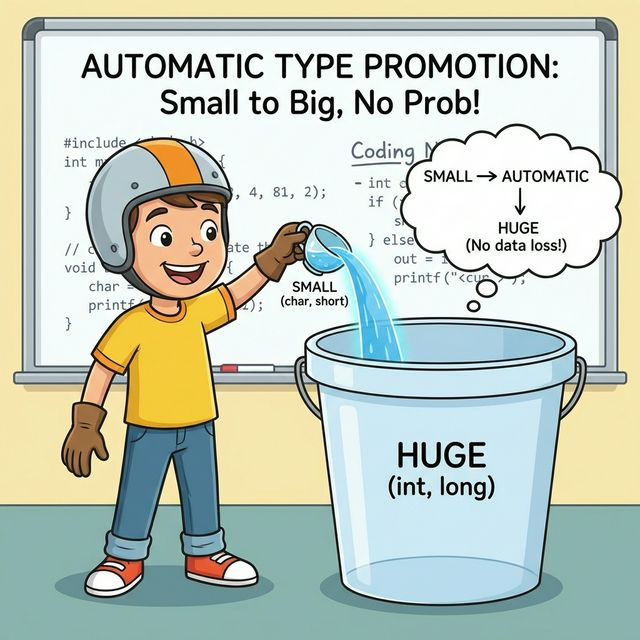

# 4.7 자동 타입 변환

## 1. 작은 컵의 물을 큰 양동이에 붓기 💧

데이터 타입을 다른 타입으로 바꾸는 것을 **타입 변환(Type Conversion)**이라고 합니다.

**자동 타입 변환(Promotion)**은 값의 범위가 **작은 타입**을 **큰 타입**으로 옮길 때 일어납니다.
작은 컵의 물을 큰 양동이에 부으면 절대 넘치지 않겠죠? 그래서 자바가 알아서 바꿔줍니다.



```mermaid
flowchart LR
    SmallCup[작은 컵\nint\n'10'] -->|자동 변환 (안전)| BigBucket[큰 양동이\nlong\n'10']
    
    style SmallCup fill:#def,stroke:#333,stroke-width:2px
    style BigBucket fill:#bdf,stroke:#333,shape:cylinder,stroke-width:2px
```

> `byte` < `short` < `int` < `long` < `float` < `double`

```java
int small = 10;
long big = small; // (O) 자동 변환 (int -> long)

float f = 100;    // (O) 자동 변환 (정수 -> 실수)
```

## 2. 연산에서의 자동 변환

정수끼리 계산하면 결과도 정수가 나오고,
---

# 4.7 자동 타입 변환

## 1. 작은 컵의 물을 큰 양동이에 붓기 💧

데이터 타입을 다른 타입으로 바꾸는 것을 **타입 변환(Type Conversion)**이라고 합니다.

**자동 타입 변환(Promotion)**은 값의 범위가 **작은 타입**을 **큰 타입**으로 옮길 때 일어납니다.
작은 컵의 물을 큰 양동이에 부으면 절대 넘치지 않겠죠? 그래서 자바가 알아서 바꿔줍니다.


```mermaid
flowchart LR
    SmallCup[작은 컵\nint\n'10'] -->|자동 변환 (안전)| BigBucket[큰 양동이\nlong\n'10']
    
    style SmallCup fill:#def,stroke:#333,stroke-width:2px
    style BigBucket fill:#bdf,stroke:#333,shape:cylinder,stroke-width:2px
```

> `byte` < `short` < `int` < `long` < `float` < `double`

```java
int small = 10;
long big = small; // (O) 자동 변환 (int -> long)

float f = 100;    // (O) 자동 변환 (정수 -> 실수)
```

## 2. 연산에서의 자동 변환

정수끼리 계산하면 결과도 정수가 나오고,
실수가 하나라도 끼어있으면 결과는 실수가 됩니다.

```java
int a = 10;
double b = 2.5;

double result = a + b; // 10.0 + 2.5 = 12.5
// a가 자동으로 double(10.0)로 변해서 계산됨
```

---

## 코딩 영단어 학습 📝

코딩에서 영어 단어의 의미만 정확히 이해해도 절반은 성공입니다! 오늘 배운 핵심 영단어들을 다시 한번 짚고 넘어가 볼까요?

*   **`Type Conversion`**: 타입 컨버전, 타입(자료형) 변환. (데이터의 모양이나 크기를 컴퓨터 상황에 맞게 유연하게 바꾸는 아주 기본적인 작업)
*   **`Promotion`**: 프로모션, 승격 / 자동 타입 변환. (상대적으로 범위가 좁고 작은 타입의 데이터가 더 크고 넉넉한 안전한 곳으로 자동으로 이사하면서 당당하게 모양이 커지는 기분 좋은 변화)
