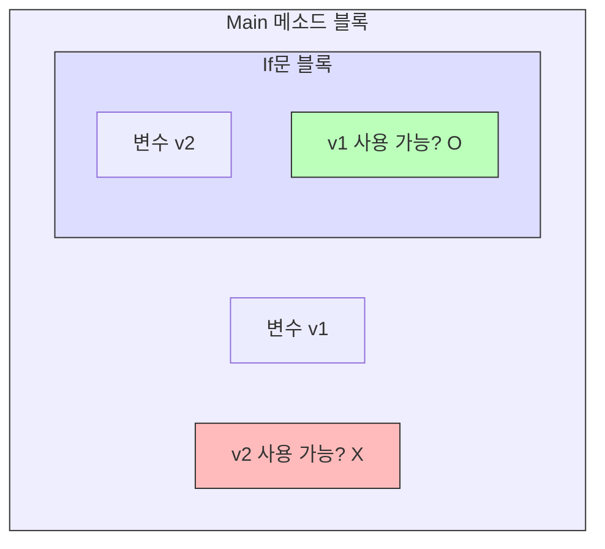

# 4.9 변수 사용 범위 (Scope)

변수는 언제 태어나서 언제 사라질까요?
변수의 **생명 주기(Life Cycle)**와 **유효 범위(Scope)**에 대해 알아봅니다.

---

## 1. 블록 `{ }`이 곧 변수의 우주 🌌

### 1) 개념
변수는 **자신이 선언된 중괄호 `{ ... }` 블록 안에서만** 존재하고 사용할 수 있습니다.
블록이 끝나는 순간(`}`) 변수는 메모리에서 소멸합니다. (마치 연기처럼 사라집니다!)

### 2) 비유: "썬팅된 유리방"
*   **안에서 밖은 보인다**: 유리방 안(`if`문 내부)에 있는 사람은 바깥(`main` 메소드)에 있는 사람을 볼 수 있습니다.
*   **밖에서 안은 안 보인다**: 바깥(`main` 메소드)에 있는 사람은 썬팅된 유리방 안(`if`문 내부)에 있는 사람을 볼 수 없습니다.

### 3) 범위 시각화



---

## 2. 코드 예시 🔍

```java
public static void main(String[] args) {
    int v1 = 10;
    
    if (v1 > 5) {
        int v2 = 20; // v2 탄생
        
        // 안쪽에서는 바깥쪽 변수(v1) 사용 가능
        System.out.println(v1 + v2); 
    } // v2 사망 (메모리에서 사라짐)
    
    // 바깥쪽에서는 안쪽 변수(v2) 사용 불가
    // System.out.println(v2); // (X) 에러! v2는 이미 죽었어요.
}
```

> **핵심 규칙**: **"내려갈 수는 있지만, 올라올 수는 없다."**
> (상위 블록의 변수는 하위 블록에서 쓸 수 있지만, 하위 블록의 변수는 상위 블록에서 쓸 수 없다.)
