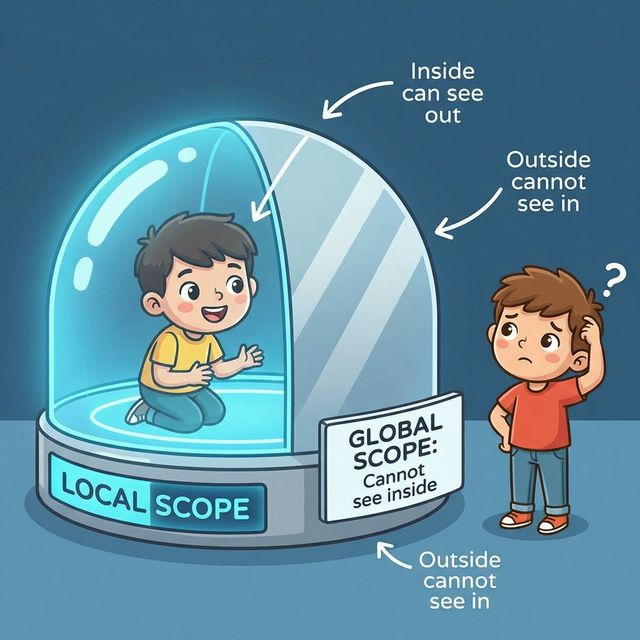
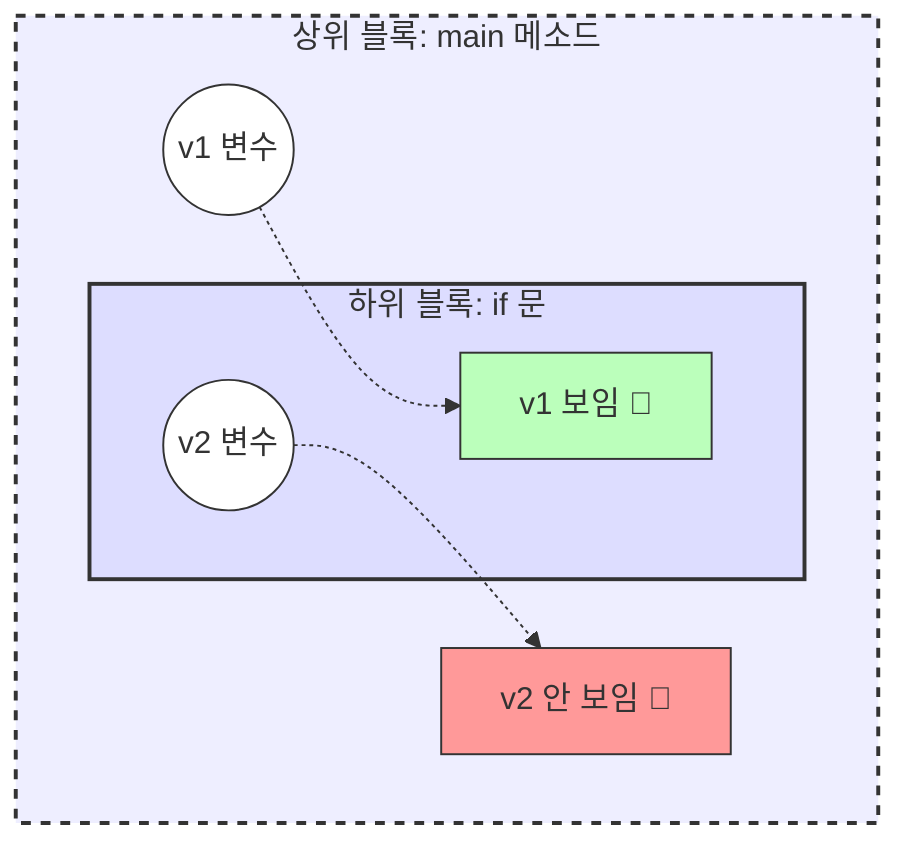

# 4.9 변수 사용 범위 (Scope)

변수는 언제 태어나서 언제 사라질까요?
변수의 **생명 주기(Life Cycle)**와 **유효 범위(Scope)**에 대해 알아봅니다.

---

## 1. 블록 `{ }`이 곧 변수의 우주 🌌

### 1) 개념
변수는 **자신이 선언된 중괄호 `{ ... }` 블록 안에서만** 존재하고 사용할 수 있습니다.
블록이 끝나는 순간(`}`) 변수는 메모리에서 소멸합니다. (마치 연기처럼 사라집니다!)

### 2) 비유: "썬팅된 유리방"
*   **안에서 밖은 보인다**: 유리방 안(`if`문 내부)에 있는 사람은 바깥(`main` 메소드)에 있는 사람을 볼 수 있습니다.
*   **밖에서 안은 안 보인다**: 바깥(`main` 메소드)에 있는 사람은 썬팅된 유리방 안(`if`문 내부)에 있는 사람을 볼 수 없습니다.



### 3) 범위 시각화

### 3) 범위 시각화


```mermaid
graph TD
    subgraph Main [상위 블록: main 메소드]
        v1((v1 변수))
        
        subgraph Sub [하위 블록: if 문]
            v2((v2 변수))
            Access1[v1 보임 👀]
        end
        
        Access2[v2 안 보임 🙈]
    end
    
    v1 -.-> Access1
    v2 -.-> Access2
    
    style Main fill:#eef,stroke:#333,stroke-width:2px,stroke-dasharray: 5 5
    style Sub fill:#ddf,stroke:#333,stroke-width:2px
    style v1 fill:#fff,stroke:#333
    style v2 fill:#fff,stroke:#333
    style Access1 fill:#bfb,stroke:#333
    style Access2 fill:#f99,stroke:#333
```

---

## 2. 코드 예시 🔍

```java
public static void main(String[] args) {
    int v1 = 10;
    
    if (v1 > 5) {
        int v2 = 20; // v2 탄생
        
        // 안쪽에서는 바깥쪽 변수(v1) 사용 가능
        System.out.println(v1 + v2); 
    } // v2 사망 (메모리에서 사라짐)
---

# 4.9 변수 사용 범위 (Scope)

변수는 언제 태어나서 언제 사라질까요?
변수의 **생명 주기(Life Cycle)**와 **유효 범위(Scope)**에 대해 알아봅니다.

---

## 1. 블록 `{ }`이 곧 변수의 우주 🌌

### 1) 개념
변수는 **자신이 선언된 중괄호 `{ ... }` 블록 안에서만** 존재하고 사용할 수 있습니다.
블록이 끝나는 순간(`}`) 변수는 메모리에서 소멸합니다. (마치 연기처럼 사라집니다!)

### 2) 비유: "썬팅된 유리방"
*   **안에서 밖은 보인다**: 유리방 안(`if`문 내부)에 있는 사람은 바깥(`main` 메소드)에 있는 사람을 볼 수 있습니다.
*   **밖에서 안은 안 보인다**: 바깥(`main` 메소드)에 있는 사람은 썬팅된 유리방 안(`if`문 내부)에 있는 사람을 볼 수 없습니다.


### 3) 범위 시각화

### 3) 범위 시각화


```mermaid
graph TD
    subgraph Main [상위 블록: main 메소드]
        v1((v1 변수))
        
        subgraph Sub [하위 블록: if 문]
            v2((v2 변수))
            Access1[v1 보임 👀]
        end
        
        Access2[v2 안 보임 🙈]
    end
    
    v1 -.-> Access1
    v2 -.-> Access2
    
    style Main fill:#eef,stroke:#333,stroke-width:2px,stroke-dasharray: 5 5
    style Sub fill:#ddf,stroke:#333,stroke-width:2px
    style v1 fill:#fff,stroke:#333
    style v2 fill:#fff,stroke:#333
    style Access1 fill:#bfb,stroke:#333
    style Access2 fill:#f99,stroke:#333
```

---

## 2. 코드 예시 🔍

```java
public static void main(String[] args) {
    int v1 = 10;
    
    if (v1 > 5) {
        int v2 = 20; // v2 탄생
        
        // 안쪽에서는 바깥쪽 변수(v1) 사용 가능
        System.out.println(v1 + v2); 
    } // v2 사망 (메모리에서 사라짐)
    
    // 바깥쪽에서는 안쪽 변수(v2) 사용 불가
    // System.out.println(v2); // (X) 에러! v2는 이미 죽었어요.
}
```

> **핵심 규칙**: **"내려갈 수는 있지만, 올라올 수는 없다."**
> (상위 블록의 변수는 하위 블록에서 쓸 수 있지만, 하위 블록의 변수는 상위 블록에서 쓸 수 없다.)

---

## 코딩 영단어 학습 📝

코딩에서 영어 단어의 의미만 정확히 이해해도 절반은 성공입니다! 오늘 배운 핵심 영단어들을 다시 한번 짚고 넘어갈까요?

*   **`Scope`**: 스코프, 유효 범위. (변수가 당당하게 탄생하고 살아 숨 쉬며 제 역할을 다해 사용될 수 있는 중괄호(`{ }`) 내부의 허락된 공간)
*   **`Life Cycle`**: 라이프 사이클, 생명 주기. (변수가 메모리에 짠하고 태어났다가 소임을 전부 다하고 흔적도 없이 예쁘게 사라지는 전체 서사 과정)
*   **`Block`**: 블록, 구역. (중괄호 `{ }` 로 단단하고 안전하게 묶어져 코드가 모여서 실행되는 단절된 독립적인 작은 세상)
