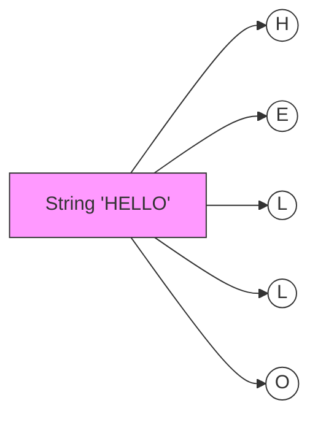
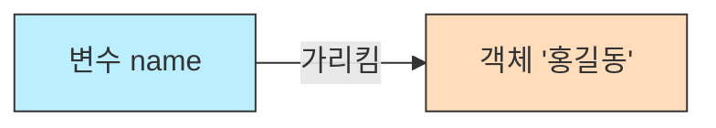

# 4.6 문자열 타입 (String)

프로그래밍에서 가장 많이 사용하는 데이터 중 하나인 **문자열(String)**에 대해 알아봅니다.

---

## 1. 문자열이란? (Text) 🧵

### 1) 개념
문자열은 **문자(char)들의 나열**입니다.
작은따옴표가 아닌 **큰따옴표(`" "`)**로 감싸야 합니다.

### 2) 비유: "구슬 목걸이"
*   `char`가 구슬 하나라면, `String`은 구슬을 실에 꿰어 만든 **목걸이**입니다.
*   구슬(`char`)이 하나도 없어도 실만 있으면 목걸이(`String`)가 될 수 있습니다. (빈 문자열 가능)

### 3) 구조 시각화



---

## 2. String은 특별하다 (참조 타입) 🌟

### 1) 기본 타입이 아님
`int`, `double`, `boolean` 등은 소문자로 시작하는 **기본 타입(Primitive Type)**이지만, `String`은 대문자로 시작하는 **클래스(Class)**이자 **참조 타입(Reference Type)**입니다.

### 2) 메모리 저장 방식
*   기본 타입: 상자 안에 **값(데이터)**이 직접 들어있습니다.
*   참조 타입(String): 상자 안에 진짜 데이터가 있는 **주소(번지수)**가 들어있습니다. (보물지도 같은 개념)



---

## 3. 이스케이프 문자 (Escape Character) 🏃‍♂️

문자열 안에 쌍따옴표(`"`)를 넣거나 줄 바꿈을 하고 싶을 때, 역슬래시(`\`)를 사용하여 특별한 신호를 보냅니다.

| 기호 | 설명               | 예시             | 출력 결과                        |
| :--- | :----------------- | :--------------- | :------------------------------- |
| `\"` | 큰따옴표 출력      | `"\"안녕\""`     | `"안녕"`                         |
| `\'` | 작은따옴표 출력    | `'\'A\''`        | `'A'`                            |
| `\n` | 줄 바꿈 (New Line) | `"안녕\n하세요"` | 안녕<br>하세요                   |
| `\t` | 탭 (Tab)           | `"이름\t나이"`   | 이름&nbsp;&nbsp;&nbsp;&nbsp;나이 |
| `\\` | 역슬래시 출력      | `"C:\\Poler"`    | `C:\Folder`                      |

### 코드 예시
```java
public class EscapeExample {
    public static void main(String[] args) {
        System.out.println("우리는 \"개발자\" 입니다."); 
        System.out.println("봄\t여름\t가을\t겨울");
        System.out.println("안녕\n반가워");
    }
}
```
