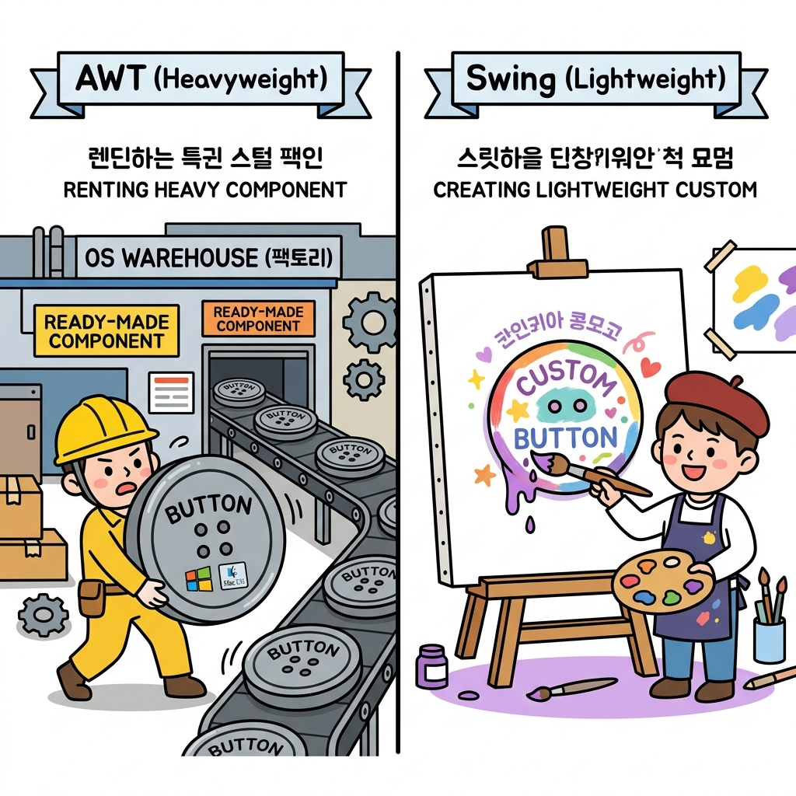
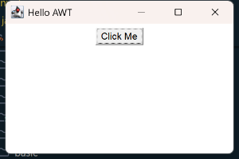

# 01. AWT 개요 및 첫 프로그램

자바 GUI 프로그래밍의 역사가 시작된 곳, **AWT**에 오신 것을 환영합니다! 🚀 AWT가 무엇인지 알아보고, 화면에 멋진 자바 창을 띄워봅시다.

---

## 1. AWT(Abstract Window Toolkit)란?

자바가 1.0 버전을 통해 세상에 처음 공개되었을 때 함께 포함되었던 **자바 최초의 GUI 라이브러리**입니다.

### 💡 그림으로 이해하는 AWT의 핵심 특징: Heavyweight (무거운 컴포넌트)

AWT가 윈도우 창을 만들거나 버튼을 생성할 때, 내부적으로는 어떤 일이 일어날까요? 실생활의 비유를 통해 알아봅시다!

> **AWT는 'OS 대여점'에서 물건을 빌려 쓰는 방식입니다.** 🛠️
> 
> 자바 프로그램이 직접 버튼을 깎아서 만드는 것이 아니라, 자바가 작동 중인 운영체제(Windows, macOS 등)에게 **"버튼 하나만 대여해 주세요!"** 하고 부탁합니다.
> - **Windows**에서 실행하면 **Windows 스타일 버튼**을 대여해 화면에 띄웁니다.
> - **macOS**에서 실행하면 **macOS 스타일 버튼**을 대여해 화면에 띄웁니다.
> 
> 이렇게 운영체제의 실제 UI 부품(이를 **Peer**라고 불러요)을 빌려와 화면에 얹어놓기 때문에, AWT 컴포넌트는 굉장히 무겁고 운영체제에 종속적이라서 **'Heavyweight(무거운) 컴포넌트'**라고 불립니다.



### AWT의 핵심 장단점
* **👍 장점: 빠른 렌더링 속도**
  운영체제(OS)가 이미 만들어둔 부품을 직접 가져와 화면에 바로 그리므로, 처리 속도가 매우 빠르고 컴퓨터 리소스를 덜 소모합니다.
* **👎 단점: 운영체제 종속적 디자인**
  Windows에서 만든 프로그램이 macOS로 가면 디자인과 레이아웃이 삐뚤어지거나 다르게 보일 수 있습니다. OS마다 대여해 주는 버튼의 두께나 크기가 조금씩 다르기 때문입니다. 또한, OS들이 공통으로 가지고 있지 않은 특이하고 화려한 컴포넌트는 만들 수가 없습니다.

---

## 2. AWT와 Swing 한눈에 비교하기

AWT의 단점(OS 종속성)을 극복하기 위해 등장한 것이 바로 **Swing**입니다. 두 기술의 성격은 다음과 같이 다릅니다.

| 구분 | AWT (`java.awt`) | Swing (`javax.swing`) |
| :--- | :--- | :--- |
| **작동 원리** | OS의 네이티브 부품을 대여함 (**Heavyweight**) | 자바 캔버스 위에 직접 그림 (**Lightweight**) |
| **디자인 일관성** | OS에 따라 화면 모양이 달라짐 (OS 의존성 높음) | 모든 OS에서 항상 일관되고 예쁜 디자인 유지 |
| **렌더링 속도** | OS 직접 제어로 매우 빠름 | 상대적으로 컴퓨터 리소스를 더 소모함 |
| **디자인 자유도** | 기본 제공하는 것 외의 세밀한 커스텀이 어려움 | 자유롭고 화려한 스킨(Look & Feel) 설정 가능 |

---

## 3. 첫 AWT 프로그램: Hello AWT!

AWT 프로그램의 기본 캔버스가 되는 `Frame`(창)을 만들고, 그 위에 클릭할 수 있는 `Button`을 하나 얹어보겠습니다.

### 📄 실습 예제 소스 코드
* **실습 예제 파일**: [AwtExample.java](sample/AwtExample.java) (경로: `sample/AwtExample.java`)

```java
import java.awt.Frame;
import java.awt.Button;
import java.awt.FlowLayout;

public class AwtExample {
    public static void main(String[] args) {
        // 1. 프레임(윈도우 창) 생성 - 창 제목을 지정합니다
        Frame f = new Frame("Hello AWT");

        // 2. 레이아웃 설정 (컴포넌트를 물 흐르듯 순서대로 배치하는 FlowLayout 사용)
        f.setLayout(new FlowLayout());

        // 3. 버튼 컴포넌트 생성 및 프레임에 추가
        Button b = new Button("Click Me");
        f.add(b);

        // 4. 프레임의 크기 설정 (너비 300픽셀, 높이 200픽셀)
        f.setSize(300, 200);
        
        // 5. 프레임을 화면에 표시 (이 코드가 없으면 눈에 보이지 않아요)
        f.setVisible(true);
    }
}
```

### 💻 컴파일 및 실행 방법
터미널에서 아래 명령어를 차례대로 입력하여 첫 AWT 프로그램을 실행해 봅시다.

```powershell
# 1. 01_awt_intro 디렉토리로 이동 후 컴파일 (클래스 파일을 sample 폴더 안에 생성)
javac -d sample sample/AwtExample.java

# 2. 클래스패스를 지정하여 실행
java -cp sample AwtExample
```

### 🖥️ 실행 결과 화면



> **⚠️ 아주 중요한 주의 사항!**
> 이 프로그램을 실행한 뒤 오른쪽 위의 **닫기 버튼(X)**을 눌러도 창이 닫히지 않아 당황하셨을 겁니다! 
> 그 이유는 AWT는 창을 닫는 사건(Window Closing Event)을 직접 코드로 감지하고 처리해 주어야 하기 때문입니다. 프로그램 종료를 원하시면 터미널 창에서 **`Ctrl + C`**를 눌러 강제 종료해 주세요. 
> 창을 우아하게 닫는 마법은 **[04. AWT 이벤트 처리]** 챕터에서 친절하게 배웁니다!

---

## 🔤 코딩 영단어 학습

자바 GUI 프로그래밍을 더 깊게 이해하기 위해 필수 단어들을 익혀둡니다.

* **Toolkit (툴킷)**
  * **뜻**: 도구 상자
  * **설명**: 화면을 그리는 데 쓰이는 버튼, 텍스트 상자 등의 유용한 클래스 도구들을 모아놓은 패키지를 의미합니다.
* **Heavyweight (헤비웨이트)**
  * **뜻**: 무거운, 중량의
  * **설명**: 자바 자체적으로 그리는 대신 OS에 직접 요청하여 물리적인 UI 리소스를 통째로 끌고 와야 하므로 '무겁다'고 부릅니다.
* **Native (네이티브)**
  * **뜻**: 태어난 곳의, 원래의
  * **설명**: 컴퓨터 분야에서는 '특정 운영체제(Windows, macOS)에 기본으로 갖춰진 것'을 의미합니다. AWT 버튼은 OS 네이티브 버튼입니다.
* **Peer (피어)**
  * **뜻**: 동료, 대응자
  * **설명**: 자바 내부의 Button 객체와 실제 연결되어 동작하는 Windows나 macOS의 진짜 OS 버튼 부품을 지칭하는 용어입니다.
