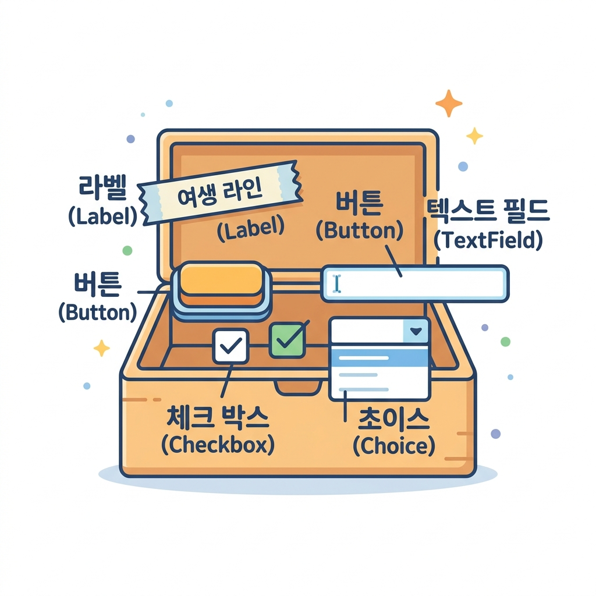
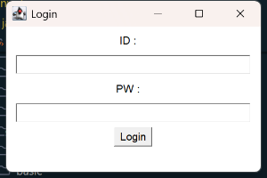

# 02. AWT 컴포넌트

화면을 꽉 채울 다채로운 부품들을 만나볼 시간입니다! 🧰 자바 GUI 화면을 구성하는 핵심 컴포넌트와 그들을 담아주는 컨테이너를 자세히 알아보고 로그인 화면을 만들어봅시다.

---

## 1. 컴포넌트(Component)와 컨테이너(Container)

자바 AWT에서 화면에 그려지는 모든 시각적 요소를 **컴포넌트**라고 부릅니다. 이들은 `java.awt.Component`라는 단 하나의 거대한 부모 클래스를 똑같이 물려받아 만들어졌습니다.

### 💡 학용품 상자 비유로 이해하기

* **컴포넌트 (Component)**: 연필, 지우개, 자, 풀 등 **필통 속에 쏙 들어가는 각각의 도구들**입니다. 화면에 배치되는 버튼, 글씨 레이블, 텍스트 상자 등이 여기에 속해요.
* **컨테이너 (Container)**: 연필과 지우개들을 가지런히 보관하는 **필통이나 서랍장**입니다. 컴포넌트들을 일정한 자리에 가두고 모아주는 특별한 컴포넌트입니다.



### 🧱 주요 컨테이너의 종류
1. **Frame (프레임)**: 가장 널리 쓰이는 **독립된 윈도우 창**입니다. 제목 바, 닫기/최소화 버튼, 크기 변경 테두리를 기본 제공하여 프로그램의 메인 도화지가 됩니다.
2. **Panel (패널)**: 투명한 유리판과 같습니다. 단독으로 화면에 뜰 수는 없지만, 프레임 안에서 컴포넌트 여러 개를 깔끔하게 그룹으로 묶어 배치할 때 유용하게 쓰입니다.
3. **Dialog (다이얼로그)**: 경고창이나 안내창처럼 사용자에게 메시지를 전달하고 확인을 유도하는 팝업 대화상자입니다.

---

## 2. 주요 AWT 컴포넌트 요약

화면을 구성할 7가지 단골 컴포넌트들을 만나봅시다!

| 컴포넌트 이름 | 설명 | 주요 메서드 및 팁 |
| :--- | :--- | :--- |
| **Label** (라벨) | 화면에 고정된 텍스트 문자열을 표시합니다 (수정 불가). | `new Label("텍스트", Label.CENTER)` (정렬 설정) |
| **Button** (버튼) | 사용자가 클릭하여 신호를 전달할 수 있는 누름단추입니다. | `new Button("확인")` |
| **TextField** (텍스트 필드) | 사용자로부터 한 줄의 글자를 입력받는 빈칸입니다. | `tf.setEchoChar('*')` (비밀번호 가리기) |
| **TextArea** (텍스트 영역) | 일기장처럼 여러 줄의 긴 글을 입력받는 입력란입니다. | `new TextArea("초기값", 줄수, 글자수)` |
| **Checkbox** (체크박스) | 여러 항목 중에서 여러 개를 선택(Check)하거나 해제할 수 있습니다. | `new Checkbox("사과", true)` (선택된 상태) |
| **Choice** (초이스) | 클릭하면 아래로 슥 펼쳐지며 목록 중 하나를 고르는 드롭다운 메뉴입니다. | `day.add("MON"); day.add("TUE");` |
| **List** (리스트) | 목록을 바깥에 넓게 띄워두고 그중 여러 개를 선택할 수 있게 합니다. | `new List(보여줄줄수, 다중선택여부)` |

---

## 3. 실습 예제: 간단한 로그인(Login) 화면 만들기

AWT의 여러 컴포넌트를 사용하여 ID와 비밀번호를 입력하고 로그인 버튼을 누를 수 있는 클래식한 로그인 창을 만들어봅시다.

### 📄 실습 예제 소스 코드
* **실습 예제 파일**: [ComponentExam.java](sample/ComponentExam.java) (경로: `sample/ComponentExam.java`)

```java
import java.awt.Frame;
import java.awt.Label;
import java.awt.TextField;
import java.awt.Button;
import java.awt.FlowLayout;

public class ComponentExam {
    public static void main(String[] args) {
        // 1. 메인 윈도우 창(Frame) 생성
        Frame f = new Frame("Login");
        f.setSize(300, 200);
        // 물 흐르듯 순서대로 배치하는 레이아웃 매니저 설정
        f.setLayout(new FlowLayout()); 

        // 2. ID 입력 부분 생성
        Label idLabel = new Label("ID :");
        TextField idText = new TextField(20); // 20글자 크기의 입력 공간
        
        // 3. 비밀번호 입력 부분 생성 (입력 글자를 *로 숨깁니다)
        Label pwLabel = new Label("PW :");
        TextField pwText = new TextField(20);
        pwText.setEchoChar('*'); 

        // 4. 로그인 누름버튼 생성
        Button loginBtn = new Button("Login");

        // 5. 프레임(컨테이너)에 컴포넌트들을 차례대로 추가(add)
        f.add(idLabel);
        f.add(idText);
        f.add(pwLabel);
        f.add(pwText);
        f.add(loginBtn);

        // 6. 창 보이기
        f.setVisible(true);
    }
}
```

### 💻 컴파일 및 실행 방법

```powershell
# 1. 02_awt_components 디렉토리로 이동 후 컴파일
javac -d sample sample/ComponentExam.java

# 2. 실행
java -cp sample ComponentExam
```

### 🖥️ 실행 결과 화면



> **💡 미니 팁**:
> ID와 PW 텍스트 상자 옆의 버튼이 둥글둥글하지 않고 고전적인 회색 평면 버튼이죠? 
> 이것이 바로 사용하고 계신 운영체제(Windows 등)의 구형 기본 UI 부품을 직접 빌려 렌더링한 Heavyweight의 흔적입니다!

---

## 🔤 코딩 영단어 학습

컴포넌트 설계에 활용되는 주요 단어들의 뜻을 익혀봅시다.

* **Component (컴포넌트)**
  * **뜻**: 구성 요소, 부품
  * **설명**: 화면을 수놓는 버튼(`Button`), 입력란(`TextField`), 글자판(`Label`) 등 GUI 화면을 조립하는 최소한의 부품들을 지칭합니다.
* **Container (컨테이너)**
  * **뜻**: 그릇, 보관함
  * **설명**: 다른 부품(컴포넌트)들을 안에 넣고 묶어주는 그릇 역할을 하는 특별한 컴포넌트입니다. `Frame`과 `Panel`이 대표적입니다.
* **Checkbox (체크박스)**
  * **뜻**: 확인 표시용 네모 상자
  * **설명**: 네모난 상자 안에 V자 표시를 켰다 껐다 하며 다중 선택을 가능하게 하는 UI 도구입니다.
* **Choice (초이스)**
  * **뜻**: 선택, 대안
  * **설명**: 한 줄만 보여주다가 클릭하면 밑으로 주르륵 선택 항목 목록을 내려주는 드롭다운 형태의 컴포넌트입니다.
