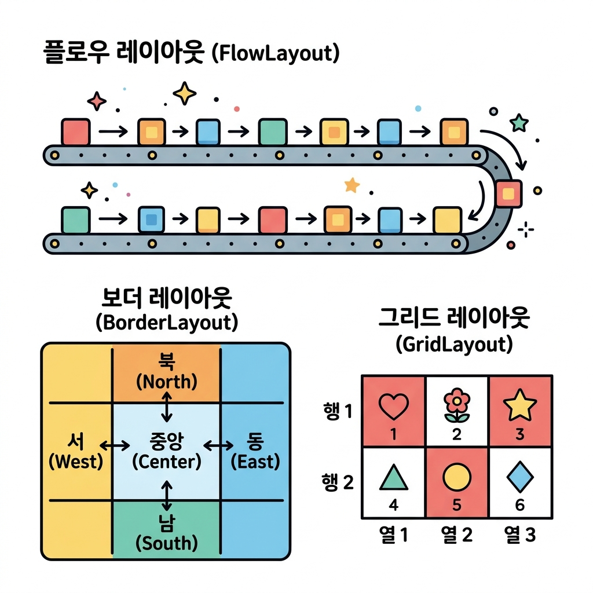
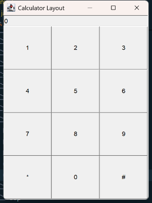

# 03. AWT 배치 관리자 (Layout Manager)

창을 크게 늘리거나 줄였을 때 버튼들이 한쪽으로 쏠리거나 겹쳐 보이지 않게 하려면 어떻게 해야 할까요? 📐 컨테이너 내부의 컴포넌트들을 아름답고 질서 정연하게 자동 정렬해 주는 **배치 관리자(Layout Manager)**의 규칙들을 배워봅시다!

---

## 1. 배치 관리자(Layout Manager)란?

자바 GUI 창은 사용자가 직접 창 테두리를 당겨 크기를 조절할 수 있습니다. 이때 컴포넌트의 가로/세로 크기와 위치를 매번 픽셀 단위로 다시 계산하는 것은 비효율적입니다.
**배치 관리자**는 창 크기 변화에 맞춰 컴포넌트들을 사전에 약속된 규칙대로 정렬하는 비서 역할을 합니다.

> **💡 컨테이너별 기본 배치 관리자 규칙!**
> 자바 컨테이너들은 각각 태어날 때부터 쥐고 있는 기본 배치 관리자가 정해져 있습니다.
> - 🔲 **Frame**의 기본값: **BorderLayout** (동서남북 및 중앙 배치)
> - 📄 **Panel**의 기본값: **FlowLayout** (물 흐르듯 왼쪽부터 순서대로 배치)

---

## 2. 주요 배치 관리자 삼총사 + 절대 좌표

배치 관리자가 컴포넌트를 줄 세우는 네 가지 마법 같은 규칙을 알아봅시다.



### 🌊 1) FlowLayout (물 흐름 배치)
- **비유**: **컨베이어 벨트나 줄 노트**입니다. 물건을 올리면 왼쪽에서 오른쪽으로 흐르듯이 얹어지고, 줄 끝에 다다르면 아래 줄로 내려가서 다시 왼쪽부터 채웁니다.
- **특징**: 컴포넌트 본연의 원래 크기(최적 크기)를 유지하려고 노력합니다. `Panel`의 기본 배치 방식입니다.
```java
f.setLayout(new FlowLayout()); // 프레임에 FlowLayout 탑재
f.add(new Button("1"));
f.add(new Button("2"));
```

### 🧭 2) BorderLayout (나침반/5방향 배치)
- **비유**: **동·서·남·북·중앙의 5방향 지도**입니다.
- **특징**: 화면을 5개 구역(`NORTH`, `SOUTH`, `EAST`, `WEST`, `CENTER`)으로 쪼갭니다. 각 구역에는 **단 하나의 컴포넌트**만 들어갈 수 있습니다. `Frame`의 기본 배치 방식입니다.
```java
f.setLayout(new BorderLayout());
f.add(new Button("상단"), BorderLayout.NORTH);
f.add(new Button("하단"), BorderLayout.SOUTH);
f.add(new Button("중앙"), BorderLayout.CENTER);
```

### 🏁 3) GridLayout (바둑판/격자 배치)
- **비유**: **바둑판이나 가로세로 사물함**입니다.
- **특징**: 행(Row)과 열(Column) 개수를 지정하여 화면을 똑같은 크기의 칸으로 등분합니다. 배치되는 모든 컴포넌트의 크기가 강제로 동일해집니다. 계산기 키패드나 바둑판 모양의 UI에 최적입니다.
```java
f.setLayout(new GridLayout(2, 3)); // 2행 3열 격자판 생성
f.add(new Button("1번방"));
f.add(new Button("2번방"));
```

### 📌 4) Null Layout (절대 좌표 배치)
- **비유**: **도화지 위에 고정 핀 꽂기**입니다.
- **특징**: 자동 배치 관리자를 없애고(`setLayout(null)`), 개발자가 직접 컴포넌트의 x좌표, y좌표, 너비, 높이를 수동으로 픽셀 단위 계산하여 고정합니다 (`setBounds`). 창이 늘어나도 컴포넌트 크기가 변하지 않습니다.
```java
f.setLayout(null); // 배치 비서 해고!
Button b = new Button("고정");
b.setBounds(50, 50, 100, 30); // x=50, y=50 위치에 가로 100, 세로 30 크기로 강제 지정
f.add(b);
```

---

## 3. 종합 실습 예제: 계산기 키패드 화면 레이아웃 구성하기

AWT의 기본 프레임(`BorderLayout`)의 북쪽(`NORTH`)에는 입력창(`TextField`)을 배치하고, 중앙(`CENTER`)에는 숫자 패드(`Panel` + `GridLayout`)를 결합하여 완벽한 계산기 껍데기 화면을 조립해 봅시다.

### 📄 실습 예제 소스 코드
* **실습 예제 파일**: [LayoutExam.java](sample/LayoutExam.java) (경로: `sample/LayoutExam.java`)

```java
import java.awt.Frame;
import java.awt.TextField;
import java.awt.Panel;
import java.awt.Button;
import java.awt.BorderLayout;
import java.awt.GridLayout;
import java.awt.event.WindowAdapter;
import java.awt.event.WindowEvent;
import java.awt.event.ActionListener;
import java.awt.event.ActionEvent;

public class LayoutExam {
    public static void main(String[] args) {
        Frame f = new Frame("Calculator Layout");
        f.setSize(300, 400);
        // 1. 전체 틀은 BorderLayout을 사용하여 구역 분할
        f.setLayout(new BorderLayout()); 

        // 2. 상단(NORTH): 결과물 표시창용 TextField 배치
        TextField result = new TextField("0");
        result.setEditable(false); // 키보드로 문자 직접 오타치는 것을 막음
        f.add(result, BorderLayout.NORTH);

        // 3. 중앙(CENTER): 숫자 및 연산 기호용 패널 배치
        Panel p = new Panel();
        // 패널 안쪽은 4행 3열짜리 균등한 바둑판 GridLayout 설계
        p.setLayout(new GridLayout(4, 3)); 

        // 간단한 숫자 기입 반응 리스너
        ActionListener btnListener = new ActionListener() {
            @Override
            public void actionPerformed(ActionEvent e) {
                String cmd = e.getActionCommand();
                if (cmd.equals("*")) {
                    result.setText("0"); // *는 화면 리셋(Clear)
                } else if (cmd.equals("#")) {
                    // #은 미구현 상태로 유지
                } else {
                    String current = result.getText();
                    if (current.equals("0")) {
                        result.setText(cmd);
                    } else {
                        result.setText(current + cmd);
                    }
                }
            }
        };

        // 1~9까지의 버튼 생성 및 격자판에 차례대로 담기
        for (int i = 1; i <= 9; i++) {
            Button btn = new Button(String.valueOf(i));
            btn.addActionListener(btnListener);
            p.add(btn);
        }

        // 맨 아래 행: *, 0, # 버튼 담기
        Button starBtn = new Button("*");
        starBtn.addActionListener(btnListener);
        p.add(starBtn);

        Button zeroBtn = new Button("0");
        zeroBtn.addActionListener(btnListener);
        p.add(zeroBtn);

        Button hashBtn = new Button("#");
        hashBtn.addActionListener(btnListener);
        p.add(hashBtn);

        // 완성된 격자판 패널을 전체 프레임의 중앙(CENTER)에 적재
        f.add(p, BorderLayout.CENTER);

        // 윈도우 우측 상단 'X' 버튼 클릭 시 꺼지도록 닫기 구현 (4장 예습)
        f.addWindowListener(new WindowAdapter() {
            @Override
            public void windowClosing(WindowEvent e) {
                System.exit(0);
            }
        });

        f.setVisible(true);
    }
}
```

### 💻 컴파일 및 실행 방법

```powershell
# 1. 03_awt_layout 디렉토리로 이동 후 컴파일
javac -d sample sample/LayoutExam.java

# 2. 실행
java -cp sample LayoutExam
```

### 🖥️ 실행 결과 화면



---

## 🔤 코딩 영단어 학습

레이아웃 설계에 많이 쓰이는 중요 영어 어휘를 복습합니다.

* **Layout (레이아웃)**
  * **뜻**: 배치, 설계 구획
  * **설명**: 화면에 들어갈 다양한 부품들의 자리 배치나 구성 상태를 의미합니다.
* **Flow (플로우)**
  * **뜻**: 흐름, 흐르다
  * **설명**: 물이 위에서 아래로 흐르고 글씨가 왼쪽에서 오른쪽으로 흘러가듯, 컴포넌트들을 차례차례 순서대로 정렬하는 흐름 방식을 말합니다.
* **Border (보더)**
  * **뜻**: 국경, 가장자리, 경계선
  * **설명**: 창의 가장자리 영역(동, 서, 남, 북)과 가장 안쪽 영역(중앙)으로 나누어 부품을 정렬하는 규칙을 가리킵니다.
* **Grid (그리드)**
  * **뜻**: 격자판, 바둑판 무늬
  * **설명**: 바둑판의 가로세로 줄처럼 균등한 간격으로 나누어진 행과 열의 구조를 의미합니다.
