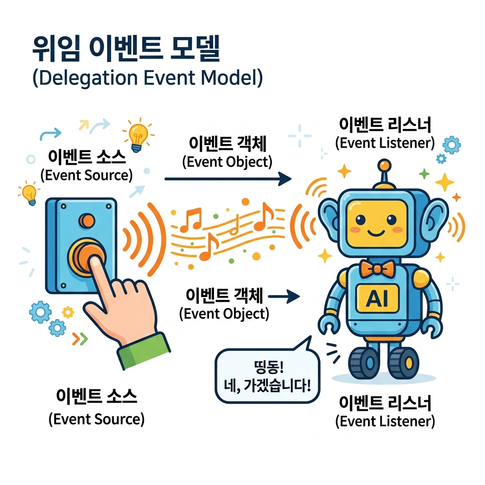
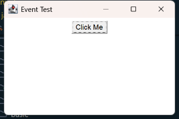
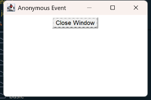

# 04. AWT 이벤트 처리 (Event Handling)

사용자가 마우스로 버튼을 클릭하거나, 키보드로 글자를 입력하고, 창의 X 버튼을 눌러 창을 닫을 때 자바 프로그램은 어떻게 이를 알아차리고 반응할까요? ⚡ 자바의 핵심 소통 메커니즘인 **위임형 이벤트 모델(Delegation Event Model)**과 코드를 획기적으로 줄여주는 **어댑터(Adapter)** 클래스의 비밀을 파헤쳐 봅시다!

---

## 1. 이벤트 위임 모델 (Event Delegation Model)

자바 AWT는 사용자의 행동에 반응하기 위해 **이벤트 위임 모델**이라는 약속된 규칙을 사용합니다. 

### 💡 초인종과 로봇 집사 비유로 배우는 이벤트 구조

초인종을 눌렀을 때 집안의 로봇 집사가 손님 마중을 나가는 상황에 빗대어 봅시다!

1. **이벤트 소스 (Event Source - 초인종 스위치)**
   - **설명**: 이벤트가 처음 발생하는 컴포넌트입니다. (예: 사용자가 누르는 **Button** 등)
2. **이벤트 객체 (Event Object - 초인종 신호/음파)**
   - **설명**: 어떤 일(클릭, 키 입력)이 일어났는지에 대한 모든 상세 정보(발생 시간, 마우스 위치, 발생 위치)를 담아 날아가는 정보 패키지입니다. (예: **ActionEvent**, **WindowEvent**)
3. **이벤트 리스너 (Event Listener - 귀를 쫑긋 세운 로봇 집사)**
   - **설명**: 신호를 기다리다가 신호가 감지되면 정해진 명령을 수행하는 로직 코드입니다. (예: **ActionListener**, **WindowListener** 인터페이스)

> **작동 흐름**:
> 사용자가 **이벤트 소스(초인종)**를 클릭하면, 정보가 든 **이벤트 객체(음파)**가 생성되어 **이벤트 리스너(로봇 집사)**에게 전송됩니다. 리스너 안에 작성해 둔 코드가 자동으로 호출되며 작동이 개시됩니다!



---

## 2. 주요 이벤트와 리스너

자바 AWT에서 가장 자주 연동되는 대표 컴포넌트, 신호, 그리고 반응 리스너들의 맵입니다.

| 컴포넌트 (Source) | 신호 클래스 (Event) | 들음이 리스너 (Listener) | 리스너 안의 핵심 액션 메서드 |
| :--- | :--- | :--- | :--- |
| **Button** (버튼 클릭) | `ActionEvent` | `ActionListener` | `actionPerformed(ActionEvent e)` |
| **List, Choice** (항목 선택) | `ItemEvent` | `ItemListener` | `itemStateChanged(ItemEvent e)` |
| **TextField** (글자 변경) | `TextEvent` | `TextListener` | `textValueChanged(TextEvent e)` |
| **Frame** (창 닫기 등) | `WindowEvent` | `WindowListener` | `windowClosing(WindowEvent e)` 등 7개 |
| **Mouse** (마우스 이동/클릭) | `MouseEvent` | `MouseListener` | `mouseClicked`, `mousePressed` 등 |
| **Keyboard** (키보드 타자) | `KeyEvent` | `KeyListener` | `keyPressed`, `keyReleased` 등 |

---

## 3. 이벤트 처리 실습

이벤트를 등록하고 동작시키는 대표적인 **두 가지 방식**을 예제로 마스터해 봅시다.

---

### 방법 1: 클래스에 리스너 인터페이스 직접 연결하기 (Implements)

자신이 만든 클래스 헤더에 `implements ActionListener`를 직접 붙여서 버튼 클릭 반응기 역할을 스스로 맡기는 정석적이고 고전적인 방식입니다.

* **실습 예제 파일**: [EventExam.java](sample/EventExam.java) (경로: `sample/EventExam.java`)

```java
import java.awt.Frame;
import java.awt.Button;
import java.awt.FlowLayout;
import java.awt.event.WindowAdapter;
import java.awt.event.WindowEvent;
import java.awt.event.ActionListener;
import java.awt.event.ActionEvent;

// 1. ActionListener(버튼 클릭 대기자) 인터페이스를 직접 구현합니다.
public class EventExam implements ActionListener {
    Frame f;
    Button b;

    public EventExam() {
        f = new Frame("Event Test");
        f.setLayout(new FlowLayout());

        b = new Button("Click Me");
        // 2. 버튼에 클릭 신호 리스너로 '나 자신(this)'을 연결합니다.
        b.addActionListener(this); 

        f.add(b);
        f.setSize(300, 200);

        // 창을 정상적으로 닫을 수 있게 설정
        f.addWindowListener(new WindowAdapter() {
            @Override
            public void windowClosing(WindowEvent e) {
                System.exit(0);
            }
        });

        f.setVisible(true);
    }

    // 3. 버튼 클릭 신호가 도착하면 자동으로 호출되는 이벤트 메서드입니다.
    @Override
    public void actionPerformed(ActionEvent e) {
        System.out.println("Button Clicked!"); // 터미널 창에 출력됩니다
    }

    public static void main(String[] args) {
        new EventExam();
    }
}
```

#### 🖥️ EventExam 실행 결과 화면



---

### 방법 2: 즉석에서 만드는 익명 내부 클래스 (Anonymous Inner Class) 사용하기

버튼의 리스너를 위한 독립적인 메서드를 번거롭게 선언하지 않고, 버튼에 등록하는 괄호 안에서 즉석으로 리스너 코드를 정의하여 결합하는 방식입니다. **실무 자바 GUI 코딩에서 가장 압도적으로 많이 활용되는 패턴**입니다!

* **실습 예제 파일**: [AnonymousEventExam.java](sample/AnonymousEventExam.java) (경로: `sample/AnonymousEventExam.java`)

```java
import java.awt.Frame;
import java.awt.Button;
import java.awt.FlowLayout;
import java.awt.event.WindowAdapter;
import java.awt.event.WindowEvent;
import java.awt.event.ActionListener;
import java.awt.event.ActionEvent;

public class AnonymousEventExam {
    public static void main(String[] args) {
        Frame f = new Frame("Anonymous Event");
        f.setSize(300, 200);
        f.setLayout(new FlowLayout());

        Button b = new Button("Close Window");

        // 1. 버튼 클릭 반응기를 괄호 안에서 '즉석(익명)'으로 생성하여 등록합니다!
        b.addActionListener(new ActionListener() {
            @Override
            public void actionPerformed(ActionEvent e) {
                System.out.println("Close button clicked");
                System.exit(0); // 프로그램 즉시 종료
            }
        });

        // 2. WindowListener 대신 WindowAdapter라는 고마운 도우미 클래스를 이용해 
        // 7개의 귀찮은 메서드 중 'windowClosing' 딱 하나만 즉석 재정의합니다!
        f.addWindowListener(new WindowAdapter() {
            @Override
            public void windowClosing(WindowEvent e) {
                System.exit(0);
            }
        });

        f.add(b);
        f.setVisible(true);
    }
}
```

#### 🖥️ AnonymousEventExam 실행 결과 화면



---

## 🛠️ 핵심 꿀팁: 어댑터(Adapter) 클래스가 왜 존재할까요?

자바의 **WindowListener**나 **MouseListener** 인터페이스는 창의 상태 변경(켜짐, 꺼짐, 최소화, 활성화 등)이나 마우스 움직임(클릭, 휠, 이동 등)을 전부 잡기 위해 내부에 구현해야 할 메서드가 5~7개씩 들어있습니다. 
만약 우리가 '마우스 클릭 하나' 또는 '창 닫기 하나'만 처리하고 싶어도, 인터페이스의 규칙 때문에 빈 껍데기 메서드를 전부 억지로 적어주어야 해서 코드가 아주 지저분해집니다.

이를 해결하기 위해 자바는 **빈 껍데기로 모든 메서드를 미리 채워둔 클래스인 어댑터(Adapter)**를 선물로 제공합니다!
- `WindowListener` 대신 ➡️ `WindowAdapter` 상속 사용
- `MouseListener` 대신 ➡️ `MouseAdapter` 상속 사용
- `KeyListener` 대신 ➡️ `KeyAdapter` 상속 사용
- *(주의: `ActionListener`는 구현해야 할 메서드가 `actionPerformed` 딱 1개뿐이므로 별도의 어댑터가 필요 없습니다!)*

---

## 💻 컴파일 및 실행 방법

```powershell
# 1. 04_awt_event 디렉토리로 이동 후 두 예제 파일 동시에 컴파일
javac -d sample sample/EventExam.java sample/AnonymousEventExam.java

# 2. EventExam 예제 실행
java -cp sample EventExam

# 3. AnonymousEventExam 예제 실행
java -cp sample AnonymousEventExam
```

---

## 🔤 코딩 영단어 학습

자바 이벤트 통신과 관련된 주요 영단어를 학습합니다.

* **Delegation (델리게이션)**
  * **뜻**: 위임, 대리
  * **설명**: 어떤 일(이벤트)을 자신이 직접 다 처리하는 대신, 미리 지정해 둔 반응 요원(리스너)에게 처리를 떠넘기는 이벤트 방식을 뜻합니다.
* **Source (소스)**
  * **뜻**: 원천, 시초, 출처
  * **설명**: 이벤트가 태동한 컴포넌트입니다. 버튼 클릭 이벤트라면 버튼 객체가 소스가 됩니다.
* **Listener (리스너)**
  * **뜻**: 듣는 사람, 경청자
  * **설명**: 이벤트 소스의 일거수일투족을 귀를 세우고 모니터링하다가 신호가 떨어지면 정해진 자바 로직을 일사불란하게 실행하는 클래스 요원입니다.
* **Adapter (어댑터)**
  * **뜻**: 변환 장치, 중개 조율 도구
  * **설명**: 여러 개를 전부 오버라이딩해야 하는 리스너 인터페이스를 빈 메서드들의 세트로 선행 가공하여, 프로그래머가 손쉽게 오버라이딩하도록 징검다리 역할을 수행하는 유용한 클래스입니다.
