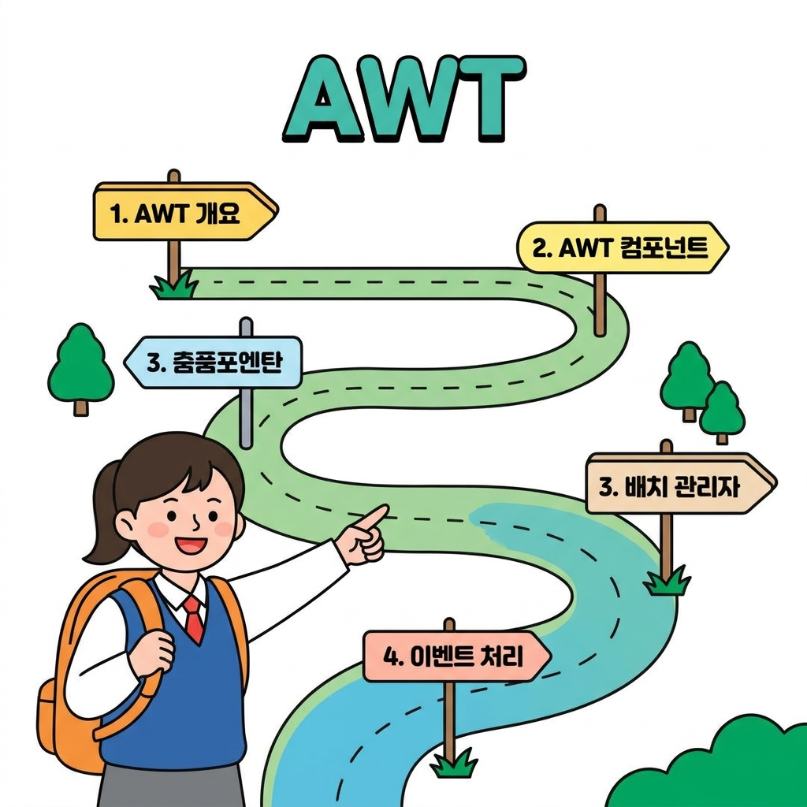

# AWT 프로그래밍 개요

자바 GUI 프로그래밍의 첫걸음이자 뼈대가 되는 **AWT(Abstract Window Toolkit)** 과정에 오신 것을 환영합니다! 🥳

비록 지금은 더 세련되고 기능이 많은 **Swing**과 **JavaFX**가 널리 쓰이지만, 창(Window)을 띄우고 버튼을 배치하며 마우스 클릭에 반응하는 자바 GUI의 핵심 뼈대는 모두 AWT에서 설계되었습니다. AWT를 단단하게 익혀두면 다음 단계인 Swing과 JavaFX도 한결 쉽고 빠르게 마스터할 수 있습니다!

---

## 🗺️ AWT 학습 로드맵

아래 지도를 따라 차근차근 AWT 정복을 위한 탐험을 떠나볼까요? 

---

## 🎯 이번 과정의 학습 목표
자바 GUI의 시초인 AWT를 탐험하며 아래의 능력을 기르게 됩니다.
1. 🧱 **AWT 구조 이해**: 운영체제의 네이티브 부품을 빌려 쓰는 **Heavyweight Component**와 OS 종속성의 관계를 배웁니다.
2. 🧰 **핵심 컴포넌트 활용**: 화면을 다채롭게 채워주는 `Button`, `Label`, `TextField`, `Checkbox` 등의 기본 부품들을 능숙하게 다룹니다.
3. 📏 **배치 관리자 정복**: 화면 크기가 바뀌어도 부품들이 흐트러지지 않도록 격자(`GridLayout`), 나침반(`BorderLayout`), 물 흐름(`FlowLayout`) 방식으로 정렬합니다.
4. ⚡ **이벤트 처리 모델**: 사용자가 버튼을 클릭하는 사건(Event)을 듣고 동작하는 **위임형 이벤트 모델(Delegation Event Model)**과 코드 길이를 줄여주는 **어댑터(Adapter)** 활용법을 터득합니다.

---

## 📚 학습 목차

### 📌 [01. AWT 개요 및 첫 창 띄우기](01_awt_intro/)
AWT가 무엇인지 배우고 Swing과의 결정적 차이를 알아봅니다. 그리고 AWT의 캔버스가 되는 첫 번째 `Frame` 창을 직접 화면에 띄우는 예제를 실습합니다.

### 📌 [02. 화면을 구성하는 AWT 컴포넌트](02_awt_components/)
문자를 보여주는 `Label`, 글자를 입력하는 `TextField`, 다중 선택의 `Checkbox`, 드롭다운 방식의 `Choice` 등 필수가 되는 AWT 부품들의 특징과 활용 꿀팁을 익힙니다.

### 📌 [03. 깔끔하게 정렬하는 배치 관리자](03_awt_layout/)
컨테이너 내부에 컴포넌트를 보기 좋게 정렬하는 다양한 배치 관리자(`FlowLayout`, `BorderLayout`, `GridLayout`)를 알아보고, 종합 예제인 계산기 화면 레이아웃을 직접 구현해 봅니다.

### 📌 [04. 마법 같은 상호작용, 이벤트 처리](04_awt_event/)
사용자의 마우스 클릭이나 키 입력 사건을 감지하여 프로그램을 작동시키는 원리를 배웁니다. 리스너(Listener) 인터페이스 직접 구현법과 익명 내부 클래스, 그리고 코드를 간결하게 돕는 어댑터(Adapter)를 학습합니다.
