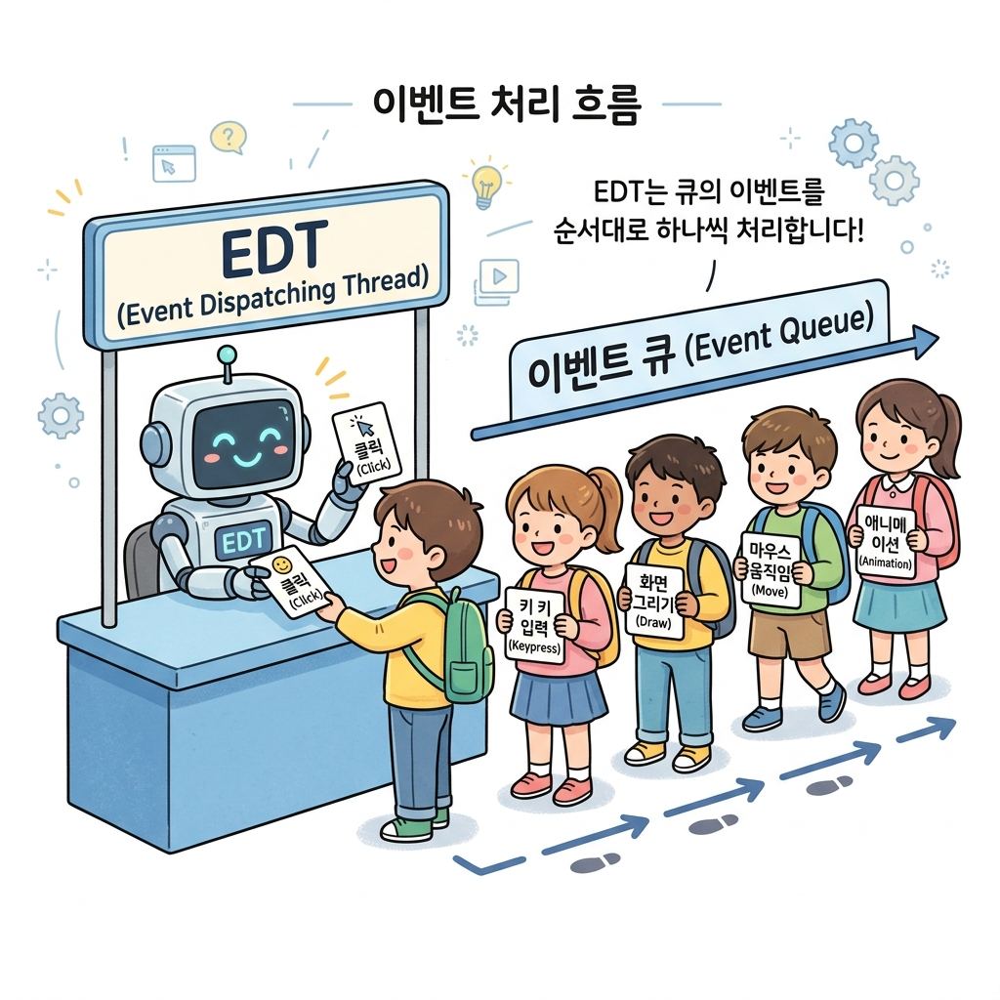
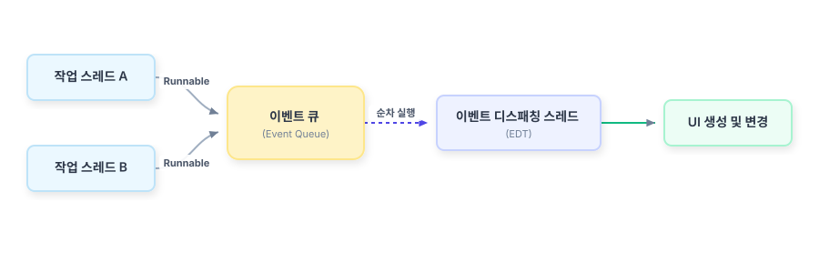

# 02. 이벤트 디스패칭 스레드

Swing은 **스레드에 안전하지 않기(Not Thread-Safe)** 때문에, 여러 작업 스레드가 동시에 UI 컴포넌트에 접근하여 변경하면 동기화 문제가 발생할 수 있습니다. 
따라서 Swing은 **이벤트 디스패칭 스레드(Event-Dispatching Thread, EDT)**라는 단일 스레드를 사용하여 UI 생성, 변경, 이벤트 처리를 순차적으로 담당하도록 설계되었습니다.

### 💡 그림으로 이해하기: 창구 직원(EDT)과 대기 줄(이벤트 큐)

이벤트 디스패칭 스레드(EDT)의 동작 방식은 마치 은행 창구에서 혼자 업무를 처리하는 **단 한 명의 친절한 창구 직원**과 같습니다.
사용자가 마우스 클릭을 하거나 키보드를 누르는 등의 GUI 작업들은 **대기 줄(이벤트 큐)**에 순서대로 쌓이게 되고, 창구 직원(EDT)은 이 대기 줄에서 작업을 하나씩 꺼내어 순차적으로 처리합니다.
만약 직원이 업무를 처리하는 도중에 외부 작업 스레드(다른 사람)가 갑자기 창구를 거치지 않고 직접 UI 컴포넌트(금고)에 접근하여 조작하면 동기화 충돌이 일어나게 됩니다. 그래서 Swing은 모든 UI 관련 작업을 반드시 이 창구 직원(EDT)을 통해서만 처리하도록 엄격히 제한하고 있습니다.




## 1. 동작 원리

작업 스레드에서 UI를 업데이트해야 할 때는, 작업을 `Runnable` 객체로 만들어 **이벤트 큐(Event Queue)**에 넣어야 합니다. 그러면 EDT가 큐에서 작업을 하나씩 꺼내어 실행합니다.



## 2. invokeLater() 메소드

작업 스레드는 `SwingUtilities.invokeLater()` 메소드를 사용하여 `Runnable` 객체를 이벤트 큐에 저장할 수 있습니다. 메서드 이름이 `invokeLater`인 이유는 큐에 대기 중인 다른 이벤트들이 처리된 후, "나중에" 실행되기 때문입니다.

* **실습 예제 파일**: [App.java](sample/sec02/exam01_invokeLater/App.java) (경로: `sample/sec02/exam01_invokeLater/App.java`)
* **실행 방법**:
  ```powershell
  # 1. 02_event_dispatching_thread 디렉토리로 이동 후 컴파일
  javac -d sample sample/sec02/exam01_invokeLater/App.java
  
  # 2. 실행
  java -cp sample sec02.exam01_invokeLater.App
  ```

* **실행 결과 화면**:
  
  


### 예제 코드

```java
package sec02.exam01_invokeLater;

import java.awt.event.WindowAdapter;
import java.awt.event.WindowEvent;
import javax.swing.JFrame;
import javax.swing.SwingUtilities;

public class App extends JFrame {
    public App() {
        // 제목 설정
        setTitle("Swing App");
        // 윈도우 크기 설정
        setSize(300, 100);
        
        // 윈도우 종료 버튼을 클릭하면 프로세스 종료
        addWindowListener(new WindowAdapter() {
            @Override
            public void windowClosing(WindowEvent e) {
                System.exit(0);
            }
        });
    }

    public static void main(String[] args) {
        // 이벤트 큐에 Runnable 넣기
        SwingUtilities.invokeLater(new Runnable() {
            public void run() {
                // 윈도우 생성 및 출력 (EDT에서 실행됨)
                App app = new App();
                app.setVisible(true);
                
                // 현재 스레드 이름 출력 -> AWT-EventQueue-0 (EDT) 확인
                System.out.println(Thread.currentThread().getName());
            }
        });
    }
}
```

### 실행 결과
프로그램을 실행하면 빈 `JFrame` 윈도우 창이 화면에 나타나며, 콘솔창에는 다음과 같이 스레드 이름이 출력됩니다:

```text
AWT-EventQueue-0
```

콘솔에 `AWT-EventQueue-0`와 같은 이름이 출력되면, 해당 코드가 메인 스레드가 아닌 이벤트 디스패칭 스레드(EDT)에 의해 안전하게 실행되고 있음을 의미합니다.

