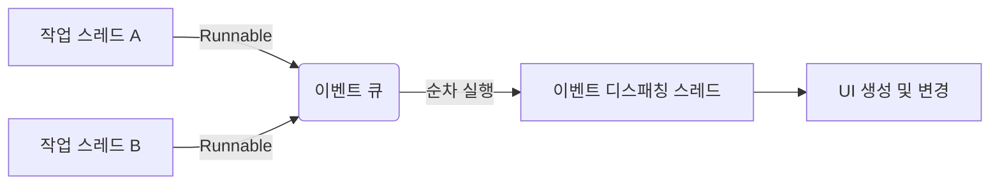

# 02. 이벤트 디스패칭 스레드

Swing은 **스레드에 안전하지 않기(Not Thread-Safe)** 때문에, 여러 작업 스레드가 동시에 UI 컴포넌트에 접근하여 변경하면 동기화 문제가 발생할 수 있습니다. 
따라서 Swing은 **이벤트 디스패칭 스레드(Event-Dispatching Thread, EDT)**라는 단일 스레드를 사용하여 UI 생성, 변경, 이벤트 처리를 순차적으로 담당하도록 설계되었습니다.

## 1. 동작 원리

작업 스레드에서 UI를 업데이트해야 할 때는, 작업을 `Runnable` 객체로 만들어 **이벤트 큐(Event Queue)**에 넣어야 합니다. 그러면 EDT가 큐에서 작업을 하나씩 꺼내어 실행합니다.



## 2. invokeLater() 메소드

작업 스레드는 `SwingUtilities.invokeLater()` 메소드를 사용하여 `Runnable` 객체를 이벤트 큐에 저장할 수 있습니다. 메서드 이름이 `invokeLater`인 이유는 큐에 대기 중인 다른 이벤트들이 처리된 후, "나중에" 실행되기 때문입니다.

### 예제 코드

```java
package sec02.exam01_invokeLater;

import java.awt.event.WindowAdapter;
import java.awt.event.WindowEvent;
import javax.swing.JFrame;
import javax.swing.SwingUtilities;

public class App extends JFrame {
    public App() {
        // 제목 설정
        setTitle("Swing App");
        // 윈도우 크기 설정
        setSize(300, 100);
        
        // 윈도우 종료 버튼을 클릭하면 프로세스 종료
        addWindowListener(new WindowAdapter() {
            @Override
            public void windowClosing(WindowEvent e) {
                System.exit(0);
            }
        });
    }

    public static void main(String[] args) {
        // 이벤트 큐에 Runnable 넣기
        SwingUtilities.invokeLater(new Runnable() {
            public void run() {
                // 윈도우 생성 및 출력 (EDT에서 실행됨)
                App app = new App();
                app.setVisible(true);
                
                // 현재 스레드 이름 출력 -> AWT-EventQueue-0 (EDT) 확인
                System.out.println(Thread.currentThread().getName());
            }
        });
    }
}
```

### 실행 결과
콘솔에 `AWT-EventQueue-0`와 같은 이름이 출력되면, 해당 코드가 이벤트 디스패칭 스레드(EDT)에 의해 실행되고 있음을 의미합니다.
