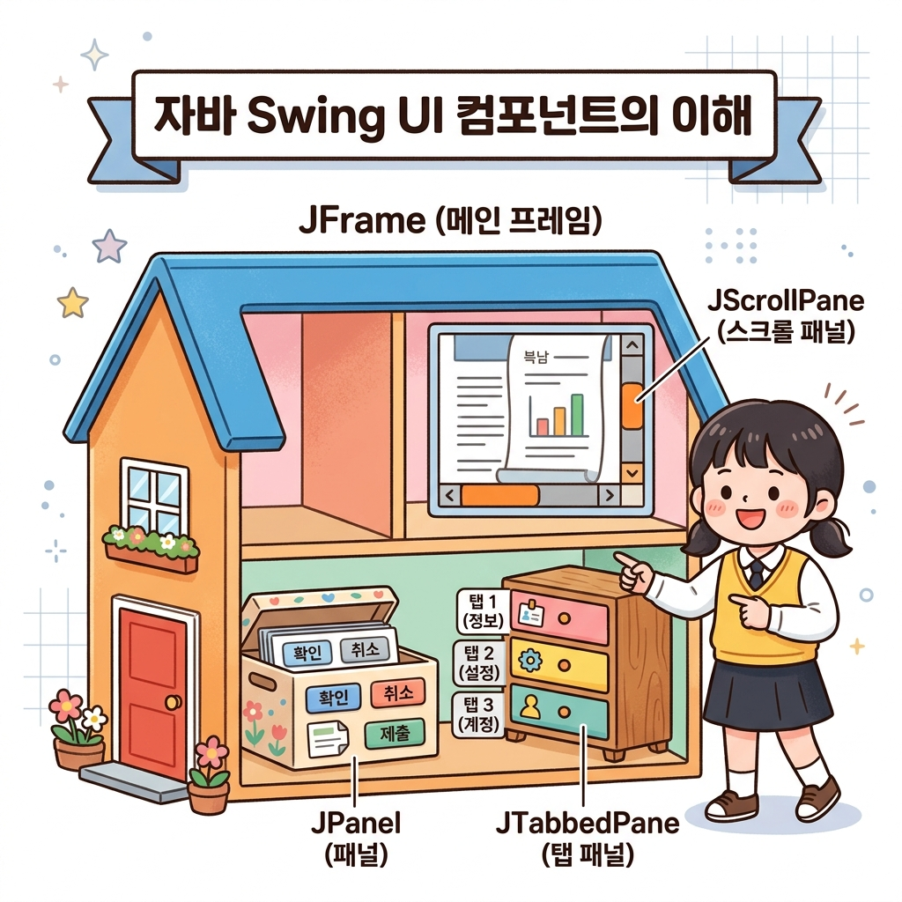
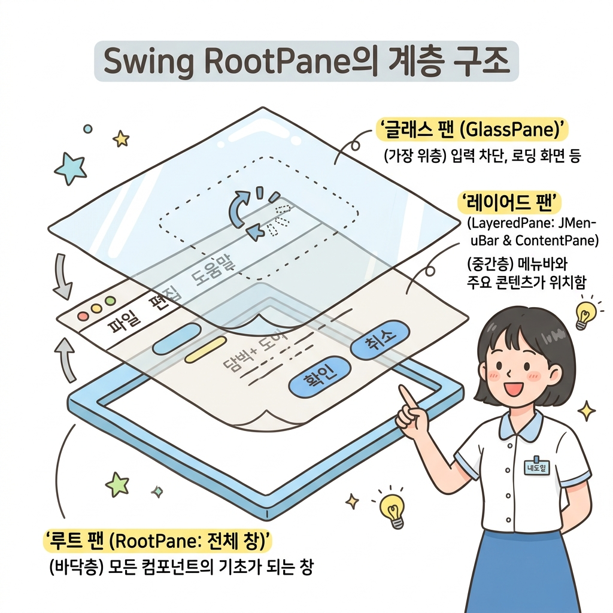
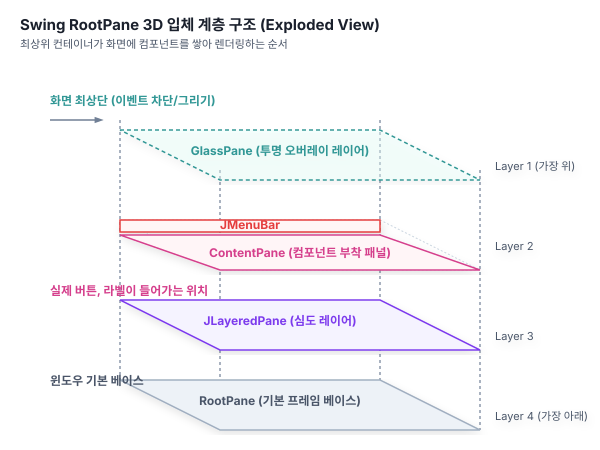
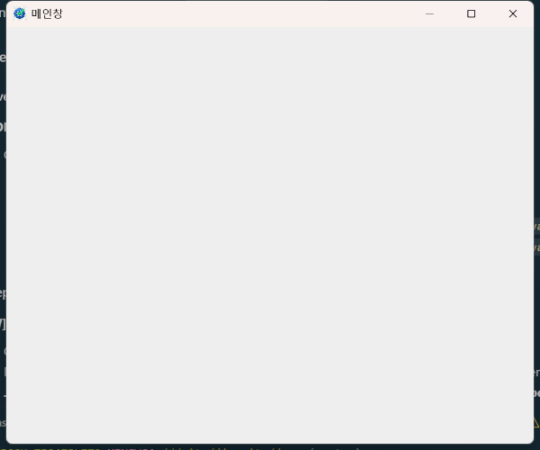
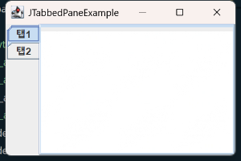
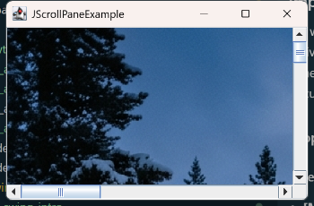

# 03. Swing 컨테이너

## 컨테이너(Container)란?
**컨테이너(Container)**는 버튼, 텍스트 필드, 라벨 등 다양한 GUI 컴포넌트들을 담고 배치할 수 있는 특수한 컴포넌트입니다. 자바 GUI 프로그램에서 컨테이너는 화면의 뼈대를 형성하는 핵심적인 역할을 합니다.
모든 컴포넌트는 홀로 화면에 나타날 수 없으며, 반드시 어떤 컨테이너 위에 배치되어야만 비로소 화면에 출력되고 사용자에게 표시될 수 있습니다.

---

## Swing 컨테이너 클래스 종류

Swing은 화면 상에서의 동작 구조와 목적에 따라 두 가지 형태의 컨테이너를 제공합니다.

### 1. 최상위 컨테이너 (Top-Level Container)
다른 컨테이너에 포함되지 않고 운영체제(OS) 화면 위에 독립적으로 직접 띄울 수 있는 완전한 윈도우 창 역할을 하는 컨테이너입니다.
- **`JFrame`**: 가장 일반적인 데스크톱 응용 프로그램 메인 윈도우 창입니다. 제목 표시줄, 최소화/최대화/종료 버튼과 테두리를 기본 탑재하고 있습니다.
- **`JDialog`**: 사용자에게 경고 알림을 주거나 추가적인 정보를 입력받기 위해 주 윈도우 위에 추가로 띄우는 대화상자 윈도우입니다.
- **`JWindow`**: 테두리, 제목 표시줄, 우상단 제어 버튼 등이 전혀 없는 순수한 빈 창입니다. 주로 프로그램 시작 시 보이는 스플래시 화면을 연출할 때 사용합니다.
- **`JApplet`**: 웹 브라우저 안에서 동작하도록 설계되었던 컨테이너입니다. (현재는 기술 표준 변화로 사용되지 않는 레거시 기술입니다.)

### 2. 보조 및 중간 컨테이너 (Intermediate Container)
스스로 화면에 떠 있을 수 없으며, 반드시 최상위 컨테이너나 다른 컨테이너의 내부에 배치되어 컴포넌트들을 정렬하고 묶어주는 데 사용하는 보조 컨테이너입니다.
- **`JPanel`**: 여러 컴포넌트를 영역별로 그룹화하기 위해 사용하는 가장 기본적인 판 모양의 컨테이너입니다.
- **`JScrollPane`**: 내용물이 창 크기보다 클 때 상하좌우 스크롤바를 동적으로 생성하여 보여주는 컨테이너입니다.
- **`JSplitPane`**: 구분선을 경계로 좌우 또는 상하로 화면을 나누어 배치하고, 사용자가 드래그하여 두 영역의 크기 비율을 바꿀 수 있는 컨테이너입니다.
- **`JTabbedPane`**: 탭(Tab) 영역을 선택함에 따라 포개어져 있는 여러 컴포넌트 중 하나를 골라 화면에 가득 채워주는 컨테이너입니다.
- **`JDesktopPane`**: 하나의 응용 프로그램 영역 안에서 동작하는 내부 프레임(`JInternalFrame`)들을 관리하는 데스크톱 가상 화면 컨테이너입니다.
- **`JInternalFrame`**: `JDesktopPane` 안에서 독립된 프레임처럼 작동하며 최소화/최대화가 가능한 자식 윈도우 형태의 컴포넌트입니다.

---

최상위 컨테이너(`JFrame`, `JDialog`, `JWindow` 등)는 내부적으로 **루트 팬(Root Pane)**이라는 특수한 다층(Multi-layered) 판 구조를 가집니다.

### 💡 그림으로 이해하기: 컨테이너 역할 (JFrame은 집, JPanel은 수납상자)

Swing의 컨테이너 구조를 보다 친숙한 사물에 비유하면 다음과 같습니다:
- **JFrame**: 가장 바깥을 감싸고 잠금 단추들이 다 달려있는 안전한 **'집(House)'**입니다.
- **JPanel**: 집 방 내부에 장난감이나 도구들을 모아 정돈해 두는 **'수납상자(Container Box)'**입니다.
- **JTabbedPane**: 인덱스 라벨을 잡고 서랍을 꺼낼 수 있는 **'탭이 달린 서랍장(Tab Drawer)'**입니다.
- **JScrollPane**: 내용물이 너무 커서 아래로 길어질 때 바퀴를 달고 굴릴 수 있도록 돕는 **'스크롤 바퀴 액자(Scroll Frame)'**입니다.



---

### 🖼️ 루트 팬(RootPane)의 적층 구조와 OHP 필름 비유

루트 팬의 다중 레이어 구조는 학교에서 사용하는 **여러 장의 투명한 OHP 필름(혹은 트레이싱지)을 겹쳐놓은 것**과 유사합니다:
- **GlassPane (투명 오버레이 필름)**: 가장 최상단에 투명하게 위치하여 아래쪽 컴포넌트들을 클릭하지 못하도록 임시로 이벤트를 차단하거나, 화면 전체에 애니메이션/그리기 효과를 추가하는 보호 필름 역할을 합니다.
- **ContentPane & JMenuBar (구성요소 필름)**: 메뉴바와 버튼, 글상자 등 화면의 실제 핵심 GUI 컴포넌트들이 부착되는 중심 필름입니다.
- **LayeredPane (조립대 프레임)**: Z-order(깊이 순서)를 조절하며 필름들을 층층이 고정하는 프레임 지지대입니다.

이 레이어들이 한데 모여 겹쳐짐으로써 최종적으로 사용자에게 단일 윈도우 창 형태로 출력됩니다.



#### 3D 입체 투시도로 보는 루트 팬 계층
각각의 레이어가 수직으로 어떤 레이아웃을 통해 쌓이는지 3D 그래픽으로 살펴보면 다음과 같습니다:




### 1) GlassPane
`GlassPane`은 다른 패널들 가장 위에 존재하는 투명한 판입니다. 기본적으로는 비활성화되어 있지만, 활성화하면 마우스 이벤트를 가로채거나 화면 전체에 그림을 그리는 등의 효과를 낼 수 있습니다. (예: 전체 화면 로딩 표시 등)

### 2) JMenuBar와 ContentPane
- **JMenuBar**: 메뉴바가 위치하는 영역입니다. `setJMenuBar()`로 설정합니다.
- **ContentPane**: 실제 UI 컴포넌트(버튼, 패널 등)가 배치되는 영역입니다. `getContentPane()`으로 얻어와서 `add()` 해야 합니다. (JDK 1.5부터는 `JFrame.add()`가 자동으로 `ContentPane`에 추가해줍니다.)

```java
JFrame jFrame = new JFrame();
// MenuBar 추가
jFrame.setJMenuBar(new JMenuBar());
// 컴포넌트 추가 (ContentPane에 추가됨)
jFrame.getContentPane().add(new JButton("확인"), BorderLayout.SOUTH);
```

### 3) LayeredPane
컴포넌트들이 겹쳐질 때 **Z-order(심도)**를 결정합니다. `JLayeredPane`을 사용하면 팝업 메뉴나 툴팁처럼 다른 컴포넌트 위에 떠 있는 효과를 구현할 수 있습니다.

---

## 2. JWindow
`JWindow`는 제목 표시줄, 버튼, 테두리가 없는 윈도우입니다. 주로 애플리케이션 시작 시 보여주는 **스플래시 화면(Splash Screen)**이나 커스텀 디자인 윈도우를 만들 때 사용합니다.

* **실습 예제 파일**: [JWindowExample.java](sample/sec03/exam02_jwindow/JWindowExample.java) (경로: `sample/sec03/exam02_jwindow/JWindowExample.java`)
* **실행 방법**:
  ```powershell
  # 1. 03_swing_containers 디렉토리로 이동 후 컴파일
  javac -d sample sample/sec03/exam02_jwindow/JWindowExample.java
  
  # 2. 실행 (실행된 이미지를 클릭하면 윈도우가 닫힙니다)
  java -cp sample sec03.exam02_jwindow.JWindowExample
  ```

* **실행 결과 화면**:
  
  


```java
package sec03.exam02_jwindow;

import java.awt.BorderLayout;
import java.awt.GraphicsEnvironment;
import java.awt.Point;
import java.awt.event.MouseAdapter;
import java.awt.event.MouseEvent;
import javax.swing.ImageIcon;
import javax.swing.JLabel;
import javax.swing.JWindow;
import javax.swing.SwingUtilities;

public class JWindowExample extends JWindow {
    public JWindowExample() {
        // JWindow 크기 설정
        this.setSize(600, 350);
        
        // 화면 중앙에 띄우기
        GraphicsEnvironment ge = GraphicsEnvironment.getLocalGraphicsEnvironment();
        Point centerPoint = ge.getCenterPoint();
        int leftTopX = centerPoint.x - this.getWidth() / 2;
        int leftTopY = centerPoint.y - this.getHeight() / 2;
        this.setLocation(leftTopX, leftTopY);
        
        // 이미지 라벨 추가
        JLabel label = new JLabel();
        label.setIcon(new ImageIcon(getClass().getResource("game.png")));
        getContentPane().add(label, BorderLayout.CENTER);
        
        // 클릭 시 종료
        this.addMouseListener(new MouseAdapter() {
            @Override
            public void mouseClicked(MouseEvent e) {
                dispose(); // 윈도우 닫기
            }
        });
    }

    public static void main(String[] args) {
        SwingUtilities.invokeLater(() -> {
            JWindowExample jWindow = new JWindowExample();
            jWindow.setVisible(true);
        });
    }
}
```

---

## 3. JFrame
`JFrame`은 제목 표시줄과 최대화/최소화/닫기 버튼이 있는 표준 윈도우입니다.
- **setDefaultCloseOperation**: 닫기 버튼 클릭 시 동작 설정.
    - `DO_NOTHING_ON_CLOSE`: 무시.
    - `HIDE_ON_CLOSE`: 숨김 (기본값).
    - `DISPOSE_ON_CLOSE`: 리소스 해제 및 닫기.
    - `EXIT_ON_CLOSE`: 애플리케이션 종료 (`System.exit(0)`).

* **실습 예제 파일**: [JFrameExample.java](sample/sec03/exam03_jframe/JFrameExample.java) (경로: `sample/sec03/exam03_jframe/JFrameExample.java`)
* **실행 방법**:
  ```powershell
  # 1. 03_swing_containers 디렉토리로 이동 후 컴파일
  javac -d sample sample/sec03/exam03_jframe/JFrameExample.java
  
  # 2. 실행
  java -cp sample sec03.exam03_jframe.JFrameExample
  ```

* **실행 결과 화면**:
  
  


```java
package sec03.exam03_jframe;

import java.awt.GraphicsEnvironment;
import java.awt.Point;
import javax.swing.ImageIcon;
import javax.swing.JFrame;
import javax.swing.SwingUtilities;

public class JFrameExample extends JFrame {
    public JFrameExample() {
        this.setSize(600, 500);
        
        // 아이콘 및 제목 설정
        this.setIconImage(new ImageIcon(getClass().getResource("icon.png")).getImage());
        this.setTitle("메인창");
        
        // 종료 동작 설정
        this.setDefaultCloseOperation(JFrame.EXIT_ON_CLOSE);
        
        // 화면 중앙 배치
        GraphicsEnvironment ge = GraphicsEnvironment.getLocalGraphicsEnvironment();
        Point centerPoint = ge.getCenterPoint();
        this.setLocation(centerPoint.x - this.getWidth()/2, centerPoint.y - this.getHeight()/2);
    }

    public static void main(String[] args) {
        SwingUtilities.invokeLater(() -> {
            JFrameExample jFrame = new JFrameExample();
            jFrame.setVisible(true);
        });
    }
}
```

---

## 4. JTabbedPane
`JTabbedPane`은 탭을 통해 여러 화면을 전환하며 보여주는 컨테이너입니다. `addTab()` 메서드로 탭 이름과 컴포넌트(주로 `JPanel`)를 추가합니다.

* **실습 예제 파일**: [JTabbedPaneExample.java](sample/sec03/exam04_jtabbedpane/JTabbedPaneExample.java) (경로: `sample/sec03/exam04_jtabbedpane/JTabbedPaneExample.java`)
* **실행 방법**:
  ```powershell
  # 1. 03_swing_containers 디렉토리로 이동 후 컴파일
  javac -d sample sample/sec03/exam04_jtabbedpane/JTabbedPaneExample.java
  
  # 2. 실행
  java -cp sample sec03.exam04_jtabbedpane.JTabbedPaneExample
  ```

* **실행 결과 화면**:
  
  


```java
package sec03.exam04_jtabbedpane;

import java.awt.BorderLayout;
import javax.swing.ImageIcon;
import javax.swing.JFrame;
import javax.swing.JLabel;
import javax.swing.JPanel;
import javax.swing.JTabbedPane;
import javax.swing.SwingUtilities;

public class JTabbedPaneExample extends JFrame {
    private JTabbedPane jTabbedPane;
    private JPanel tab1Panel;
    private JPanel tab2Panel;

    public JTabbedPaneExample() {
        this.setTitle("JTabbedPaneExample");
        this.setSize(300, 200);
        this.setDefaultCloseOperation(JFrame.EXIT_ON_CLOSE);
        this.getContentPane().add(getJTabbedPane(), BorderLayout.CENTER);
    }

    private JTabbedPane getJTabbedPane() {
        if (jTabbedPane == null) {
            jTabbedPane = new JTabbedPane();
            jTabbedPane.setTabPlacement(JTabbedPane.LEFT); // 탭 위치 (LEFT, TOP, BOTTOM, RIGHT)
            jTabbedPane.addTab("탭1", getTab1Panel());
            jTabbedPane.addTab("탭2", getTab2Panel());
        }
        return jTabbedPane;
    }

    private JPanel getTab1Panel() {
        if (tab1Panel == null) {
            tab1Panel = new JPanel();
            JLabel jLabel = new JLabel();
            jLabel.setIcon(new ImageIcon(getClass().getResource("duke1.gif")));
            tab1Panel.add(jLabel);
        }
        return tab1Panel;
    }

    private JPanel getTab2Panel() {
        if (tab2Panel == null) {
            tab2Panel = new JPanel();
            JLabel jLabel = new JLabel();
            jLabel.setIcon(new ImageIcon(getClass().getResource("duke2.gif")));
            tab2Panel.add(jLabel);
        }
        return tab2Panel;
    }

    public static void main(String[] args) {
        SwingUtilities.invokeLater(() -> {
            JTabbedPaneExample jFrame = new JTabbedPaneExample();
            jFrame.setVisible(true);
        });
    }
}
```

---

## 5. JScrollPane
`JScrollPane`은 컴포넌트가 화면 영역보다 클 때 자동으로 스크롤바를 생성해주는 컨테이너입니다. `JList`, `JTable`, `JTextArea`, 이미지(`JLabel`) 등을 감쌀 때 주로 사용합니다.

```java
// 사용법
JScrollPane scrollPane = new JScrollPane(targetComponent);
```

* **실습 예제 파일**: [JScrollPaneExample.java](sample/sec03/exam05_jscrollpane/JScrollPaneExample.java) (경로: `sample/sec03/exam05_jscrollpane/JScrollPaneExample.java`)
* **실행 방법**:
  ```powershell
  # 1. 03_swing_containers 디렉토리로 이동 후 컴파일
  javac -d sample sample/sec03/exam05_jscrollpane/JScrollPaneExample.java
  
  # 2. 실행
  java -cp sample sec03.exam05_jscrollpane.JScrollPaneExample
  ```

* **실행 결과 화면**:
  
  


```java
package sec03.exam05_jscrollpane;

import java.awt.BorderLayout;
import javax.swing.ImageIcon;
import javax.swing.JFrame;
import javax.swing.JLabel;
import javax.swing.JScrollPane;
import javax.swing.SwingUtilities;

public class JScrollPaneExample extends JFrame {
    private JScrollPane scrollImage;
    private JLabel lblImage;

    public JScrollPaneExample() {
        this.setTitle("JScrollPaneExample");
        this.setSize(350, 230);
        this.setDefaultCloseOperation(JFrame.EXIT_ON_CLOSE);
        
        // 이미지가 윈도우보다 크면 자동으로 스크롤 생성됨
        this.getContentPane().add(getScrollImage(), BorderLayout.CENTER);
    }

    private JScrollPane getScrollImage() {
        if (scrollImage == null) {
            scrollImage = new JScrollPane(getLblImage());
        }
        return scrollImage;
    }

    public JLabel getLblImage() {
        if (lblImage == null) {
            lblImage = new JLabel();
            lblImage.setIcon(new ImageIcon(getClass().getResource("snow.jpg")));
        }
        return lblImage;
    }

    public static void main(String[] args) {
        SwingUtilities.invokeLater(() -> {
            JScrollPaneExample jFrame = new JScrollPaneExample();
            jFrame.setVisible(true);
        });
    }
}
```
