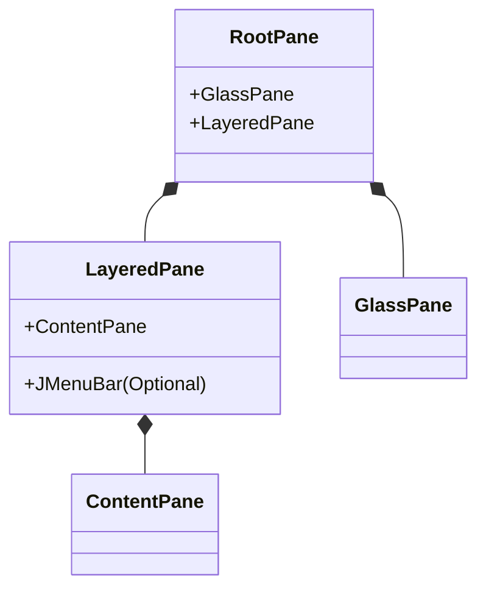

# 03. Swing 컨테이너

윈도우 창과 같이 버튼, 체크박스, 텍스트 필드 등의 컴포넌트를 배치할 수 있는 클래스를 **컨테이너(Container)**라고 합니다. Swing은 기능에 따라 다음과 같은 컨테이너 클래스를 제공합니다.

| 컨테이너 클래스    | 용도                                                                                  |
| :----------------- | :------------------------------------------------------------------------------------ |
| **JWindow**        | 운영체제의 창 장식(Title bar, Border 등)이 없는 윈도우.                               |
| **JFrame**         | 일반적인 응용 프로그램 윈도우 (Title bar, Minimize/Maximize/Close 버튼 포함).         |
| **JDialog**        | 대화상자 윈도우.                                                                      |
| **JApplet**        | 웹 브라우저 내에서 실행되는 애플릿.                                                   |
| **JPanel**         | 컴포넌트들을 그룹화하여 배치할 때 사용 (가장 많이 사용됨).                            |
| **JScrollPane**    | 스크롤바가 필요한 컴포넌트를 감쌀 때 사용.                                            |
| **JSplitPane**     | 두 개의 컴포넌트를 수직/수평으로 나누어 배치할 때 사용.                               |
| **JTabbedPane**    | 탭(Tab)을 이용하여 여러 컴포넌트를 겹쳐 놓고 선택하여 보여줄 때 사용.                 |
| **JDesktopPane**   | MDI(Multiple Document Interface) 애플리케이션의 내부 프레임(`JInternalFrame`)을 관리. |
| **JInternalFrame** | `JDesktopPane` 내부에서 사용되는 내부 윈도우.                                         |

`JWindow`, `JFrame`, `JDialog`는 완전한 윈도우 형태를 가진 **최상위 레벨 컨테이너(Top-Level Container)**이며, 나머지는 이들 내부에 배치되는 보조 컨테이너입니다.

---

## 1. Swing 컨테이너 구조

최상위 컨테이너(`JFrame`, `JDialog`, `JWindow` 등)는 **루트 팬(Root Pane)**이라는 구조를 가집니다.



### 1) GlassPane
`GlassPane`은 다른 패널들 가장 위에 존재하는 투명한 판입니다. 기본적으로는 비활성화되어 있지만, 활성화하면 마우스 이벤트를 가로채거나 화면 전체에 그림을 그리는 등의 효과를 낼 수 있습니다. (예: 전체 화면 로딩 표시 등)

### 2) JMenuBar와 ContentPane
- **JMenuBar**: 메뉴바가 위치하는 영역입니다. `setJMenuBar()`로 설정합니다.
- **ContentPane**: 실제 UI 컴포넌트(버튼, 패널 등)가 배치되는 영역입니다. `getContentPane()`으로 얻어와서 `add()` 해야 합니다. (JDK 1.5부터는 `JFrame.add()`가 자동으로 `ContentPane`에 추가해줍니다.)

```java
JFrame jFrame = new JFrame();
// MenuBar 추가
jFrame.setJMenuBar(new JMenuBar());
// 컴포넌트 추가 (ContentPane에 추가됨)
jFrame.getContentPane().add(new JButton("확인"), BorderLayout.SOUTH);
```

### 3) LayeredPane
컴포넌트들이 겹쳐질 때 **Z-order(심도)**를 결정합니다. `JLayeredPane`을 사용하면 팝업 메뉴나 툴팁처럼 다른 컴포넌트 위에 떠 있는 효과를 구현할 수 있습니다.

---

## 2. JWindow
`JWindow`는 제목 표시줄, 버튼, 테두리가 없는 윈도우입니다. 주로 애플리케이션 시작 시 보여주는 **스플래시 화면(Splash Screen)**이나 커스텀 디자인 윈도우를 만들 때 사용합니다.

```java
package sec03.exam02_jwindow;

import java.awt.BorderLayout;
import java.awt.GraphicsEnvironment;
import java.awt.Point;
import java.awt.event.MouseAdapter;
import java.awt.event.MouseEvent;
import javax.swing.ImageIcon;
import javax.swing.JLabel;
import javax.swing.JWindow;
import javax.swing.SwingUtilities;

public class JWindowExample extends JWindow {
    public JWindowExample() {
        // JWindow 크기 설정
        this.setSize(600, 350);
        
        // 화면 중앙에 띄우기
        GraphicsEnvironment ge = GraphicsEnvironment.getLocalGraphicsEnvironment();
        Point centerPoint = ge.getCenterPoint();
        int leftTopX = centerPoint.x - this.getWidth() / 2;
        int leftTopY = centerPoint.y - this.getHeight() / 2;
        this.setLocation(leftTopX, leftTopY);
        
        // 이미지 라벨 추가
        JLabel label = new JLabel();
        label.setIcon(new ImageIcon(getClass().getResource("game.png")));
        getContentPane().add(label, BorderLayout.CENTER);
        
        // 클릭 시 종료
        this.addMouseListener(new MouseAdapter() {
            @Override
            public void mouseClicked(MouseEvent e) {
                dispose(); // 윈도우 닫기
            }
        });
    }

    public static void main(String[] args) {
        SwingUtilities.invokeLater(() -> {
            JWindowExample jWindow = new JWindowExample();
            jWindow.setVisible(true);
        });
    }
}
```

---

## 3. JFrame
`JFrame`은 제목 표시줄과 최대화/최소화/닫기 버튼이 있는 표준 윈도우입니다.
- **setDefaultCloseOperation**: 닫기 버튼 클릭 시 동작 설정.
    - `DO_NOTHING_ON_CLOSE`: 무시.
    - `HIDE_ON_CLOSE`: 숨김 (기본값).
    - `DISPOSE_ON_CLOSE`: 리소스 해제 및 닫기.
    - `EXIT_ON_CLOSE`: 애플리케이션 종료 (`System.exit(0)`).

```java
package sec03.exam03_jframe;

import java.awt.GraphicsEnvironment;
import java.awt.Point;
import javax.swing.ImageIcon;
import javax.swing.JFrame;
import javax.swing.SwingUtilities;

public class JFrameExample extends JFrame {
    public JFrameExample() {
        this.setSize(600, 500);
        
        // 아이콘 및 제목 설정
        this.setIconImage(new ImageIcon(getClass().getResource("icon.png")).getImage());
        this.setTitle("메인창");
        
        // 종료 동작 설정
        this.setDefaultCloseOperation(JFrame.EXIT_ON_CLOSE);
        
        // 화면 중앙 배치
        GraphicsEnvironment ge = GraphicsEnvironment.getLocalGraphicsEnvironment();
        Point centerPoint = ge.getCenterPoint();
        this.setLocation(centerPoint.x - this.getWidth()/2, centerPoint.y - this.getHeight()/2);
    }

    public static void main(String[] args) {
        SwingUtilities.invokeLater(() -> {
            JFrameExample jFrame = new JFrameExample();
            jFrame.setVisible(true);
        });
    }
}
```

---

## 4. JTabbedPane
`JTabbedPane`은 탭을 통해 여러 화면을 전환하며 보여주는 컨테이너입니다. `addTab()` 메서드로 탭 이름과 컴포넌트(주로 `JPanel`)를 추가합니다.

```java
package sec03.exam04_jtabbedpane;

import java.awt.BorderLayout;
import javax.swing.ImageIcon;
import javax.swing.JFrame;
import javax.swing.JLabel;
import javax.swing.JPanel;
import javax.swing.JTabbedPane;
import javax.swing.SwingUtilities;

public class JTabbedPaneExample extends JFrame {
    private JTabbedPane jTabbedPane;
    private JPanel tab1Panel;
    private JPanel tab2Panel;

    public JTabbedPaneExample() {
        this.setTitle("JTabbedPaneExample");
        this.setSize(300, 200);
        this.setDefaultCloseOperation(JFrame.EXIT_ON_CLOSE);
        this.getContentPane().add(getJTabbedPane(), BorderLayout.CENTER);
    }

    private JTabbedPane getJTabbedPane() {
        if (jTabbedPane == null) {
            jTabbedPane = new JTabbedPane();
            jTabbedPane.setTabPlacement(JTabbedPane.LEFT); // 탭 위치 (LEFT, TOP, BOTTOM, RIGHT)
            jTabbedPane.addTab("탭1", getTab1Panel());
            jTabbedPane.addTab("탭2", getTab2Panel());
        }
        return jTabbedPane;
    }

    private JPanel getTab1Panel() {
        if (tab1Panel == null) {
            tab1Panel = new JPanel();
            JLabel jLabel = new JLabel();
            jLabel.setIcon(new ImageIcon(getClass().getResource("duke1.gif")));
            tab1Panel.add(jLabel);
        }
        return tab1Panel;
    }

    private JPanel getTab2Panel() {
        if (tab2Panel == null) {
            tab2Panel = new JPanel();
            JLabel jLabel = new JLabel();
            jLabel.setIcon(new ImageIcon(getClass().getResource("duke2.gif")));
            tab2Panel.add(jLabel);
        }
        return tab2Panel;
    }

    public static void main(String[] args) {
        SwingUtilities.invokeLater(() -> {
            JTabbedPaneExample jFrame = new JTabbedPaneExample();
            jFrame.setVisible(true);
        });
    }
}
```

---

## 5. JScrollPane
`JScrollPane`은 컴포넌트가 화면 영역보다 클 때 자동으로 스크롤바를 생성해주는 컨테이너입니다. `JList`, `JTable`, `JTextArea`, 이미지(`JLabel`) 등을 감쌀 때 주로 사용합니다.

```java
// 사용법
JScrollPane scrollPane = new JScrollPane(targetComponent);
```

```java
package sec03.exam05_jscrollpane;

import java.awt.BorderLayout;
import javax.swing.ImageIcon;
import javax.swing.JFrame;
import javax.swing.JLabel;
import javax.swing.JScrollPane;
import javax.swing.SwingUtilities;

public class JScrollPaneExample extends JFrame {
    private JScrollPane scrollImage;
    private JLabel lblImage;

    public JScrollPaneExample() {
        this.setTitle("JScrollPaneExample");
        this.setSize(350, 230);
        this.setDefaultCloseOperation(JFrame.EXIT_ON_CLOSE);
        
        // 이미지가 윈도우보다 크면 자동으로 스크롤 생성됨
        this.getContentPane().add(getScrollImage(), BorderLayout.CENTER);
    }

    private JScrollPane getScrollImage() {
        if (scrollImage == null) {
            scrollImage = new JScrollPane(getLblImage());
        }
        return scrollImage;
    }

    public JLabel getLblImage() {
        if (lblImage == null) {
            lblImage = new JLabel();
            lblImage.setIcon(new ImageIcon(getClass().getResource("snow.jpg")));
        }
        return lblImage;
    }

    public static void main(String[] args) {
        SwingUtilities.invokeLater(() -> {
            JScrollPaneExample jFrame = new JScrollPaneExample();
            jFrame.setVisible(true);
        });
    }
}
```
