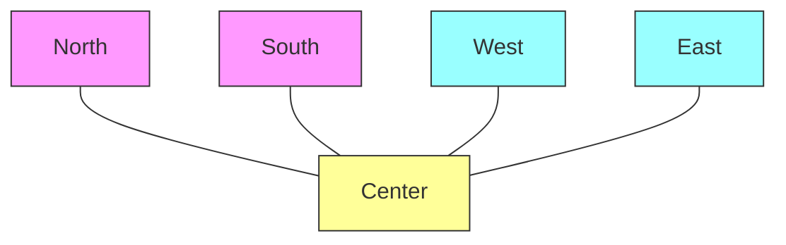

# 04. 컴포넌트 배치

컨테이너는 컴포넌트(버튼, 체크박스 등)를 배치할 때 **배치 관리자(Layout Manager)**를 사용합니다. 배치 관리자를 사용하면 컨테이너의 크기가 변경되더라도 컴포넌트의 크기나 위치가 유동적으로 조절되어 레이아웃을 유지할 수 있습니다.

물론 크기가 고정된 컨테이너의 경우, 좌표값(x, y)을 직접 지정하여 배치할 수도 있습니다(NullLayout).

| 배치 관리자       | 설명                                                                                     |
| :---------------- | :--------------------------------------------------------------------------------------- |
| **BorderLayout**  | 동·서·남·북·중앙(Center) 5개 영역으로 나누어 배치. (`JFrame`, `JDialog`, `JWindow` 기본) |
| **FlowLayout**    | 왼쪽에서 오른쪽으로 물 흐르듯 배치. 공간이 부족하면 아래로 줄바꿈. (`JPanel` 기본)       |
| **GridLayout**    | 행(Row)과 열(Column)의 격자(Grid)에 균등한 크기로 배치.                                  |
| **CardLayout**    | 여러 컴포넌트(패널)를 포개 놓고, 한 번에 하나씩 보여주는 배치 (탭과 유사).               |
| **GridBagLayout** | 격자 기반이지만, 컴포넌트의 크기나 위치를 매우 세밀하게 제어 가능 (복잡함).              |
| **NullLayout**    | 배치 관리자 없이 좌표값(`setBounds`)으로 직접 배치.                                      |

`setLayout()` 메서드로 컨테이너의 배치 관리자를 변경할 수 있습니다.
```java
jFrame.getContentPane().setLayout(new FlowLayout());
```

---

## 1. BorderLayout
`BorderLayout`은 컨테이너를 **North, South, East, West, Center**의 5개 영역으로 나눕니다.



- **North/South**: 컴포넌트의 높이는 유지되고, 폭은 컨테이너에 맞춰집니다.
- **East/West**: 컴포넌트의 폭은 유지되고, 높이는 컨테이너에 맞춰집니다.
- **Center**: 남은 모든 공간을 차지합니다.

```java
package sec04.exam01_borderlayout;

import java.awt.BorderLayout;
import java.awt.Color;
import javax.swing.JButton;
import javax.swing.JFrame;
import javax.swing.JTextArea;
import javax.swing.JTextField;
import javax.swing.SwingUtilities;

public class BorderLayoutExample extends JFrame {
    private JTextField txtNorth;
    private JTextArea txtCenter;
    private JButton btnSouth;

    public BorderLayoutExample() {
        this.setTitle("BorderLayoutExample");
        this.setSize(300, 200);
        this.setDefaultCloseOperation(JFrame.EXIT_ON_CLOSE);
        
        // 북쪽, 중앙, 남쪽에 컴포넌트 배치
        this.getContentPane().add(getTxtNorth(), BorderLayout.NORTH);
        this.getContentPane().add(getTxtCenter(), BorderLayout.CENTER);
        this.getContentPane().add(getBtnSouth(), BorderLayout.SOUTH);
    }

    private JTextField getTxtNorth() {
        if (txtNorth == null) {
            txtNorth = new JTextField();
            txtNorth.setText("북쪽 컴포넌트");
            txtNorth.setBackground(Color.YELLOW);
        }
        return txtNorth;
    }

    private JTextArea getTxtCenter() {
        if (txtCenter == null) {
            txtCenter = new JTextArea();
            txtCenter.append("중앙 컴포넌트\n");
            txtCenter.append("동쪽/서쪽이 없으면 중앙이 확장됩니다.\n");
        }
        return txtCenter;
    }

    private JButton getBtnSouth() {
        if (btnSouth == null) {
            btnSouth = new JButton("남쪽 컴포넌트");
        }
        return btnSouth;
    }

    public static void main(String[] args) {
        SwingUtilities.invokeLater(() -> {
            BorderLayoutExample jFrame = new BorderLayoutExample();
            jFrame.setVisible(true);
        });
    }
}
```

---

## 2. FlowLayout
`FlowLayout`은 컴포넌트를 왼쪽에서 오른쪽으로 차례대로 배치합니다. 한 줄이 꽉 차면 다음 줄로 넘어갑니다. 컴포넌트의 크기는 각 컴포넌트의 적정 크기(Preferred Size)로 유지됩니다.

```java
package sec04.exam02_flowlayout;

import java.awt.FlowLayout;
import javax.swing.JButton;
import javax.swing.JFrame;
import javax.swing.SwingUtilities;

public class FlowLayoutExample extends JFrame {
    private JButton btnOk;
    private JButton btnCancel;

    public FlowLayoutExample() {
        this.setTitle("FlowLayoutExample");
        this.setSize(300, 100);
        this.setDefaultCloseOperation(JFrame.EXIT_ON_CLOSE);
        
        // FlowLayout 설정
        this.setLayout(new FlowLayout());
        
        this.getContentPane().add(getBtnOk());
        this.getContentPane().add(getBtnCancel());
    }

    private JButton getBtnOk() {
        if(btnOk == null) {
            btnOk = new JButton("확인");
        }
        return btnOk;
    }

    private JButton getBtnCancel() {
        if(btnCancel == null) {
            btnCancel = new JButton("취소");
        }
        return btnCancel;
    }

    public static void main(String[] args) {
        SwingUtilities.invokeLater(() -> {
            FlowLayoutExample jFrame = new FlowLayoutExample();
            jFrame.setVisible(true);
        });
    }
}
```

### JPanel과 Layout
`JPanel`은 기본적으로 `FlowLayout`을 사용합니다. 복잡한 배치를 할 때 `JFrame`(`BorderLayout`)의 각 영역에 `JPanel`을 배치하고, 그 `JPanel` 안에 다시 컴포넌트들을 `FlowLayout` 등으로 배치하는 방식(중첩 레이아웃)을 많이 사용합니다.

```java
package sec04.exam03_jpanel;

import java.awt.BorderLayout;
import java.awt.Color;
import javax.swing.JButton;
import javax.swing.JFrame;
import javax.swing.JPanel;
import javax.swing.SwingUtilities;

public class JPanelExample extends JFrame {
    private JPanel panelSouth;
    private JButton btnOk;
    private JButton btnCancel;

    public JPanelExample() {
        this.setTitle("JPanelExample");
        this.setSize(250, 200);
        this.setDefaultCloseOperation(JFrame.EXIT_ON_CLOSE);
        
        // JFrame 남쪽에 JPanel 배치
        this.getContentPane().add(getPanelSouth(), BorderLayout.SOUTH);
    }

    public JPanel getPanelSouth() {
        if (panelSouth == null) {
            panelSouth = new JPanel(); // 기본 FlowLayout
            panelSouth.setBackground(Color.WHITE);
            panelSouth.add(getBtnOk());
            panelSouth.add(getBtnCancel());
        }
        return panelSouth;
    }

    public JButton getBtnOk() {
        if (btnOk == null) btnOk = new JButton("확인");
        return btnOk;
    }

    public JButton getBtnCancel() {
        if (btnCancel == null) btnCancel = new JButton("취소");
        return btnCancel;
    }

    public static void main(String[] args) {
        SwingUtilities.invokeLater(() -> {
            JPanelExample jFrame = new JPanelExample();
            jFrame.setVisible(true);
        });
    }
}
```

---

## 3. GridLayout
`GridLayout`은 컨테이너를 행(Row)과 열(Column)로 나누어 모든 구획을 **동일한 크기**로 만듭니다. 컴포넌트가 추가되면 왼쪽→오른쪽, 위→아래 순서로 채워집니다.

```java
package sec04.exam04_gridlayout;

import java.awt.GridLayout;
import javax.swing.JButton;
import javax.swing.JFrame;
import javax.swing.SwingUtilities;

public class GridLayoutExample extends JFrame {
    private JButton[][] btn;

    public GridLayoutExample() {
        setTitle("GridLayoutExample");
        setSize(300, 100);
        setDefaultCloseOperation(JFrame.EXIT_ON_CLOSE);
        
        // 2행 3열 GridLayout
        setLayout(new GridLayout(2, 3));
        
        for(int r = 0; r < 2; r++) {
            for(int c = 0; c < 3; c++) {
                getContentPane().add(getBtn()[r][c]);
            }
        }
    }

    public JButton[][] getBtn() {
        if(btn == null) {
            btn = new JButton[2][3];
            for(int r = 0; r < 2; r++) {
                for(int c = 0; c < 3; c++) {
                    btn[r][c] = new JButton("["+r+"][" + c + "]");
                }
            }
        }
        return btn;
    }

    public static void main(String[] args) {
        SwingUtilities.invokeLater(() -> {
            GridLayoutExample jFrame = new GridLayoutExample();
            jFrame.setVisible(true);
        });
    }
}
```

---

## 4. CardLayout
`CardLayout`은 여러 컴포넌트(주로 패널)를 같은 위치에 겹쳐 놓고, 한 번에 하나만 보여줍니다. `first()`, `last()`, `next()`, `show()` 메서드로 보여줄 카드를 전환합니다.

```java
package sec04.exam05_cardlayout;

import java.awt.CardLayout;
import java.awt.Color;
import javax.swing.JFrame;
import javax.swing.JPanel;
import javax.swing.SwingUtilities;

public class CardLayoutExample extends JFrame {
    private JPanel redCard, greenCard, blueCard;

    public CardLayoutExample() {
        this.setTitle("CardLayoutExample");
        this.setSize(250, 400);
        this.setResizable(false);
        this.setDefaultCloseOperation(JFrame.EXIT_ON_CLOSE);
        
        // CardLayout 설정
        this.getContentPane().setLayout(new CardLayout());
        
        // 이름과 함께 패널 추가
        this.getContentPane().add("RedCard", getRedCard());
        this.getContentPane().add("GreenCard", getGreenCard());
        this.getContentPane().add("BlueCard", getBlueCard());
    }

    public JPanel getRedCard() {
        if (redCard == null) {
            redCard = new JPanel();
            redCard.setBackground(Color.RED);
        }
        return redCard;
    }
    public JPanel getGreenCard() {
        if (greenCard == null) {
            greenCard = new JPanel();
            greenCard.setBackground(Color.GREEN);
        }
        return greenCard;
    }
    public JPanel getBlueCard() {
        if (blueCard == null) {
            blueCard = new JPanel();
            blueCard.setBackground(Color.BLUE);
        }
        return blueCard;
    }

    public static void main(String[] args) {
        SwingUtilities.invokeLater(() -> {
            final CardLayoutExample jFrame = new CardLayoutExample();
            jFrame.setVisible(true);
            
            // 1초마다 자동으로 카드 전환하는 스레드
            new Thread(() -> {
                for (int i = 0; i < 10; i++) {
                    try {
                        Thread.sleep(1000);
                    } catch (InterruptedException e) {}
                    
                    SwingUtilities.invokeLater(() -> {
                        CardLayout cardLayout = (CardLayout) jFrame.getContentPane().getLayout();
                        cardLayout.next(jFrame.getContentPane());
                    });
                }
            }).start();
        });
    }
}
```

---

## 5. NullLayout (절대 위치)
배치 관리자를 `null`로 설정하고, `setBounds(x, y, width, height)`를 사용하여 컴포넌트의 위치와 크기를 픽셀 단위로 직접 지정합니다. 컨테이너 크기가 변해도 컴포넌트 위치가 변하지 않습니다.

```java
package sec04.exam06_nulllayout;

import javax.swing.JButton;
import javax.swing.JFrame;
import javax.swing.SwingUtilities;

public class NullLayoutExample extends JFrame {
    private JButton btnOk;

    public NullLayoutExample() {
        this.setTitle("NullLayoutExample");
        this.setSize(300, 200);
        this.setResizable(false);
        this.setDefaultCloseOperation(JFrame.EXIT_ON_CLOSE);
        
        // NullLayout 설정
        this.getContentPane().setLayout(null);
        this.getContentPane().add(getBtnOk());
    }

    public JButton getBtnOk() {
        if(btnOk == null) {
            btnOk = new JButton("확인");
            // 절대 위치 및 크기 설정
            btnOk.setBounds(100, 50, 70, 60);
        }
        return btnOk;
    }

    public static void main(String[] args) {
        SwingUtilities.invokeLater(() -> {
            NullLayoutExample jFrame = new NullLayoutExample();
            jFrame.setVisible(true);
        });
    }
}
```

---

## 6. Pack
`pack()` 메서드는 컨테이너 내부의 컴포넌트들이 선호하는 크기(Preferred Size)에 맞춰서 컨테이너(윈도우)의 크기를 자동으로 조절해줍니다. `setSize()` 대신 사용하면 내용물에 딱 맞는 윈도우 크기를 얻을 수 있습니다.

```java
package sec04.exam07_pack;

import java.awt.FlowLayout;
import javax.swing.JButton;
import javax.swing.JFrame;
import javax.swing.SwingUtilities;

public class PackExample extends JFrame {
    private JButton btnOk;
    private JButton btnCancel;

    public PackExample() {
        this.setTitle("PackExample");
        this.setDefaultCloseOperation(JFrame.EXIT_ON_CLOSE);
        
        this.setLayout(new FlowLayout());
        this.getContentPane().add(getBtnOk());
        this.getContentPane().add(getBtnCancel());
        
        // 내부 컴포넌트 크기에 맞게 윈도우 크기 자동 조절
        this.pack();
    }

    private JButton getBtnOk() {
        if(btnOk == null) {
            btnOk = new JButton("확인");
        }
        return btnOk;
    }

    private JButton getBtnCancel() {
        if(btnCancel == null) {
            btnCancel = new JButton("취소");
        }
        return btnCancel;
    }

    public static void main(String[] args) {
        SwingUtilities.invokeLater(() -> {
            PackExample jFrame = new PackExample();
            jFrame.setVisible(true);
        });
    }
}
```
