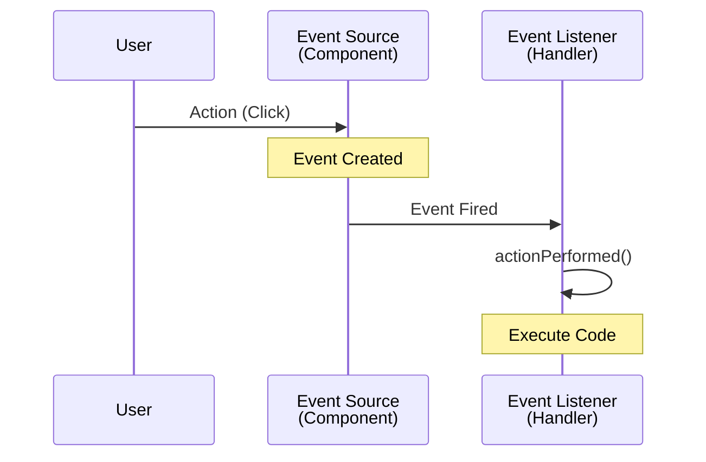

# 05. 이벤트 처리

UI 프로그램은 사용자와 상호작용하며 코드를 실행합니다. 사용자가 버튼을 클릭하거나 키보드를 누르는 등 UI 컴포넌트를 사용하는 순간 **이벤트(Event)**가 발생합니다.

## 이벤트 처리 방식 (Delegation Model)
자바는 **이벤트 소스(Event Source)**와 **이벤트 처리 객체(Listener)**를 분리하는 **위임형(Delegation) 방식**을 사용합니다.
이벤트 소스에서 이벤트가 발생하면, 직접 처리하지 않고 해당 소스에 등록된 리스너에게 처리를 위임하는 방식입니다.

예를 들어, 사용자가 `JButton`(이벤트 소스)을 클릭하면 `ActionEvent`가 발생하고, 버튼에 등록된 `ActionListener`(이벤트 처리 객체)의 메서드가 호출됩니다.



1. **이벤트 소스 (Event Source)**: 이벤트가 발생하는 컴포넌트 (예: `JButton`, `JTextField`)
2. **이벤트 객체 (Event Object)**: 발생한 이벤트에 대한 정보 (예: `ActionEvent`, `MouseEvent`)
3. **이벤트 리스너 (Event Listener)**: 이벤트를 감지하고 처리하는 인터페이스 (예: `ActionListener`)

---

## 주요 이벤트와 리스너
우리가 모든 이벤트를 다 처리할 필요는 없습니다. 필요한 이벤트에 대해서만 리스너를 등록하면 됩니다.

| 이벤트 소스                  | 발생 이벤트   | 리스너 인터페이스 | 발생 시점                           |
| :--------------------------- | :------------ | :---------------- | :---------------------------------- |
| **Window** (`JFrame` 등)     | `WindowEvent` | `WindowListener`  | 창 열기/닫기, 아이콘화 등           |
| **Button**, **TextField**    | `ActionEvent` | `ActionListener`  | 버튼 클릭, 엔터키 입력              |
| **Mouse** (모든 컴포넌트)    | `MouseEvent`  | `MouseListener`   | 마우스 클릭, 누름, 뗌, 들어옴, 나감 |
| **Keyboard** (모든 컴포넌트) | `KeyEvent`    | `KeyListener`     | 키 누름, 뗌, 타이핑                 |
| **List**, **ComboBox**       | `ItemEvent`   | `ItemListener`    | 아이템 선택 상태 변경               |

리스너 등록은 `add + 리스너이름 + (...)` 형태의 메서드를 사용합니다.
- `jFrame.addWindowListener(WindowListener l)`
- `jButton.addActionListener(ActionListener l)`

---

## 리스너(Listener)와 어댑터(Adapter)

이벤트를 처리하는 클래스를 만드는 방법은 두 가지가 있습니다.

### 1. 리스너 인터페이스 구현 (implements)
리스너 인터페이스에 정의된 **모든 추상 메서드를 재정의(Override)**해야 합니다.
`WindowListener`처럼 메서드가 많은 경우, 사용하지 않는 메서드까지 모두 빈 블록으로 구현해야 하는 번거로움이 있습니다.

```java
// 모든 메서드를 오버라이딩 해야 함
class MyWindowListener implements WindowListener {
    public void windowOpened(WindowEvent e) {}
    public void windowClosing(WindowEvent e) { /* 처리 코드 */ }
    public void windowClosed(WindowEvent e) {}
    public void windowIconified(WindowEvent e) {}
    public void windowDeiconified(WindowEvent e) {}
    public void windowActivated(WindowEvent e) {}
    public void windowDeactivated(WindowEvent e) {}
}
```

### 2. 어댑터 클래스 상속 (extends)
추상 메서드가 2개 이상인 리스너 인터페이스는 편의를 위해 **어댑터(Adapter)** 클래스를 제공합니다.
어댑터 클래스는 인터페이스의 메서드들을 빈 블록으로 미리 구현해 둔 클래스입니다. 이를 상속받으면 **필요한 메서드만 재정의**하면 됩니다.

```java
// 필요한 메서드만 오버라이딩 가능
class MyWindowListener extends WindowAdapter {
    @Override
    public void windowClosing(WindowEvent e) {
        // 처리 코드
    }
}
```
*참고: `ActionListener`처럼 메서드가 하나뿐인 인터페이스는 어댑터 클래스가 제공되지 않습니다.*

| 리스너 인터페이스 | 어댑터 클래스       |
| :---------------- | :------------------ |
| `WindowListener`  | `WindowAdapter`     |
| `MouseListener`   | `MouseAdapter`      |
| `KeyListener`     | `KeyAdapter`        |
| `ActionListener`  | 없음 (메서드가 1개) |

---

### 예제: WindowListener와 ActionListener
창 닫기 버튼을 눌렀을 때(`WindowListener`)와 "닫기" 버튼을 눌렀을 때(`ActionListener`) 프로그램을 종료하는 예제입니다.

```java
package sec05.exam01_windowadpater;

import java.awt.FlowLayout;
import java.awt.event.ActionEvent;
import java.awt.event.ActionListener;
import java.awt.event.WindowAdapter;
import java.awt.event.WindowEvent;
import javax.swing.JButton;
import javax.swing.JFrame;
import javax.swing.SwingUtilities;

public class ClosableExample1 extends JFrame {
    private JButton btnClose;

    public ClosableExample1() {
        this.setTitle("CloseExample");
        this.setSize(300, 100);
        this.setLayout(new FlowLayout());
        
        this.getContentPane().add(getBtnClose());
        
        // WindowAdapter를 상속받은 클래스 사용
        this.addWindowListener(new MyWindowAdapter());
    }

    private JButton getBtnClose() {
        if(btnClose == null) {
            btnClose = new JButton("닫기");
            // ActionListener를 구현한 클래스 사용
            btnClose.addActionListener(new MyActionListener());
        }
        return btnClose;
    }

    // 내부 클래스로 리스너 정의
    class MyWindowAdapter extends WindowAdapter {
        @Override
        public void windowClosing(WindowEvent e) {
            System.exit(0);
        }
    }

    class MyActionListener implements ActionListener {
        @Override
        public void actionPerformed(ActionEvent e) {
            System.exit(0);
        }
    }

    public static void main(String[] args) {
        SwingUtilities.invokeLater(() -> {
            ClosableExample1 jFrame = new ClosableExample1();
            jFrame.setVisible(true);
        });
    }
}
```

---

## 익명 객체 (Anonymous Object)
리스너 클래스를 별도로 만들지 않고, **익명 객체**를 사용하여 코드를 간결하게 작성하는 것이 일반적입니다. 특히 이벤트 처리 코드가 짧을 때 유용합니다.

```java
package sec05.exam01_windowadpater;

import java.awt.FlowLayout;
import java.awt.event.ActionEvent;
import java.awt.event.ActionListener;
import java.awt.event.WindowAdapter;
import java.awt.event.WindowEvent;
import javax.swing.JButton;
import javax.swing.JFrame;
import javax.swing.SwingUtilities;

public class ClosableExample2 extends JFrame {
    private JButton btnClose;

    public ClosableExample2() {
        this.setTitle("CloseExample");
        this.setSize(300, 100);
        this.setLayout(new FlowLayout());
        this.getContentPane().add(getBtnClose());
        
        // 익명 객체로 WindowListener 구현
        this.addWindowListener(new WindowAdapter() {
            @Override
            public void windowClosing(WindowEvent e) {
                System.exit(0);
            }
        });
    }

    private JButton getBtnClose() {
        if(btnClose == null) {
            btnClose = new JButton("닫기");
            
            // 익명 객체로 ActionListener 구현
            btnClose.addActionListener(new ActionListener() {
                @Override
                public void actionPerformed(ActionEvent e) {
                    System.exit(0);
                }
            });
        }
        return btnClose;
    }

    public static void main(String[] args) {
        SwingUtilities.invokeLater(() -> {
            ClosableExample2 jFrame = new ClosableExample2();
            jFrame.setVisible(true);
        });
    }
}
```

---

## 다중 컴포넌트 이벤트 처리
하나의 리스너 객체로 여러 컴포넌트의 이벤트를 처리할 수도 있습니다. 이때는 `e.getSource()` 메서드를 사용하여 어떤 컴포넌트에서 이벤트가 발생했는지 확인합니다.

```java
package sec05.exam02_actionlistener;

import java.awt.FlowLayout;
import java.awt.event.ActionEvent;
import java.awt.event.ActionListener;
import javax.swing.JButton;
import javax.swing.JFrame;
import javax.swing.SwingUtilities;

public class ActionListenerExample extends JFrame {
    private JButton btnOk;
    private JButton btnCancel;

    public ActionListenerExample() {
        this.setTitle("ActionListenerExample");
        this.setSize(300, 100);
        this.setDefaultCloseOperation(JFrame.EXIT_ON_CLOSE);
        
        this.setLayout(new FlowLayout());
        this.getContentPane().add(getBtnOk());
        this.getContentPane().add(getBtnCancel());
    }

    // 하나의 리스너로 여러 컴포넌트 처리
    private ActionListener actionListener = new ActionListener() {
        @Override
        public void actionPerformed(ActionEvent e) {
            if(e.getSource() == btnOk) {
                System.out.println("확인 버튼을 클릭했습니다.");
            } else if(e.getSource() == btnCancel) {
                System.out.println("취소 버튼을 클릭했습니다.");
            }
        }
    };

    private JButton getBtnOk() {
        if(btnOk == null) {
            btnOk = new JButton("확인");
            btnOk.addActionListener(actionListener);
        }
        return btnOk;
    }

    private JButton getBtnCancel() {
        if(btnCancel == null) {
            btnCancel = new JButton("취소");
            btnCancel.addActionListener(actionListener);
        }
        return btnCancel;
    }

    public static void main(String[] args) {
        SwingUtilities.invokeLater(() -> {
            ActionListenerExample jFrame = new ActionListenerExample();
            jFrame.setVisible(true);
        });
    }
}
```
