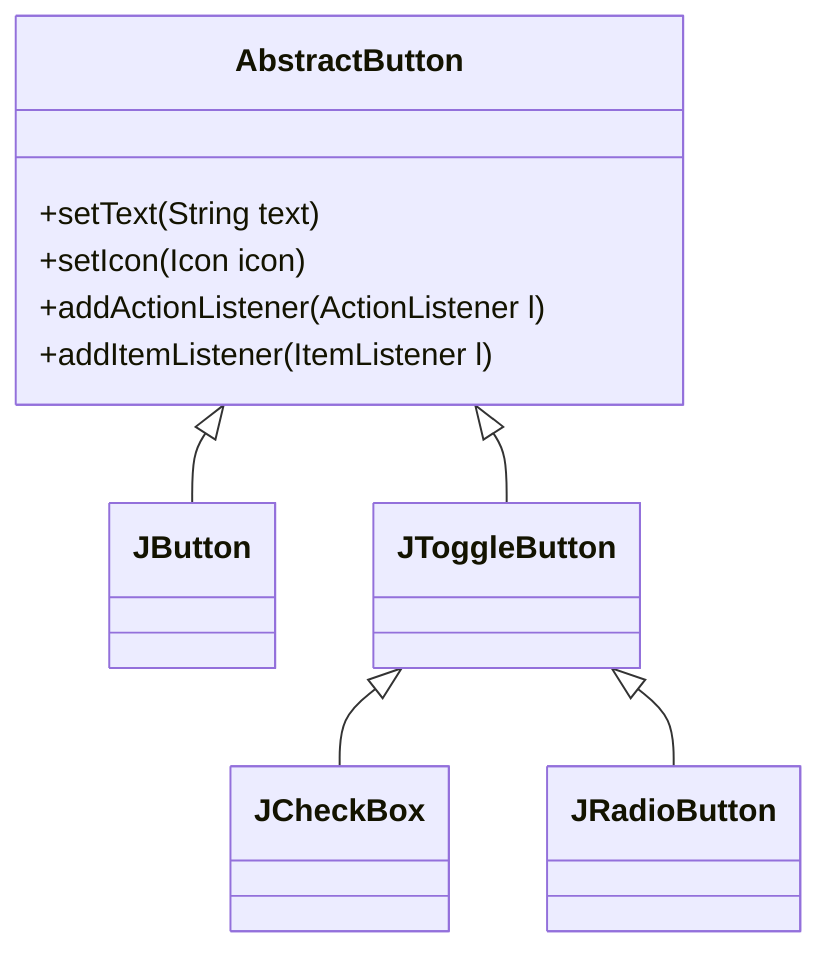

# 06. 버튼 컴포넌트

버튼 컴포넌트는 사용자가 클릭했을 때 이벤트를 발생시키는 가장 기본적인 컴포넌트입니다. Swing의 모든 버튼은 `AbstractButton` 클래스를 상속받습니다.



- **JButton**: 일반적인 푸시 버튼.
- **JToggleButton**: 눌린 상태와 눌리지 않은 상태를 가지는 버튼.
- **JCheckBox**: 다중 선택이 가능한 체크 박스.
- **JRadioButton**: 그룹 내에서 하나만 선택 가능한 라디오 버튼.

---

## 1. JButton
`JButton`은 텍스트, 이미지, 또는 둘 다를 포함할 수 있는 버튼입니다. 클릭 시 `ActionEvent`가 발생합니다.

```java
package sec06.exam01_jbutton;

import java.awt.FlowLayout;
import java.awt.event.ActionEvent;
import java.awt.event.ActionListener;
import javax.swing.ImageIcon;
import javax.swing.JButton;
import javax.swing.JFileChooser;
import javax.swing.JFrame;
import javax.swing.SwingUtilities;

public class JButtonExample extends JFrame {
    private JButton btn1, btn2, btn3;

    public JButtonExample() {
        this.setTitle("JButtonExample");
        this.setSize(300, 100);
        this.setDefaultCloseOperation(JFrame.EXIT_ON_CLOSE);
        
        this.getContentPane().setLayout(new FlowLayout());
        this.getContentPane().add(getBtn1());
        this.getContentPane().add(getBtn2());
        this.getContentPane().add(getBtn3());
    }

    // 텍스트 버튼
    public JButton getBtn1() {
        if(btn1 == null) {
            btn1 = new JButton("새문서");
            btn1.addActionListener(e -> {
                JFileChooser jFileChooser = new JFileChooser();
                jFileChooser.showOpenDialog(JButtonExample.this);
            });
        }
        return btn1;
    }

    // 이미지 버튼
    public JButton getBtn2() {
        if(btn2 == null) {
            btn2 = new JButton();
            btn2.setIcon(new ImageIcon(getClass().getResource("new.gif")));
            btn2.addActionListener(e -> {
                JFileChooser jFileChooser = new JFileChooser();
                jFileChooser.showOpenDialog(JButtonExample.this);
            });
        }
        return btn2;
    }

    // 텍스트 + 이미지 버튼
    public JButton getBtn3() {
        if(btn3 == null) {
            btn3 = new JButton("새문서", new ImageIcon(getClass().getResource("new.gif")));
            btn3.addActionListener(e -> {
                JFileChooser jFileChooser = new JFileChooser();
                jFileChooser.showOpenDialog(JButtonExample.this);
            });
        }
        return btn3;
    }

    public static void main(String[] args) {
        SwingUtilities.invokeLater(() -> {
            JButtonExample jFrame = new JButtonExample();
            jFrame.setVisible(true);
        });
    }
}
```

---

## 2. JToggleButton
`JToggleButton`은 토글(On/Off) 기능을 가진 버튼입니다. 클릭할 때마다 선택(Selected)/해제(Deselected) 상태가 바뀝니다.
상태 변화를 감지하기 위해 `ItemListener`를 사용하는 것이 좋습니다.

```java
package sec06.exam02_jtogglebutton;

import java.awt.GridLayout;
import java.awt.event.ItemEvent;
import java.awt.event.ItemListener;
import javax.swing.ButtonGroup;
import javax.swing.ImageIcon;
import javax.swing.JFrame;
import javax.swing.JOptionPane;
import javax.swing.JPanel;
import javax.swing.JToggleButton;
import javax.swing.SwingUtilities;
import javax.swing.border.TitledBorder;

public class JToggleButtonExample extends JFrame {
    private JPanel pFirst, pSecond;
    private JToggleButton tbOnOff, tbStart, tbStop;

    public JToggleButtonExample() {
        this.setTitle("JToggleButtonExample");
        this.setDefaultCloseOperation(JFrame.EXIT_ON_CLOSE);
        this.getContentPane().setLayout(new GridLayout(2, 1));
        this.getContentPane().add(getPFirst());
        this.getContentPane().add(getPSecond());
        this.pack();
    }

    public JPanel getPFirst() {
        if(pFirst == null) {
            pFirst = new JPanel();
            pFirst.add(getTbOnOff());
        }
        return pFirst;
    }

    public JPanel getPSecond() {
        if(pSecond == null) {
            pSecond = new JPanel();
            pSecond.setBorder(new TitledBorder("원하는 기능은?"));
            pSecond.add(getTbStart());
            pSecond.add(getTbStop());

            // 배타적 선택을 위한 ButtonGroup 생성
            ButtonGroup buttonGroup = new ButtonGroup();
            buttonGroup.add(getTbStart());
            buttonGroup.add(getTbStop());
        }
        return pSecond;
    }

    // On/Off 토글 버튼
    public JToggleButton getTbOnOff() {
        if(tbOnOff == null) {
            tbOnOff = new JToggleButton("On");
            tbOnOff.addItemListener(e -> {
                if(e.getStateChange() == ItemEvent.SELECTED) {
                    tbOnOff.setText("Off");
                } else {
                    tbOnOff.setText("On");
                }
            });
        }
        return tbOnOff;
    }

    // Start 토글 버튼
    public JToggleButton getTbStart() {
        if(tbStart == null) {
            tbStart = new JToggleButton("Start", new ImageIcon(getClass().getResource("start.gif")));
            tbStart.addActionListener(e -> JOptionPane.showMessageDialog(this, "Start"));
        }
        return tbStart;
    }

    // Stop 토글 버튼
    public JToggleButton getTbStop() {
        if(tbStop == null) {
            tbStop = new JToggleButton("Stop", new ImageIcon(getClass().getResource("stop.gif")));
            tbStop.addActionListener(e -> JOptionPane.showMessageDialog(this, "Stop"));
        }
        return tbStop;
    }

    public static void main(String[] args) {
        SwingUtilities.invokeLater(() -> {
            JToggleButtonExample jFrame = new JToggleButtonExample();
            jFrame.setVisible(true);
        });
    }
}
```

---

## 3. JRadioButton
`JRadioButton`은 여러 옵션 중 **하나만 선택**해야 할 때 사용합니다. 반드시 `ButtonGroup`으로 묶어주어야 배타적 선택이 동작합니다.

```java
package sec06.exam03_jradiobutton;

import java.awt.BorderLayout;
import java.awt.GridLayout;
import java.awt.event.ActionEvent;
import java.awt.event.ActionListener;
import javax.swing.ButtonGroup;
import javax.swing.ImageIcon;
import javax.swing.JFrame;
import javax.swing.JLabel;
import javax.swing.JPanel;
import javax.swing.JRadioButton;
import javax.swing.SwingUtilities;

public class JRadioButtonExample extends JFrame {
    private JPanel radioPanel;
    private JRadioButton rbBird, rbCat;
    private JLabel lblPicture;

    public JRadioButtonExample() {
        setTitle("JRadioButtonExample");
        setDefaultCloseOperation(JFrame.EXIT_ON_CLOSE);
        this.getContentPane().add(getRadioPanel(), BorderLayout.WEST);
        this.getContentPane().add(getLblPicture(), BorderLayout.CENTER);
        pack();
    }

    public JPanel getRadioPanel() {
        if (radioPanel == null) {
            radioPanel = new JPanel(new GridLayout(2, 1));
            radioPanel.add(getRbBird());
            radioPanel.add(getRbCat());

            // ButtonGroup으로 묶어서 하나만 선택되게 설정
            ButtonGroup group = new ButtonGroup();
            group.add(getRbBird());
            group.add(getRbCat());
        }
        return radioPanel;
    }

    public JRadioButton getRbBird() {
        if (rbBird == null) {
            rbBird = new JRadioButton("Bird");
            rbBird.setSelected(true); // 기본 선택
            rbBird.addActionListener(e -> 
                getLblPicture().setIcon(new ImageIcon(getClass().getResource("Bird.gif")))
            );
        }
        return rbBird;
    }

    public JRadioButton getRbCat() {
        if (rbCat == null) {
            rbCat = new JRadioButton("Cat");
            rbCat.addActionListener(e -> 
                getLblPicture().setIcon(new ImageIcon(getClass().getResource("Cat.gif")))
            );
        }
        return rbCat;
    }

    public JLabel getLblPicture() {
        if (lblPicture == null) {
            lblPicture = new JLabel();
            lblPicture.setIcon(new ImageIcon(getClass().getResource("Bird.gif")));
        }
        return lblPicture;
    }

    public static void main(String[] args) {
        SwingUtilities.invokeLater(() -> {
            JRadioButtonExample jFrame = new JRadioButtonExample();
            jFrame.setVisible(true);
        });
    }
}
```

---

## 4. JCheckBox
`JCheckBox`는 **다중 선택**이 가능한 버튼입니다. 각 체크박스는 독립적으로 선택/해제 상태를 가집니다. `isSelected()` 메서드로 상태를 확인할 수 있습니다.

```java
package sec06.exam04_jcheckbox;

import java.awt.BorderLayout;
import java.awt.GridLayout;
import java.awt.event.ActionEvent;
import java.awt.event.ActionListener;
import javax.swing.ImageIcon;
import javax.swing.JCheckBox;
import javax.swing.JFrame;
import javax.swing.JLabel;
import javax.swing.JPanel;
import javax.swing.SwingUtilities;

public class JCheckBoxExample extends JFrame {
    private JPanel pWest;
    private JCheckBox cbGlasses;
    private JCheckBox cbHair;
    private JLabel lblPicture;

    public JCheckBoxExample() {
        this.setTitle("JCheckBoxExample");
        this.setDefaultCloseOperation(JFrame.EXIT_ON_CLOSE);
        this.getContentPane().add(getPWest(), BorderLayout.WEST);
        this.getContentPane().add(getLblPicture(), BorderLayout.CENTER);
        this.pack();
    }

    public JPanel getPWest() {
        if (pWest == null) {
            pWest = new JPanel(new GridLayout(2, 1));
            pWest.add(getCbGlasses());
            pWest.add(getCbHair());
        }
        return pWest;
    }

    public JCheckBox getCbGlasses() {
        if (cbGlasses == null) {
            cbGlasses = new JCheckBox("Glasses");
            cbGlasses.addActionListener(actionListener);
        }
        return cbGlasses;
    }

    public JCheckBox getCbHair() {
        if (cbHair == null) {
            cbHair = new JCheckBox("Hair");
            cbHair.addActionListener(actionListener);
        }
        return cbHair;
    }

    public JLabel getLblPicture() {
        if (lblPicture == null) {
            lblPicture = new JLabel();
            lblPicture.setIcon(new ImageIcon(getClass().getResource("geek.gif")));
        }
        return lblPicture;
    }

    // 공통 리스너
    private ActionListener actionListener = new ActionListener() {
        @Override
        public void actionPerformed(ActionEvent e) {
            String imageName = "geek";
            
            if (cbGlasses.isSelected()) imageName += "-glasses";
            if (cbHair.isSelected()) imageName += "-hair";
            
            imageName += ".gif";
            
            lblPicture.setIcon(new ImageIcon(getClass().getResource(imageName)));
        }
    };

    public static void main(String[] args) {
        SwingUtilities.invokeLater(() -> {
            JCheckBoxExample jFrame = new JCheckBoxExample();
            jFrame.setVisible(true);
        });
    }
}
```
