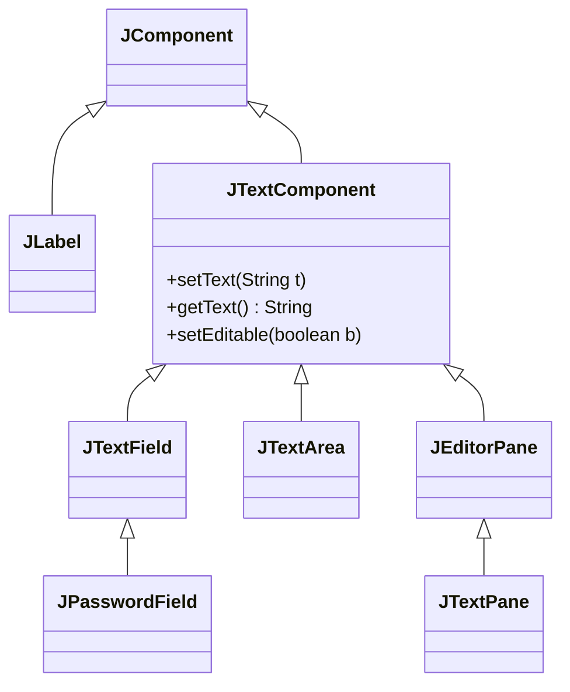

# 07. 텍스트 컴포넌트

Swing에서 텍스트를 다루는 컴포넌트는 크게 **편집 불가능한 컴포넌트**(`JLabel`)와 **편집 가능한 컴포넌트**(`JTextComponent` 상속 클래스)로 나뉩니다.



- **JLabel**: 짧은 텍스트나 이미지를 표시 (편집 불가).
- **JTextField**: 한 줄 텍스트 입력.
- **JPasswordField**: 비밀번호 입력 (입력값 숨김).
- **JTextArea**: 여러 줄 텍스트 입력.
- **JEditorPane / JTextPane**: 서식 있는 텍스트(HTML 등) 지원.

---

## 1. JLabel
`JLabel`은 텍스트나 이미지를 보여주는 가장 기본적인 컴포넌트입니다.

### 주요 메서드
| 메서드                           | 설명                                         |
| :------------------------------- | :------------------------------------------- |
| `setText(String)`                | 표시할 텍스트 설정                           |
| `setIcon(Icon)`                  | 표시할 이미지(Icon) 설정                     |
| `setHorizontalAlignment(int)`    | 가로 정렬 (`JLabel.LEFT`, `CENTER`, `RIGHT`) |
| `setVerticalAlignment(int)`      | 세로 정렬 (`JLabel.TOP`, `CENTER`, `BOTTOM`) |
| `setHorizontalTextPosition(int)` | 이미지 기준 텍스트의 가로 위치               |
| `setVerticalTextPosition(int)`   | 이미지 기준 텍스트의 세로 위치               |
| `setIconTextGap(int)`            | 텍스트와 이미지 사이의 간격 (픽셀)           |
| `setBorder(Border)`              | 경계선 설정 (예: `EtchedBorder`)             |

```java
package sec07.exam01_jlabel;

import java.awt.GridLayout;
import javax.swing.ImageIcon;
import javax.swing.JFrame;
import javax.swing.JLabel;
import javax.swing.SwingUtilities;
import javax.swing.border.EtchedBorder;

public class JLabelExample extends JFrame {
    private JLabel jLabel1, jLabel2, jLabel3, jLabel4;

    public JLabelExample() {
        this.setTitle("JLabelExample");
        this.setDefaultCloseOperation(JFrame.EXIT_ON_CLOSE);
        this.setSize(200, 300);
        this.getContentPane().setLayout(new GridLayout(4, 1));

        this.getContentPane().add(getJLabel1());
        this.getContentPane().add(getJLabel2());
        this.getContentPane().add(getJLabel3());
        this.getContentPane().add(getJLabel4());
    }

    // 1. 텍스트만 + 좌측 정렬 + 테두리
    public JLabel getJLabel1() {
        if (jLabel1 == null) {
            jLabel1 = new JLabel("JLabel1");
            jLabel1.setHorizontalAlignment(JLabel.LEFT);
            jLabel1.setBorder(new EtchedBorder());
        }
        return jLabel1;
    }

    // 2. 텍스트 + 이미지 + 중앙 정렬
    public JLabel getJLabel2() {
        if (jLabel2 == null) {
            jLabel2 = new JLabel("JLabel2");
            jLabel2.setIcon(new ImageIcon(getClass().getResource("user.gif")));
            jLabel2.setHorizontalAlignment(JLabel.CENTER);
            jLabel2.setBorder(new EtchedBorder());
        }
        return jLabel2;
    }

    // 3. 이미지 왼쪽에 텍스트 배치
    public JLabel getJLabel3() {
        if (jLabel3 == null) {
            jLabel3 = new JLabel("JLabel3");
            jLabel3.setIcon(new ImageIcon(getClass().getResource("user.gif")));
            jLabel3.setHorizontalAlignment(JLabel.CENTER);
            jLabel3.setHorizontalTextPosition(JLabel.LEFT);
            jLabel3.setBorder(new EtchedBorder());
        }
        return jLabel3;
    }

    // 4. 아이콘과 텍스트 간격 조정
    public JLabel getJLabel4() {
        if (jLabel4 == null) {
            jLabel4 = new JLabel("JLabel4");
            jLabel4.setIcon(new ImageIcon(getClass().getResource("user.gif")));
            jLabel4.setHorizontalAlignment(JLabel.CENTER);
            jLabel4.setIconTextGap(20);
            jLabel4.setBorder(new EtchedBorder());
        }
        return jLabel4;
    }

    public static void main(String[] args) {
        SwingUtilities.invokeLater(() -> {
            JLabelExample jFrame = new JLabelExample();
            jFrame.setVisible(true);
        });
    }
}
```

---

## 2. JTextField와 JPasswordField
한 줄의 텍스트를 입력받을 때 사용합니다. `JPasswordField`는 입력 문자를 `*`이나 `●` 등으로 가려서 보여줍니다.

- **값 가져오기**:
    - `JTextField`: `getText()` (String 반환)
    - `JPasswordField`: `getPassword()` (char[] 반환 - 보안상 이유)

- **주요 이벤트**:
    - `KeyEvent`: 키를 누를 때마다 발생 (`KeyListener` 사용).
    - `ActionEvent`: 입력 후 Enter 키를 누르면 발생 (`ActionListener` 사용).

```java
package sec07.exam02_jtextfield_jpasswordfield;

import java.awt.GridLayout;
import java.awt.event.ActionEvent;
import java.awt.event.ActionListener;
import java.awt.event.KeyAdapter;
import java.awt.event.KeyEvent;
import javax.swing.JFrame;
import javax.swing.JLabel;
import javax.swing.JOptionPane;
import javax.swing.JPasswordField;
import javax.swing.JTextField;
import javax.swing.SwingUtilities;

public class JTextFieldJPasswordFieldExample extends JFrame {
    private JTextField txtId;
    private JPasswordField txtPassword;

    public JTextFieldJPasswordFieldExample() {
        this.setTitle("JTextField & JPasswordField");
        this.setDefaultCloseOperation(JFrame.EXIT_ON_CLOSE);
        this.setSize(200, 100);
        this.getContentPane().setLayout(new GridLayout(2, 2));
        
        this.getContentPane().add(new JLabel("아이디", JLabel.CENTER));
        this.getContentPane().add(getTxtId());
        this.getContentPane().add(new JLabel("패스워드", JLabel.CENTER));
        this.getContentPane().add(getTxtPassword());
    }

    // ID 입력 필드 (KeyListener 예제)
    public JTextField getTxtId() {
        if (txtId == null) {
            txtId = new JTextField();
            txtId.addKeyListener(new KeyAdapter() {
                @Override
                public void keyPressed(KeyEvent e) {
                    if (e.getKeyCode() >= KeyEvent.VK_A && e.getKeyCode() <= KeyEvent.VK_Z) {
                        System.out.println("알파벳 입력됨");
                    } else {
                        System.out.println("알파벳 아님");
                    }
                }
            });
        }
        return txtId;
    }

    // 비밀번호 입력 필드 (ActionListener 예제 - Enter키)
    public JPasswordField getTxtPassword() {
        if (txtPassword == null) {
            txtPassword = new JPasswordField();
            txtPassword.addActionListener(e -> {
                String password = new String(txtPassword.getPassword());
                JOptionPane.showMessageDialog(
                    JTextFieldJPasswordFieldExample.this, 
                    "입력한 패스워드: " + password
                );
            });
        }
        return txtPassword;
    }

    public static void main(String[] args) {
        SwingUtilities.invokeLater(() -> {
            JTextFieldJPasswordFieldExample jFrame = new JTextFieldJPasswordFieldExample();
            jFrame.setVisible(true);
        });
    }
}
```

---

## 3. JTextArea
여러 줄의 텍스트를 입력하거나 보여줄 때 사용합니다. 스크롤이 자동으로 생기지 않으므로 **`JScrollPane`**에 넣어서 사용해야 합니다.

```java
JTextArea jTextArea = new JTextArea();
JScrollPane jScrollPane = new JScrollPane(jTextArea);
```

### 자동 스크롤 기능
채팅창처럼 텍스트가 추가될 때 자동으로 맨 아래로 스크롤되게 하려면 커서 위치(Caret Position)를 끝으로 옮겨주면 됩니다.
```java
jTextArea.setCaretPosition(jTextArea.getText().length());
```

```java
package sec07.exam03_jtextarea;

import java.awt.BorderLayout;
import java.awt.event.ActionEvent;
import java.awt.event.ActionListener;
import javax.swing.JButton;
import javax.swing.JFrame;
import javax.swing.JPanel;
import javax.swing.JScrollPane;
import javax.swing.JTextArea;
import javax.swing.JTextField;
import javax.swing.SwingUtilities;

public class JTextAreaExample extends JFrame {
    private JTextArea txtDisplay;
    private JPanel pSouth;
    private JTextField txtInput;
    private JButton btnSend;

    public JTextAreaExample() {
        this.setTitle("JTextAreaExample");
        this.setDefaultCloseOperation(JFrame.EXIT_ON_CLOSE);
        this.setSize(300, 200);
        
        // 중앙에 스크롤 가능한 JTextArea 배치
        this.getContentPane().add(new JScrollPane(getTxtDisplay()), BorderLayout.CENTER);
        this.getContentPane().add(getPSouth(), BorderLayout.SOUTH);
    }

    public JTextArea getTxtDisplay() {
        if (txtDisplay == null) {
            txtDisplay = new JTextArea();
            txtDisplay.setEditable(false); // 읽기 전용
        }
        return txtDisplay;
    }

    public JPanel getPSouth() {
        if (pSouth == null) {
            pSouth = new JPanel(new BorderLayout());
            pSouth.add(getTxtInput(), BorderLayout.CENTER);
            pSouth.add(getBtnSend(), BorderLayout.EAST);
        }
        return pSouth;
    }

    public JTextField getTxtInput() {
        if (txtInput == null) {
            txtInput = new JTextField();
            // Enter키 입력 시 전송 버튼 클릭 효과
            txtInput.addActionListener(e -> getBtnSend().doClick());
        }
        return txtInput;
    }

    public JButton getBtnSend() {
        if (btnSend == null) {
            btnSend = new JButton("전송");
            btnSend.addActionListener(e -> {
                String message = getTxtInput().getText();
                getTxtDisplay().append(message + "\n");
                
                // 스크롤을 맨 아래로 이동
                getTxtDisplay().setCaretPosition(getTxtDisplay().getText().length());
                
                getTxtInput().setText("");
                getTxtInput().requestFocus();
            });
        }
        return btnSend;
    }

    public static void main(String[] args) {
        SwingUtilities.invokeLater(() -> {
            JTextAreaExample jFrame = new JTextAreaExample();
            jFrame.setVisible(true);
        });
    }
}
```

---

## 4. JEditorPane
`JEditorPane`은 HTML 같은 서식 있는 텍스트를 보여주거나 간단한 브라우저 기능을 구현할 때 사용할 수 있습니다.
- HTML 로드: `setPage(URL)`
- 링크 클릭 처리: `addHyperlinkListener`

```java
package sec07.exam04_jeditpane;

import java.awt.BorderLayout;
import java.io.IOException;
import javax.swing.JEditorPane;
import javax.swing.JFrame;
import javax.swing.JScrollPane;
import javax.swing.SwingUtilities;
import javax.swing.event.HyperlinkEvent;

public class JEditorPaneExample extends JFrame {
    private JEditorPane jEditorPane;

    public JEditorPaneExample() {
        this.setTitle("JEditorPaneExample");
        this.setDefaultCloseOperation(JFrame.EXIT_ON_CLOSE);
        this.setSize(400, 300);
        this.getContentPane().add(new JScrollPane(getJEditorPane()), BorderLayout.CENTER);
    }

    public JEditorPane getJEditorPane() {
        if(jEditorPane == null) {
            jEditorPane = new JEditorPane();
            jEditorPane.setEditable(false); // 읽기 전용 (HTML 뷰어)
            
            try {
                // 같은 패키지 내의 jeditorpane.html 파일 로딩
                jEditorPane.setPage(getClass().getResource("jeditorpane.html"));
            } catch(Exception e) {
                e.printStackTrace();
            }

            // 하이퍼링크 클릭 이벤트 처리
            jEditorPane.addHyperlinkListener(e -> {
                if(e.getEventType() == HyperlinkEvent.EventType.ACTIVATED) {
                    try {
                        jEditorPane.setPage(e.getURL());
                    } catch(IOException ioe) {
                        ioe.printStackTrace();
                    }
                }
            });
        }
        return jEditorPane;
    }

    public static void main(String[] args) {
        SwingUtilities.invokeLater(() -> {
            JEditorPaneExample jFrame = new JEditorPaneExample();
            jFrame.setVisible(true);
        });
    }
}
```
