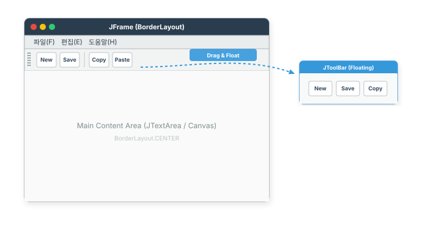
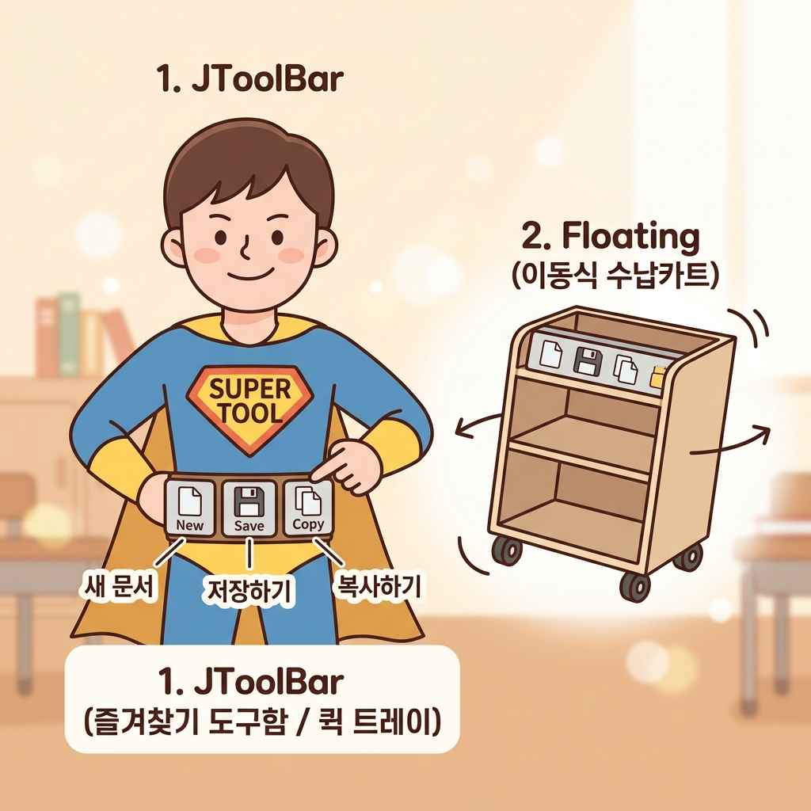
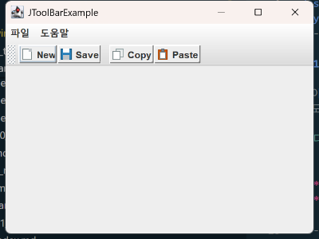

# 12. 툴바 컴포넌트

툴바(Toolbar)는 메뉴보다 빠르게 주요 기능을 선택할 수 있도록, 버튼이나 콤보박스 등의 컴포넌트를 모아놓은 컨테이너입니다.



### 💡 비주얼 개념 잡기: 툴바의 편리함
툴바의 기능은 히어로의 **유틸리티 벨트**나 책상 위 **자주 쓰는 도구 트레이**에 비유할 수 있습니다!



* **JToolBar (즐겨찾기 도구함 / 퀵 트레이)**: 깊은 드롭다운 메뉴를 헤매지 않고, 자주 쓰는 기능(새 파일, 저장, 복사 등)을 단 한 번의 클릭으로 신속히 실행할 수 있도록 주요 도구 버튼들을 모아놓은 전용 트레이(도구 벨트)입니다.
* **Floating (이동식 수납카트)**: 기본적으로는 프레임의 한쪽 경계(BorderLayout)에 고정되어 있지만, 사용자가 마우스로 드래그하면 화면 어디로든 분리해 독립된 창으로 떼어낼 수 있는 이동식 트레이 역할을 합니다.

## 1. JToolBar
| 컴포넌트                 | 설명                        |
| :----------------------- | :-------------------------- |
| **`JToolBar`**           | 툴바 컨테이너               |
| **`JToolBar.Separator`** | 툴바 요소 간의 구분선(공백) |

### 특징
- `BorderLayout`의 `NORTH`, `SOUTH`, `EAST`, `WEST` 등에 배치할 수 있습니다.
- **Floating**: 사용자가 마우스로 드래그하여 위치를 옮기거나 별도의 창으로 떼어낼 수 있습니다.
    - `setFloatable(false)`: 이동 불가능하게 고정.
- 주로 `JButton`을 담지만, `JComboBox` 등 다른 컴포넌트도 추가 가능합니다.

```java
JToolBar toolBar = new JToolBar();
toolBar.setFloatable(false); // 고정

JButton btn = new JButton(new ImageIcon("icon.png"));
btn.setToolTipText("기능 설명");
toolBar.add(btn);

frame.add(toolBar, BorderLayout.NORTH);
```

---

## 2. 툴바 예제 (`JToolBarExample`)
이미지 아이콘이 있는 버튼들로 구성된 툴바를 만들고, 클릭 이벤트를 처리하는 예제입니다.

* **실습 예제 파일**: [JToolBarExample.java](sample/sec12/exam01_jtoolbar/JToolBarExample.java) (경로: `sample/sec12/exam01_jtoolbar/JToolBarExample.java`)
* **실행 방법**:
  ```powershell
  # 1. 12_toolbar_component 디렉토리로 이동 후 컴파일
  javac -d sample sample/sec12/exam01_jtoolbar/JToolBarExample.java
  
  # 2. 실행 (실행 전 같은 패키지 폴더 내의 new.gif, save.gif, copy.gif, paste.gif 리소스가 필요합니다)
  java -cp sample sec12.exam01_jtoolbar.JToolBarExample
  ```

```java
package sec12.exam01_jtoolbar;

import java.awt.BorderLayout;
import java.awt.event.ActionEvent;
import java.awt.event.ActionListener;
import javax.swing.ImageIcon;
import javax.swing.JButton;
import javax.swing.JFrame;
import javax.swing.JMenu;
import javax.swing.JMenuBar;
import javax.swing.JOptionPane;
import javax.swing.JToolBar;
import javax.swing.SwingUtilities;
import javax.swing.border.SoftBevelBorder;

public class JToolBarExample extends JFrame {
    private JMenuBar jMenuBar;
    private JToolBar jToolBar;
    private JButton btnNew, btnSave, btnCopy, btnPaste;

    public JToolBarExample() {
        this.setTitle("JToolBarExample");
        this.setDefaultCloseOperation(JFrame.EXIT_ON_CLOSE);
        this.setSize(400, 300);
        
        this.setJMenuBar(getJMenuBar());
        this.getContentPane().add(getJToolBar(), BorderLayout.NORTH);
    }

    // 메뉴바 생성
    public JMenuBar getJMenuBar() {
        if (jMenuBar == null) {
            jMenuBar = new JMenuBar();
            jMenuBar.add(new JMenu("파일"));
            jMenuBar.add(new JMenu("도움말"));
        }
        return jMenuBar;
    }

    // 툴바 생성
    public JToolBar getJToolBar() {
        if (jToolBar == null) {
            jToolBar = new JToolBar();
            // 툴바 이동 가능 여부 (false: 고정)
            // jToolBar.setFloatable(false); 
            
            jToolBar.add(getBtnNew());
            jToolBar.add(getBtnSave());
            jToolBar.addSeparator(); // 구분선
            jToolBar.add(getBtnCopy());
            jToolBar.add(getBtnPaste());
        }
        return jToolBar;
    }

    public JButton getBtnNew() {
        if (btnNew == null) {
            btnNew = new JButton();
            // 이미지 아이콘이 있다면 사용 (없으면 텍스트 대체 가능)
            btnNew.setIcon(new ImageIcon(getClass().getResource("new.gif"))); 
            btnNew.setText("New"); // 아이콘 없을 시 텍스트 표시
            btnNew.setBorder(new SoftBevelBorder(SoftBevelBorder.RAISED));
            btnNew.setToolTipText("새로 만들기");
            btnNew.addActionListener(actionListener);
        }
        return btnNew;
    }

    public JButton getBtnSave() {
        if (btnSave == null) {
            btnSave = new JButton();
            btnSave.setIcon(new ImageIcon(getClass().getResource("save.gif")));
            btnSave.setText("Save");
            btnSave.setBorder(new SoftBevelBorder(SoftBevelBorder.RAISED));
            btnSave.setToolTipText("저장");
            btnSave.addActionListener(actionListener);
        }
        return btnSave;
    }

    public JButton getBtnCopy() {
        if (btnCopy == null) {
            btnCopy = new JButton();
            btnCopy.setIcon(new ImageIcon(getClass().getResource("copy.gif")));
            btnCopy.setText("Copy");
            btnCopy.setBorder(new SoftBevelBorder(SoftBevelBorder.RAISED));
            btnCopy.setToolTipText("복사");
            btnCopy.addActionListener(actionListener);
        }
        return btnCopy;
    }

    public JButton getBtnPaste() {
        if (btnPaste == null) {
            btnPaste = new JButton();
            btnPaste.setIcon(new ImageIcon(getClass().getResource("paste.gif")));
            btnPaste.setText("Paste");
            btnPaste.setBorder(new SoftBevelBorder(SoftBevelBorder.RAISED));
            btnPaste.setToolTipText("붙여넣기");
            btnPaste.addActionListener(actionListener);
        }
        return btnPaste;
    }

    // 공통 액션 리스너
    private ActionListener actionListener = new ActionListener() {
        @Override
        public void actionPerformed(ActionEvent e) {
            String command = "";
            if (e.getSource() == btnNew) command = "[새로만들기]";
            else if (e.getSource() == btnSave) command = "[저장]";
            else if (e.getSource() == btnCopy) command = "[복사]";
            else if (e.getSource() == btnPaste) command = "[붙여넣기]";
            
            JOptionPane.showMessageDialog(JToolBarExample.this, command + " 클릭");
        }
    };

    public static void main(String[] args) {
        SwingUtilities.invokeLater(() -> {
            JToolBarExample jFrame = new JToolBarExample();
            jFrame.setVisible(true);
        });
    }
}

#### 실행 결과 화면

