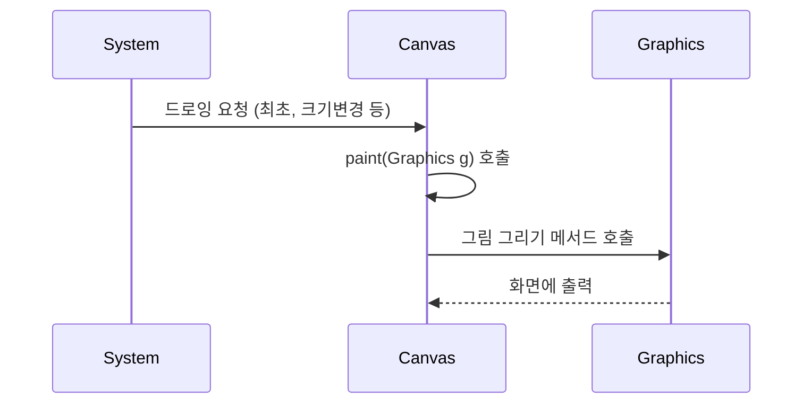

# 14. 2D 그래픽스

UI 프로그램에서 윈도우, 버튼, 이미지 등은 모두 화면에 그려진 2D 그래픽입니다. Swing은 개발자가 직접 2D 그래픽을 그릴 수 있도록 **Java2D API**를 제공합니다.

## 1. Canvas와 Graphics
그림을 그리기 위해서는 **도화지(Canvas)**와 **붓(Graphics)**이 필요합니다.
- **Canvas**: 그림이 그려지는 컴포넌트 (도화지)
- **Graphics**: 그림을 그리는 도구 (붓)

### 그리기 매커니즘
`Canvas`는 화면에 보일 준비가 되면 `paint(Graphics g)` 메서드를 호출하여 그림을 그립니다.



### `paint()` 메서드가 호출되는 시점
1. 윈도우가 처음 나타날 때
2. 윈도우 크기가 변경될 때
3. 윈도우가 다른 창에 가려졌다가 다시 나타날 때
4. 프로그램에서 강제로 `repaint()`를 호출할 때

### 예제 (`CanvasPaintExample`)
```java
package sec14.exam01_paint;

import java.awt.BorderLayout;
import java.awt.Canvas;
import java.awt.Graphics;
import javax.swing.JFrame;
import javax.swing.SwingUtilities;

public class CanvasPaintExample extends JFrame {
    public CanvasPaintExample() {
        setTitle("paint() 메서드 호출 시점");
        getContentPane().add(new MyCanvas(), BorderLayout.CENTER);
        setSize(300, 200);
    }

    // 사용자 정의 Canvas
    class MyCanvas extends Canvas {
        @Override
        public void paint(Graphics g) {
            g.drawString("윈도우 크기를 변경해보세요", 50, 80);
            System.out.println("paint() 메서드 실행");
        }
    }

    public static void main(String[] args) {
        SwingUtilities.invokeLater(() -> {
            new CanvasPaintExample().setVisible(true);
        });
    }
}
```

---

## 2. 다시 그리기 (Repaint)
개발자가 직접 `paint()`를 호출할 수는 없습니다. 대신 `repaint()`를 호출하면 시스템이 `update()`를 거쳐 `paint()`를 호출합니다.

### Repaint 흐름
1. `repaint()` 호출
2. `update(Graphics g)` 호출: 기본적으로 화면을 지움 (배경색으로 채움)
3. `paint(Graphics g)` 호출: 다시 그림

화면이 깜빡거리는 것을 방지하거나, 이전 그림을 유지하려면 `update()` 메서드를 재정의하여 `super.update(g)`(화면 지우기)를 호출하지 않도록 해야 합니다.

```java
@Override
public void update(Graphics g) {
    paint(g); // 화면을 지우지 않고 바로 그리기
}
```

### 예제: 마우스 드래그로 그림 그리기 (`RepaintExample`)
```java
package sec14.exam02_repaint;

import java.awt.BorderLayout;
import java.awt.Canvas;
import java.awt.Graphics;
import java.awt.event.MouseEvent;
import java.awt.event.MouseMotionListener;
import javax.swing.JFrame;
import javax.swing.SwingUtilities;

public class RepaintExample extends JFrame {
    public RepaintExample() {
        setTitle("재 드로잉");
        getContentPane().add(new MyCanvas(), BorderLayout.CENTER);
        setSize(500, 400);
    }

    class MyCanvas extends Canvas implements MouseMotionListener {
        private int x, y;

        public MyCanvas() {
            addMouseMotionListener(this);
        }

        @Override
        public void update(Graphics g) {
            paint(g); // 화면 지우기 생략
        }

        @Override
        public void paint(Graphics g) {
            g.drawString("*", x, y);
        }

        @Override
        public void mouseDragged(MouseEvent e) {
            x = e.getX();
            y = e.getY();
            repaint(); // 다시 그리기 요청
        }

        @Override
        public void mouseMoved(MouseEvent e) {}
    }

    public static void main(String[] args) {
        SwingUtilities.invokeLater(() -> new RepaintExample().setVisible(true));
    }
}
```

---

## 3. 그래픽 주요 메서드
`Graphics` 객체는 다양한 그리기 메서드를 제공합니다.

### 색상 및 폰트 설정
| 메서드              | 설명                                                   |
| :------------------ | :----------------------------------------------------- |
| `setColor(Color c)` | 붓의 색상 설정 (예: `Color.RED`, `new Color(r, g, b)`) |
| `setFont(Font f)`   | 글자 폰트 설정                                         |

**Font 생성**: `new Font("글꼴이름", 스타일, 크기)`
- 스타일: `Font.PLAIN`, `Font.BOLD`, `Font.ITALIC` (조합 가능: `Font.BOLD | Font.ITALIC`)

### 도형 그리기 메서드
| 종류            | 외곽선 그리기 (`draw...`)  | 내부 채우기 (`fill...`) | 설명                                |
| :-------------- | :------------------------- | :---------------------- | :---------------------------------- |
| **선**          | `drawLine(x1, y1, x2, y2)` | -                       | (x1, y1)에서 (x2, y2)까지 선 그리기 |
| **사각형**      | `drawRect(x, y, w, h)`     | `fillRect(x, y, w, h)`  | (x, y) 위치에 w x h 크기 사각형     |
| **원/타원**     | `drawOval(x, y, w, h)`     | `fillOval(x, y, w, h)`  | 사각형 안에 내접하는 원/타원        |
| **둥근 사각형** | `drawRoundRect(...)`       | `fillRoundRect(...)`    | 모서리가 둥근 사각형                |
| **입체 사각형** | `draw3DRect(...)`          | `fill3DRect(...)`       | 음영 효과가 있는 사각형             |
| **호 (부채꼴)** | `drawArc(...)`             | `fillArc(...)`          | 원의 일부분                         |
| **다각형**      | `drawPolygon(...)`         | `fillPolygon(...)`      | 점들의 배열을 이어 만든 다각형      |

### 예제 (`ShapeExample`)
```java
// paint 내부
g.drawOval(50, 50, 50, 50); // 원
g.setColor(Color.RED);
g.drawLine(50, 100, 100, 150); // 선
g.setColor(Color.BLUE);
g.drawRoundRect(200, 50, 120, 80, 30, 30); // 둥근 사각형
```

---

## 4. 안티 알리아싱 (Anti-aliasing)
거친 계단 현상(Aliasing)을 없애고 부드럽게 그리는 기능입니다. `Graphics2D`로 캐스팅하여 설정합니다.

```java
public void paint(Graphics g) {
    Graphics2D g2 = (Graphics2D) g;
    g2.setRenderingHint(
        RenderingHints.KEY_ANTIALIASING, 
        RenderingHints.VALUE_ANTIALIAS_ON
    );
    // 그리기 코드...
}
```

---

## 5. 이미지 그리기
이미지 파일을 로딩하여 화면에 그립니다.

### 이미지 로딩 방법
1. **Toolkit 이용**:
   ```java
   Image img = Toolkit.getDefaultToolkit().getImage("경로/파일명");
   ```
2. **ImageIcon 이용**:
   ```java
   Image img = new ImageIcon("경로/파일명").getImage();
   ```
3. **리소스 경로 (classpath)**:
   ```java
   URL url = getClass().getResource("파일명");
   Image img = Toolkit.getDefaultToolkit().getImage(url);
   ```

### 이미지 그리기
```java
// g.drawImage(Image img, int x, int y, ImageObserver observer)
g.drawImage(img, 0, 0, this);
```

---

## 6. JPanel 배경 이미지 넣기
`JPanel`은 컨테이너이므로 자식 컴포넌트들 뒤에 배경을 그려야 합니다. 이를 위해 `paintComponent` 메서드를 재정의합니다.

**호출 순서**:
1. `JPanel.paint()`
2. `JPanel.paintComponent()` (여기서 배경 그리기)
3. `JPanel.paintChildren()` (자식 컴포넌트 그리기)

### 예제 (`BackgroundImageExample`)
```java
public class MyPanel extends JPanel {
    private Image bgImage;

    public MyPanel() {
        setLayout(null);
        bgImage = new ImageIcon(getClass().getResource("bg.jpg")).getImage();
        // 자식 컴포넌트 추가
        add(new JButton("버튼"));
    }

    @Override
    protected void paintComponent(Graphics g) {
        super.paintComponent(g); // 기본 그리기 수행
        g.drawImage(bgImage, 0, 0, getWidth(), getHeight(), this); // 배경 그리기
    }
}
```

