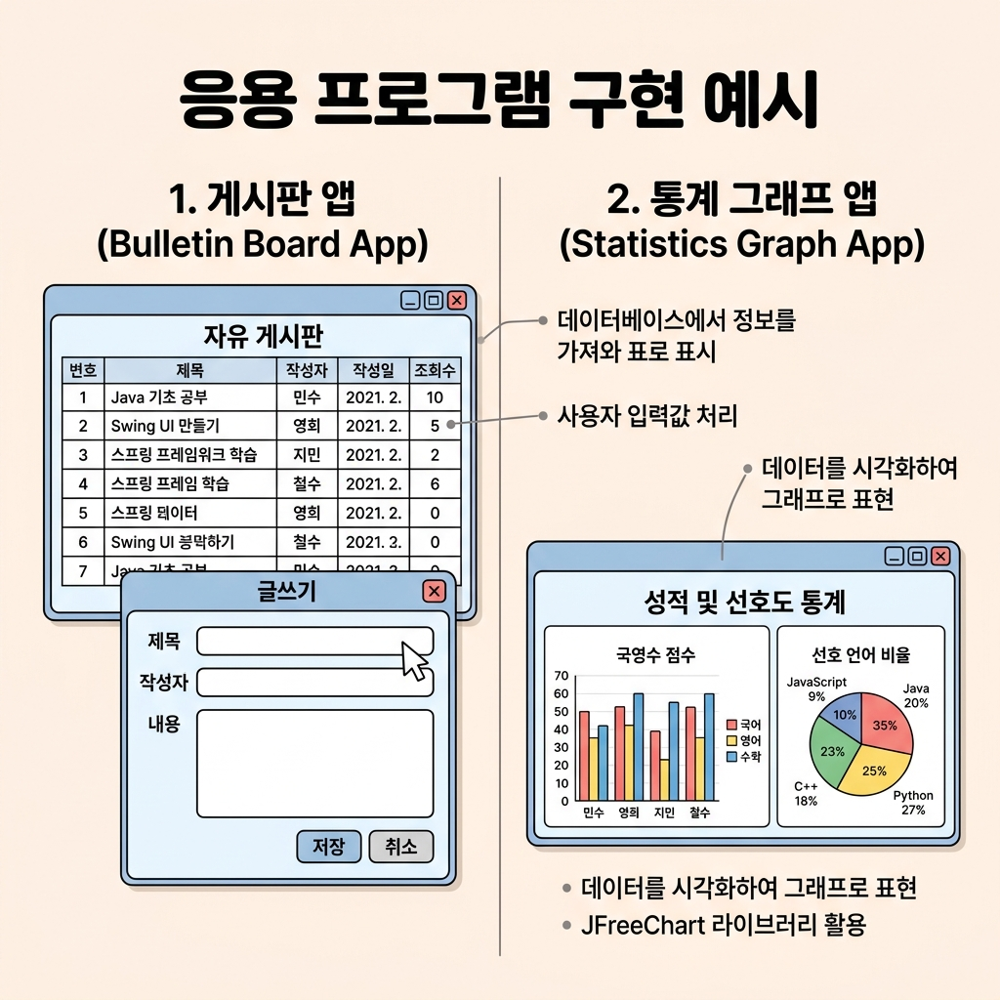
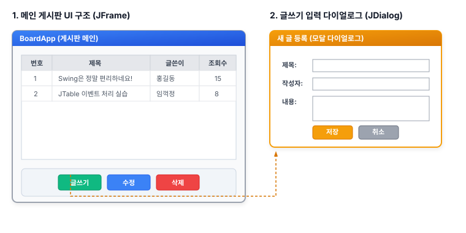

# 15. Swing 과제

지금까지 학습한 내용을 기반으로 아래의 과제들을 수행해 보며 실력을 탄탄하게 다져봅시다!

### 🎯 과제 최종 결과 미리보기
과제를 완료하면 다음과 같은 형태의 게시판 애플리케이션과 통계 그래프 애플리케이션이 완성됩니다.

---

## 📋 [Part A] Swing 게시판 프로젝트 (과제 1~3)
하나의 게시판 앱을 단계별로 확장해 나가는 종합 과제입니다.

### 1단계: 게시판 기본 UI 구성 (과제 1)
* **목표**: 게시판 애플리케이션의 메인 윈도우 프레임을 직접 구성합니다.
* **핵심 요구사항**:
  - [ ] `JFrame`을 사용하여 `BoardApp` 메인 윈도우 생성
  - [ ] 상단에 게시물 목록을 보여줄 `JTable`과 스크롤 지원을 위한 `JScrollPane` 배치
  - [ ] 하단에 [추가] 버튼이 포함된 제어 영역 배치
  - [ ] [추가] 버튼 클릭 시 `JTable`에 임의의 테스트 데이터 행이 추가되는 동적 연동 구현 (`DefaultTableModel` 활용)

### 2단계: 게시물 입력 대화상자 연동 (과제 2)
* **목표**: 사용자가 직접 데이터를 입력하여 추가할 수 있도록 입력용 팝업 창을 연결합니다.
* **핵심 요구사항**:
  - [ ] [추가] 버튼 클릭 시 모달(Modal) 형태의 **게시물 입력 다이얼로그(`JDialog`)** 띄우기
  - [ ] 다이얼로그 내부에 **제목(JTextField)**, **글쓴이(JTextField)**, **내용(JTextArea)**을 입력받을 수 있는 레이아웃 설계
  - [ ] 다이얼로그 하단에 [저장] 및 [취소] 버튼 배치
  - [ ] [저장] 클릭 시 입력 폼의 데이터를 검증한 후 메인 화면의 `JTable`에 행으로 추가하고 다이얼로그 닫기

### 3단계: 게시물 상세 조회 및 수정/삭제 (과제 3)
* **목표**: 목록에서 게시물을 선택하여 내용을 조회하고, 수정 또는 삭제하는 기능을 구현합니다.
* **핵심 요구사항**:
  - [ ] `JTable`의 특정 행을 더블 클릭(또는 선택 후 버튼 클릭)하면 **게시물 상세보기 다이얼로그** 띄우기
  - [ ] 상세보기 다이얼로그에 선택된 행의 데이터(제목, 글쓴이, 내용)를 바인딩하여 출력
  - [ ] 다이얼로그 내 [수정] 버튼 클릭 시, 텍스트 입력창의 수정된 데이터로 메인 `JTable`의 해당 행 데이터를 업데이트
  - [ ] 다이얼로그 내 [삭제] 버튼 클릭 시, 해당 게시물 데이터를 `JTable` 목록에서 제거하고 윈도우 닫기

---

## 📊 [Part B] 2D 그래픽스 차트 프로젝트 (과제 4~5)
Java2D API를 활용해 데이터를 예쁜 시각적 그래프로 그리는 개별 과제입니다.

### 4단계: 성적 통계 막대 그래프 (과제 4)
* **목표**: 제공되는 국영수 점수 데이터를 기반으로 수치에 맞게 사각형의 길이를 조절하는 막대 그래프를 그립니다.
* **성적 데이터**:
  
  | 과목 | 점수 | 색상 가이드 |
  | :--- | :---: | :--- |
  | 국어 | 80 | 빨간색 계열 |
  | 영어 | 70 | 파란색 계열 |
  | 수학 | 90 | 녹색 계열 |

* **핵심 요구사항**:
  - [ ] `Canvas` 또는 `JPanel`을 상속받는 커스텀 드로잉 컴포넌트 생성
  - [ ] `paint()` 또는 `paintComponent()` 오버라이딩
  - [ ] `g.fillRect(x, y, width, height)` 메서드를 조절해 점수 비율에 맞는 막대 그리기
  - [ ] 막대 아래 또는 옆에 과목명과 점수 텍스트(`g.drawString`) 표시하기

### 5단계: 언어 선호도 파이 그래프 (과제 5)
* **목표**: 100명의 개발자 대상 조사 결과를 바탕으로 비율에 맞춰 원을 분할하는 파이(원) 그래프를 그립니다.
* **선호도 조사 데이터**:
  
  | 언어 | 선호 인원 | 비율 (%) |
  | :--- | :---: | :---: |
  | Java | 40명 | 40% |
  | Python | 30명 | 30% |
  | C# | 20명 | 20% |
  | Other | 10명 | 10% |

* **핵심 요구사항**:
  - [ ] 각 언어별 각도 계산 (360도 * 비율)
    - 예: Java = 360 * 0.4 = 144도
  - [ ] `g.fillArc(x, y, width, height, startAngle, arcAngle)` 메서드를 이용해 부채꼴 그리기
  - [ ] 각 영역마다 서로 다른 색상을 지정하고 범례(Legend) 또는 라벨 텍스트 표시하기
