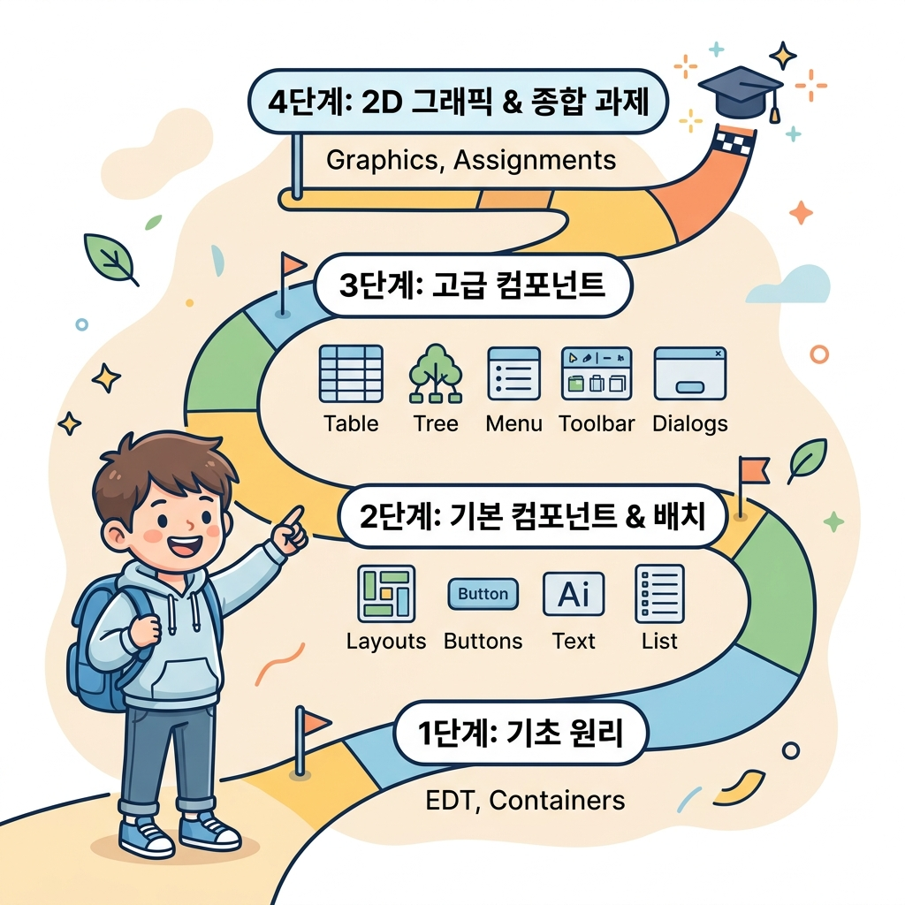

# Swing GUI 프로그래밍 강좌

자바 Swing은 데스크톱 애플리케이션을 개발하기 위한 강력하고 유연한 GUI(Graphical User Interface) 툴킷입니다. 본 강좌는 Swing의 기초 원리인 이벤트 디스패칭 스레드(EDT)부터 시작하여 다양한 기본 컴포넌트, 복잡한 레이아웃 관리, 그리고 고급 2D 그래픽과 실습 과제까지 체계적으로 학습할 수 있도록 구성되어 있습니다.

### 🗺️ Swing 학습 로드맵
아래의 4단계 학습 경로를 따라가며 데스크톱 자바 애플리케이션 개발의 달인이 되어 봅시다!



> [!NOTE]
> **학습 목표**
> 1. **스레드 안전한 GUI 설계**: 이벤트 디스패칭 스레드(EDT)와 `SwingUtilities.invokeLater()`의 중요성을 이해합니다.
> 2. **유연한 레이아웃 구성**: 컨테이너 중첩 및 다양한 배치 관리자(Layout Manager)를 통한 화면 배치 최적화.
> 3. **다양한 컴포넌트 마스터**: 버튼, 텍스트 필드, 테이블, 트리, 메뉴, 툴바 등 핵심 컴포넌트 제어.
> 4. **커스텀 디자인 및 그래픽**: Graphics2D를 사용한 2D 드로잉과 커스텀 렌더러 구현.

---

## 📚 전체 학습 목차

| 장 (Chapter) | 주제 (Topic) | 주요 내용 | 링크 |
| :---: | :--- | :--- | :---: |
| **01** | **Swing 소개** | AWT와 Swing의 차이점, 중량(Heavyweight) vs 경량(Lightweight) 컴포넌트 비교 | [바로가기](01_swing_intro/) |
| **02** | **이벤트 디스패칭 스레드** | 단일 스레드 규칙, EDT(Event Dispatching Thread) 및 `invokeLater()` 사용법 | [바로가기](02_event_dispatching_thread/) |
| **03** | **Swing 컨테이너** | JFrame, JDialog 등 최상위 컨테이너와 JPanel, JScrollPane 등 보조 컨테이너 구조 | [바로가기](03_swing_containers/) |
| **04** | **컴포넌트 배치** | BorderLayout, FlowLayout, GridLayout, CardLayout 등의 배치 관리자 실습 | [바로가기](04_component_layout/) |
| **05** | **이벤트 처리** | 위임형 이벤트 모델(Event delegation model) 및 Listener, Adapter 활용 | [바로가기](05_event_handling/) |
| **06** | **버튼 컴포넌트** | JButton, JToggleButton, JCheckBox, JRadioButton 등의 활용과 이벤트 연결 | [바로가기](06_button_component/) |
| **07** | **텍스트 컴포넌트** | JTextField, JTextArea, JPasswordField 제어 및 Document 모델 학습 | [바로가기](07_text_component/) |
| **08** | **리스트 컴포넌트** | JList와 JComboBox 사용법 및 Vector/배열 데이터를 이용한 항목 동적 관리 | [바로가기](08_list_component/) |
| **09** | **테이블 컴포넌트** | JTable 및 TableModel 구조 이해, 셀 렌더러와 셀 에디터 커스터마이징 | [바로가기](09_table_component/) |
| **10** | **트리 컴포넌트** | JTree의 계층 구조 시각화, DefaultMutableTreeNode 및 TreeCellRenderer | [바로가기](10_tree_component/) |
| **11** | **메뉴 컴포넌트** | JMenuBar, JMenu, JMenuItem, JPopupMenu 구성 및 단축키/체크박스 메뉴 설정 | [바로가기](11_menu_component/) |
| **12** | **툴바 컴포넌트** | JToolBar 추가, 버튼 배치, 이동 가능한 플로팅(Floating) 툴바 활용 | [바로가기](12_toolbar_component/) |
| **13** | **다이얼로그** | JOptionPane 표준 다이얼로그 및 JDialog 상속을 통한 커스텀 모달 대화상자 구현 | [바로가기](13_dialog/) |
| **14** | **2D 그래픽스** | paintComponent() 오버라이딩, Graphics2D를 활용한 커스텀 드로잉 및 이미지 로딩 | [바로가기](14_2d_graphics/) |
| **15** | **Swing 종합 과제** | 메인 게시판 구현(BoardApp), JTable 데이터 수정/삭제, 막대/파이 그래프 그리기 | [바로가기](15_swing_assignment/) |

---

## 🛠️ 실습 환경 구성 및 예제 실행 방법

모든 예제 소스 코드는 각 장의 `sample` 폴더 내에 패키지 단위로 깔끔하게 정리되어 있습니다.

1. **디렉토리 이동**: 실행할 예제가 포함된 챕터 폴더로 이동합니다.
   ```powershell
   cd d:/site/jinysite/java/src/gui/2.swing/01_swing_intro
   ```
2. **소스 코드 컴파일**: `-d` 옵션을 이용하여 소스코드를 `sample` 클래스 디렉토리에 빌드합니다.
   ```powershell
   javac -d sample sample/sec01/exam01_awt/App.java
   ```
3. **애플리케이션 실행**: 패키지 경로를 포함하여 클래스를 실행합니다.
   ```powershell
   java -cp sample sec01.exam01_awt.App
   ```
