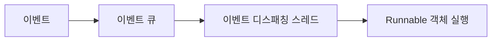
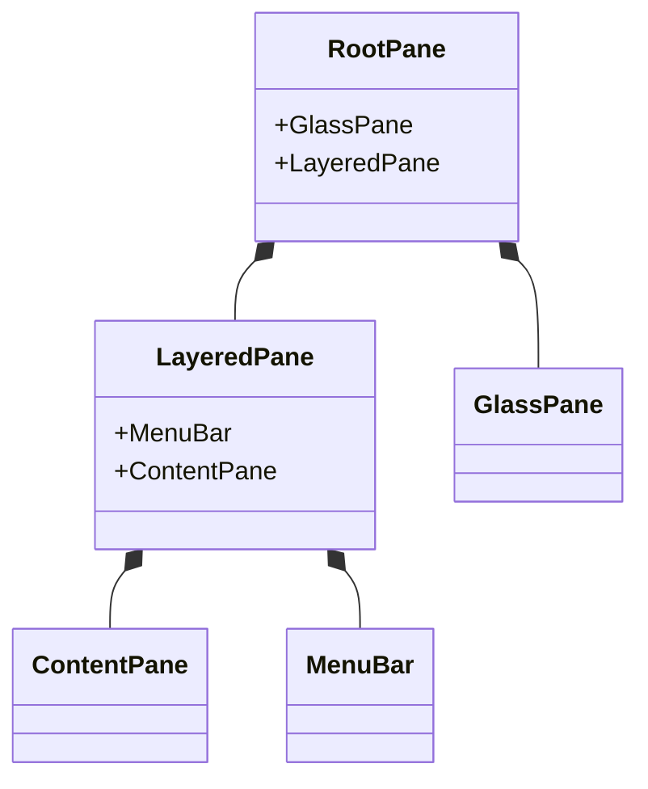

# Swing

## 목차

- 01. Swing 소개
- 02. 이벤트 디스패칭 스레드
- 03. Swing 컨테이너
- 04. 컴포넌트 배치
- 05. 이벤트 처리
- 06. 버튼 컴포넌트
- 07. 텍스트 컴포넌트
- 08. 리스트 컴포넌트
- 09. 테이블 컴포넌트
- 10. 트리 컴포넌트
- 11. 메뉴 컴포넌트
- 12. 톨바 컴포넌트
- 13. 다이얼로그
- 14. 2D 그래픽스
- 15. Swing 과제


## 01. Swing 소개

Up netics 프로그램은 윈도우, 메뉴, 버튼, 라디오, 리스트 등 시각적인 컴포넌트를 제공해서 Ab
용자와 상호작용하도록 돕는다. 자바는 이러한 UI 프로그램을 개발할 수 있도록 JDK JFC!*
Foundation Cases 제공한다.

JECE UL 프로그램을 만들기 위한 클래스들의 모음으로, AWArsme window Tookigh Swing (29%)
을 제공하고 있다. AWTS java.awt 패키지로, 5\10융은 javax.swing 패키지로 사용 가능하다.
AWT는 운영체제가 가지고 있는 컴포넌트를 그대로 이용하고, swings 자바에서 직접 컴포넌트를
만든다는 점이 다르다. 따라서 AWT는 여러 운영체제들이 공통적으로 가지고 있는 컴포넌트만 사
용하므로 컴포넌트 수가 제한적이지만, Swing은 자바에서 직접 제공하는 컴포넌트이기 때문에 종
류가 매우 다양하다. Swing의 단점은 자바가 직접 컴포넌트를 생성하기 때문에 4\에 비해 CPU
와 메모리를 상대적으로 많이 사용한다는 것이다.

다음은 AWT는 작성한 간단한 윈도우 프로그램이다. imports WSS 보면 모두 1102.2\1 패키
지를 사용하고 있는 것을 볼 수 있다.

>»> App. java
```java
package sec01.exam01_awt;

import java.awt.BorderLayout;
import java.awt.Button;

import java.awt.Frame;

import java.awt.event.WindowAdapter;
import java.awt.event WindowEvent;
```

@ 440 어머드 미그

77806 상속
```java
public class App extends Frame {

public App() {

```
WAR 설정

```java
setTitle("AWT App");

```
HAS? 크기 설정

```java
setSize(300, 100);

```
“Button 추가

```java
add(new Button("Ok"), BorderLayout.SOUTH);
```


```java
//윈도우 종료 버튼을 클릭하면 프로세스 종료

addWindowListener(new WindowAdapter() {
Override
public void windowClosing(WindowEvent e) {
System.exit(0);
}
}
public static void main(String[] args) {
//윈도우 생성
App app = new App();
//윈도우를 보여줌
app.setVisible(true);
}
}
```
실행 결과

다음은 5\010으로 작성한 간단한 윈도우 프로그램이다. swings AWT7} 제공하는 AS 공유하

기 때문에 40100ㅁ되는 내용을 보면 java.awt 패키지와 javax.swing 패키지를 사용하고 있는 것

을볼수 있다.
> App. java
```java
package sec01.exam02_swing;
import java.awt.BorderLayout;
import java.awt.event.WindowAdapter;
import java.awt.event WindowEvent;
import javax.swing.JButton;
import javax.swing.JFrame;
```


```java
//IFrame 상속
public class App extends JFrame {

public App() {
```
WAR 설정
```java
setTitle("Swing App");
//윈도우 크기 설정
setSize(300, 100);
```
sButton 추가
```java
getContentPane().add(new JButton("Ok"), BorderLayout.SOUTH);
//윈도우 종료 버튼을 클릭하면 프로세스 종료
addWindowListener(new WindowAdapter() {
@Override
public void windowClosing(WindowEvent e) {
System.exit(0);
}
}
public static void main(String[] args) {
//윈도우 생성
App app = new App();
//윈도우를 보여줌
app.setVisible(true);
}
33}
```
실행 결과

윈도우를 만들기 위해 AWT는 Frame 상속했고, Swing은 JFrame& 상속했다, 그리고 버튼은
AWT는 Button’, Swing은 JButton’: 사용하고 있다. 5\10의 UI 관련 클래스는 AWTS] 클
래스에 ]를 붙였기 때문에 쉽게 구분할 수 있다.


## 02. 이벤트 디스패칭 스레드

Swing은 스레드에 안전하지 않기 때문에 작업 스레드들이 동시에 접근해서 UIE 변경하게 되면 문
제가 발생할 수 있다. 그래서 Swing은 이벤트 디스패칭 스레드여-0048에 의해 순차적으
로 111 변경 작업을 진행하도록 설계되어 있다.

작업 스레드에서 11 를 생성하거나 변경하는 작업이 필요할 때에는 작업해야 할 내용을 Runnable
객체로 생성한 뒤, sooo 저장해 놓는다. 그러면 이벤트 디스패칭 스레드 pooner yy 순
차적으로 Hol] 있는 Runnable 객체를 꺼내어 실행하면서 를 생성하거나 변정시킨다.





작업 스레드는 SwingUtilities 클래스의 invokeLater() 메소드를 이용해서 Fol] Runnable
AAS 저장한다. 메소드 이름이 invokeLater 인 이유는 Fell 먼저 저장된 Runnable 처리하고
나중에 처리한다는 의미이다. 다음은 110101216『() 메소드를 호출하는 방법을 보여 준다.

> App. java
```java
package secO2.exam01_invokeLater;
import java.awt event.WindowAdapter;
import java.awt event.WindowEvent;

import javax.swing.JFrane;
import javax.swing.SwingUtilities;
```

OU AARWHH

(Frame 상속
```java
public class App extends JFrame {
public App() {

```
HAS 설정
```java
setTitle("Swing App");
```
WASPS 크기 설정


```java
setSize(300, 100);

//윈도우 종료 버튼을 클릭하면 프로세스 종료
addWindowListener(new WindowAdapter() {
@Override
public void windowClosing(WindowEvent e) {
System.exit(0);
}
}
public static void main(String[] args) {
//이벤트 큐에 Runnable 넣기
SwingUtilities.invokeLater(new Runnable() {
public void run() {
//윈도우 생성
App app = new App();
```
7/윈도우를 보여줌
```java
app.setVisible(true);
System.out print1n(Thread.currentThread().getName());
}
}
}
```
실행 결과
Bi console £2             =                        a
‘Ap (ava Applicaton) 22 M02 APP

‘AWT-EventQueue-0

Runnable 객체를 실행하는 실제 스레드가 무엇인지 32라인에서 스레드의 이름을 출력하게 했다.
출력 USS 보면 AWT-EventQueue-00] 출력되었는데, 이것이 이벤트 디스패칭 스레드의 이름
이다.


## 03. Swing 컨테이너

윈도우 창과 같이 버튼, 라디오, 체크박스, 텍스트 필드 등의 컴포넌트를 배치한 수 있는 클래스를 컨
테이너라고 한다. Swing® 기능에 따라 컨테이너 클래스를 다음과 같이 제공한다.

| 컨테이너 클래스 | 용도 |
| --- | --- |
| JDesktopPane | 내부 윈도우를 여러 개 포함할 수 있는 MDI 프로그램을 만들 때 사용 |
| JDialog | 다이얼로그 윈도우를 만들 때 사용 |
| JFrame | 작업 BAS, 메뉴가 제공되는 윈도우를 만들 때 사용 |
| JinternalFrame | JDesktopPaneOl| 포함되는 내부 윈도우를 만들 때 사용 |
| JPanel | 컴포넌트들을 배치할 때 사용 |
| JScrollPane | 수직 또는 수평 스크롤이 필요할 때 사용 |
| JSplitPane | 수직 또는 수평으로 보여주는 크기를 조절할 때 사용 |
| JTabbedPane | 여러 가지 탭을 제공할 때 사용 |
| JWindow | 작업 BAS, 메뉴가 없는 윈도우를 만들 때 사용 |

JWindow, JFrame, JDialog= 완전한 윈도우 창 형태를 갖고 있는 최상위 레벨 컨테이너「0ㅋ이
Conaineno]th, 이들을 제외한 나머지는 최상위 레벨 컨테이너의 내부에서 사용되는 보조 컨테이너들
이다.

JFrame

JTabbedPane

JDesktopPane

JinternalFrame

JScrollPane

Press Shif-F10 to activate popup menu


Swing 컨테이너 구조

JWindow, JFrame, JDialog, JInternalFrame 컨테이너는 다른 컨테이너와 달리 기본 판\9 Mane
위에 다음과 같이 여러 겹의 판으로 구성되어 있다.





### 1) GlassPane
GlassPane® 다른 패널 위에 존재하면서 기본적으로 숨겨져 있는 투명한 판이다. GlassPanel]

대한 이해를 돕기 위해 책과 함께 제공되는 소스에서                                      is
GlassPaneDemo java 찾아 이클립스에서 실행 |
Glass pane “Visible”                           Button 2

해 보자.
GlassPaneDemo 대화상자에서 Glass pane “visible”2} 체크박스에 체크하지 않은 상태에서는
다른버튼을 클릭할 수 있지만 체크하면 614550306이 최상판이 되어 바로 밑에 있는 버튼과 메뉴들
을 사용할 수 없다. 대신 GlassPaned]] 그려지는 동그란 빨간 점만 볼 수 있다. 마치 유리로 덮여있

는 진열대에서 유리 속의 물건을 만질 수 없는 이치와 같다.

### 2) JMenuBart ContentPane
JMenuBar= 메뉴가 포함되는 판이고, 그 아래쪽에 있는 ContentPane= 버튼과 같은 111 AE
넌트가 배치되는 판이다. ContentPane#} JMenuBarol] 대한 이해를 돕기 위해 예제 소스에서

ContentPaneDemo java 찾아 이클립스에서 실행해 보자.


JMenuBar

ContentPane

JMenuBar¥ JFrame] setJMenuBar() 메소드로 추가할 수 있다. 하지만 버튼과 같은 UI 컴포넌
트는 JWindow, JFrame, JDialog, JInternalFramel] 직접 배치할 수 없고 getContentPane ()

메소드를 이용해서 ContentPane& 얻은 후에 배치해야 한다.

다음 SEE JFrame] JMenuBarS 추가하고, ContentPane 남쪽에 JButton-& 배치한다.

```java
JFrame jFrame = new JFrame();

```
/MenuBar 추가
```java
iFrame.setdMenuBar(new JMenuBar());

//컴포넌트 추가
jFrame.getContentPane().add(new JButton("2t2!"), BorderLayout.SOUTH);
```

### 3) LayeredPane

여러 컴포넌트들이 AAA 때 각 컴포넌트의 상하 위치를 결
정한다. LayeredPaneel] 대한 이해를 돕기 위해 예제 소스
를 찾아 이클립스에서 실행

EB LayeredPaneDemo             =!미지

‘Choose Duke's Layer and Position                     」

에서 LayeredPaneDemo ja’
해 보자.

손 흔드는 Fapiukeo] 마우스를 올려 놓으면 듀크가 마우:

손 흔드는          스를 올              :
를 따라 움직인다. 듀크를 Yellow, Magenta, Cyan 영역
에 갖다 놓으면 잘 보이지만, Red, Green 영역에 갖다 놓

으면 가려진다. 듀크가 Cyan 레이어 위에 위치하기 때문이
다. 드롭다운 리스트에서 듀크의 위치를 변경해 보면 레이어

개념을 알 수 있을 것이다.

+


JWindow

JWindowS 원도우 경계선, 제목 HAS, 메뉴바가 모두 없는 윈도우를 만드는 컨테이너로, 컴포
넌트만 배치할 수 있는 평면 공간만을 갖는다. 게임 야플리케이션처럼 제목 표시줄이 없는 윈도우를
만들 때 주로 이용된다.

새로운 개발자 정의 윈도우는 다음과 같이 Windows 상속해서 만들 수 있다.

```java
public class JWindowExample extends 2010000 {
public JWindowExample() {
this setSize(450, 300);
}
}
```


우는 반드시 Hung Seopestey} 있어야 하기 때문에 생성자에서 setsize() 메소드로 폭과 높
면 된다. 윈도우를 화면 중앙에 띄우기 위해서는 화면의 중앙 지점을 얻어서 윈도우의 좌측
리의 죄표를 계산해야 한다.


상단 모서

(centerPointx - width/2, centerPointy—height/2)

JWindow

중앙|지점
(centerPointx.|centerPointy)


다음은 1\1000\를 화면 중앙에 띄우기 위해 필요한 코드들이다.

```java
GraphicsEnvironment ge = GraphicsEnvironment .getLocalGraphicsEnvironment();
Point centerPoint = ge.getCenterPoint();

int leftTopx = centerPoint.x - getWidth()/2;

int leftTopY = centerPoint.y - getHeight()/2;

this.setLocation(leftTopx, leftTopY);
```

java.awt,GraphicsEnvironment 그래픽 환경에 대한 정보를 가지고 있는 객체이다. 이 객체는
정적“ 메소드인 getLocalGraphicsEnvironment ()S 호출해서 얻을 수 있다.
GraphincsEnvironment®] getContentPoint() 메소드는 화면 중앙 지점의 %좌표와 좌표를
가지고 있는 Point AAS 리턴한다. 이렇게 얻은 화면 중앙 좌표와 윈도우 폭, 높이로 1\1000\
의 좌측 상단 모서리 좌표를 계산할 수 있다. 그런 다음 1\1000\의 setLocation() 메소드로 좌
측 상단 모서리 좌표를 설정해주면 된다.

JWindowS 화면에 =}-4-24i setVisible (true) 메소드를 호출하면 된다.

```java
JWindowExample jWindow = new JWindowExample();
jWindow.setVisible(true);

BHHE setVisible (false) & 호출하면 JWindow7} 화면에서 사라지는데, 이것은 JWindow7} 3}
```
면에서 완전히 제거되는 것이 아니라 단지 숨겨질 뿐이다. cH] setVisible (true )& 호출하면 언제
든지 나타난다. 만약 ]\1000\를 화면에서 완전히 제거하고 싶다면 dispose () 메소드를 호출하
면 된다.

```java
jWindow.dispose();
```

the 예제는 JWindowS 이용해서 게임을 시작할 때 보여줄 로고 윈도우를 만는다.

02-04606 UI- Swing 81


>> JWindowExample. java

```java
package sec03.exam02_jwindow;

import java.awt BorderLayout;
import java.awt GraphicsEnvironment;

import java.awt.event MouseAdapter;
import java.awt.event MouseEvent;
import javax.swing. ImageIcon;

import javax.swing.JLabel;

import javax.swing.JWindow;

import javax.swing.SwingUtilities;
```

```java
import java.awt.Point;


public class JWindowExample extends JWindow {

public JWindowExample() {

//MWindow2| 크기

this.setSize(600, 350);
```


7/00100애를 화면 중앙으로 띄우기

```java
GraphicsEnvironnent ge = GraphicsEnvironnent.getLocalGraphicsEnvironment();
Point centerPoint = ge.getCenterPoint();

int leftTopxX = centerPoint.x - this.getWidth()/2;
int leftTopY = centerPoint.y - this.getHeight()/2;
this.setLocation(leftTopx, leftTopY);
```


7/3010000에 이미지가 포함된 JLabel 추가

```java
JLabel label = new JLabel();

label.setIcon(new ImageIcon(getClass().getResource("game.png")));
getContentPane().add(label, BorderLayout CENTER);

```
## 30. HSA 클릭 이벤트 처리

```java
this .addMouseListener(new MouseAdapter() {

Override

public void mouseClicked(MouseEvent e) {

dispose();

}


}
```


```java
public static void main(String[{] args) {

SwingUtilities.invokeLater(new Runnable() {

public void run() {

‘WindowExample jWindow = new JWindowExample();
jWindow,setVisible(true);

}


}

47}
```

et 결과

기 위해 26~27 라인에서 JLabel 컴포넌:

= 컴포넌트인데, 56000ㅁ() 메소드로 Imagelcon 객체를 매개값으로

ES 활용하였다. JLabel2 글자

Imagelcon 생성자는 이미지 파일의 URL 객체를 매개값으로 받는데, 1\1000\%31011012.

와 동일한 폴더에 있는 ‘game. png’ 파일에 대한 URL AAS 얻기 위해 다음 SES 사용하였다.

‘un

getClass().getResource("game.png")

28라인은 JLable& JWindo    중앙에 배치시킨다. 컴포넌트 배치는 4절'
라인은 마우스로 JWindowS 클릭했을 때 Windows 제거하기 위해 이벤트를 처리한 것이다.

이벤트 처리는 5절에서 설명한다.


JFrame

JFrame JWindow2k= 달리 2.

클래스
[들수있다

우 경계선, 제목 표시줄, 메뉴바가 있는 윈도우를 만드:
이다. 새로운 개발자 정의 윈도우를

는 컨테

만들기 위해서는 다음과 같이 JFrames 상속해서

```java
public class JFrameExample extends JFrame {

public JFrameExample() {
```

HAS BAS
this.setIconImage(

new ImageIcon(getClass()
```java
this.setTitle(’aaig");
//\Frame 크기
this.setSize(600, 500);
```
NEB 버튼의 기본 기능

```java
-getResource("icon.png")).getImage());

this.setDefaultCloseOperation(JFrame.EXIT_ON_CLOSE);
```

JFrame} 제목 EASES 아이콘, 제목, 크

기 조절용 버튼. 종료 버튼으로 구성된다.
아이콘은
설정하면 되는데, Imagelcon 객체의
getImage () WES Image 객체를 얻
어 매개값으로 설정하면 된다.

setIconImage() 메소드로

창 ASS setTitle() 메소드로 설정할 수


있다. 종료 버튼의 기본 기능은 ]073006을 단순히 숨기기만 하고 프로세스를 종료하지 않는다. 프로세

스를 완전히 $HSEA setDefaultCloseOperation () 메소드로 종료 버튼의 기본 기능을
OF 한다. setDefaultCloseOperation() 메소드에 지정할 수 있는 종료 버튼의 기능별 매개값은

다음 네 가지 종류가 있다.


을 변경해


기능별 상수                                                                           설명
WindowConstants.DO_NOTHING_ON_CLOSE ㅣ 야무것도 하지않음

WindowConstants.HIDE_ON_CLOSE                         화면에서가78006 숨김(기본)

화면에서 JFrame 완전히 제거, 다른 JFrame] 없다면
WindowConstants.DISPOSE_ON_CLOSE            윈도우 프로세스를 종료
JFrame.EXIT_ON_CLOSE                                              윈도우 프로세스를 종료

앙 부분에 위치시키는 방법은

창 크기는 56[5120()로 폭과 높이값을 주고, 10724006을 화면의 중
JWindowol] 설명한 것과 동일하다. 화면 중앙 좌표와 윈도우 폭, 높이로 JFrame] 좌측 상단
모서리 좌표를 구한 다음, 560.008000() 메소드로 설정해주면 된다.

JFrameS 화면에 띄우려면 5600151316(6046) 메소드를 다음과 같이 호출하면 된다.

```java
JFrameExample jFrame = new JFrameExample ();
jFrame.setVisible(true);
```

반대로 520\1513216 (false )S 호출하면 JFrame] 화면에서 사라지는데, 이것은 JFrame] 화면에
서 완전히 제거되는 것이 아니라 숨겨질 뿐이다. cH] setVisible (true )S 호출하면 언제든지 나타
난다. 만약 ]|8724006를 화면에서 완전히 제거하고 싶다면 015605ㅇ() AES 호출하면 된다.

```java
Frame dispose();
```

요

다음 예제는 JFrame 2. 제목 표시줄이 있는 윈도:

o» JFrameExample. java

```java
package sec03.exam03_j frame;
```


```java
그 import java.awt GraphicsEnvironment;
import java.awt.Point:

import javax.swing. Imagelcon;

import javax.swing.JFrame;

import javax.swing.SwingUtilities;
```


```java
public class JFrameExample extends JFrame {

public JFrameExample() {
```
"       //MWindow2| 크기
```java
this setSize(600, 500);
//제목 ENS 내용
this.setIconImage(new ImageIcon(getClass().getResource("icon.png")).

getImage());

this setTitle(*ai2la");
```
HSB 버튼의 기본 기능
```java
this.setDefaultCloseOperation(JFrame.£XIT_ON_CLOSE);
```
7/00100애를 화면 중앙으로 띄우기
```java
GraphicsEnvironnent ge = GraphicsEnvironnent.getLocal GraphicsEnvironment();
Point centerPoint = ge.getCenterPoint();
int leftTopxX = centerPoint.x - this.getWidth()/2;
int leftTopY = centerPoint.y - this.getHeight()/2;
this.setLocation(leftTopx, leftTopY);
}
public static void main(String[] args) {
SwingUtilities.invokeLater(new Runnable() {
public void run() {
JFrameExample jFrame = new JFrameExample();
jFrame.setVisible(true);
}
}
37}
```

실랭 결과


JTabbedPane

JTabbedPane® 탭『별로 다른 내용을 보여주

기 위해 사용되는 컨테이너이다. JTabbedPane
은 독립적인 윈도우 모양을 갖고 있지 않기 때문

에 JWindow, JFrame, JDialog 등과 같은 최
상위 레벨 컨테이너에 배치된다.

2% 화면은 JTabbedPane2] 구현 모습이다.
BO] 위치는 상단, 하단, 왼쪽, 오른쪽에 위치 시
킬 수 있다. JTabbedPaneS 생성하려면 다음
이 기본 생성자를 호출하면 된다.

부
a

```java
JTabbedPane jTabbedPane = new JTabbedPane();
```

탭의 위치를 AVsAIA setTabPlacement() 메소드로 탭의 위치 상수를 다음과 같이 지정한다.

jTabbedPane.setTabPlacement(

ITabbedPane.TOP | JTabbedPane.BOTTOM | JTabbedPane.LEFT | JTabbedPane.RIGHT
%

JTabbedPane®l] “ uo addTab() 메소드를 이용한다. addTab() 메소드는 탭의 이

름과 탭안에 배치될           트를 매개값으로 받는데, 컴포넌트는 FH JPanelS 객체를 사용한다.

```java
jTabbedPane .addTab("TapName1", jPanel1);
jTabbedPane .addTab("TapName2", jPanel2);
```

그리고 각각의 JPanel 안에는 해당 탭에서 보여줄 컴포넌트를 배치하면 된다. 이렇게 “
JTabbedPane® 다른 컴포넌트와 마찬가지로 ContentPanes 배치된다. 다음은 JFrame2| 중

에 JTabbedPane& 배치하는 코드이다.

```java
jFrame.getContentPane().add("Center”, jTabbedPane);
```

02- Java U-Swing 87


다음 예제는 두 개의 탭을 추가한 다음 각 탭을 클릭하면 두 개의 JPanel] 이미지를 교체해 보여 준다.

> JTabbedPaneExample. java
```java
package sec03.exam04_j tabbedpane;

import java.awt.BorderLayout;

import javax.swing.JFrane;
import javax.swing.JLabel;
import javax.swing.JPanel;

import javax.swing.JTabbedPane;

import javax.swing.SwingUtilities;
```

```java
import javax.swing. InageIcon;

public class JTabbedPaneExample extends JFrame {

private JTabbedPane jTabbedPane;

private JPanel tabiPanel;

private JPanel tab2Panel;
```


```java
//메인 윈도우 설정

public JTabbedPaneExample() (

this setTitle("JTabbedPaneExample");

this setSize(300, 200);

this.setDefaul tCloseQperation(JFrame.EXIT_ON_CLOSE);
this getContentPane().add(getJTabbedPane(), BorderLayout.CENTER);
}
```


```java
//JTabbedPane 생성 및 Tab 추가

private JTabbedPane getJTabbedPane() {

if (jTabbedPane == null) {

jTabbedPane = new JTabbedPane();

jTabbedPane.setTabPlacement (JTabbedPane LEFT);

jTabbedPane.addTab("e41", getTab1Panel());

jTabbedPane.addTab("e!2", getTab2Panel());

}

return jTabbedPane;

}
```


```java
//Tab10l 추가된 JPanel 생성
```


```java
private JPanel getTab1Panel() {

if(tab1Panel == null) {

tabiPanel = new JPanel();

JLabel jlabel = new JLabel();

a“           jlabel.setIcon(new ImageIcon(getClass().getResource("duke1 .gif")));
tab1Panel .add(jLabel);

}

return tabiPanel;

}
```


```java
//Tab20) #7 JPanel 생성

private JPanel getTab2Panel() {

if(tab2Panel == null) {

tab2Panel = new JPanel();

JLabel jlabel = new JLabel();

jlabel.setIcon(new ImageIcon(getClass().getResource("duke2.gif")));
tab2Panel .add(jLabel);

}

return tab2Panel;

}


public static void main(String[] args) {

SwingUtilities invokeLater(new Runnable() {

public void run() {

ITabbedPaneExample jFrame = new JTabbedPaneExample();
jFrane.setVisible(true);

}

yi

}

}
```


JScrollPane

바를 이용해서 볼 수 있게 해준다. JScrollPanee 다른 컨테이너와는 달리 단 하나의 컴포넌트만

포함시킬 수 있다.

JscrollPane® 포함된 컴포넌트의 크기가 ]5070110206 자신보다 큰 경우 수평 또는 수직 스크롤
을
을

IScrollPaneExample

JScroliPane

위 그림을 보면 JScrollPane®: JFrame2] 중앙에 위치하고 있다. ]9070110276안에는 DAS
하고 있는 JLabel 배치되어 있는데, 그림의 크기가 ]500110206보다 크기 때문에 수직 및 수평 스
크롤이 생긴다.

스크롤이 필요한 컴포넌트에는 큰 내용을 포함하고 QE JLabel, JTextArea, JList, JTable, JTree
등이 있다. 이 컴포넌트에 스크롤을 적용시키려면 다음과 같이 JScrollPane 생성자에 컴포넌트를
매개값으로 주면 된다. 이렇게 생성된 ]5070110206은 컴포넌트가 배치될 수 있는 곳이라면 어디든
지 배치가 가능하다.

```java
JScrollPane scrollJList = new JScrollPane(jLabel);
JScrollPane scrollJTextArea = new JScrollPane(jTextArea);
JScrollPane scrollJList = new JScrollPane(jList);
JScrollPane scrollJTable = new JScrollPane(jTable);
```

다음 예제에서는 ]12101에 큰 이미지를 넣고, JScrollPane4] JLabel& 추가시켰다. 그리고

JFrame 중앙에 JScrollPane& 배치시켰는데, JFrame] 사이즈가 이미지보다 작기 때문에 스크롤
이 자동 생성된다.


>»» JScrol1PaneExample. java

```java
package sec03.exam05_jscrollpane;

import java.awt.BorderLayout;
import javax.swing. Inagelcon;
import javax.swing.JFrane;

import javax.swing.JLabel;

import javax.swing.JScrol1Pane;
import javax.swing.SwingUtilities;

public class JScrollPaneExample extends JFrame {
private JScrollPane scrollimage;
private JLabel 1blImage;

```
lel 윈도우 설정
```java
public JScrollPaneExample() {
this .setTitle("JScrollPaneExample");
this .setSize(350, 230);
this .setDefaultCloseOperation(JFrame.EXIT_ON_CLOSE);
//JFrame SY IScrollPane 추가
this .getContentPane().add(getScrollImage(), BorderLayout .CENTER);

//ScrollPane 생성
private JScrollPane getScrollimage() {
if (scrollImage == null) {
scrollImage = new JScrollPane(getLblImage());
}
return scrollImage;

```
/Alabel 생성
```java
public JLabel getLblImage() {
if(lblImage == null) {
IblImage = new JLabel();
IblImage.setIcon(new ImageIcon(getClass().getResource("snow.jpg")));
}
return 16110096;
```


```java
public static void main(String[] args) {
SwingUtilities.invokeLater(new Runnable() {
public void run() {
IScrollPaneExample jFrame = new JScrollPaneExample();
jFrame.setVisible(true);
}
}
480}
```
실랭 결과

## 04. 컴포넌트 배치

컨테이너에는 UI 컴포넌트들이 배치된다. 대표적인 컴포넌트에는 버튼, 체크박스, 라디오 버튼, 콤
포, 리스트 등이 있다. 컨테이너는 기본적으로 배치 관리자로 컴포넌트를 배치한다.

배치 관리자는 좌표값으로 컴포넌트를 배치하지 않고, 컨테이너를 몇 개의 구획으로 나누어 하나의
구획에 하나의 컴포넌트를 배치해준다. 배치 관리자로 배치하게 되면 컨테이너의 크기가 사용자에
의해 변경되더라도 컴포넌트의 크기가 비율적으로 늘거나 줄게되어 배치 모양이 그대로 유지된다는
장점이 있다.

크기가 고정된 컨테이너일 경우, 세밀한 MAS 위해서 죄표값으로 컴포넌트를 배치할 수도 있다.


이 경우 컨테이너의 좌측 상단 모서리를 (0.0)으로 보고, <축과 ys 좌표로 컴포넌트의 위치를 정
해서 배치한다.

Layout Manager

컨테이너가 컴포넌트를 배치할 때에는 배치 관리자ㅁ0“0*0049가 무엇이냐에 따라 달라진다.
JWindow, JFrame, JDialog= 기본적으로 BorderLayout 배치 관리자를 사용하고, JPanel
FlowLayout& 사용한다. 자바는 1102.21 패키지에서 다음과 같은 배치 관리자를 제공한다.

| 배치 관리자 | 설명 |
| --- | --- |
| BorderLayout | 동ㆍ서ㆍ남ㆍ북ㆍ중앙으로 컴포넌트를 배치 |
| CardLayout | 여러 장의 카드에 컴포넌트를 각각 배치 |
| FlowLayout | 왼쪽에서 오른쪽으로 컴포넌트를 배치 |
| GridLayout | 바둑판과 같은 격자에 컴포넌트를 배치 |
| GridBagLayout | 바둑판과 같은 격자에 컴포넌트를 배치하지만 격자 간 병합 가능 |

컨테이너의 기본 배치 관리자 대신 다른 것을 사용하고 ITH setLayout () 메소드로 변경할 수 있
다. setLayout() 2} 매개변수 데이터 EFL LayoutManager 인터페이스인데, 모든 배치 관리자
의 인스턴스가 올 수 있다. 다음은 ]0724006의 배치 관리자를 변경하는 방법을 보여 준다.

```java
jFrame.getContentPane().setLayout( LayoutManager layoutManager );
Fe
```

new BorderLayout()        new FlowLayout()        new GridLayout(2,3)

th

컨테이너의 배치 관리자 AVS 컴포넌트를 배치하기 전에 변경하는 것이 좋다. 컨테이너에서 사용
하는 배치 관리자를 얻고 싶다면 컨테이너의 860.4704『() 메소드를 호출하면 된다. getLayout()
의 리턴타입은 LayoutManager 인터페이스이므로 다음과 같이 타입 변환을 해야 한다.

```java
BorderLayout borderLayout = (BorderLayout) jFrame.getContentPane().getLayout();
```


BorderLayout

BorderLayout 배치 관리자는 컨테이너를 SS NE
동ㆍ서 ㆍ남ㆍ북으로 구획 짓고, 각 구획에 하나의
컴포넌트 또는 컨테이너를 배치한다. 일반적으로
각 구획에는 JPanel 컨테이너가 배치되어 복잡한
형태의 ]]를 만들어낸다. 다음 그림은 ]8073000의
각 구획에 18400 컴포넌트를 배치한 것이다.
BorderLayout& 기본적으로 사용하는 컨테이너
는 1\01000\, JFrame, JDialog 등이 있다. BorderLayout®] 적용된 컨테이너에 컴포넌트를 배
치할 때에는 다음과 같이 00ㅁ66ㅁ00”306을 얻고 add () 메소드를 사용해야 한다.

```java
JFrame getContentPane().add(42W=, BorderLayout CENTER);
JFrame getContentPane().add(4ZUS, BorderLayout EAST);
JFrame getContentPane().add(4ZUS, BorderLayout WEST);
JFrame getContentPane().add(¥2W&, BorderLayout SOUTH);
JFrame getContentPane().add(¥2W&, BorderLayout NORTH);
```

첫 번째 매개값에는 배치할 컴포넌트 객체가 오고, 두 번째 매개값에는 어떤 구획에 배치할 것인지
지정하는 BorderLayout2| 상수가 온다. 만약 동 ㆍ서 ㆍ남 ㆍ북 중에서 컴포넌트가 배치되지 않은
구획이 있다면 중앙에 배치된 컴포넌트가 해당 구획까지 확장된다.

다음 예제는 중앙. 북쪽, 남쪽에만 컴포넌트를 배치하고, 동쪽과 서쪽은 배치하지 않았다. 그래서 중
앙에 배치된 컴포넌트가 동쪽과 서쪽으로 확장되었다.

```java
package sec04,exan01_borderlayout;

import java.awt BorderLayout;
import java.awt Color;
import javax.swing, JButton;

AuURWNno

import javax.swing.JFrane;
```


```java
import javax.swing.JTextArea;
import javax.swing.JTextField;
import javax.swing.SwingUtilities;
```


```java
public class BorderLayoutExample extends JFrame (

private JTextField txtNorth;
private JTextArea txtCenter;
private JButton btnSouth;

```
lel 윈도우 설정
```java
public BorderLayoutExample() {
this .setTitle("BorderLayoutExample");
this .setSize(300, 200);
this setDefaultCloseOperation(JFrame.EXIT_ON_CLOSE);

```
13%, 중앙, 남쪽에 컴포넌트 배치

```java
this .getContentPane().add(getTxtNorth(), BorderLayout NORTH);
this .getContentPane().add(getTxtCenter(), BorderLayout CENTER);
this .getContentPane().add(getBtnSouth(), BorderLayout SOUTH);

//ITextField 생성
private JTextField getTxtNorth() {
aif (txtNorth == null) {
txtNorth = new JTextField();
txtNorth.setText("S§ 컴포넌트");
txtNorth.setBackground(Color YELLOW);
}
return txtNorth;

```
1/TrextArea 생성
```java
private JTextArea getTxtCenter() {
if (txtCenter    null) {
txtCenter = new JTextArea();
txtCenter.append("Se 컴포넌트");
txtCenter.append("S% 컴포년트가 없으니 SFOS 확장\0");
100『66016ㄷ.000600("서쪽 컴포년트가 없으니 서쪽으로 확장\0");
}
return txtCenter;
```


```java
}
```


s3Button 생성

```java
private JButton getBtnSouth() {

if (btnSouth == null) {

btnSouth = new JButton();

66050410.56116짜("남쪽 컴포넌트");

}

return btnSouth;

}


public static void main(String[] args) {

SwingUtilities.invokeLater(new Runnable() {
public void run() {

BorderLayoutExample jFrame = new BorderLayoutExample();
jFrame.setVisible(true);

}


}

}
```

실행 결과

[99094 1942.08

ees
등짝 컴포년트가없으니 등쪽으로 확장

서쪽 컴포넌트가없으니 서쪽으로 확장

남쪽 길포넌트

FlowLayout

FlowLayout 배치 관리자는 이미 배치된 컴포넌트의 오른쪽 옆에 새로운 컴포넌트를 배치한다. 오
른쪽에 배치할 공간이 부족하면 하단에 배치하기 때문에 사용자에 의해 컨테이너의 Bwano] 변경되
면 컴포넌트의 배치 위치가 변경될 수 있다.


FB BorderLayoutExample 런드!

a

a
명

FlowLayout®] 적용된 컨테이너에 컴포넌트를 배치할 때는 컴포넌트만 매개변수로 갖는 add()
메소드를 사용한다. 예를 들어 ]074076이 FlowLayouts 사용하여 컴포넌트를 배치한다면, 다음
과 같은 200 () 메소드로 컴포넌트를 배치한다.

```java
iFrame.getContentPane().setLayout(new FlowLayout());
jFrame.getContentPane().add(d=W);
```

다음 예제는 JFrame] 배치 관리자로 FlowLayoutS 적용하고 버튼 두 개를 배치

>» FlowLayoutExample. java

```java
package sec04,exan02_flowlayout;
```


```java
import java.awt.FlowLayout;

import javax.swing.JButton;

import javax.swing.JFrame;

import javax.swing.SwingUtilities;

public class FlowLayoutExample extends JFrame {

private JButton btnOk;

private JButton btnCancel;
```


```java
//메인 윈도우 설정

public FlowLayoutExample() {

this setTitle(‘FlowLayoutExample");

this.setSize(300, 100);

this setDefaul tCloseOperation(JFrame.EXIT_ON_CLOSE);

```
/FlowLayoutc= 변경하고 두 개의 버튼 추가
```java
this.setLayout(new FlowLayout());

this getContentPane().add(getBtnOk());

this.getContentPane().add(getBtnCancel());
```


```java
}

```
Ok 버튼 생성
```java
private JButton getBtnOk() {
if(btnOk == null) {
btnOk = new JButton();
btnOk.setText("s2l");
}
return 0600;
}
```
7/680661 HE 생성
```java
private JButton getBtnCancel() {
if(btnCancel    null) {
btnCancel = new JButton();
btnCancel.setText("4|4");
}
return btnCancel;
}
a
public static void main(String[] args) {
SwingUtilities.invokeLater(new Runnable() {
public void run() {
FlowLayoutExample jFrame = new FlowLayoutExample();
jFrame.setVisible(true);
}
}
50}
```
실행 결과

Leal]

FlowLayout® 기본적으로 사용하는 컨테이너에는 JPanele] 있다. JPanel JWindow,
JFrame, 11218108처럼 하나의 윈도우 창을 만들는 최상위 레벨 컨테이너가 아니라, 컨테이너 속에서


컴포넌트의 배치를 위해 사용되는 투명한 보조 컨테이너이다.

the JFrame 남쪽에 JPanel & 추가하고, JPanel 내부에 Button 두 개를 배치한 것이다.

JPanel

JPanel? 컴포넌트가 배치될 수 있는 어떤 곳이라도 배치가 가능하다. 심지어 ]040이에 또다른
JPanel& 배치하는 것도 가능하다. ]020이은 기본적으로 FlowLayoutS 사용하지만, 다음과 같이
setLayout() 메소드로 배치 관리자를 변경할 수도 있다.

```java
JPanel jPanel = new JPanel();
Panel setLayout(new BorderLayout());
```

JPanel& JWindow, JFrame, JDialog4# Root Pane& 이용해서 컴포넌트를 관리하지 않기

때문에 ContentPane®] 없이 JPanel2] add () 메소드로 컴포넌트를 배치하면 된다.

```java
FlowLayout’ 경우:  ]『8061.200(컴포년트);
BorderLayoutY 경우: ]『0061.000(컴포년트, BorderLayout.CENTER);
```

.1000리을 사용하지 않고 JFrame, JDialog] 복잡한 형태로 컴포넌트를 배치할 수 없기 때문에

거의 필수적으로 ]020리이 사용된다. 다음 예제는 JFrame2} 남쪽에 JPanel 배치하고 확인 및
취소 BES ]020히에 배치한다.


>» JPanelExample. java

```java
package sec04.exam03_jpanel;
```


```java
import java.awt BorderLayout;

import java.awt Color;

import javax.swing.JButton;

— import javax.swing.JFrame;

import javax.swing.JPanel;

— import javax.swing.SwingUtilities;


public class JPanelexample extends JFrame {

private JPanel panelSouth;

private JButton btnOk;

private JButton btnCancel;
```


```java
//머인 윈도우 설정

public JPanelexample() {

this .setTitle("JPanelExample");

this .setSize(250, 200);

this .setDefaultCloseOperation(JFrame.EXIT_ON_CLOSE);

//남쪽에 JPanel 추가
```

this getContentPane().add(getPanelSouth(), BorderLayout.SOUTH)


Panel 생성

public JPanel getPanelSouth() {                          |
if (panelSouth == null) {                           H
panelSouth = new JPanel();                          i
panelSouth.setBackground(Color WHITE);                           H
```java
panel South.add(getBtnOk());

panel South.add(getBtnCancel());

}

return panelSouth;
```


1Ok 버튼 생성

```java
public JButton getBtnOk() {

if (btndk == null) {

btnOk = new JButton();
```


실행 결과


```java
btnOk.setText("s}2!");
}
return btnOk;

```
Cancel HE 생성
```java
public JButton getBtnCancel() {
if (btnCancel == null) {
btnCancel = new JButton();
btnCancel setText("4l2");
}
return btnCancel;

public static void main(String[] args) {
SwingUtilities invokeLater(new Runnable() {
public void run() {
JPanelexample jFrame = new JPanelExample();
jFrame.setVisible(true);
}
```

02ㆍ0806 UI - Swing


GridLayout                                                                 &(column)

| GridLayout 배치 관리자는 컨테이너를 행과 열 | EE owLayoulExample |
| --- | --- |
| column & 구성된 테이블 모양으로 구획 짓고, 각 구획 행004) | ‘> ror. | ror | 00 | |

에 하나의 컴포넌트를 배치한다.

행과 열의 HE GridLayout 객체를 생성할 때 생성
자의 매개값으로 주거나, 객체 생성 후 setRows(), setColumns() 메소드로 지정할 수도 있다. 다
음 코드는 생성자에서 행과 열의 수를 지정하여 GridLayourS 생성한 뒤 JFrame} 배치 관리자
로 설정한다.

```java
iFrame ,getContentPane().setLayout(new GridLayout (#4, 열수);
```

GridLayout& 배치 관리자로 사용하는 컨테이너가 컴포넌트를 배치할 때는 FlowLayout#} 마찬
가지로 컴포넌트만 매개변수로 갖는 200 () 메소드를 사용한다.

```java
가18006.9616001601806().000(컴포넌트);
```

컴포넌트 배치 순서는 첫 번째 행의 첫 번째 열부터 배치되고, 행의 마지막 열까지 배치가 끝나면 다
음 행의 첫 번째 열부터 다시 차례대로 배치된다.

```java
package sec04,exan04_gridlayout;

import java.awt.GridLayout;
import javax.swing.JButton;
import javax.swing.JFrame;

public class GridLayoutExample extends JFrame {
```

```java
import javax.swing.SwingUtilities;
private JButton{][] btn;
```


7//메인 윈도우 설정


```java
public GridLayoutExample() {
setTitle("GridLayoutExample");
setSize(300, 100);
setDefaultCloseOperation(JFrame.EXIT_ON_CLOSE);

```
WHE 배열 생성
```java
public JButton[][] getBtn() {
if(btn == null) {
btn = new JButton[2][3];
for(int r = 0; r@Q; r+) {
for(int c=0; c<3; c+) {
btn[r][c] = new JButton();
btn[r][c].setText("["#r+"J[" + 6 + "]");

}
return btn;

public static void main(String[] args) {
SwingUtilities invokeLater(new Runnable() {
public void run() {
GridLayoutExample jFrame = new GridLayoutExample();
jFrame.setVisible(true);
```


CardLayout

CardLayout 배치 관리자는 이름에서도 알 수 있듯이 여러 장의 카드를 포개 놓고 한 번에 하나의
카드를 보여주는 BL 한다, 이때 카드는 하나의 panel sz 구성된다.

CardLayout

>| Card1 (JPanel)

>| Card2(JPanel)

CardLayout®] 적용된 컨테이너에 카드 하나를 추가할 때에는 카드의 이름과 Panels 추가할 수
있는 00() 메소드를 사용한다. 그리고 Card] 4-2 JPanel 안에 배치하면 된다.

```java
jFrame.getContentPane().add("Card1", jPanel1);
jFrame.getContentPane().add("Card2", jPanel2);
```

여러 개의 카드를 추가하더라도 제일 먼저 추가한 카드만 보인다. 다른 카드는 아래에 겹쳐져 있어
= 수 없는데, 이 카드를 보이게 하려면 CardLayout9] first (), last(), next (), show () 메소드
를 호출하면 된다.


CardLayout WAS                                               설명

first(Container container)                                      첫 번째 배치한 카드를 보이게 한다.

last(Container container)                                  마지막에 배치한 카드를 보이게 한다.

next(Container container)

현재 카드 다음에 배치한 카드를 보이게 한다.

show(Container container, String name)               지정된 이름의 카드를 보이게 한다.

메소드의 첫 번째 매개값인 Container CardLayout& 사용하는 컨테이너이고, show () 메소드
의 두 번째 매개값은 보여줄 카드 이름이다. 다음 예제는 3개의 색깔 카드를 JFrame] 추가하고 1초
간격으로 카드를 변경해서 보여 준다.

>» CardLayoutExample. java

```java
package secO4.exam05_cardlayout;

import java.awt CardLayout;
import java.awt.Color;

import javax.swing.JFrane;

import javax.swing.JPanel;

import javax.swing.SwingUtilities;

public class CardLayoutExample extends JFrame (
private JPanel redCard, greenCard, blueCard;

//메인 윈도우 설정
public CardLayoutExample() {
this setTitle("CardLayoutExample");
this setSize(250, 400);
this setResizable(false);
this setDefaultCloseOperation(JFrame EXIT_ON_CLOSE);
```

iCardLayout©2 변경하고 3749) 카드 추가

OF
```java
this getContentPane().add(*RedCard", getRedCard());
this getContentPane().add("GreenCard", getGreenCard());
```

(
(
(
```java
this getContentPane().add("BlueCard", getBlueCard());
```


WRedCardo| 해당하는 JPanel 생성
```java
public JPanel getRedCard() {
if (redCard    null) {
redCard = new JPanel();
redCard.setBackground(Color RED);
}
return redCard;

```
/GreenCardd 해당하는 JPanel 생성
```java
public JPanel getGreenCard() {
if (greenCard == null) {
greenCard = new JPanel();
greenCard.setBackground (Color GREEN);
}
return greenCard;
}

```
7/81466870에 해당하는 JPanel 생성
```java
public JPanel getBlueCard() {
if (blueCard == null) {
blueCard = new JPanel();
blueCard.setBackground(Color BLUE);
}
return blueCard;

public static void main(String[] args) {
SwingUtilities.invokeLater(new Runnable() {
public void run() {
final CardLayoutExample jFrame = new CardLayoutExample();
jFrame.setVisible(true);
```
es 스레드 생성
```java
Thread thread = new Thread() {
@Override
public void run() {
for (int i = 0; i < 10; i+) {
try {
//2초간 일시정지
Thread.sleep(1000);
```


```java
} catch (InterruptedException 6) {

}
//이벤트 큐에 Runnable 객체 넣기
SwingUtilities.invokeLater(new Runnable() {
@verride
n               public void run() {
```
MardayoutS 얻어 다음 카드 보여주기
CardLayout cardlayout = 0
```java
(CardLayout) jFrame.getContentPane().getLayout();
cardLayout .next(jFrame.getContentPane());
}
}
//반복 스레드 시작
thread.start();
}
ye
}
}
```
실행 결과

Cima Sa [9 00900 ㅣ 의어트 "루드


NullLayout

NullLayout®: 컨테이너의 setLayout() 메소드에 배치 관리자 대신 매개값을 null 설정한 것을
말한다. 이것은 어떠한 배치 관리자도 사용하지 않고 좌표값으로 컴포넌트를 배치함을 뜻한다.

```java
jFrame.getContentPane().setLayout(nul1);
```

컨테이너가 컴포넌트를 배치할 때 죄표값을 주는 것이 아니라. 컴포넌트쪽에서 컨테이너의 어떤 위
치에 배치될 것인지 setBounds () 메소드로 좌표값을 설정해야 한다.

```java
setBounds(int x, int y, int width, int height);
```

x, y 매개값은 픽셀 단위의 좌표값인데, 컨테이너의 좌
측 상단이 (0, 0)이고 우측이 ×축, 하단이 *축이다. <의
최대값은 컨테이너의 volar, \의 최대값은 컨테이
너의 높이"90"이다. width 매개값은 컴포넌트의 폭을
말하고, height 매개값은 컴포넌트의 높이를 말한다.
다음 예제는 184000을 다음 그림과 같이 배치한다.

```java
package sec04,examd6_nulllayout;

import javax.swing.JButton;
import javax.swing.JFrame;
import javax.swing.SwingUtilities;

public class NullLayoutExample extends JFrame {
private JButton btnOk;
```

@ 440 어머드 미그

WA 윈도우 설정
```java
public NullLayoutExample() {
this .setTitle("NullLayoutExample");
```


```java
this .setSize(300, 200);

this .setResizable(false);
this setDefaul tCloseOperation(JFrame.EXIT_ON_CLOSE);
```
/NullLayout S82} 버튼 추가
```java
this .getContentPane().setLayout(null);
this getContentPane().add(getBtnOk());
}
//버튼 생성
public JButton getBtnOk() {
if(btnOk == null) {
btnOk = new JButton();
btnOk.setText("2}2!");
//버튼이 위치할 좌표값과 폭과 높이 설정
btnOk.setBounds(100, 50, 70, 60);
}
return btnOk;
}
public static void main(String[] args) {
SwingUtilities invokeLater(new Runnable() {
public void run() {
NullLayoutExample jFrame = new NullLayoutExample();
jFrame.setVisible(true);
}
ye
}
+}
Pack
```

JWindow, JFrame, JDialog} 같이 java.awt. Windows 상속받는 최상위 레벨 컨테이너는
pack ()}#H= 메소드를 사용해서 내부의 컴포넌트의 크기에 맞게 컨테이너의 크기를 자동으로 조
절할 수 있다.

컴포넌트에는 PreferredSize@hs 속성이 있는데, 이것은 컴포넌트의 기본 배치 크기를 말한다. 컨


테이너의 pack () 메소드가 호출되면 내부 ALVES getPreferredSize ()S 호출해서 컴포넌트
의 기본 배치 크기를 알아낸 뒤, 컨테이너의 크기를 계산한다.

컨테이너의 setSize () AEE 직접 컨테이너의 폭과 높이를 설정하지만, pack () 메소드는 내부
컴포넌트의 크기에 따라 컨테이너의 크기가 결정된다. 따라서 pack () WES 호출하는 시점은
컨테이너에 컴포넌트들이 모두 배치가 끝난 시점이어야 한다.

다음 예제는 JFrame] 두 개의 JButtonS 추가하고 720) 메소드를 호출했다. JFrame] 크기
는 두 버튼의 크기에 최대한 맞추게 된다.

>» PackExample. java

```java
package sec04,exam07_pack;


import java.awt.FlowLayout;

import javax.swing.JButton;

import javax.swing JFrame;

import javax.swing.SwingUtilities;


public class PackExample extends JFrame {
private JButton btnOk;

private JButton btnCancel;
```


WA 윈도우 설정

```java
public PackExample() {

this setTitle(*FlowLayoutExample");

this setDefaultCloseOperation(JFrame EXIT_ON_CLOSE);

//FlowLayoute2 변경하고 버튼 추가

this setLayout(new FlowLayout());
```

this getContentPane(),add(getBtnOk())
this getContentPane(),add(getBtnCancel ())

```java
//000() WAS 호출
```


1Ok 버튼 생성

```java
private JButton getBtnOk() {
```


```java
if(btnOk == null) {

btnOk = new JButton();
btnOk.setText("2}2!");
}
return btnOk;
}
```
Cancel HE 생성
```java
private JButton getBtnCancel() {
if(btnCancel == null) {
btnCancel = new JButton();
btnCancel setText("3|4");
}
a“       return btnCancel;
}
public static void main(String[] args) {
SwingUtilities invokeLater(new Runnable() {
public void run() {
PackExample jFrame = new PackExample();
jFrame.setVisible(true);
}
yi
}
52}
```
실행 결과

@rlelsl = 7

## 05. 이벤트 처리

UI 프로그램은 사용자와 상호작용을 하면서 BES 실행한다. 사용자가 UI] 컴포넌트를 사용하는
순간 이벤트“가 발생하고, 프로그램은 이벤트를 처리하기 위해 코드를 실행한다.


자바는 이벤트 소스 객체(컨테이너, 컴포넌트)와 이벤트 처리 객체(리스너를 분리하는 위임
형09580 방식을 사용한다, 위임형 방식이란 이벤트 소스에서 이벤트가 빌생하면 직접 처리하지 않
고 이벤트 소스에 추가된 리스너에게 이벤트 처리를 위임하는 방식이다.

를 들어 사용자가 Button (OME 소스 객체)를 클릭하면 액션 이벤트가 발생하고,

JButtonl] 추가된 ActionLister 객체(이벤트 처리 객체)가 액션 이벤트를 처리한다.

이벤트 처리 객체
(ActionListener)

OWE ALA. 객체           2.0벤트
(Button)                                발생          -ㅡ>           이벤트 처리 메소드
실행

```java
actionPerformed(---) {
```
@ 이벤트 처리

닫기
2, 윈도우 내용 변경,
3. 새로운 윈도우 띄무기

이벤트 처리 객체인 리스너는 컴포넌트에서 이벤트가 발생하면 이벤트 처리 메소드를 실행시킨다.
이벤트 처리 메소드는 현재 윈도우를 닫거나, 윈도우 내용을 변경하거나. 새로운 윈도우 또는 다이
얼로그를 띄우기도 한다.

컴포넌트는 하나의 이벤트만 발생하는 것이 아니라 동시에 여러 개의 이벤트가 발생하기도 한다. 예
와 함께 마우스 이벤트5도 발생

를 들어 Buttong 마우스로 클릭하면 액션 이벤트
한다. 액션 이벤트는 마우스로 클릭하거나 Enter 키를 눌러 사용하는 컴포넌트에서 주로 발생하고,
마우스 이벤트는 대부분의 컨테이너 또는 컴포넌트에서 발생한다.

컴포넌트에서 발생하는 모는 이벤트를 처리하기 위해서는 이벤트별로 리스너가 추가되어야 한다.
184000에서 발생하는 액션 이벤트와 마우스 이벤트를 동시에 처리하기 위해서는 액션 리스너와
마우스 리스너가 모두 필요하다.

iota

하지만, 동시에 발생되는 이벤트가 많다고 하더라도 모두 처리할 필요가 없다. 처리하고 싶은 관
이벤트에 대해서만 AUS 추가하면 된다. 다음 표는 컨테이너 및 컴포넌트에서 빌생할 수 있
대표적인 이벤트와 이벤트 처리 리스너를 정리한 표이다.

cr


이벤트 소스             발생 이벤트                    발생 원인                                  리스너

JFrame                WindowEvent               MIDIXI 중 하나를 클릭했을 a} ~—- WindowListener
JDialog                 WindowEvent               MIDIXI 중 하나를 클릭했을 a} ~—- WindowListener
JTextField             ActionEvent                  Ener] 키를 눌렀을 때                     ActionListener
JButton                ActionEvent                  클릭했을 때                                 ActionListener
JRadioButton | ActionEvent                  클릭했을 때                                 ActionListener
JCheckBox          ActionEvent                  클릭했을 때                                 ActionListener
JMenultem           ActionEvent                  선택했을 때                                 ActionListener
JComboBox | ActionEvent                다른 향목을 선택했을 때                 ActionListener

JList                   ListSelectionEvent | 다른 향목을 선택했을 때                 ListSelectionListener

이벤트 소스에 리스너를 추가하려면 addXXXListener() 메소드를 사용한다. XXX 이벤트명인
데, 예를 들어 WindowEvent, ActionEvent, ListSelectionEventS 처리하기 위한 리스너를 추

가하는 메소드는 다음과 같다.

```java
jFrame.addWindowListener(WindowListener listener);
jButton.addActionListener(ActionListener listener);
jList.addListSelectionListener(ListSelectionListener listener);
```

자바 APL 도큐먼트를 보면 컴포넌트에서 어떤 이벤트들이 wake 알 수 있다. 컴포넌트의
메소드 목록을 보면 addXXXListener() 메소드를 많이 볼 수 있다. 이것은 해당 ax  넌트가

XXXEvent7} 발생할 수 있으니 XXXListenerS 등록할 수 eset 말이다.

대부분의 컴포넌트들은 113.8\.0010ㅁㅁ0ㅁㅇ7[를 상속하는데, Component 클래스는
addKeyListener ()2} addMouseListener() 메소드를 가지고 있다. 따라서 658600【와
MouseEvent7} 발생할 수 있고, 이들을 처리하기 위해 KeyListener2} MouseListenerS 등록할

수 있다.
Listener} Adapter
컴포넌트에 리스너를 추가하기 위해서는 리스너 SHAS 먼저 작성해야 한다. 리스너 클래스를 생

성하는 방법은 리스너 인터페이스를 구현하는 방범과 ope] 클래스를 상속하는 방범이 있다.


>0XListener (인터페이스)
수                               a

| implements

XxxAdapter (클래스)

| implements            extends

사용자 리스너 클래스

리스너 인터페이스를 구현하는 방법
리스너 인터페이스를 구현하려면 리스너 인터페이스에 정의되어 있는 이벤트 처리 메소드를 모두
재정의해야 한다.

를 들어 \1000\1.156006@『에는 windowClosing() 메소드를 포함하여 7개의 메소드가 정의
되어 있다. 이 메소드들은 WindowEvent7} 발생했을 때 사용자의 행위에 따라 개별적으로 실행
된다. 윈도우 상단 우측 닫기(×) WES 클릭하면 windowClosing() 메소드가 실행되고, 최소
화(_) HES 클릭하면 windowlconified() 메소드가 실행된다. 닫기(×) 버튼에서 발생하는
\010009\0060[만 처리하고 싶어도 windowClosing() 및 나머지 6개를 다음과 같이 모두 재정

의해야 한다.

class MyWindowListener implements WindowListener (
```java
public void windowActivatediWiindowEvent e) {}
public void windowClosed(WindowEvent e) {}
public void windowClosing(\iindowEvent e) {

//닫기) HES 클릭했을 때 처리 방법 코딩

}
public void windowDeactivatediWindowEvent e) {}
public void windowDeiconifiediWindowEvent e) {}
public void windowIconifiediWindowEvent e) {}
public void windowOpened(WindowEvent e) {}
```


리스너 어탭터를 상속하는 방법

리스너 OPES 상속하면 관심 있는 이벤트 처리 메소드만 재정의할 수 있기 때문에 리스너 인터페
이스를 구현하는 방법보다 좀 더 효율적이다.

예를 들어 WindowAdapter 클래스를 상속할 경우 windowClosing() 메소드만 재정의하면 된
다. 나머지 6개의 메소드는 \1000\&040010에서 내용이 없는 채로 이미 구현되어 있기 때문이다.

```java
class MyWindowListener extends WindowAdapter {
public void windowClosing(WindowEvent e) {
//닫기(×) 버튼을 클릭했을 때 처리 방법 코딩
}
}
```

리스너 인터페이스에 대응되는 PME] 클래스가 모두 존재하는 것은 아니다. 리스너 인터페이스에 2개
이상의 이벤트 처리 메소드가 정의되어 있을 경우에만 of BE] 클래스가 제공된다. ActionEvent
를 처리하는 ActionListenerY 경우 actionPerformed() 메소드 한 개만 정의되어 있기 때문에
ActionAdapter= 제공되지 않는다. 다음 표는 리스너 인터페이스와 대응되는 oye] 클래스를 나
타낸 것이다.

리스너 인터페이스                                           Ofte
java.awteventWindowListener                         java.awteventWindowAdapter
java.awt.event MouseListener                          java.awt.event MouseAdapter
java.awt.event.KeyListener                              java.awteventKeyAdapter
java.awt.eventActionListener                           없음

javax.swing.event ListSelectionListener               없음

다음 예제는 JFrame] 제목 표시줄의 닫기(×) 버튼과 하단에 있는 binClose 버튼 중 하나를 클
릭하면 프로그램이 종료되도록 한다. 제목 표시줄의 닫기 버튼

+ ActionListener 이용해서 리스너 클래스를 작성하였다.

> WindowAdapterS, btnClose


> ClosableExample1. java

```java
package sec05.exam01_windowadpater:

import java.awt FlowLayout;

import java.awt.event.ActionEvent;

import java.awt.event ActionListener;
import java.aut.event..WindowAdapter;
import java.awt.event.WindowEvent;

import javax.swing.JButton;

import javax.swing.JFrame;

import javax.swing.SwingUtilities;


public class ClosableExample1 extends JFrame {
private JButton btnClose;
```


```java
//메인 윈도우 설정

public ClosableExample1() (

this setTitle(*CloseExample");

this .setSize(300, 100);


this.setLayout(new FlowLayout());

this .getContentPane().add(getBtnClose());
```


| this.additindowListener(new MyWindowAdapter())
```java
}
```


```java
//닫기 버튼 생성

private JButton getBtnClose() {

if(btnClose == null) {

btnClose = new JButton();

btnClose.setText("27|");
```


```java
//ActionListener 추가

: btnClose.addActionListener(new MyActionListener()); |
}

return btnClose;

}
```


public static void main(String[] args) (


```java
SwingUtilities invokeLater(new Runnable() {

public void run() {

ClosableExample1 jFrame = new ClosableExample1();
jFrame.setVisible(true);

yi
}
47}

```
/MindowAdapter 클래스를 상속해서 WindowListener 클래스 작성
```java
‘class MyWindowAdapter extends WindowAdapter {

Override

public void windowClosing(WindowEvent 6) {
System.exit(0);

}
```


y

Override

```java
public void actionPerformed(ActionEvent 6) {
System.exit(0);

}
```

Anonymous Listener

이벤트를 처리할 때 리스너 클래스를 외부 클래스로 선언하게 되면 컨테이너의 필드와 메소드에 접
근하는 것이 불편하다. 그래서 리스너는 일반적으로 익명“ 개체로 작성한다. 다음 예제는 이
전 예제를 수정한 것으로, 익명 객체를 사용해서 이벤트를 처리한다.


>» ClosableExample2. java

```java
package sec05.exam01_windowadpater:

import. java.awt.FlowLayout;

import java.awt.event.ActionEvent;
import java.awt.event ActionListener;
import java.awt.event.WindowAdapter;
import java.awt.event.WindowEvent;
import javax.swing.JButton;

import javax.swing.JFrame;

import javax.swing.SwingUtilities;

public class ClosableExample2 extends JFrame {
private JButton btnClose;

```
WA 윈도우 설정

```java
public ClosableExample2() {
this .setTitle("CloseExample");
this.setSize(300, 100);

this.setLayout(new FlowLayout());
this .getContentPane().add(getBtnClose());
```

this addWindowListener(new WindowAdapter() ( |
Override

```java
public void windowClosing(WindowEvent e) {
System.exit(0);

private JButton getBtnClose() {
if(btnClose == null) {
btnClose = new JButton();
btnClose.setText("27I");
```

1/4 ActionListener 객체 추가


binClose addActionListener(new ActionListener()
eOverride
```java
public void actionPerformed(ActionEvent e) { |
System.exit(0);                          |
)                                       |
08                                        i
}
return btnClose;
OY
public static void main(String[] args) {
SwingUtilities.invokeLater(new Runnable() {
public void run() {
ClosableExample2 jFrame = new ClosableExample2();
jFrane.setVisible(true);
}
ye
5}
56}
```
실행 결과

만약 복수 개의 컴포넌트에서 동일한 리스너를 사용해서 이벤트를 처리하고 싶다면 리스너를 필드
로 선언한다. 이 경우에는 리스너에서 어떤 컴포넌트에서 이벤트가 발생되었는지 코드로 구분해야
한다.

다음 예제는 두 개의 Button] 발생하는 ActionEventS 하나의 ActionListener 익명 객체
로 처리하는 방법을 보여 준다. 어떤 컴포넌트에서 ActionEvent7} 발생되었는지 구분하기 위해

ActionEvent®] getSource () 메소드를 이용하였다.

02ㆍ0808 UI- Swing 119


>» ActionListenerExample. java

```java
package sec05.exan02_actionlistener;

import java.awt FlowLayout;
import java.awt.event.ActionEvent;

import java.awt.event ActionListener;
— import javax.swing.JButton;

import javax.swing.JFrame;

import javax.swing.SwingUtilities;

public class ActionListenerExample extends JFrame {

private JButton btnOk;

private JButton btnCancel;
```


```java
//미인 윈도우 설정

public ActionListenerExample() {

this setTitle("ActionListenerExample");

this setSize(300, 100);

this .setDefaultCloseOperation(JFrame.EXIT_ON.CLOSE);


this setLayout(new FlowLayout());

this .getContentPane().add(getBtnOk());

this .getContentPane().add(getBtnCancel());

3B}
```


ActionListener 타입의 필드 선언 및 익명 객체로 초기화

{private ActionListener actionListener = new ActionListener()
sOverride

```java
public void actionPerformed(ActionEvent e) {

```
JikctionEvent?} 발생한 컴포넌트 구분

```java
if(e.getSource() == 60000 {

systen.out.println("2ie! 버튼을 클릭했습니다");

} else if(e.getSource() == btnCancel) {
```

|      system.out.printIn("ai4 버튼을 클릭했습니다.");             |
|


```java
//0( 버튼 생성
```


실행 결과

```java
private JButton getBtnOk() {
if(btnOk == null) {
btnOk = new JButton();
btnOk.setText("2}2!");
```
_HactionListener 필드 대입

,
```java
return btnOk;

```
Cancel 버튼 생성
```java
private JButton getBtnCancel() {
if(btnCancel == null) {

btnCancel = new JButton();
btnCancel setText("4l2");
```
/actionListener 필드 대입

```java
[btnCancel addactionListener(actionListener);
}
return btnCancel;

public static void main(String[] args) {
SwingUtilities invokeLater(new Runnable() {
public void run() {
ActionListenerExample jFrame = new ActionListenerExample();
jFrame.setVisible(true);
```

be

02+ Java UI- 50009 121


## 06. 버튼 컴포넌트

버튼 컴포넌트는 AbstractButtonS 상속받은 하위 클래스들을 말한다. 버튼 컴포넌트에는 Button,
JToggleButton, JRadioButton, JCheckBox7} 있는데, 모두 사용자가 마우스로 클릭하여 사용
할 수 있도록 되어 있다. 다음은 버튼 컴포넌트의 상속 관계  = 준다.

AbstractButton

JButton                                  JToggleButton

JCheckBox                                                JRadioButton

버튼 컴포넌트를 마우스로 클릭하면 모두 ActionEvent”} 발생한다. 그래서 addActionListener ()

튼
메소드로 ActionListener 객체를 등록하여 이벤트를 처리할 수 있다.

JButton

JButton= 이미지와 텍스트로 구성된 일반적인 버튼을 만들 때 사용한다. [Buttons] setText()

메소드는 WES] 텍스트를 설정하고, 560007() 메소드는 HE 이미지를 설정한다.

```java
JButton jButton = new JButton();
jButton.setText ("2A");
jButton.setIcon( new ImageIcon( getClass().getResource("new.gif") ),
```

다음 예제는 텍스트, 이미지, 텍스트+이미지 버튼을 생성한다. 버튼의 이벤트 처리는 파일 열기 대
화상자를 보여주도록 했다. 이 대화상자를 활용하는 방법은 13절에서 설명한다.


>> JButtonExample. java

```java
package sec06.exam01_jbutton;

import java.awt.FlowLayout;

import java.awt.event.ActionEvent;
import java.awt.event ActionListener;
import javax.swing.ImageIcon;

import javax.swing.JButton;

import javax.swing.JFileChooser;
import javax.swing.JFrame;

import javax.swing.SwingUtilities;

public class JButtonExample extends JFrame {
private JButton btn1, btn2, btn3;

//메인 윈도우 설정
public JButtonExample() {
this setTitle("IButtonExample");
this .setSize(300, 100);
this setDefaultCloseOperation(JFrame.EXIT_ON_CLOSE);
this.getContentPane().setLayout(new FlowLayout());
this .getContentPane().add(getBtn1());
this .getContentPane().add(getBtn2());
this .getContentPane().add(getBtn3());

//글자만 있는 버튼 생성
public JButton getBtn1() {
if(btn1    null) {
btn1 = new JButton();
btn1.setText("*MEA");
btn1.addActionListener(new ActionListener() {
public void actionPerformed(ActionEvent e) {

JFileChooser jFileChooser = new JFileChooser();
jFileChooser.showOpenDialog(JButtonExample.this);

return btn1;
```


거

```java
//아이콘만 있는 버튼 생성
public JButton getBtn2() {
if(btn2    null) {
btn2 = new JButton();
btn2.setIcon(new ImageIcon(getClass().getResource("new.gif")));
btn2.addActionListener(new ActionListener() {
public void actionPerformed(ActionEvent e) {
IFileChooser jFileChooser = new JFileChooser();
jFileChooser.showOpenDialog(JButtonExample.this);

return btn2;

//아이콘과 글자가 있는 버튼 생성
public JButton getBtn3() {
if(btn3    null) {
btn3 = new JButton();
btn3.setText ("ZA");
btn3.setIcon(new ImageIcon(getClass().getResource("new.gif")));
btn3.addActionListener(new ActionListener() {
public void actionPerformed(ActionEvent e) {

JFileChooser jFileChooser = new JFileChooser();
jFileChooser.showOpenDialog(JButtonExample.this);

return btn3;

public static void main(String[] args) {
SwingUtilities.invokeLater(new Runnable() {
public void run() {
IButtonExample jFrame = new JButtonExample();
jFrame.setVisible(true);
```


실행 결과

JToggleButton

으

JToggleButtone 선택된 상태와 그렇지 않은 두 가지 상태를 가지는 버튼이다. 생성 방법은

선택된
184000과 유사해서 텍스트와 이미지를 설정할 수 있다.

```java
IToggleButton jToggleButton = new IJToggleButton();
§ToggleButton.setText("22l");
```

JToggleButton.setIcon(new ImageIcon( getClass().getResource(*ok.gif") )

JToggleButton? 선택된 상태를 가지는 버튼이기 때문에 ActionListenerth= 다음과 같
이 ItemListener@ 이벤트를 처리하는 것이 좋다. ItemEvent2] getStateChange() 메소드는

JToggleButton?] 선택되었을 경우 ItemEvent, SELECTED 상수값을 리턴한다.

```java
§ToggleButton.addItemListener(new ItemListener() {
Override
public void itemStateChanged(ItemEvent e) {
if(e.getStateChange() == ItemEvent.SELECTED) {
//선택된 상태
} else {
//해제된 상태
```

Ds


JToggleButton®? 단독으로도 사용 가능하지만, JToggleButton 두 개를 800402ㅁ0ㅁ047에 포함
선

포함
시키면 두 버튼을 배타적으로 선택할 수 있다, ButonGroup 내부에서는 하나의 버튼만이 선택된

상태로 존재할 수 있기 때문이다.

```java
ButtonGroup buttonGroup = new ButtonGroup();
buttonGroup.add( jToggleButton1 );
buttonGroup.add( jToggleButton2 );
```

다음 예제는 [On] [Off] 토글 버튼과, 배타적으로 선택할 수 Ake [Start]9} [Stop] HES
그리고 [Start]2} [Stop] HES 클릭하면 메시지 다이얼로그를 보여 준다. 다이얼로그에 대한 내용
은 13절에서 자세히 설명한다.

생성한다.

>> JToggleButtonExample. java

```java
package sec06.exam02_jtogglebutton;

import java.awt GridLayout;

import java.awt.event.ActionEvent;

import java.awt.event ActionListener;

import java.awt.event.ItemEvent;

import java.awt.event.ItemListener;

import javax.swing.ButtonGroup;

import javax.swing. InageIcon;

import javax.swing.JFrame;

import javax.swing.JOptionPane;

import javax.swing.JPanel;

import javax.swing.JToggleButton;

import javax.swing.SwingUtilities;

import javax.swing.border.TitledBorder;


public class JToggleButtonExample extends JFrame {
private JPanel pFirst;

private JPanel pSecond;

private JToggleButton tbOn0ff;

private JToggleButton tbStart;

private JToggleButton tbStop;
```


```java
//메인 윈도우 설정
public JToggleButtonExample() {
this setTitle("JToggleButtonExample");

this setDefaultCloseOperation(JFrame.EXIT_ON_CLOSE);

this .getContentPane().setLayout(new GridLayout(2, 1));

this .getContentPane().add(getPFirst());
this .getContentPane().add(getPSecond());
this.pack();

public JPanel getPFirst() {
if(pFirst == null) {
pFirst = new JPanel();
pFirst.add(getTbOn0ff());
}
return pFirst;

public JPanel getPSecond() {
if(pSecond == null) {
pSecond = new JPanel();

pSecond.setBorder(new TitledBorder("Hst= 기능은?"));

pSecond.add(getTbStart());
pSecond.add(getTbStop());

//배타적 선택을 위한 ButtonGroup 생성 및 토글 버튼
ButtonGroup buttonGroup = new ButtonGroup();

: buttonGroup.add(getTbStart());

buttonGroup.add(getTbStop());
}
return pSecond;

```
HOn/0ff 토글 버튼 생성

```java
public JToggleButton getTbOndFf() {
if(tbOnOff == null) {

= new JToggleButton();
tbOnOff.setText("On");

tbOn0ff addItemListener(new ItemListener() {
```

| @Override

00:


```java
public void itemStateChanged(ItemEvent 6) {

if(e.getStateChange() == ItemEvent.SELECTED) {
getTbOn0FF().setText ("OFF");

| yelse {

get TbOn0FF().setText ("On");

}

}

n          ;


return tb0n0ff;

}
```


```java
//518다 토글 버튼 생성

public JToggleButton getTbStart() (

if(tbStart    null) {


bStart setText ("Start");

al          bStart.setIcon(new InageIcon(getClass().getResource("start.gif*

bStart addActionListener(new ActionListener() {
```

| public void actionPerformed(ActionEvent e) {                  |
| JOptionPane. showllessageDialog(JToggleButtonExample.this, “Start*); |
|                                                       |
ip:                                                       i
7                                                         :
```java
return tbStart;

}
```


a”     HStop 토글 HE 생성

```java
public JToggleButton getTbStop() {

if(tbStop == null) {

0 =      99

bStop.setText ("Stop");

bStop.setIcon(new ImageIcon(getClass().getResource("stop.gif*))):

bStop.addActionListener(new ActionListener() {

public void actionPerformed(ActionEvent e) {

JOptionPane. showllessageDialog(JToggleButtonExample.this, “Stop");
```


```java
return tbStop;
```


```java
public static void main(String[] args) {
SwingUtilities invokeLater(new Runnable() {
public void run() {
IToggleButtonExample jFrame = new JToggleButtonExample();
jFrame.setVisible(true);
```

be

JRadioButton

JRadioButton® JToggleButton2] 하위 F

<2, 등근 모양의 선택과 텍스트를 함께 보여주는

버튼이다. ]844010134100은 동일한 8400ㅁ0ㅁ0472에 포함되어 한 번에 하나의 ]430108400ㅁ만
선택된 상태를 가진다. 다음 코드는 남자와 여자 둘 중 하나를 선택할 수 있다.

```java
JRadioButton jRadioButton1 = new JRadioButton();
```

RadioButton! setText("2h


```java
JRadioButton jRadioButton2 = new JRadioButton();
jRadioButton2.setText("Ol2}");

ButtonGroup buttonGroup = new ButtonGroup();
but tonGroup.add(jRadioButton1);
but tonGroup.add(jRadioButton2);
```


JRadioButtonS 마우스로 클릭했을 때 40000ㅁ\6ㅁ가 발생하므로 40000115160@[로 이벤트를
처리할 수 있다. 다음 예제는 두 개의 JRadioButton 중에 하나를 선택하면 JLabel2} 이미지가 변
경되도록 하였다.

>> JRadioButtonExample. java

```java
package sec06.exan03_jradiobutton;

import java.awt.BorderLayout;
import java.awt.GridLayout;

import java.awt.event.ActionEvent;
import java.awt.event ActionListener;
import javax.swing.ButtonGroup;
import javax.swing. ImageIcon;

import javax.swing.JFrame;

import javax.swing.JLabel;

import javax.swing.JPanel;

import javax.swing.JRadioButton;

import javax.swing.SwingUtilities;
```

@ 440 어머드 미그

```java
public class JRadioButtonExample extends JFrame {

private JPanel radioPanel;

private JRadioButton rbBird;

private JRadioButton rbCat;

private JLabel 1blPicture;
```


```java
//메인 윈도우 설정

public JRadioButtonExample() {

setTitle("JRadioButtonExample");

setDefaul tCloseOperation (JFrame.EXIT_ON_CLOSE);

this.getContentPane().add(getRadioPanel(), BorderLayout WEST);
this.getContentPane().add(getLblPicture(), BorderLayout CENTER);
pack();

}
```


```java
//3RadioButtono| 배치된 JPanel 생성

public JPanel getRadioPanel() {

if (radioPanel == null) {

radioPanel = new JPanel();
```


```java
radioPanel.setLayout(new GridLayout(2, 1));
;

radioPanel .add(getRbCat());

//배타적 선택을    ButtonGroupoll 두 개의 JRadioButton 추가
ButtonGroup group    ew ButtonGroup();
group.add(getRbBird());
group.add(getRbCat());

}

return radioPanel;

//JRadioButton 생성
public JRadioButton getRbBird() {

rbBird = new JRadioButton();

rbBird.setText ("Bird");

```
rbBird.setSelected(true); //기본적으로 선택되도록 설정

```java
rbBird.addActionListener(new ActionListener() {
public void actionPerformed(ActionEvent e) {

getLb1Picture().setIcon(new Imagecon(getClass().getResource

(Bird.gif")));

return rbBird;

//JRadioButton 생성
public JRadioButton getRbCat() {

rbCat.setText ("Cat");
rbCat.addActionListener(new ActionListener() {
public void actionPerformed(ActionEvent e) {

("Cat.gif")));
```


getLblPicture().setIcon(new ImageIcon(getClass().getResource |


```java
}

return rbCat;
}
//이미지를 보여줄 JLabel 생성
public JLabel getLblPicture() {
if (IblPicture == null) {
1plPicture = new JLabel();
1plPicture.setIcon(new ImageIcon(getClass().getResource("Bird.gif")));
}
return 1blPicture;
}
public static void main(String[] args) (
SwingUtilities invokeLater(new Runnable() {
public void run() (
JRadioButtonExample jFrame = new JRadioButtonExample();
jFrame.setVisible(true);
}
De
}
}
```
실행 결과
© Bird
Jo cat
JCheckBox

JCheckBox 사각형의 체크박스와 텍스트를 함께 보여주는 컴포넌트이다. 이 컴포넌트도
JToggleButtonS 상속하며 체크와 언체크의 두 가지 상태를 갖는다. ]44010134000과 차이점은
개별적으로 선택할 수 있다는 것이다. 다음 SLES 축구와 농구를 개별 선택할 수 있도록 한다.


```java
JCheckBox jCheckBox1 = new JCheckBox();
jCheckBox1 setText ("43");

JCheckBox jCheckBox2 = new JCheckBox();
jCheckBox2 setText ("s2");
```

JCheckBox 마우스로 클릭했을 때 ActionEvent7} 발생하므로 ActionListener= 이벤트를
리할 수 있다. JCheckBox7} 선택되었는지 확인하는 YS isSelected () 메소드의 리턴값을 확
인하면 된다. true7} 리턴되면 선택이 된 것이다.

다음 예제는 JCheckBox 체크 상태에 따라 Label} 이미지를 변경한다.

> JCheckBoxExample. java

```java
package sec06.exam04. jcheckbox;

import java.awt.BorderLayout;

import java.awt.GridLayout;

import java.awt.event.ActionEvent;

import java.awt.event ActionListener;
import javax.swing, ImageIcon;

import javax.swing.JCheckBox;

import javax.swing.JFrame;

import javax.swing.JLabel;

import javax.swing.JPanel;

import javax.swing.SwingUtilities;


public class JCheckBoxExample extends JFrame {

private JPanel plest;

private JCheckBox cbGlasses;

private JCheckBox cbHair;

private JLabel lblPicture;
```


lel 윈도우 설정

```java
public JCheckBoxExample() {

this setTitle("ICheckBoxExample");

this .setDefaultCloseOperation (JFrame EXIT_ON_CLOSE);
this getContentPane().add(getPWest(), BorderLayout WEST);
```


```java
this .getContentPane().add(getLblPicture(), BorderLayout CENTER);

this pack();

}
```


```java
//서쪽에 부착할 JPanel 생성

public JPanel getPiest() {

if (pest == null) {

pllest = new JPanel(new GridLayout(2, 1));


: pllest..add(getCbHair());

}

return pllest;

}
```


7/0대6080× 생성

```java
public JCheckBox getCbGlasses() {
if (cbGlasses == null) {

IChe     B
44.         cbGlasses.setText("Glasses");
661.     10065<10111

}

return cbGlasses;

}
```


7/0대6080× 생성

```java
public JCheckBox getCbHair() {

if (cbHai      1) {

new JCheckBox();

cbHair.setText(‘Hair);

cbHair.addActionListener(actionListener);
}

return cbHair;

}
```


```java
//이미지를 보여줄 28661 생성

public JLabel getLblPicture() (
if (IblPicture == null) {

IblPicture = new JLabel();
64.         1b1Picture.setIcon(new ImageIcon(getClass().getResource(“geek.gif")));
```


```java
}
return 1blPicture;

//3CheckBox 이벤트 처리 리스너를 위한 필드 선언
private ActionListener actionListener = new ActionListener() {
Override
public void actionPerformed(ActionEvent 6) {
if (cbGlasses.isSelected() 44 cbHair.isSelected()) {
LblPicture.setIcon(new ImageIcon(getClass().getResource
(*geek-glasses-hair.gif")));
} else if (cbGlasses.isSelected()) {
LblPicture.setIcon(new ImageIcon(getClass().getResource
(*geek-glasses.gif")));
} else if (cbHair.isSelected()) {
LblPicture.setIcon(new ImageIcon(getClass().getResource
(geek-hair.gif")));
} else {
LblPicture.setIcon(new InageIcon(getClass().getResource("geek.gif")));

}

public static void main(String[] args) {
SwingUtilities invokeLater(new Runnable() {
public void run() {
JCheckBoxExample jFrame = new JCheckBoxExample();
jFrame.setVisible(true);
```

be


## 07. 텍스트 컴포넌트

텍스트 컴포넌트는 텍스트를 나타내거나 편집할 수 있는            말한다. 텍스트 컴포넌트에는
JLabel, JTextField, |PasswordFicld JTextArea, JEditorPane, JTextPane 동이 있다, 이 중
에서 1121821만 텍스트를 편집할 수 없고, 나머지는 텍스트를 편집할 수 있다. 편집 가능한 텍스트
컴포넌트는 모두 JTextComponentS 상속받아 각 컴포넌트의 특징에 맞게 설계되었다.


JTextComponent
JTextField                                    JTextArea                                  JEditorPane
JPasswordField                                                                   JTextPane
BE 텍스트                            HS 텍스트                           스타일 텍스트
(한줄편집)             (여러 줄편집)            (여러 줄 편집)

JTextField?} JPasswordField= 단일 라인의 AES 편집할 수 있고, JTextArea, JEditorPane,
JTextPane®: 멀티 라인 편집을 지원한다.

JLabel

JLabel® 편집할 수 없는 한 줄의 간단한 텍스트와 정적인 이미지를 보여주는 컴포넌트이다. JLabel
of MAES} 이미지를 Ava 방범은 came,

```java
JLabel jlabel = new JLabel();
jLabel setText ("AS");
jLabel setIcon(new ImageIcon( getClass().getResource(*0|0|2|x}2!"));
```

트와 이미지의 배치는 정렬409"과 위치" 그리고 orow 조절할 수 있다. 정렬은
Jlabel 전체 내용물의 위치를 의미하고, 위치는 이미지와 텍스트 사이의 상대적인 위치를 의미한
다. 그리고 간격은 텍스트와 이미지의 간격이다.


7/018661 영역에서의 내용물(텍스트+이미지)의 위치
```java
setHorizontalAlignment( JLabel.LEFT | JLabel.CENTER | JLabel RIGHT );
setVerticalAlignment( JLabel.TOP | JLabel.CENTER { JLabel BOTTOM );

```
HALES 이미지의 상대적인 위치
```java
setHorizontalTextPosition( JLabel LEFT | JLabel CENTER | JLabel.RIGHT );
setVerticalTextPosition( JLabel.TOP | JLabel CENTER | JLabel BOTTOM );

```
HALES 이미지 사이의 간격
```java
setIconTextGap( iconTextGap );
```

JLabel2] 경계선은 기본적으로 없기 때문에 경계선의 모양을 주고 alc} setBorder() 메소드를

ABE + 있
```java
setBorder(Border border);
```

스는

매개값은 Border 인터페이스 구현 객체인데, Border 구현 SAE javax,swing border 패키지
에 포함되어 있다. 예를 들어 조각갈로 판 모양의 경계를 사용하고 싶다면 다음과 같이 EtchedBorder
를 지정하면 된다.

```java
setBorder(new EtchedBorder());
```

JLabel2 마우스로 클릭할 수 없고, 키보드로 편집할 수도 없기 때문에, 특별한 이벤트가 발생하지

않는다.

> JLabelExample. java

```java
package sec07.exan01_j label;
```


```java
import java.awt.GridLayout;
import javax.swing.ImageIcon;
import javax.swing.JFrame;

import javax.swing.JLabel;
```

02- Java UI- 5009 137


```java
import javax.swing.SwingUtilities;
import javax.swing.border.£tchedBorder;


public class JLabelExample extends JFrame {

private JlLabel jLabel1, jLabel2, jlabel3, jLabel4;

```
WA 윈도우 설정

```java
public JLabelExample() {

this .setTitle("JLabelExample");

this .setDefaultCloseQperation(JFrame.EXIT_ON_CLOSE);
this .getContentPane().setLayout(new GridLayout(4, 1));

this .getContentPane().add(getJLabel1());

this .getContentPane().add(getJLabel2());

this .getContentPane().add(getJLabel3());

this .getContentPane().add(getJLabel4());

this.setSize(200, 300);

}
```


Mabel 생성: 텍스트 좌측 정렬, EtchedBorder 적용

```java
public JLabel getJLabel1() {

if (jLabel1 == null) {

jlabel1 = new JLabel();

jLabel1 setText("JLabel1");

jLabel1 .setHorizontalAlignment(JLabel LEFT);
jLabel1.setBorder(new EtchedBorder());

}

return jLabel1;

}
```


Mabel 생성: 이미지 추가, 내용물 중앙 정렬

```java
public JLabel getJLabel2() {

if (jLabel2 == null) {

jlabel2 = new JLabel();

jLabel2.setText("JLabel2");

jLabel2.setIcon(new ImageIcon(getClass().getResource("user.gif")));
jLabel2.setHorizontalAlignment(JLabel CENTER);
jLabel2.setBorder(new EtchedBorder());

}

return jLabel2;
```


Mlabel 생성: 이미지 왼쪽에 텍스트가 오도록 설정
```java
public JLabel getJLabel3() {
if (jLabel3 == null) {
jlabel3 = new JLabel();
jLabel3.setText("ILabel3");
jLabel3.setIcon(new ImageIcon(getClass().getResource("user.gif")));
jLabel3.setHorizontalAlignment(JLabel .CENTER);
jLabel3.setHorizontalTextPosi tion (JLabel LEFT);
jLabel3.setBorder(new EtchedBorder());
}
return jLabel3;
}

```
Mlabel 생성: 이미지와 텍스트 사이의 간격 설정
```java
public JLabel getJLabel4() {
if (jLabel4 == null) {
jlabel4 = new JLabel();
jlabel4.setText("ILabel4");
jLabel4.setIcon(new ImageIcon(getClass().getResource("user.gif")));
jLabel4.setHorizontalAlignment(JLabel .CENTER);
jLabel4.setIconTextGap(20);
jLabel4.setBorder(new EtchedBorder());
}
return jLabel4;
}

public static void main(String[] args) {
SwingUtilities invokeLater(new Runnable() {
public void run() {
JLabelExample jFrame = new JLabelExample();
jFrame.setVisible(true);
```


실행 결과

위 Label

|JLabelt

Labels &

JTextField2t JPasswordField

JTextField?} JPasswordFields= 단일 라인의 텍스트 입력란을 제공하는 컴포넌트이다. 차이점은
JPasswordField= 사용자의 입력을 다른 사람이 볼 수 없도록 숨긴다는 것이다.

```java
JTextField jTextField = new JTextField();
JPasswordField jPasswordField = new JPasswordField();
```

사용자가 입력한 AAS JTextFielda 경우 getText() 메소드로, JPasswordFieldY 경
HO getPassword() 메소드로 얻을 수 있다. getText ()= String 타입으로 리턴하지만,
getPassword ( )는 char[] 배열로 리턴하므로 50108 타입으로 변환할 필요가 있다.

```java
String inputData = jTextField.getText();

String inputData = new String( jPasswordField.getPassword() );
```

JTextField?} JPasswordField= 두 가지 주요 이벤트가 발생한다. 키보드로 문자를 입력할 때마
다 KeyEvent7} 발생하고, (Enter) 키를 입력하면 ActionEvent7} 발생한다. 사용자가 입력하는 각
문자마다 처리할 내용이 있다면 KeyEventS 처리하는 것이 좋고, (Enter) 키를 누르기 전까지 입력
된 모든 문자들을 한꺼번에 처리하려면 ActionEventS 처리하는 것이 좋다.


```java
KeyEventS 처리하기 위해 KeyListener 객체를 등록하는 코드는 다음과 같다. KeyListener2}
```
keyPressed() 메소드는 키보드를 누를 때마다 실행된다.

```java
jTextField.addKeyListener( new KeyAdapter() {
public void keyPressed(keyEvent e) {
```
char keyCar = e.getKeyChar(); - //입력된 문자 al
int keyCode = e.getKeyCode(); - //입력된 키코드 2

KeyEvent®] getKeyChar() 메소드는 입력된 키문자를 리턴하고, getKeyCode() 메소드는 키
SLES 리턴한다. 키코드는 65860 FHA 상수로 선언되어 있기 때문에 키보드에서 어떤 키
가 입력되었는지 확인하려면 상수와 비교하면 된다. 예를 들어 다음은 11, 『21, [531 키가 입력되었
는지 확인한다.

```java
if(e.getKeyCode()    KeyEvent.VKF1) { = }
if(e.getKeyCode()    KeyEvent.VKF2) { = }
if(e.getKeyCode() == KeyEvent.VKF3) { ~~ }
```

입력한 키가 유효한 키코드 범위에 속하는 지 AA 수도 있다. 예를 들어 다음은 알파벳을 입력했
는지 확인하는 코드이다.

```java
+( (e.getKeyCode() >= KeyEvent.VK_A) && (e.getKeyCode() <= KeyEvent.VKZ) ) {= }
```

다음 예제는 아이디 입력 내용이 알파벳인지 검사하고,

o» JTextFieldJPasswordFieldExample. java

```java
package sec07 .exan02_jtextfield jpasswordfield;

import java.awt GridLayout;
```


oud AU


```java
import java.awt.event.ActionEvent;
import java.awt.event ActionListener;
import java.awt.event.KeyAdapter;
import java.awt.event.KeyEvent;
import javax.swing.JFrame;

import javax.swing.JLabel;

import javax.swing.JOptionPane;
import javax.swing.JPasswordField;
import javax.swing.JTextField;
import javax.swing.SwingUtilities;

public class JTextFieldJPasswordFieldExample extends JFrame {
private JTextField txtId;
private JPasswordField txtPassword;

```
WA 윈도우 설정

```java
public JTextFieldJPasswordFieldExample() {
this.setTitle("JTextField & JPasswordField");
this .setDefaultCloseQperation(JFrame.EXIT_ON_CLOSE);
this .getContentPane().setLayout(new GridLayout(2, 2));
this.getContentPane().add(new JLabel("0}0|c|", JLabel .CENTER));
this .getContentPane().add(getTxtId());
this .getContentPane().add(new JLabel ("m9
this .getContentPane().add(getTxtPassword());
this.setSize(200, 100);

", JLabel .CENTER));

```
MTextField 생성
```java
public JTextField getTxtId() {
if (txtId    null) {
txtId = new JTextField();
txtId.addKeyListener(new KeyAdapter() {
public void keyPressed(KeyEvent e) {
if (e.getKeyCode() >= KeyEvent.VK_A 8& e.getKeyCode() <=
KeyEvent.VK_Z) {
JOptionPane. shoullessageDialog(
ITextFieldJPasswordFieldExample.this, "알파벳 이군요");
} else {
JOptionPane. shoullessageDialog(
JTextFieldJPasswordFieldExample.this, "알파벳이 아니군요");
```


실행 결과


```java
}
}
return txtId;

//3PasswordField 생성
public JPasswordField getTxtPassword() {
if (txtPassword == null) {
txtPassword = new JPasswordField();
txtPassword.addActionListener(new ActionListener() {
public void actionPerformed(ActionEvent 6) {
String password = new String(txtPassword.getPassword());
JOptionPane.showilessageDialog(
```
IextFieldJPasswordFieldExample.this, "Wee 패스워드: " +
```java
password);

}
yi
}
return txtPassword;

public static void main(String[] args) {
SwingUtilities invokeLater(new Runnable() {
public void run() {
JTextFieldJPasswordFieldExample jFrame = new
JTextFieldJPasswordFieldExample();
jFrame.setVisible(true);
```

be

마미다

al
wane | |


JTextArea

JTextAreate 멀티 라인의 텍스트를 편집할 수 있는 컴포넌트이다. JTextAreat 자체적으로 스크

ES 제공하지 않으므로 ]56ㅠ0110206에 추가해서 사용된다.

```java
JTextArea jTextArea = new JTextArea();
JScrollPane jScrollPane = new JScrollPane( jTextArea );
```

JTextAreao] 키보드로 텍스트를 편집할 경우에는 스크롤이 따라 움직이지만, 프로그램에 의해
편집될 경우에는 스크롤이 따라 움직이지 않는다. 이럴 때 다음 코드를 추가하면 스크롤이 자동으로

내용에 맞게 움직이게 된다.
```java
jTextArea.setCaretPosition( jTextArea.getText().length() );
```

다음 예제는 채팅창을 흉내내어 입력한 내용을 전송하면 JTextAreal] 출력하도록 했다.

>» JTextAreaExample. java

```java
package sec07.exam03_j textarea;

import java.awt.BorderLayout;
import java.awt.event.ActionEvent;

import java.awt.event ActionListener;
— import javax.swing.JButton;

import javax.swing.JFrame;

import javax.swing.JPanel;

import javax.swing.JScrolPane;

import javax.swing.JTextArea;

import javax.swing.JTextField;

import javax.swing.SwingUtilities;


public class JTextAreaExample extends JFrame {
private JTextArea txtDisplay;

private JPanel pSouth;

private JTextField txtInput;
```


```java
private JButton btnSend;

//메인 윈도우 설정
public JTextAreaExample() {
this .setTitle("JTextAreaExample");
this setDefaultCloseOperation(JFrame.EXIT_ON_CLOSE);
this.getContentPane().add(new JScrollPane(getTxtDisplay()),
BorderLayout CENTER);
this .getContentPane().add(getPSouth(), BorderLayout SOUTH);
this .setSize(300, 200);

```
/JTextarea 생성
```java
public JTextArea getTxtDisplay() {
if (txtDisplay == null) {
txtDisplay = new JTextArea();
txtDisplay.setEditable(false);
}
return txtDisplay;

//남쪽에 부착할 JPanel 생성
public JPanel getPSouth() {
if (pSouth == null) {
pSouth = new JPanel();
pSouth.setLayout(new BorderLayout());
pSouth.add(getTxtInput(), BorderLayout.CENTER);
pSouth.add(getBtnSend(), BorderLayout EAST);
}
return pSouth;

//ITextField 생성
public JTextField getTxtInput() {
aif (txtInput == null) {
txtInput = new JTextField();
}
return txtInput;
```


7/0801【07 생성

```java
public JButton getBtnSend() {
if (btnSend    null) {
btnSend = new JButton();
btnSend.setText("2is");
btnSend.addActionListener(new ActionListener() {
public void actionPerformed(ActionEvent e) {
getTxtDisplay().append(getTxtInput().getText() + "\n");
getTxtInput().setText("");
}
}
return btnSend;
}
n
public static void main(String[] args) {
SwingUtilities.invokeLater(new Runnable() {
public void run() {
ITextAreaExample jFrame = new JTextAreaExample();
jFrame.setVisible(true);
}
}
```
실행 결과
[을 JTextareatxample      16191 8


스크롤미 생길려면 끝까지 입력합니다.


JEditorPane

JEditorPane& 다양한 타입의 BAS 보여주거나 편집이 가능한 멀티 라인의 텍스트 컴포넌트이다.
기본적으로 단순 B25 (text/plain), HTML (text/html) 타입의 문서를 지원한다. 다음 코드는
JEditorPane 2 HTML 파일의 내용을 보는 방법을 보여 준다.

```java
JEditorPane jEditorPane = new JEditorPane();
try {

jEditorPane.setPage(HTML URL);
} catch(Exception e) {}
jEditorPane.setEditable(false);

```
HTML 문서를 표시할 경우에는 setEditable (false )S 호출해서 편집할 수 없도록 하고, 사용자가

```java
jEditorPane.addHyperlinkListener(new HyperlinkListener() {
public void hyperlinkUpdate(HyperlinkEvent e) {
if(e.getEventType() == HyperlinkEvent.EventType.ACTIVATED) {
try {
jEditorPane.setPage(e.getURL());
} catch(Exception e) {}
}
}
dD:
```

HyperlinkEvent= 마우스를 링크 위로 가져갔을 경우와 링크 바깥으로 가져갔을 경우, 그리고 링
크를 클릭했을 경우 모두 발생한다. 그래서 HyperlinkEvent2] getEventType() 메소드는 어떤
이벤트가 발생했느냐를 구별해주는 HyperlinkEvent.EventType¥9] 상수를 리턴한다.

마우스를 링크 위로 가져갔을 경우에는 ENTEREDS 리턴하고, 마우스를 링크 바깥으로 가져갔
을 경우에는 EXITEDS 리턴한다. 그리고 링크를 클릭했을 경우에는 ACTIVATEDS 리턴한다.
ENTERED$} EXITED@ 경우에는 링크의 색깔을 바꾸도록 처리하면 좋고, ACTIVATED S 실제
로 링크된 문서를 불러와 보여주도록 처리하면 된다.


ACTIVATED7} 리턴되었을 때 HyperlinkEvent2] getURL ()-& 호출하면 링크된 문서의 URLS
을 수 있다. 리턴된 URLS JEditorPane9] setPage () 메소드의 매개변수로 주면 JEditorPane

은 링크된 문서를 표시한다.

아쉬운 42 JEditorPane® HTML 3.2 태그만 지원하고, HTML 4.0이나, XHTML, HTMLS=

지원하지 않는다.

> JEditorPaneExample. java

```java
package sec07.exam04_jeditpane;

import java.awt BorderLayout;
import java.io. 10Exception;

import javax.swing.JEditorPane;

import javax.swing.JFrame;

import javax.swing.JScrol1Pane;

import javax.swing.SwingUtilities;

import javax.swing.event.HyperlinkEvent;

import javax.swing.event.HyperlinkListener;
```

@ 440 어머드 미그


```java
public class JEditorPaneExample extends JFrame {

private JEditorPane jEditorPane;
```


WA 윈도우 설정

```java
public JEditorPaneExample() {

this setTitle("JEditorPaneExample");

this setDefaultCloseOperation(JFrame.EXIT_ON_CLOSE);

this getContentPane().add(new JScrollPane(getJEditorPane()),
BorderLayout CENTER);

this .setSize(400, 300);

}
```


```java
//EditorPane 생성

public JEditorPane getJEditorPane() {

if(jEditorPane    null) {

jEditorPane = new JEditorPane();

try {

jEditorPane.setPage(getClass().getResource("jeditorpane.html"));

} catch(Exception e) {}
```


```java
jEditorPane.setEditable(false);

jEditorPane.addHyperlinkListener(new HyperlinkListener() {
public void hyperlinkUpdate(HyperlinkEvent e) {
if(e.getEventType() == HyperlinkEvent.EventType.ACTIVATED) {
try {
jEditorPane.setPage(e.getURL());
} catch(IOException 62) {}
}
}
}
a        return jEditorPane;
}
public static void main(String[] args) {
SwingUtilities invokeLater(new Runnable() {
public void run() {
JEditorPaneExample jFrame = new JEditorPaneExample();
jFrane.setVisible(true);
}
}
}
```
실행 결과

Previous.

Inport java.aut.+?
inport java.ant event.+:
```java
import javax.sving.
```

Inport Javax.swing.event.*


‘This isan uneditable JEditorPane, which was

nttialted with HIME text ten. 2 URL.

[An editor pane uses specialized editor kits to read, write, display,
‘and edit text of different formats. The Swing text package
‘includes editor Kits for plan text, HTML, and RTF. You can also
develop custom editor kits for other formats.

```java
public class JEditorPaneExanple extends JFrane {
ues
private JEditorPane JEditorPane:
```

Source


## 08. 리스트 컴포넌트

리스트 컴포넌트에는
JList, JComboBox7} 있다, JListt= 목록에서 하나 이상의 항목을 선택할 수 있고, [ComboBox

£2 dase $80] 보이고, 그중 하늘 AALS 있다.

JList

JList: 목록에서 하나 이상의 항목을 선택할 수 있는 컴포넌트이다. jist] 항목은 다음과 같이 배
열로 주거나.

```java
String[] stringItems = { "006", "two", “tree*, four" };
JList jList = new JList(stringltems);

```
다음과 같이 Vector 객체로 S 수 있다.

```java
Vector items = new Vector();
items .add(“one’
items .add("two");
items .add("tree");
items .add("four");
JList jList = new JList( items );
```

JList®] 기본적인 항목 컴포넌트는 Jlabel 구성되어 있기 때문에 텍스트 이외에도 이미지 표현도
가능하다.

```java
Vector items = new Vector();
items .add( new ImageIcon( getClass().getResource("fruit1 gif") ).

items .add( new ImageIcon( getClass().getResource("fruit2.gif") ).
JList jList = new JList( items );

```
JListt= 자동으로 스크롤 바가 생성되지 않으므로 ]50ㅠ01103006에 추가해서 사용할 수 있다.

```java
JScrollPane jScrollPane = new JScrollPane( jList );
```


사용자가 JList2] 항목을 선택하면 ListSelectionEvent7} 발생하기 때문에 ListSelectionListener

를 등록하면 이벤트를 처리할 수 있다.

```java
jList.addListSelectionListener(new ListSelectionListener() {
public void valueChanged(ListSelectionEvent e) {
if(e.getValueIsAdjusting() == false) {
//이벤트 처리 코드

}
Ds
```

JList= 선택 항목이 변경되면 115[56160010ㅁ8\67[를 두 번 발생시킨다. 이것을 해결하기 위
해 ListSelectionEvent getValuelsAdjusting () 메소드를 제공하고 있다. 첫 번
빔

째
가 발생했을 때는 falseS 리턴하고, 두 번째 이벤트가 연이어 발생하면 rues 리턴한다. 따라서

]148(에서 선택된 항목을 알아내는 방법은 두 가지가 UHH, getSelectedIndex() 메소드는 선택된
항목의 인덱스을 리턴하고, 80[56100[60\3106()는 선택된 항목의 Zo] 리턴된다. 어떤 정보가 이
벤트 처리 시 유리한지를 판단하고 사용하면 된다.

```java
//선택된 BBO] 인덱스 얻기

int selectedIndex =

ist.getSelectedIndex();
int[] selectedIndices = jList.getSelectedIndices();

//선택된 항목의 텍스트 얻기
String selectedItem = (String) jList.getSelectedValue();
String[] selectedItems = (String[]) jList.getSelectedValues();

//선택된 항목의 이미지 얻기

ImageIcon selectedItem = (ImageIcon) jlist.getSelectedValue();
ImageIcon{] selectedItem = (ImageIcon[]) jList.getSelectedValue();
```

go} (Shi) 또는[001 71S 이용해서 두 개 이상의 항목을 선택했다면 선택된 항목의 인덱스와 값들
을 배열로 리턴하는 메소드를 사용하면 된다.
다음 예제는 좌측 목록에서 항목을 선텍하면 해당 항목의 이미지를 오른쪽에 보여

02-0808 UI- Swing 15]


>> JListExample. java

```java
package sec08.exam01_jlist;

import java.awt.BorderLayout;

import java.awt.Color;

import java.awt.GridLayout;

import java.util.Vector;

import javax.swing. ImageIcon;

import javax.swing.JFrame;

import javax.swing.JLabel;

import javax.swing.JList;

import javax.swing.JPanel;

import javax.swing.JScrollPane;

import javax.swing.SwingUtilities;

import javax.swing.event.ListSelectionEvent;
import javax.swing.event.ListSelectionListener;

public class JListExample extends JFrame {
private JPanel pWest;
private JList listString;
private JList listImage;
private JLabel jLabel;

//머인 윈도우 설정
public JListExample() (

this setTitle(“JListExample");

this .setDefaultCloseOperation(JFrame.EXIT_ON_CLOSE);

this .setSize(250, 200);

this .getContentPane().setBackground(Color WHITE);

this .getContentPane().add(getPWest(), BorderLayout WEST);

this.getContentPane().add(getJLabel(), BorderLayout CENTER);

//좌측 목록 JPanel 생성
public JPanel getPllest() {
if (pllest == null) {
pWest = new JPanel();
pWest.setLayout(new GridLayout(2, 1));
pWest.add(new JScrollPane(getListString()));
```


```java
pWest.add(new JScrollPane(getListImage()));
}
return plest;

//텍스트 SES Be Jlist 생성
public JList getListString() {
if (listString == null) {
String[] items = {
"Cantaloupe", "Grapefruit", "Grapes", "Kiwi", “Peach”,
“pineapple", "strawberry", "tomato", “watermelon”

=             5
listString.addListSelectionListener(new ListSelectionListener() {
public void valueChanged(ListSelectionEvent e) {
if (1e.getValueIsAdjusting()) (
int selectedIndex = listString.getSelectedIndex();
Imagelcon image = new ImageIcon(
getClass().getResource("fruit" + (selectedIndex + 1) + ".jpa")):
getJLabel().setIcon(image);

return listString;

//이미지 SSS 2 JList 생성
public JList getListImage() {
if (listImage == null) {
Vector items = new Vector();
for (int i = 1; i < 10; iH) {
ImageIcon image = new ImageIcon(
getClass().getResource("fruit" + i + ".jpg"));
items addElement(image);

listImage.addListSelectionListener(new ListSelectionListener() {
public void valueChangedi(ListSelectionEvent 6) {
if (le.getValuelsAdjusting()) {
```


```java
ImageIcon image = (ImageIcon) listImage.getSelectedValue();

getJLabel().setIcon(image);
al            }
}
;
}
return listImage;
}
//선택된 BRO} 이미지를 보여주는 21661 생성
public JLabel getJLabel() (
if (jlabel == null) {
a”        jlabel = new JLabel();
jLabel setHorizontalAlignment(JLabel CENTER);
}
return jLabel;
}
public static void main(String[] args) (
SwingUtilities invokeLater(new Runnable() {
public void run() {
JListExample jFrame = new JListExample();
jFrame.setVisible(true);
}
by
}
105}
```
실행 결과


JComboBox

JComboBoxt= HES 클릭하면 항목이 나열되고 그 중 하나를 선택할 수 있다. JComboBox2]
항목은 다음과 같이 배열로 주거나,

```java
String[] items = { "one", "two", "tree", “four” }
IJComboBox jComboBox = new JComboBox( items );

```
다음과 같이 Vector 객체로 줄 수 있다.

```java
Vector items = new Vector();
```

items add(“one").

items add("two" ):

```java
items add("tree");

items add("four");

JComboBox jComboBox = new JComboBox( items );
```

JComboBox2] 항목은 텍스트와 이미지 모두 가능하다. 이미지 항목은 Imagelcon 객체를 배열
EE Vector 항목으로 만들면 된다.

```java
Vector items = new Vector();

items add( new ImageIcon( getClass().getResource(*fruit1.gif*) )
items add( new ImageIcon( getClass().getResource(*fruit2.gif*) )
IComboBox jComboBox = new JComboBox( items );
```

JComboBoxA AE getSelectedIndex() 메소드는 선택된 항목의 인덱스:
getSelecteditem ()-& 선택된 항목의 값을 리턴한다.

프
a
Et

```java
//선택된 BBO] 인덱스 얻기

int selectedIndex = jComboBox.getSelectedIndex();

//선택된 항목의 텍스트 얻기

String selectedItem = (String) jComboBox.getSelectedValue();

```
7/선택된 항목의 이미지 얻기

```java
ImageIcon selectedItem = (ImageIcon) jComboBox.getSelectedItem();
```


다음 예제는 상단의 [ComboBox] 항목을 선택하면, 해당 이미지를 아래에 보여


> IComboBoxExample. java

@ 440 어머드 미그

```java
package sec08.exam02_jcombobox;

import java.awt.BorderLayout;

import java.awt.Color;

import java.awt.event.ActionEvent;
import java.awt.event.ActionListener;
import java.util.Vector;

import javax.swing.ImageIcon;

import javax.swing.JComboBox;

import javax.swing.JFrame;

import javax.swing.JLabel;

import javax.swing.JPanel;

import javax.swing.SwingUtilities;


public class JComboBoxExample extends JFrame {
private JPanel pNorth;

private JComboBox comboString;

private JComboBox combolmage;

private JLabel jLabel;
```


WA 윈도우 설정

```java
public JComboBoxExample() {

this setTitle("IComboBoxExample");

this .setDefaultCloseQperation(JFrame.EXIT_ON_CLOSE);

this .getContentPane().setBackground(Color WHITE);

this .getContentPane().add(getPNorth(), BorderLayout NORTH);
this .getContentPane().add(getJLabel(), BorderLayout CENTER);
this.setSize(250, 200);

}
```


ist 목록 JPanel 생성

```java
public JPanel getPNorth() {

if (pNorth == null) {

pNorth = new JPanel();

pNorth.add(getComboString());

pNorth.add(getComboImage());
```


dy


```java
}
return pNorth;

//텍스트 목록을 갖는 JComboBox 생성
public JComboBox getComboString() {
if (comboString == null) {
String[] arrString = {
"Cantaloupe", "Grapefruit’
"pineapple", "strawberry",      ’
comboString = new JComboBox(arrString);
comboString.setBackground (Color WHITE);
comboString.addActionListener(new ActionListener() {
public void actionPerformed(ActionEvent e) {
int selectedIndex = comboString.getSelectedIndex();
ImageIcon image = new ImageIcon(

getClass().getResource("fruit" + (selectedIndex + 1) + ".jpa"));

getJLabel().setIcon(image);

yi
}
return comboString;

//이미지 목록을 갖는 JComboBox 생성
public JComboBox getComboImage() {
if (comboImage == null) {
Vector vImage = new Vector();
for (int i = 1; i < 10; iH) {
ImageIcon image = new ImageIcon(
getClass().getResource("fruit" + i + ".jpg"));
vImage.add(image);
}
comboImage = new JComboBox(vImage);
comboImage.setBackground(Color WHITE);
comboImage.addActionListener(new ActionListener() {
public void actionPerformed(ActionEvent e) {

ImageIcon image = (ImageIcon) combolmage.getSelectedItem();

getJLabel().setIcon(image);
```


실행 결과

```java
}
return combolnage;
}

//선택된 BRO} 이미지를 보여주는 21661 생성
public JLabel getJLabel() {
if (jlabel == null) {
jlabel = new JLabel();
jLabel .setHorizontalAlignment(JLabel CENTER);
}
return jLabel;
}

public static void main(String[] args) {
SwingUtilities.invokeLater(new Runnable() {
public void run() {
IComboBoxExample jFrame = new JComboBoxExample();
jFrame.setVisible(true);
```


## 09. 테이블 컴포넌트

JTable’. 테이블 형식의 데이터를 표시하고 편집할 수 있는 컴포넌트이다. 12610은 다른 컴포넌
트에 비해서 다소 복잡한 구조로 이루어져 있다.

fe)
x

컬럼헤더 —>|]      미를           나미 |


```java
(row) —>}
```

SoNwe S|

Cg

셀(661!) 컬럼(60400)

데이블은 컬럼…과 gor ow 구성되어 있고, 컬럼과 Yo] 만나는 곳이 Ato}ch 셀은 실제 데이
터가 표시되는 곳이다. 하나의 컬럼을 구성하는 ASS 동일한 데이터 타입을 가져야 한다. 위의 테
이블에서 이름 컬럼의 데이터는 모두 텍스트, 나이 컬럼의 데이터는 모두 숫자로 구성되어 있는 것

불수
을볼수있다.

테이블 생성
간단한 JTable 객체를 만들기 위해서는 먼저 컬럼 이름을 포함하고 있는 1차원 50108 배열과 셀의
데이터인 2차원 Object MAS 생성해야 한다. 그리고 이들을 JTable 생성자를 호출할 때 매개 값
으로 넘겨준다.

```java
String[] columnNames = { "이름", "나이" };
Object[][] rowData = {
```
{ "춘삼월", 25 },
{ "하여름", 23 },
```java
{ "하바다", 26 }
JTable jTable = new JTable(rowData, columnNames);
```

2차원 Object HIS 생성할 때 주의할 점은 하나의 컬럼을 구성하는 셀의 데이터들은 모두 Be
타입이어야 한다, 앞의 HES 보면 이름 Belo] 데이터는 모두 suring 객체, 나이는 모두 Integer
객체로 주었다.

02ㆍ0808 UI- Swing 159


각 컬럼의 폭을 변경하고 싶다면 주어진 컬럼 이름에 해당하는 TableColumn= getColumn ()

메소드로 얻고, TableColumn] setPreferredWidth() 메소드로 폭을 변경하면 된다.

```java
TableColumn tableColumn = 110016.961601400("컬럼 이름");
tableColumn. setPreferredWidth(S20l);

```
JTable: 자체적으로 스크롤을 지원하지 않으므로 ]50ㅠ0110206에 추가해서 사용할 수 있

```java
IScrollPane jScrollPane = new JScrollPane( jTable);
jFrame.getCententPane().add(jScrollPane, BorderLayout.CENTER);
```

다음 예제는 oles} 나이 컬림으로 구성된 테이블을 생

>» JTableExample. java

```java
package sec09.exam01_jtable;


import java.awt BorderLayout;

import javax.swing.JFrame;

import javax.swing.JScrollPane;

import javax.swing.JTable;

import javax.swing.SwingUtilities;


public class JTableExample extends JFrame {

private JTable jTable;

"

public JTableExample() {

this .setTitle("JTableExample1");

this.setDefaul tCloseOperation(JFrame.EXIT_ON_CLOSE);

this.getContentPane().add(new JScrollPane(getJTable()),
BorderLayout CENTER);

this .setSize(200, 125);

}


public JTable getJTable() {

if(jTable == null) {
```


```java
String[] columnNames = { "이름", "나이" };

Object{J{] rowData = {
```
{ "춘삼월", 25 },
{ "하여름", 23 },
{ "하바다", 26 },
{ "추가을", 22 },
{ "동겨울", 27 },
```java
{ "saa", 15 }
b
| jTable.getColumn("0|&").setPreferredWidth(100);
jTable getColumn("L10|").setPreferredWidth(50);
}
return jTable;
}
public static void main(String[] args) {
SwingUtilities invokeLater(new Runnable()
public void run() {
JTableExample jFrame = new JTableExample();
a“          jFrane.setVisible(true);
}
yi
}
45}
```
ae 결과
(Bp 700069 30500

미를               나미

S/S) B]R
ㅁ00

테이블 모델

JTable TableModel 객체를 사용해서 컬럼과 셀의 데이터를 관리한다. JTableS 생성할 때 컬럼
이름인 1차원 90408 배열과 셀의 데이터인 2차원 Object WAS 생성자로 넘겨주면, TableModel

이 내부적으로 생성되고 이 데이터들을 관리하게 된다.

02ㆍ0808 UI - Swing


JTable 내부적으로 생성된 TableModel& 프로그램에서 사용할 수 있도록 getModel () 메소
드를 제공한다.

```java
TableModel tableModel = jTable.getModel();
```

TableModela= 다음과 같이 데이터에 대한 여러 가지 ABS 제공하는 메소드들이 있다.

| 메소드 | 용도 |
| --- | --- |
| int | | getColumnCount() | 총 컬럼의수 얻기 |
| String | getColumnNametint columnindex) | 컬럼의 이름 얻기 |
| int | | getRowCount() | 총행의수 얻기 |
| Object | | | getValueAt(int rowindex, int columnindex) | 셀의 데이터 얻기 |
| void | | | setValueAt(Object aValue, int rowlndex, int columnindex) | 셀의 데이터 변경 |
| vid | | | setDataVector(Objectl]l] rows, Object{] columnNames) | 전체티이블 OLEH 20481 |
| setDataVector(Vector rows, Vector columnNames); | 매개값으로 대체 |

>» JTableExample. java

```java
package sec09,exam02_tablemodel;

import java.awt BorderLayout;
import java.awt event ActionEvent;

import java.awt event ActionListener;
— import javax,swing.JButton;

7. import javax.swing.JFrane;

import javax,swing.JScrollPane;

import javax.swing.JTable;

import javax swing SwingUtilities;

import javax.swing,table,TableWodel;


public class JTableExample extends JFrame {
private JTable jTable;

private JButton btnInfo;


public JTableExample() {
```


```java
this .setTitle("JTableExample");

this.setDefaul tCloseOperation(JFrame.EXIT_ON_CLOSE);

this.getContentPane().add(new JScrollPane(getJTable()),
BorderLayout.CENTER);

this getContentPane().add(getBtnInfo(), BorderLayout SOUTH);

this setSize(200, 200);

public JTable getJTable() {
if(jTable == null) {
String{] columnNames = { "이름", "나이" };
Object{]{] rowData =
```
{ "춘삼월", 25},

```java
{ "하여를", 23 }

h
JTable = new JTable(rowData, columnNames);
}
return jTable;
}

public JButton getBtnInfo() {
if(btnInfo == null) {
btnInfo = new JButton();
btnInfo.setText("s|OlS 정보 출력");
btnInfo.addActionListener(new ActionListener() {
public void actionPerformed(ActionEvent e) {
//테이블 모델 얻기
TableModel tableModel = getJTable().getModel();
//전체 컬럼 수 얻기
int columnCount = tableModel .getColumnCount();
//전체 행수 얻기
int rowCount = tablellodel .getRowCount();
//컬럼 이름 출력
for(int i=0; i<columnCount; i+) {
String columnName = tableModel .getColumnName(i);
System.out.print(columnName + *\t\t*);
}
System.out.print1n();
System,out.print1n(*—---—-------—----——=
//행의 데이터 출력
```


```java
for(int i = 0; i<rowCount; i+) {

String column® = (String) tableModel.getValueAt(i, 0);
Integer column1 = (Integer) tableModel.getValueAt(i, 1);
System.out.printIn(columnd + "\t\t" + column1);
}

```
NB 셀 데이터 변경

```java
tableModel setValueAt("7iLt2l", 0, 0);

tableModel setValueAt(20, 0, 1);

}


}

return btnInfo;

}


n     public static void main(String[] args) {

SwingUtilities.invokeLater(new Runnable() {

public void run() {

JTableExample jFrame = new JTableExample();

jFrame.setVisible(true);

}


}

}
```

실행 결과

[9 00660 wont

미를         나미
저나리           120
하며를        123
HOLS 정보 출력

셀 표현 변경

컬럼 헤더와 셀 텍스트 내용을 수평 정렬하거나 셀 내용으로 다양한 컴포넌트를 넣고 싶다면 새로운
셀 렌더러를 정의해야 한다, 셀 렌더러는 넣고 싶은 컴포넌트를 상속하고 TableCellRenderer 인

터페이스를 구현해서 만든!


```java
public class MyTableCellRenderer extends 컴포넌트 1001606015 TableCellRenderer {
public Component getTableCellRendererComponent(...) {
//컴포넌트를 초기화하고 반환하는 코드

return this;
```

hi

getTableCellRendererComponent() YEE 상속받은 컴포넌트를 매개값으로 초기화하고
리턴해야 한다. getTableCellRendererComponent() 메소드의 매개변수는 다음과 같다.

| 매개변수" | RES 참조 |
| --- | --- |
| table | 셀을 포함하고 있는 JTable |
| value | 셀에 표시될 데이터 |
| isSelected | 셀을 포함하고 있는 행이 선택 되었는지 여부 |
| hasFocus | 셀에 포커스가 있는지 여부 |
| row | 셀을 포함하고 있는 행의 순번 |
| column | 셀을 포함하고 있는 컬럼의 순번 |

새로운 셀 렌더러가 정의되었다면 TableColumn2] setHeaderRenderer() 또는
setCellRenderer() 메소드로 헤더와 셀 렌더러를 변경하면 된다.

```java
TableColumn tc = 110016.96『601400("컬럼 이름");
TableCellRenderer tc = new new MyTableCellRenderer();
//헤더 모양 변경

tableColumn.setHeaderRenderer(tc);

//셀 모양 변경

tableColumn, setCellRenderer(tc);
```

the 예제는 첫 번째 컬럼에 텍.          중앙 정렬한 JLabelS 넣었고, 두 번째 컬럼에 이미지와 텍스

SES
트가 포함된 JLabel&, 세 번째 컬럼에는 JCheckBoxS 넣었다. 그리고 마우스로 행을 선택하면
노란색 배경으로 변경된다.

02-0808 UI- Swing 165


>» JTableExample. java

```java
package sec09.exam03.cellrenderer;
```


```java
import java.awt BorderLayout;

import java.awt Color;

import java.awt.Component;

import java.awt.Font;

import javax.swing. Imagelcon;

import javax.swing.JCheckBox;

import javax.swing.JFrame;

import javax.swing.JLabel;

import javax.swing.JScrol1Pane;

import javax.swing.JTable;

import javax.swing.SwingUtilities;
import javax.swing.table.Tablecel Renderer;
import javax.swing.table.TableColumn;


public class JTableExample extends JFrame {

private JTable jTable;
```


WA 윈도우 설정

```java
public JTableExample() {

this setTitle("JTableExample");

this setDefaultCloseOperation(JFrame.EXIT_ON_CLOSE);

this.getContentPane().add(new JScrollPane(getJTable()),
BorderLayout CENTER);

this .setSize(200, 125);

}
```


"Mable 생성

```java
public JTable getJTable() {

if (jTable == null) {

String[] columnNames = { "이름", "나이", "선택" };

Object{][] rowData = {
```

{ "춘삼월", 25, false },

{ "하여름", 26, true },

{ "추가을", 22, false },

```java
{ "동겨울", 27, true }
```

ip


```java
= new JTable(rowData, columnNames);

//각 컬럼의 셀 렌더러 변경
TableColumn tcName = jTable.getColumn("0|S");
tcName.setCellRenderer(new NameTableCellRenderer());
TableColumn tcAge = jTable.getColumn(*tt0|");
tcAge.setCellRenderer(new AgeTableCellRenderer());
TableColumn tcSelect = jTable.getColumn("s&4");
tcSelect.setCellRenderer(new SelectTableCellRenderer());

}

return jTable;

}

//이름 컬럼의 셀 렌더러 정의
public class NameTableCellRenderer extends JLabel implements
TableCellRenderer {
public Component getTableCel1RendererComponent(
TTable table, Object value, boolean isSelected, boolean hasFocus,
int row, int column) {
setText(value.toString());
setFont(new Font(null, Font.PLAIN, 12));
setHorizontalAlignment(JLabel .CENTER);
```
setOpaque(true); //JLabel2| 배경을 불투명하게 설
```java
if (isSelected) {
setBackground(Color. YELLOW);
} else {
setBackground(Color WHITE);

}
return this;

//40| 컬럼의 셀 렌더러 정의
public class AgeTableCellRenderer extends JLabel implements
TableCellRenderer {
public Component getTableCel1RendererComponent(
TTable table, Object value, boolean isSelected, boolean hasFocus,
int row, int column) {
int age = ((Integer) value).intValue();
```


```java
if (age <= 25) {

setIcon(new ImageIcon(getClass().getResource("key .gif")));
} else {

setIcon(new ImageIcon(getClass().getResource("start.gif")));
}
setText(value.toString());
setFont(new Font(null, Font.PLAIN, 12));
setHorizontalAlignment(JLabel CENTER);
```
setOpaque(true); //JLabel°| HAS 불투명하게 설정
```java
if (isSelected) {

setBackground(Color. YELLOW);
} else {

setBackground(Color WHITE);

}
return this;

//선택 컬럼의 셀 렌더러 정의
public class SelectTableCellRenderer extends JCheckBox
implements TableCellRenderer {
```

public Component getTableCellRendererComponent(

JTable table, Object value, boolean isSelected, boolean hasFocus,
```java
int row, int column) {

Boolean boollirapper = (Boolean) value;
setSelected(boolirapperbooleanValue());
setHorizontalAlignment(CENTER);
if (isSelected) {

setBackground(Color. YELLOW);
} else {
setBackground(Color WHITE);

}
return this;

public static void main(String[] args) {
SwingUtilities.invokeLater(new Runnable() {
public void run() {
ITableExample jFrame = new JTableExanple();
```


```java
jFrame.setVisible(true);
}

ye

}

}
```

실행 결과

9. tablet. Le eS)

나미    선택

### 22) oO 8
bs | 6 Ia
| ob
> 27    i _I=)

60라인과 84라인의 setOpaque (true) JLabel9] WAS 투명에서 불투명으로 변경한다. 테이
블의 행을 선택했을 때 Label] 노란색 배정색이 보이도록 하기 위해서이다.

이벤트 처리

JTable& MouseEvent7} 발생하므로 MouseListenerS 등록해서 이벤트를 처리할 수 있다.
MouseEvent®4 getSelectedColumn ()3} getSelectedRow () 메소드를 이용하면 어떤 컬럼
과 행에서 클릭되었는지 알아낼 수 있다.

```java
jTable.addouseListener(new MouseAdapter() {
public void mouseClicked(ouseEvent e) {
int rowIndex = jTable.getSelectedRow();
int columIndex = jTable.getSelectedColumn();

if(rowIndex !=-1 || columnIndex != -1) {
//이벤트 처리 코드

}
De

MouseEvent7} 발생했지만 클릭된 컬럼과 Yo] 없다면 getSelectedColumn ()3}
```
getSelectedRow() 는 모두 -1을 리턴한다. 따라서 -1이 아닐 때 이벤트 처리 BES 실행하면
된다.


다음 예제는 사용자가 BS 선택하면 Yo] 데이터를 읽고 이름과 4O}S JTextFieldal] 표시한다.


>» JTableExample. java

```java
package sec09.exam04_eventhandling;

import java.awt BorderLayout;
import java.awt GridLayout;

import java.awt.event MouseAdapter;
import java.awt.event MouseEvent;
import javax.swing.JFrame;

import javax.swing.JLabel;

import javax.swing.JPanel;

import javax.swing.JScrol1Pane;

import javax.swing.JTable;

import javax.swing.JTextField;

import javax.swing.SwingUtilities;
import javax.swing.table.TableWodel;
```

@ 440 어머드 미그


```java
public class JTableExample extends JFrame {

private JTable jTable;

private JPanel pSouth;

private JTextField txtName;

private JTextField txtAge;

private Object(][] rowData;
```


WA 윈도우 설정

```java
public JTableExample() {

this setTitle("JTableExample");

this.setDefaul tCloseOperation(JFrame.EXIT_ON_CLOSE);

this.getContentPane().add(new JScrollPane(getJTable()),
BorderLayout CENTER);

this .getContentPane().add(getPSouth(), BorderLayout SOUTH);

this .setSize(200, 230);

}
```


"Mable 생성

```java
public JTable getJTable() {

if(jTable    null) {

String{] columnNames = new String[] {"이를", "나이" };
```


```java
rowData = new Object[I[] {
{ "24g", 25 },
```
{ "하여름", 23 },
{ "추가을", 22 },
```java
{ "SAB", 27 }

JTable = new JTable(rowData, columnNames);

```
/MouseEvent 처리
```java
jTable.addMouseListener(new MouseAdapter() {
public void mouseClicked(MouseEvent 6) {
int rowIndex = jTable.getSelectedRow();
if(rowIndex 1=-1) {
//클릭된 행의 셀값 읽기
TableWodel tableodel = 110612.96내00610;
String name

```
HAZ US 아래쪽에 있는 IPanelalAl #0177]
```java
getTxtName().setText(name);
getTxtAge().setText(String.value0f(age.intValue()));

be
}
return jTable;
}

//하단에 위치할 JPanel 생성
public JPanel getPSouth() {
if(pSouth == null) {
pSouth = new JPanel();
pSouth.setLayout(new GridLayout(4,2));
pSouth.add(new 219661("[선택한 행 정보]"));
pSouth.add(new JLabel("));
pSouth.add(new JLabel("0|S", JLabel .CENTER));
pSouth.add(getTxtName());
```
이
(         )

```java
pSouth.add(new 2060661("나이", JLabel .CENTER));
pSouth.add(getTxtAge());

}

return pSouth;


(String) tableModel.getValueAt(rowIndex, 0);
Integer age = (Integer) tableModel.getValueAt(rowIndex, 1);
```


```java
}

```
실행 결과

```java
public JTextField getTxtName() {
if(txtName == null) {
txtName = new JTextField();
}
return txtName;

public JTextField getTxtAge() {
if(txtAge == null) {
txtAge = new JTextField();
}
return txtAge;
}

public static void main(String[] args) {
SwingUtilities.invokeLater(new Runnable() {
public void run() {
JTableExample jFrame = new JTableExample();
jFrame.setVisible(true);
```

(@ abies [SS] J

미를           나미
a         25
하며를 23 |
eas        127
선택한행정보]
os 추가를
나미 122

_ Appendix


행 추가, 수정, 삭제

| TableModel 타입은 JTable] 어떤 생성자로 만들어졌는지에 따라 | TableModel |
| --- | --- |
| 다르다. JTable (Object[[] rowData, String[] columnNames) | 수 |

생성자로 만들 경우 AbstractTableModel& 상속해서 만들어지           |
고, 매개변수가 없는 JTable() 생성자로 만들었다면 내부적으로

AbstractTableModel
DefaultTableMode& 상속해서 만든다.
AbstractTableModel3} DefaultTableModel9| 차이점은         |
‘aultTa    은 행을 추가. 삽입. 삭제할 수 있는 다음 메소드
DefaultTableModel2 행을 추가, 삽입, 삭제할 수 있는 다음 메.         Beware

들이 추가적으로 제공된다는 점이다.

| 메소드 | 용도 |
| --- | --- |
| addRow(Object!] rowData ) | | |
| void | 맨 뒤에 행 추가 |
| addRow(Vector rowData) | 의 |
| void | insertRow(int rowindex, Object[] rowData ) | 주어진 인덱스에 행 삼입 |

insertRowiint rowindex, Vector rowData)

void          |  removeRowiint rowindex)                                |  주어진 인덱스의 행 삭제

이 메소드들을 이용하려면 JTable () 생성자로 ]121316을 생성하고, getModel () 메소드가 리턴하
는 TableModel& DefaultTableModel. 변환해야 한다.

```java
JTable jTable = new JTable();

DefaultTableModel tableModel = (DefaultTableModel) jTable.getModel();
//맨 뒤에 행 추가

tableModel .addRow(rowData);

```
인덱스에 행 삽입

```java
tableModel insertRow(0, rowData);

//2 인덱스의 행 삭제

tableModel .removeRow(2);
```

DefaultTableModel-2: 행의 데이터를 Vector. 관리한다. 각 행은 Vector 생성되고, 행 Vector
들은 다시 전체 행을 관리하는 60[0/에 저장된다.

02ㆍ0808 UI - Swing 173


160Ｌ0ㅠ(전체 행 관리)
|-- Vector(O 인덱스 행 데이터)
|-- Vector(1 인덱스 행 데이터)

DefaultTableModelo 4] 전체 행을 관리하는 Vector= getDataVector() 메소드로 얻을 수
있다.
있다.

```java
Vector<Vector> rows = tableModel getDataVector();
```
그리고 각 행의 Vectors 행 인덱스를 주고 다음과 같이 얻을 수 있다.
```java
Vector row = rows elementAt (Sols);
```

행 Vector9] 내부 요소를 wey | 위해서는 Vector} set() 메소드를 이용하면 되는데, 첫 번째
매개값은 컬럼의 인덱스 번호이고, 두 번째 매개값은 컬럼의 같이다.

row.set(@, changeValue);   HOH 컬럼의 값을 changeValue= 수정
row.set(1, changeValue);   //1번 컬럼의 값을 changeValue= 수:

ㅇ

행 Vectors 이용해서 BY 데이터를 수정하였다면 JTable 다시 렌더링할 수
2아44101313165400이의 fireTableDataChanged () 메소드를 호출해야 한다.

)도록

x

```java
tableModel .fireTableDataChanged();
```

다음 예제는 사용자가 입력한 내용을 JTable2] 행으로 넣는다. 그리고 선택된 행의 데이터를 수정
하고 삭제할 수 있다.


> JTableExample. java


```java
package sec09.exam05_row_add_update delete;

import java.awt.BorderLayout;
import java.awt.GridLayout;

import java.awt.event.ActionEvent;

import java.awt.event ActionListener;
import java.awt.event .MouseAdapter;

import java.awt.event MouseEvent;

import java.util.Vector;

import javax.swing.JButton;

import javax.swing.JFrame;

import javax.swing.JLabel;

import javax.swing.JPanel;

import javax.swing.JScrollPane;

import javax.swing.JTable;

import javax.swing.JTextField;

import javax.swing.SwingUtilities;

import javax.swing.table.Defaul tTableModel;

public class JTableExample extends JFrame {
private JTable jTable;

private JPanel pSouth;
private JTextField txtName, txtAge;
private JButton btnInsert, btnUpdate, btnDelete;

```
lel 윈도우 설정

```java
public JTableExample() {
this .setTitle("JTableExample");
this setDefaul tCloseOperation(JFrame.EXIT_ON_CLOSE);
this.getContentPane().add(new JScrollPane(getJTable()),

BorderLayout.CENTER);

this getContentPane().add(getPSouth(), BorderLayout.SOUTH);
this setSize(250, 250);

```
7/078016 생성
```java
public JTable getJTable() {
if (jTable == null) {
```


거

```java
Table = new JTable();
final DefaultTableModel tableModel = (DefaultTableModel)
jTable.getModel ();
tableModel addColumn("0lS");
tableModel addColumn("Lto|");
```
HBS 선택했을 때 이벤트 처리
```java
jTable.addMouseListener(new MouseAdapter() {
public void mouseClicked(MouseEvent e) {
int rowIndex = jTable.getSelectedRow();
if (rowIndex != -1) {
String name = (String) tablelodel.getValueAt(rowIndex, 0);
String age = (String) tableModel.getValueAt(rowIndex, 1);
txtName.setText(name);
txtAge.setText(age.toString());
}

Ds
}
return jTable;
}

//사용자 입력 JPanel 생성
public JPanel getPSouth() {
if (pSouth == null) {

pSouth = new JPanel();

pSouth.setLayout(new GridLayout(3, 1));

JPanel pNameInput = new JPanel();
pNameInput.setLayout(new GridLayout(1, 2));
pNameInput.add(new JLabel("0|S", JLabel.CENTER));
pNameInput .add(getTxtName());
pSouth.add(pNameInput);

JPanel pAgeInput = new JPanel();
pAgeInput.setLayout(new GridLayout(1, 2));
pAgeInput.add(new JLabel("'{o|", JLabel .CENTER));
pAgeInput .add(getTxtAge());
pSouth.add(pAgeInput);
```


```java
JPanel pButton = new JPanel();
pButton.add(getBtnInsert());
pButton.add(getBtnUpdate());
pButton.add(getBtnDelete());
pSouth.add(pButton);

}

return pSouth;

public JTextField getTxtName() {
if (txtName == null) {
txtName = new JTextField();
}
return txtName;

public JTextField getTxtAge() {
if (txtAge == null) {
txtAge = new JTextField();
}
return txtAge;
}

//행 삽입 버튼 생성
public JButton getBtnInsert() {
if (btnInsert == null) {
btnInsert = new JButton();
btnInsert.setText("#7t");

btnInsert.addActionListener(new ActionListener() {

public void actionPerformed(ActionEvent e) {
Object[] rowData = { txtName.getText(),

txtAge.getText() };

DefaultTableModel tableModel = (DefaultTableModel)

getJTable().getModel ();
tableModel addRow(rowData);
txtName setText("");
txtAge.setText(");

yi
}
return btnInsert;
```


```java
//행 수정 버튼 생성
public JButton getBtnUpdate() (
if (btnUpdate == null) (
btnUpdate = new JButton();
btnUpdate.setText("2");
btnUpdate.addActionListener(new ActionListener() {
public void actionPerformed(ActionEvent e) {
DefaultTableMiodel tablellodel = (DefaultTableModel)
getJTable().getModel ();
Vector<Vector> rows = tablellodel.getDataVector();
Vector row = rows.elementAt(jTable.getSelectedRow());
row.set(®, txtName.getText());
row.set(1, txtAge.getText());
tableModel fireTableDataChanged();
txtName.setText    7
txtAge.setText(

}
return btnUpdate;

//행 삭제 버튼 생성
public JButton getBtnDelete() {
if (btnDelete == null) (
btnDelete = new JButton();
btnDelete.setText("AtAl");
btnDelete.addActionListener(new ActionListener() {
public void actionPerformed(ActionEvent e) {
int rowIndex = getJTable().getSelectedRow();
if (rowIndex != -1) {
DefaultTableMiodel tablellodel = (DefaultTableModel)
getJTable().getModel ();
tableModel .removeRow(rowIndex);
txtName.setText("");
txtAge.setText(™);
```


```java
));

}

return btnDelete;

}


public static void main(String[] args) {

SwingUtilities invokeLater(new Runnable() {
public void run() {

JTableExample jFrame = new JTableExample();
jFrame.setVisible(true);

}

));

}

}
```

실행 결과

Bee              25

on


## 10. 트리 컴포넌트

트리 컴포넌트는 계층적인 데이터를 표시하는 컴포넌트이다. Swing은 트리 SEVER JTrees
공한다. ]1160는 하나의 루트 노드" 아래에 여러 개의 자식 bee notes 가지며, 자식 노
트는 또 다시 자식 노드를 가질 수 있

동일한 부모 fC ymca 갖는 노드들을 묶어서 형제 노드0라고 부르는데, 다음 그림에서
친구1과 친구2는 형제 노드이다, 자식 노드가 없는 마지막 노드는 잎사귀 노드라고 해서 리프 노

02ㆍ0808 UI- Swing 179


1 1「005×8000.000터152!
그룹리스트               > 루트노드
철구

|  gan                  > 리프노드

Baz

ease              > 자식을 갖는 부모 노드
| 을 동료1

을 동료2

트리 생성

JTreeS 생성하려면 생성자의 매개값으로 루트 LES 대입해야 하는데, 루트 노드는
DefaultMutableTreeNode® 생성한다. DefaultMutableTreeNode= 루트 노드뿐만 아니라
부모 노드, 리프 노드를 생성하는 데 사용된다.

다음은 DefaultMutableTreeNode® 생성된 계층적 데이터를 ]1766를 생성할 때 매개값으로 제

공해야 함을 보여 준다.

DefaultMutableTreeNode
i DefaultMutableTreeNode

i DefaultMutableTreeNode

i DefaultMutableTreeNode
i DefaultMutableTreeNode

JTree jTree = new JTree(  |  IB

노드의 표현 방법은 DefaultTreeCellRenderer7} 결정한다. DefaultTreeCellRenderer=
JLabel9] 하위 클래스로서 노드를 아이콘과 텍스트로 조합해서 보여 준다. 기본적으로 루트 노드나
부모 노드는 폴더 모양의 아이콘으로 표현하고, 리프 노드는 문서 모양의 아이콘으로 표현한다.

다음 예제는 기본적인 노드의 모양을 보여 준다.
>» JTreeExample. java

```java
package sec10.exam01_jtree;
```


```java
import java.awt BorderLayout;
import javax.swing.JFrame;
```


@ 440 너


```java
import javax.swing.JScrol1Pane;
import javax.swing.JTree;

import javax.swing.SwingUtilities;

import javax.swing.tree.Defaul tMutableTreeNode;

public class JTreeExample extends JFrame {
private JTree jTree;

//메인 윈도우 설정
public JTreeExample() {
this setTitle(‘ITreeExample");
this setDefaultCloseOperation(JFrame.EXIT_ON_CLOSE);
this .getContentPane().add(new JScrol1Pane(getJTree()),
BorderLayout CENTER);
this .setSize(200, 150);

//27766 생성
public JTree getJTree() {
if (jTree == null) {
DefaultMutableTreeNode root = new DefaultWutableTreeNode("I82/A5");

DefaultMutableTreeNode 00061 = new DefaultMutableTreeNode("2i>");
node1.add(new DefaultMutableTreeNode("2!71"));

node1.add(new Defaul tMutableTreeNode("2!72"));

root .add(node1);

DefaultMutableTreeNode node2 = new DefaultMutableTreeNode("s|AtS");
node2.add(new Defaul tMutableTreeNode("S=1"));

node2.add(new Defaul tMutableTreeNode("S=2"));

root.add(node2);

jTree = new JTree(root);
}
return jTree;
}

public static void main(String[] args) {
SwingUtilities invokeLater(new Runnable() {
public void run() {
```


```java
ITreeExample jFrame = new JTreeExample();
jFrame.setVisible(true);

}


}

49}
```

실행 결과

(@ rete. [Sle] % J
그룹리스트
year
Das
UPjaze
eaNse
Dee:
—f 동료2

노드 표현 변경

노드의 아이콘과 리프 노드의 FAS 다르게 변형하고 싶다면 새로운 TreeCellRendererS 민
어 기본 렌더러인 DefaultTreeCellRendererS 대체하면 된다. 새로운 TreeCellRenderer=
TreeCellRenderer 인터페이스를 구현해서 만는다.

때

별

```java
public class MyTreeCellRenderer implements TreeCellRenderer {
public Component getTreeCellRendererComponent(...) {
```
/컴포넌트를 초기화하고 리턴하는 코드

```java
}
```

getTreeCellRendererComponent() 메소드는 주어진 매개값을 이용해서 노드를 표현할 컴포넌
트를 리턴하는 역할을 한다. 매개변수는 총 6개로 다음과 같은 값을 가지고 있다.


매개변수

값또는 참조

tree                                     노드을 포함하고 있는 JTree 참조

value                                         노드인 DefaultMutableTreeNode 객체
sel                                    노드가 선택되었는지 여부

expanded                                부모 노드가 펼쳐졌는지 여부

leaf                                            리프 노드인지 여부

hasFocus            포커스를 가지고 있는지 여부

새로운 TreeCellRenderer7} 정의되었다면 JTree] setCellRenderer() 메소드로 기본 렌더러
를 변경하면 된다.

```java
171766.56『66110600676『0060 MyTreeCellRenderer());

```
다음 예제는 부모 노드의 아이콘을 변경하고 리프 노드를 아이콘+금자+아이콘으로 표현한다.

```java
package sec10,exan02_cellrenderer;

import java.awt.BorderLayout;
import java.awt.Color;
import java.awt.Component;
```

import
import
import
import
import
import
import
import
import
import

public

javax.
javax.
javax.
javax.
javax.
javax.
javax.
javax.
javax.
javax.

class

```java
swing.BorderFactory;
swing.ImageIcon;

swing.JFrame;

swing.JLabel;

swing.JPanel;

swing.JScrol1Pane;

swing.JTree;

swing.SwingUtilities;

swing tree.DefaultMutableTreeNode;
swing tree TreeCel1Renderer;

ITreeExample extends JFrame {
```


```java
private JTree jTree;
```


WA 윈도우 설정

```java
public JTreeExample() {

this .setTitle("JTreeExample");

this .setDefaultCloseOperation(JFrame.EXIT_ON_CLOSE);

this .getContentPane().add(new JScrollPane(getJTree()),
BorderLayout .CENTER);

this.setSize(200, 150);

}
```


/7/07766 생성

```java
public JTree getJTree() {

if (jTree == null) {

DefaultMutableTreeNode root = new DefaultMutableTreeNode("12|45");


DefaultMutableTreeNode 00061 = new DefaultMutableTreeNode("2i>");

node1 .add(new DefaultMutableTreeNode("4l71"));

node1 .add(new DefaultMutableTreeNode("2l72"));

root.add(node1);


DefaultMutableTreeNode node2 = new DefaultMutableTreeNode("3|MS=");

node2.add(new DefaultMutableTreeNode("S=1"));

node2.add(new DefaultMutableTreeNode("S=2"));

root.add(node2);


jTree = new JTree(root);

//노드 표현 방법 변경

jTree.setCellRenderer(new MyTreeCellRenderer());

}

return jTree;

}
```


i/TreeCellRender 정의

```java
public class MyTreeCellRenderer implements TreeCellRenderer {
```

public Component getTreeCellRendererComponent(

JTree tree, Object value, boolean sel, boolean expanded,

```java
boolean leaf, int row, boolean hasFocus) {

if (!leaf) {

JLabel jLabel = new JLabel();
```


```java
jlabel .setBorder(BorderFactory.createEmptyBorder(5, 0, 5, 0));
```
MS 간 상하 간격

```java
jLabel.setIcon(new InageIcon(getClass().getResource("parentnode.gif")));

jlabel setText(value.toString());

return jLabel;

} else {

JPanel jPanel = new JPanel();

Panel .setBackground(Color WHITE);

jPanel.setLayout(new BorderLayout());

JPanel .setBorder(BorderFactory.createEmptyBorder(3, 0, 3, 0));
//노드 간 상하 간격

JLabel lblWest = new JLabel(new ImageIcon(getClass()
getResource("logon.gif")));
```

JLabel lblCenter = new JLabel(" " + value.toString() + "

JLabel lblEast = new JLabel(new ImageIcon(getClass()
```java
getResource("time.gif")));

jPanel.add(1blWest, BorderLayout.WEST);

jPanel.add(1b1Center, BorderLayout.CENTER);

jPanel.add(lblEast, BorderLayout.EAST);

if (sel) {

```
JPanel setBackground(Color ORANGE); //노드 선택 시 오렌지 배경색 설정
```java
}
return jPanel;

public static void main(String[] args) {

SwingUtilities invokeLater(new Runnable() {
public void run() {
‘TreeExample jFrame = new JTreeExample();
jFrame.setVisible(true);
```


실행 결과

(Beta. = /a] |

이벤트 처리

JTree = 선택이 변경되면 TreeSelectionEvent7} 발생하기 때문에 TreeSelectionListener
를 추가해서 이벤트를 처리할 수 있다. TreeSelectionListener2] valueChanged () 메소드는 노
드

선택이 변경되면 호출된다. 다음은 TreeSelectionListener 구현 BAAS 작성하는 방법을 보

요
a

```java
public class MyTreeSelectionListener implements TreeSelectionListener {
public void valueChanged(TreeSelectionEvent e) {
//선택된 노드의 전체 경로 얻기
TreePath treePath = e.getPath();
//선택된 노드의 DefaultMutableTreeNode 얻기
DefaultMutableTreeNode node =
(DefaultMutableTreeNode) treePath.getLastPathComponent();
//선택된 노드의 텍스트 얻기
String userObject = (String) node.getUserObject();
//처리 BE
~
```

TreeSelectionEvent®] 8600201()는 루트 노드에서부터 선택된 노드까지의 경로 정보를 가지고
있는 TreePathS 리턴한다. TreePath2] getLastPathComponent ()= 선택된 노드를 Object
타입으로 리턴하는데, DefaultMutableTreeNode® 타입 변환할 수 있다.

선택된 노드의 문자열은 12아3410414141710170084006의 getUserObject() 메소드로 얻을 수 있


다. 만약 노드 선택 변경보다는 클릭과 더블 클릭에 더 관심이 있다면 다음과 같이 404508*0미를

```java
public class MyMouseListener extends MouseAdapter {
public void mousePressed(MouseEvent e) {
```
7/07766 얻기
```java
jTree = (JTree) e.getSource();
//선택된 노드의 전체 경로 얻기
TreePath treePath = jTree.getPathForLocation(e.getX(), e.getY());
//선택된 노드가 있을 경우
if(selRow !=-1) {
if(e.getClickCount() == 1) {
//클릭했을 경우 실행할 코드
} else if(e.getClickCount() == 2) {
```
WAS 클릭했을 경우 실행할 코드

JTree} getPathForLocation() 메소드는 마우스로 클릭된 좌표를 가지고 선택된 노드의 전
Al 경로를 가진 TreePathS 리턴한다. 마우스를 클릭했느

getClickCount () 9] 리턴값으로 구분할 수 있으므로 ㅠ 문으로 일병 코드를 on 수있

다음 AE TreeSelectionListenerS 추가해서 선택 노드의 YASS 메시지 다이얼로그로 나타

내고, MouseListenerS 추가해서 마우스 더블 클릭을 처리했다.

> ITreeExample. java

```java
package sec10.exam03_eventhandl ing;
```


```java
import java.awt BorderLayout;

import java.awt.Color;

import java.awt.Component;

import java.awt.event.MouseAdapter;
import java.awt event MouseListener;
import javax.swing.BorderFactory;
```


```java
import javax.swing. Imagelcon;
import javax.swing.JFrane;

import javax.swing.JLabel;

import javax.swing.JOptionPane;

import javax.swing.JPanel;

import javax.swing.JScrol1Pane;

import javax.swing.JTree;

import javax.swing.SwingUtilities;

import javax.swing.event.TreeSelectionEvent;
import javax.swing.event.TreeSelectionListener;
import javax.swing.tree.DefaultMutableTreeNode;
import javax.swing.tree.TreeCel Renderer;
import javax.swing.tree.TreePath;

public class JTreeExample extends JFrame {
private JTree jTree;

//머인 윈도우 설정
public JTreeExample() {
this setTitle("ITreeExample");
this .setDefaultCloseQperation(JFrame.EXIT_ON_CLOSE);
this.getContentPane().add(new JScrollPane(getJTree()),
BorderLayout .CENTER);
this setSize(200, 150);
```

7/07766 생성
public JTree getJTree() (
if (jTree == null) (
Defaul tMutableTreeNode root = new DefaultMutableTreeNode("18214.

```java
DefaultMutableTreeNode 00061 = new DefaultMutableTreeNode("2i>");
node1 .add(new DefaultMutableTreeNode("4l71"));

node1 .add(new DefaultMutableTreeNode("2l72"));

root.add(node1);

jTree = new JTree(root);
jTree.setCellRenderer(new MyTreeCellRenderer());

//이벤트 리스너 추가
```


```java
JTree addTreeSelectionListener(treeSelectionListener);
Tree addifouseListener(nouseListener);

}
return jTree;

//TreeSelectionListener 필드 선언
private TreeSelectionListener treeSelectionListener =
new TreeSelectionListener() {
eOverride
public void valueChanged(TreeSelectionEvent 6) {
TreePath treePath = e.getPath();
DefaultMutableTreeNode treeNode =
(DefaultMutableTreeNode) treePath.getLastPathComponent();
String nodeText = (String) treeNode.getUserObject();
```
JOptionPane. showlessageDialog(ITreeExample.this, "노드 변경: " +
```java
nodeText);
}
h

```
/ouseListener 필드 선언
```java
private MouseListener mouseListener = new MouseAdapter() {
public void mouseClicked(java.awt.event.MouseEvent e) {
```
HAS 클릭이 되었을 경우에만 실행
```java
if (e.getClickCount() == 2) {
TreePath treePath = jTree.getPathForLocation(e.getX(), e.getY());
DefaultMutableTreeNode treeNode =
(DefaultMutableTreeNode) treePath.getLastPathComponent();
String nodeText = (String) treeNode.getUserObject();
```
JOptionPane.showllessageDialog(JTreeExample.this, "C1 클릭: "+
```java
nodeText);

}

//TreeCellRender 정의
public class MyTreeCellRenderer implements TreeCellRenderer {
public Component getTreeCel1RendererComponent(
tree, Object value, boolean sel, boolean expanded,
```


```java
boolean leaf, int row, boolean hasFocus) {

if (!leaf) {

JLabel jLabel = new JLabel();

jlabel.setBorder(BorderFactory.createEmptyBorder(5, 0, 5, 0));

jlabel.setIcon(new ImageIcon(getClass().getResource
(‘parentnode.gif")));

jlabel .setText(value.toString());

return jLabel;

} else {

JPanel jPanel = new JPanel();

jPanel setBackground(Color WHITE);

jPanel.setLayout(new BorderLayout());

jPanel .setBorder(BorderFactory.createEmptyBorder(3, 0, 3, 0));
```


JLabel 161065 = new JLabel(new ImageIcon(getClass()
```java
getResource("logon.gif")));

JLabel lblcenter = new JLabel(" "+ value.toString() +" ");

JLabel lblEast = new JLabel(new ImageIcon(getClass()
getResource("time.gif")));

jPanel.add(1blWest, BorderLayout WEST);

jPanel.add(1blCenter, BorderLayout CENTER);

jPanel.add(bleast, BorderLayout EAST);


if (sel) {

jPanel setBackground(Color ORANGE);

}

return jPanel;

}

}

}


public static void main(String[] args) {

SwingUtilities.invokeLater(new Runnable() {

public void run() {

ITreeExample jFrame = new JTreeExample();

jFrame.setVisible(true);

}


}

+}
```


## 11. 메뉴 컴포넌트

UI 프로그램에서 메뉴는 빠질 수 없는 구성 요소이다. Swing은 메뉴 생성을 위해 다음과 같은 컴포
WES javax.swing 패키지에서 제공한다.

| 컴포넌트 | 설명 |
| --- | --- |
| JMenuBar | 메뉴바 컴포넌트 |
| JMenu | 주 메뉴 및 자식 메뉴 아이템을 갖는 서브 메뉴 컴포넌트 |
| JPopupMenu | 팝업 메뉴 컴포넌트 |
| JMenultem | 메뉴 아이템 컴포넌트 |
| JCheckBoxMenultem | JCheckBox® 선택할 수 있는 메뉴 아이템 컴포넌트 |
| JRadioButtonMenultem | JRadioButtono@ 선택할 수 있는 메뉴 아이템 컴포넌트 |
| JSeparator | 메뉴를 수직 또는 수평으로 분리시키는 컴포넌트 |

각 컴포넌트의 사용 위치를 그림으로 표시하면 다음과 같다.

JMenuBar

개
G JCheckBoxtenuttem

>
Separator               © sRavtioButtonMenuttom


메뉴 생성

메뉴를 생성하기 위해서는 제일 먼저 JMenuBarS 생성하고 윈도우 컨테이너 상단에 배치해야 한
다. JMenuBarS 배치할 수 있는 윈도우 컨테이너에는 JFrame, JDialog 등이 있다. 이 컨테이너
는 JMenuBarS 상단에 배치하기 위해 setMenuBar () 메소드를 제공하고 있다.

```java
JMenuBar jMenuBar = new JMenuBar();
JFrame. setJMenuBar (jMenuBar);
```

JMenuBarts 윈도우 상단에 메뉴를 수평으로 배치하는 역할만 하기 때문에 메뉴가 없을 경우에는
윈도우 상단에 보이지 않는다, Menus 생성된 메뉴를 ]44004844에 다음과 같이 추가해야만 원
도우 상단에 나타난다.

```java
JMenu 30600 = new 20604("메뉴명);
jMenuBar add (jMenu);
```

JMenuBar®l) 추가된 Menus 마우스로 클릭했을 때 보여줄 메뉴 아이템과 서브 메뉴를 가져야
한다. 메뉴 Of] 8 JMenultem, JCheckBoxMenultem, JRadioButtonMenultem®]31, 서
브 메뉴는 JMenuS 말한다. 이들은 JMenuY] add () 메소드에 의해 추가된다.

```java
//메뉴 아이템 생성
IJMenultem 060411601

new JMenuItem("JMenuI tem");
new JCheckBoxMenul tem("JCheckBoxMenul tem");
new JRadioButtonMenul tem("JRadioButtonMenul tem");
```

IJMenultem menultem2

IJMenultem menultem3

```java
//서브 메뉴 생성

Menu subMenu = new JMenu("JMenu");

IMenuItem subMenuItem1 = new JMenultem("JMenuItem*);
IMenuItem subMenuItem2 = new JMenultem("JMenuItem");
jMenuSub.add(subMenuItem1);
jMenuSub.add(subMenuItem1);

//메뉴 아이템과 서브 메뉴 추가
```


```java
jMenu.add(menuItem1);
jMenu.add(menuItem2);

jMenu.add(new JSeparator());     ~
jMenu.add(menuItem3) ;
jMenu.add(subMenu);
```

메뉴 텍스

JMenuttem,
UCheckBoxMenuttem
© JRadioButtontenultem

= 앞에 아이콘을 넣고 싶다면 JMenultem, JCheckBoxMe

JRadioButtonMenultem 생성자에 Imagelcon 객체를 다음과 같이 추가하면 된다.

JMenuItem mi = new 2006041160("메뉴명",

다음 예제는 메뉴바, 메뉴, 서브 메뉴, 메뉴 아이템을 생성하고, 추가하는 방법을 보여 준!

```java
new ImageIcon(getClass().getResource("I}2")));

> JMenuExample. java

package sect1.exam01_jmenu;

import javax.swing.ImageIcon;

import javax.swing.JCheckBoxMenul tem;
import javax.swing.JFrame;

import javax.swing.JMenu;

import javax.swing.JMenuBar;

import javax.swing.JMenul tem;

import javax.swing.JSeparator;
import javax.swing.SwingUtilities;

public class JMenuExample extends JFrame {
private JMenuBar jMenuBar;
private JMenu menuFile, menuNew, menuHelp;
private JMenuItem menultemNewFile, menultemNewFolder;
private JMenuItem menultemOpen, menultemSave, menultenExit;

//메인 윈도우 설정
public JMenuExample() {
this setTitle("IMenuExample");
```

02: Java UI -

nultem,

Swing 193


```java
this .setDefaultCloseQperation(JFrame.EXIT_ON_CLOSE);
this .setdMenuBar(getJMenuBar());
this .setSize(300, 200);

//IMenuBar 생성
public JMenuBar getJMenuBar() {
if (jMenuBar == null) {
jMenuBar = new JMenuBar();
//메뉴 추가
jMenuBar .add(getMenuFile());
jMenuBar.add(getMenuHelp());
}
return jMenuBar;
}

```
HUD 메뉴 생성
```java
public JMenu getMenuFile() {
if (menuFile    null) {
menuFile = new JMenu("a}2!");
```
HAS 메뉴와 메뉴 아이템 추가
```java
menuFile.add(getMenuNew());
menuFile.add(getMenul temOpen());
menuFile.add(getMenultemSave());
menuFile.add(new JSeparator());
menuFile.add(getMenultemExit());
}
return menuFile;
```

)
)
)
)

NESEY 메뉴 생성
```java
public JMenu getMenuHelp() {
if (menuHelp == null) {
menuHelp = new JMenu(*==2");
}
return menuHelp;

//새로 만들기 서브 매뉴 생성
public JMenu getMenuNew() {
```


```java
if (menuNew    null) {
menuNew = new 00604("새로 만들기");
```
7//메뉴 아이템 추가
```java
menuNew.add(getMenultemNewFile());
menuNew.add(getMenul temNewFolder());

}

return menuNew;

//새 파일 메뉴 아이템 생성
public JMenuItem getMenuItemNewFile() {
if (menultemNewFile == null) {
menultemNewFile = new JMenultem("Ai 파일");
}
return menultemNewFile;

//새 폴더 메뉴 아이템 생성
public JMenuItem getMenultemNewFolder() {
if (menuItenNewFolder == null) {
menuItemNewFolder = new JMenuItem("Al 폴더");
}
return menultemNewFolder;

//파일 열기 메뉴 아이템 생성
public JMenuItem getMenuItemOpen() {
if (menultenOpen == null) {
```
menuItemOpen = new JMenuItem(*z2! 열기",
```java
new ImageIcon(getClass().getResource("open.gif")));

}
return 0600116000607

//파일 저장 메뉴 아이템 생성
public JMenuItem getMenultemSave() {
if (menuItemSave == null) {
menuItemSave = new JCheckBoxMenultem(*mHa 저장");
}
return menultenSave;
```


```java
}

//종료 메뉴 아이템 생성
public JMenultem getMenultemExit() {
if (menultemExit == null) {
menultemExit = new JMenuItem("S&");
}
return menultemExit;
}
public static void main(String[] args) (
SwingUtilities.invokeLater(new Runnable() {
public void 0000 {
JMenuExample jFrame = new JMenuExample();
jFrame.setVisible(true);
}
be
}
}
```
실행 결과


ange
파일저장

이벤트 처리

사용자가 마우스로 메뉴 아이템을 선택하면 ActionEvent7} 발생하게 된다. 따라서 메뉴 아이템에
ActionListener 등록하여 이벤트를 처리할 수 있다. 메뉴 아이템마다 별도의 ActionListenerS
추가해도 되지만. 하나만 만들어서 모든 메뉴 아이템의 ActionEventS 처리하는 것이 편리하다.

ActionEvent9] getSource()= 마우스로 선택한 JMenultems 리턴하고,


getActionCommand ()= JMenultem2] 텍스트를 리턴한다. 따라서 어떤 ]4160416607을 선택
했는지는 다음과 같이 2가지 방법으로 구분할 수 있다.

```java
public class MenuActionListener implements ActionListener {
public void actionPerformed(ActionEvent 6) {
//선택된 IMenultem 객체로 구분
IMenuItem selected = e.getSource();
if(selected == menultem!) { //처리 코드 }
else if(selected == menultem2) { //Al2| 코드 }

//선택된 Wenultem2| 텍스트로 구분
String ac = e.getActionCommand();
1『(06.604815("메뉴 문자열1")) { //처리 코드 }
else if(ae.equals("Olir 문자열2")) { //처리 코드 }
```

JCheckBoxMenultem3} JRadioButtonMenultem2] 경우 현재 선택되어 있는지. 아닌지에 따
라 처리 코드 내용이 달라질 수 있기 때문에 선택 여부를 알 필요가 있고, 선택 및 해제가 코드로 가
능해야 한다.

JCheckBoxMenultem3} JRadioButtonMenultem= 모두 isSelected() 메소드로 선택 여부
를 알 수 있고, setSelected() 메소드로 선택 및 해제를 할 수 있다. JcheckBoxMenultem? 추

가로 getState () 2} setState )를 제공하는데, 이들 메소드를 사용해도 된다.

```java
jCheckBoxMenuItem.addActionListener( new ActionListener() {
public void actionPerformed(ActionEvent e) {
if(jCheckBoxMenultem.isSelected()) {
//선택 SHB 때 실행할 코드
} else {
//해제 상태일 때 실행할 코드
```

다음 예제는 ]01160103030416041[60에서 선택과 해제 상태를 메시지 다이얼로그로 보여

02ㆍ0808 UI- Swing 197


>> JMenuExample. java

```java
package sec11.exam02_eventhandling;
```


```java
import java.awt.event.ActionEvent;

import java.awt.event ActionListener;
import javax.swing.JCheckBoxMenultem;
import javax.swing.JFrame;

import javax.swing.JMenu;

import javax.swing.JMenuBar;

import javax.swing.JMenuItem;

import javax.swing.JOptionPane;

import javax.swing.SwingUtilities;

public class JMenuExample extends JFrame {

private JMenuBar jMenuBar;

private JMenu menuFile;

private JMenuItem menultemSave, menultemExit;

//메인 윈도우 설정

public JMenuExample() (

this setTitle("IMenuExample");

this setDefaultCloseOperation(JFrame.EXIT_ON_CLOSE);
this setJMenuBar(getJMenuBar());

this setSize(300, 200);

}
```


```java
//3NenuBar 생성

public JMenuBar getJMenuBar() {

if (jMenuBar == null) {

jMenuBar = new JMenuBar();

MenuBar .add(getMenuFile());

}

return jMenuBar;

}
```


```java
//파일 메뉴 생성

public JMenu getMenuFile() {

if (menuFile == null) {

menuFile = new JMenu("Z}2!");
```


```java
menuFile.add(getMenultemSave());
menuFile.add(getMenultemExit());
}
return menuFile;

//파일 저장 메뉴 아이템 생성
public JMenuItem getMenuItemSave() {
if (menultemSave == null) {
menultemSave = new JCheckBoxMenultem("=}2) 저장");
menul temSave addActionListener(actionListener);
}
return menultemSave;

```
HEB 메뉴 아이템 생성
```java
public JMenuItem getMenuItemExit() {
if (menultemExit    null) {
menultemExit = new JMenuItem("S2");
menultemExit addActionListener(actionListener);
}
return menultemExit;

//메뉴 선택 이벤트를 처리하는 ActionListener 필드 선언
private ActionListener actionListener = new ActionListener() {
Override
public void actionPerformed(ActionEvent 6) {
if (e.getSource() == menultemSave) {
if (menuItemSave.isSelected()) {
JOptionPane.showilessageDialog(
‘IMenuExample.this, "해제 상태 > 체크 eH");
} else {
JOptionPane.showilessageDialog(
‘IMenuExample.this, "체크 상태 > 해제 AEH");

}
} else if (e.getSource()
System.exit(0);

menultemExit) {
```


ib


```java
public static void main(String[] args) {

SwingUtilities.invokeLater(new Runnable() {
public void run() {

JMenuExample jFrame = new JMenuExample();
jFrame.setVisible(true);

}


}

}
```

메시지 0

@    해제 상태 >> 체크 상태.


## 12. 툴바 컴포넌트
Behe 메뉴바 아래에 위치하고 주로 BESO] 배치되는 컨테이너이다. 메뉴보다는 빠르게 원하는
기능을 마우스로 선택할 수 있기 때문에 사용자들은 메뉴보다는 툴바를 더 선호한다. Swing은 툴바

생성을 위해서 다음과 같은 컴포넌트를 제공하고 있다.

| 컴포넌트 | 설명 |
| --- | --- |
| JToolBar | 툴바 생성을 위한 컴포넌트 |
| JToolBar.Separator | HESS 그룹 짓기 위해 공백을 제공하는 컴포넌트 |

각 컴포넌트의 위치를 그림으로 표시하면 다음과 같다.


파일 도움말

Bla|B) 5 le                    JToolBar

JButton
JToolBar.Separator

최상위 레벨 컨테이너에서 JToolBarS 상단에 배치하는 방법은 JToolBars 생성한 뒤
BoardLayout& 이용해서 북쪽에 배치하면 된다. JToolBar 내부에 컴포넌트가 추가되지 않으면
JToolBar7} 북쪽에 위치하더라도 보이지 않는다.

```java
JToolBar jToolBar = new JToolBar();
JFrame.getContentPane().add(jToolBar, BorderLayout NORTH);
```

프로그램 실행 중에는 ]700182의 요철 부분을 마우스로 끌어서 컨테이너의 동ㆍ서ㆍ남ㆍ북에 붙
일 수 있다. 또한 JToolBars 중앙에 끌어 놓으면 툴바 윈도우가 만들어진다. 이러한 [ToolBar]
끌기 기능을 없애려면 620102121210ㅇ[2186 )를 호출하면 된다.

jToolBar.setFloatable(false)

JToolBar 내부 컴포넌트는 일반적으로 Button’ 구성되나 다른 컴포넌트도 추가 가능하다. 다
추가하는 코드이다.

```java
JButton jButton = new JButton();
```

jButton.setIcon(new ImageIcon(getClass().getResource("image.gif")));  //아이콘
jButton.setBorder(new SoftBevelBorder(SoftBevelBorder .RAISED));     //돌출된 모양
jButton.setToolTipText(*M=S7|");  //마우스를 올려놓았을 때 나오는 품선 도움말

```java
§ToolBar.add(jButton);
```

the 예제는 툴바 버튼을 클릭하면 메시지 다이얼로그로 어떤 버튼이 클릭되었는지 알려준다.


>» JToolBarExample. java

```java
package sec12.exan01_jtoolbar;

import java.awt BorderLayout;

import java.awt.event.ActionEvent;

import java.awt.event ActionListener;

import javax.swing.ImageIcon;

import javax.swing.JButton;

import javax.swing.JFrame;

import javax.swing.JMenu;

import javax.swing.JMenuBar;

import javax.swing.JOptionPane;

import javax.swing.JToolBar;

import javax.swing.SwingUtilities;

import javax.swing.border.SoftBevelBorder;

public class JToolBarExample extends JFrame {

private JMenuBar jMenuBar;

private JToolBar jToolBar;

private JButton btnNew, btnSave, btnCopy, btnPaste;

//메인 윈도우 설정

public JToolBarExample() {

this setTitle("JFrame");

this setDefaultCloseOperation(JFrame.EXIT_ON_CLOSE);
this setJMenuBar(getJMenuBar());
```


```java
//JToolBar& JFrame2| 북쪽에 배치

this getContentPane().add(getJToolBar(), BorderLayout NORTH);

this setSize(300, 200);

}
```


```java
//3NenuBar 생성

public JMenuBar getJMenuBar() {

if (jMenuBar == null) {

jMenuBar = new JMenuBar();

jMenuBar.add(new 20600("파일"));

3060086ㄷ.0000060 JMenu("=2"));
```


```java
}
return jMenuBar;

//JToolBar 생성
public JToolBar getJToolBar() {

if (ToolBar == null) {
jToolBar = new JToolBar\();
ToolBar .add(getBtnNew());
ToolBar add(getBtnSave());
ToolBar addSeparator();
ToolBar .add(getBtnCopy());
ToolBar .add(getBtnPaste());

}

return jToolBar;

//SToolBar2| New 버튼 생성
public JButton getBtnNew() {

if (btnNew == null) {
btnNew = new JButton();
btnNew.setIcon(new ImageIcon(getClass().getResource("new.gif*)));
btnNew.setBorder(new SoftBevelBorder(SoftBevelBorder .RAISED));
btnNew.setToolTipText(*M=&2S71");
btnNew.addActionListener(actionListener);

}

return btnNew;

//JToolBar2| Save HE 생성
public JButton getBtnSave() {

if (btnSave    null) {
btnSave = new JButton();
btnSave.setIcon(new ImageIcon(getClass().getResource("save.gif")));
btnSave.setBorder(new SoftBevelBorder(SoftBevelBorder .RAISED));
btnSave.setToolTipText(*412");
btnSave addActionListener(actionListener);

}

return btnSave;
```


```java
//JToolBar2| Copy 버튼 생성
public JButton getBtnCopy() {
if (btnCopy    null) {
btnCopy = new JButton();
btnCopy.setIcon(new ImageIcon(getClass().getResource("copy.gif")));
btnCopy.setBorder(new SoftBevelBorder(SoftBevelBorder RAISED));
btnCopy .setToolTipText("SAt");
btnCopy addActionListener(actionListener);
}
return btnCopy;

//ToolBar2| Paste HE 생성
public JButton getBtnPaste() {
if (btnPaste == null) {
btnPaste = new JButton();
btnPaste.setIcon(new ImageIcon(getClass().getResource("paste.gif")));
btnPaste.setBorder(new SoftBevelBorder(SoftBevelBorder .RAISED));
btnPaste.setToolTipText("#01'27!");
btnPaste.addActionListener(actionListener);
}
return btnPaste;

```
7//07001807의 버튼 이벤트 처리
```java
private ActionListener actionListener = new ActionListener() {
@Override
public void actionPerformed(ActionEvent e) {
if (e.getSource() == btnNew) {
JOptionPane.showllessageDialog(IJToolBarExample.this,
"[새로만들기]를 클릭");
} else if (e.getSource() == btnSave) {
JOptionPane. showllessageDialog(JToolBarExample.this, "|저장]를 클릭");
} else if (e.getSource() == btnCopy) {
```
JOptionPane. showllessageDialog(JToolBarExample.this, '|복사|를 클릭"
} else if (e.getSource() == btnPaste) (
```java
JOptionPane. showlessageDialog(JToolBarExample.this, "[붙여넣기]를 클릭");
```


```java
public static void main(String[] args) {
SwingUtilities invokeLater(new Runnable() {
public void run() {
JToolBarExample jFrame = new JToolBarExample();
jFrane.setVisible(true);
}
ye
```

## 13. 다이얼로그

다이얼로그0%는 주 윈도우에서 사용자의 선택 또는 입력을 위해서 띄우는 서브 윈도우이다. 다이

얼로그를 띄우는 주 윈도우를 부모" 윈도우 또는 소유자“ 윈도우라고 한다.

02ㆍ0806 UI - Swing


소유자 윈도우
(부모 윈도우)


## 13. 다이얼로그

다미얼로그떡무기

다이얼로그는 Meola} 모달리스0“90 두 가지 종류가 있다. 모달 다이얼로그는 다이얼로그를
닫기 전까지 부모 윈도우를 사용할 수 없는 다이얼로그를 말한다. 모달리스 다이얼로그는 부모 윈도
우를 계속 사용할 수 있는 다이얼로그를 말한다. 다이얼로그의 기본은 모달이다.

Swing은 사용자 정의 다이얼로그를 생성하기 위해서 ]1212108를 제공한다. 또한 프로그램에서 자
주 사용되는 표준화된 다이얼로그도 제공한다.

다이얼로그를 띄울 때는 소유자 윈도우가 반드시 필요하다. 소유자 윈도우는 JWindow, JFrame
등이 될 수 있고, 1212108에서 또 다른 ]1012108를 생성할 수 있기 때문에 JDialog': 소유자 윈도
우가 될 수 있다.

사용자 정의 다이얼로그

사용자 정의 다이얼로그를 만들기 위해서는 Dialogs 상속해야 한다. 생성자는 소유자 ALS
받도록 선언해야 하며 소유자 윈도우를 ]012108 생성자에게 넘겨주기 위해 super (owner)S 호
출해야 한다.


```java
public class MyDialog extends IDialog {
public MyDialog(JFrame owner) {

super (owner);
```

setTitle("Title");        //다이얼로그 제목

setSize(width, height); - //다이얼로그의 크기

setModal (true);          HDS 다이얼로그(기본)
setResizable(false);     //다이얼로그의 크기를 변경하지 않도록 설정

```java
//우측 상단 종료 버튼 이벤트 처리
setDefaultCloseOperation(JDialog DISPOSE_ON_CLOSE);

//다이얼로그의 위치를 소유자 윈도우의 정중앙으로 설정
setLocation(
owner ,getLocationOnScreen().x + (owner.getWidth()-getWidth())/2,
owner getLocationOnScreen().y + (owner getHeight()-getHeight())/2
```

JDialog= JFrame?} 마찬가지로 우측 상단에 종료 버튼 [×|를 제공하는데, 기본 742 JDialog
를 화면에서 숨긴다. Dialogs 완전히 제거하고 AcHA setDefaultCloseOperation (JDialog,
DISPOSE_ON_CLOSE)S 호출하면 된다. 종료 버튼에 적용할 수 있는 기능은 다음 세 가지이다.

| 기능별 상수 | 설명 |
| --- | --- |
| WindowConstants.DO_NOTHING_ON_CLOSE | 아무 것도 하지 않음 |
| WindowConstants.HIDE_ON_CLOSE | 화면에서 UDialog S27 =) |
| WindowConstants.DISPOSE_ON_CLOSE | 화면에서 Dialog 완전히 제거 |

BE 다이얼로그는 소유자 윈도우 중잉에 나타나므로 다이얼로그의 좌상단 좌표는 소유자 윈도우의
위치와 크기 정보를 이용해서 다음과 같이 구할 수 있다.

int left = owner.getLocationOnScreen().x +

```java
(owner .getWidth()-dialog getWidth())/2;
int top = owner.getLocationOnScreen().y +

(owner ,getHeight()-dialog getHeight())/2;
```


이렇게 구한 다이얼로그의 좌상단 좌표는 ]212108의 setLocation() 메소드를 SSS 때 매개값으
로 전달된다.

```java
setLocation( left, top );
```

Screen

getLocationOnScreen().x, getLocationOnScreen().y

i<—— (owner .getWidth()-jdialog getWidth())/2

|


## 13. 다이얼로그
(owner .getHeight()-jdialog.getHeight())/2

사용자 정의 다이얼로그를 화면에 띄우려면 소유자 윈도우를 생성자 매개값으로 제공하고, 객체를
생성한 CHS setVisible (true) 메소드를 호출하면 된다.

```java
WyDialog jDialog = new MyDialog(jFrame);
jDialog setVisible(true);
```

JDialog= 724.2 BorderLayout 배치 관리자를 사용하며, 언제든지 배치 관리자를 변경할
수 있다. 내부 컴포넌트는 JPramez} 동일하게 getContentPane ()- 얻어 배치해야 한다.

다음 예제는 메인 윈도우에서 [다이얼로그 띄우기] 버튼을 클릭하면 모달 다이얼로그가 나타나고,
[닫기] 버튼을 클릭하면 모달 다이얼로그가 사라지도록 한다.


>» 00181096480010.3242

```java
package sec13.exan01_jdialog;

import java.awt.BorderLayout;

import java.awt.event.ActionEvent;

import java.awt.event.ActionListener;
import javax.swing.JButton;

import javax.swing.JDialog;

import javax.swing.JFrame;

import javax.swing.WindowConstants;

public class JDialogExample extends JDialog {

private JButton btnClose;
```


## 14. //다이얼로그 설정

```java
public JDialogExample(JFrame owner) {

super (owner);

this setTitle("JDialogExample");

this.setSize(300, 200);

this.setDefaul tCloseOperation(WindowConstants DISPOSE_ON_CLOSE);

this setResizable(false);

this setModal (true);
```

this setLocation(

owner.getLocationOnScreen().x + (ouner.getWidth() - this.getWidth()) / 2,
ouner.getLocationOnScreen().y + (owner.getHeight() - this.getHeight()) / 2
)

```java
this.getContentPane().add(getBtnClose(), BorderLayout SOUTH);

}
```


```java
//남쪽 버튼 생성

public JButton getBtnClose() {

if (btnClose == null) {

btnClose = new JButton();

btnClose.setText("2!7I");

btnClose.addActionListener(new ActionListener() {

Override

public void actionPerformed(ActionEvent 6) {

‘IialogExample.this.dispose();

}
```


»

```java
}
return btnClose;

JFrameExample. java

package sec13.exam01_jdialog;

import java.awt BorderLayout;
import javax.swing.JButton;

import javax.swing.JFrame;

import javax swing SwingUtilities;

public class JFrameExample extends JFrame {
private JButton btnOpenDialog;

//메인 윈도우 설정
public JFrameExample() {
this setTitle("JFrame");
this setSize(500, 400);
this setDefaul tCloseOperation(JFrame EXIT_ON_CLOSE);
this getContentPane().add(getBtnOpenDialog(), BorderLayout SOUTH);

```
WSS 버튼 생성
```java
private JButton getBtnOpenDialog() {
if (btnOpenDialog == null) {
btnOpenDialog = new JButton();
btnOpenDialog setText(*cho|Ye22 띄우기");
btn0penDialog,addActionListener(new java.awt event ActionListener() {
public void actionPerformed(java.awt event ActionEvent e) {
//다이얼로그 띄우기
IDialogExample jDialog = new JDialogExample(JFrameExample. this);
jDialog,setVisible(true);
```


```java
}

return btnOpenDialog;
}
public static void main(String[] args) {
SwingUtilities invokeLater(new Runnable() {
public void run() {
JFrameExample jFrame = new JFrameExample();
jFrame.setVisible(true);
}
}
}
```
실행 결과
(a ame                  크로 포그

Errrerrs)

표준화된 다이얼로그

Swing은 자주 사용되는 표준화된 Fo] 8-1 (MessageDialog, ConfirmDialog, InputDialog,
OptionDialog)S 쉽게 생성하기 위해 JOptionPane SYAS 제공한다. JOptionPane]
showXXXDialog() 메소드를 호출하면 XXX 다이얼로그가 생성된다.


메소드                                           다이얼로그 내용           다이얼로그 모양

SI OFMATION MESSAGE 피
nogea4seus        @ oozersscus
[ee]            ce]
텍스트 메시지                   시 coaeasscus
showMessageDialog( - )      =
(eel)                              [aa]
@ vosersseus
fe]
테스트리지             eect
### 01) (4
showConfirmDialog( --)       tot onl AI
[oll [OHI]              nogeasseus                  eeeeoret
(on) foes Le]     [isco] [ouszee ]
x |
)          입력 컴포넌트          oge244eu8               Peo
showinputDialog( ---      0          ; |
Beles)          Ge)         테러
=
,      .     텍스트 메시지     @ 0000799스480
showOptionDialog( -~ )    [시용자정의버튼      즈미

showXXXDialog () 메소드는 다음과 같은 매개변수를 가지는데, 이들 매개변수로 다이얼로그의

모양을 결정지을 수 있다.

| 매개변수" | 설명 | 값의종류 |
| --- | --- | --- |
| 소유자 윈도우 EE null | JWindow, |

Component parentComponent | (소유자 윈도우의 중앙에 위치, null | JFrame,
주면 스크린 중앙에 위치                    401809
Object message                           텍스트 메시지                                 String
String title                                              다이얼로그 제목                                      String


매개변수

int optionType

설명

버튼 집합결정
400000『806의 상수 이용

값의종류

OK_CANCEL_OPTION
YES_NO_OPTION
YES_NO_CANCEL_OPTION

int messageType

표준 아이콘 설정

PLAIN_MESSAGE
INFORMATION_MESSAGE
QUESTION_MESSAGE

의 상수 이용
000000870의삼수이용          WARNING MESSAGE
ERROR_MESSAGE
Icon icon                                     사용자 정의 아이콘 설정                     imageloon
InputDialogolM ABEL, 향목이 12
.                 개 미만이면 JComboBox7t AS | 80109]
Object] selectionValues            될. 항목이 12개 이상이면 JList7t 사 | 1000]
sa
Object initialSelectionValue         InputDialogolAl 초기 선택값          String, Icon
Siri
cost ont                     OptionDialogSl 버튼들에 Als | |  090
jectl] options                텍스트 또는 이미지                icon!
초기 BAAS 갖는 버튼의 텍스트 또 | Strir
Object initialValue                때  |B        버튼의             709
는 이미지                        1000

showMessageDialog () 메소드를 제외하고 나머지 세 개의 showXXXDialog () 메소드는 모두

리턴값이 있다. 리턴값은 어떤 버튼이 클릭되었는지, 입력된 값이 무

엇인지에 대한 정보를 담고 있다.

00080000010108는 어떤 버튼이 클릭되었는가가 중요하기 때문에 showConfirmDialog ()
메소드는 클릭된 버튼에 해당하는 int 타입의 JOptionPane 상수를 리턴한다.

JOptionPane 상수

JOptionPane.OK_OPTION

JOptionPane.CANCEL_OTION                                [취소] HES 눌렀을

JOptionPane.YES_OPTION

[예] HES 눌렀을 때

JOptionPane.NO_OPTION

[아니오] HES 눌렀을 때

JOptionPane.CLOSED_OPTION

우측 상단의[×

] 버튼을 눌렸을 때

02ㆍ0808 UI- Swing 213


@ InputDialog= 입력된 값이 중요하기 때문에 showInputDialog() 메소드는 입력 컴포넌
트가 ]16001610이면 String 리턴하고, ]119[나 JComboBoxe}a 선택된 ObjectS 리턴
한다.

® OptionDialog= 어떤 버튼이 클릭되었는지가 중요하기 때문에 showOptionDialog () 메
AEE 매개값으로 주어진 004005 배열에서 클릭된 버튼의 인덱스를 리턴한다.

다음 예제는 표준 다이얼로그들을 생성하는 방법과 showXXXDialog() 메소드의 리턴값을 이용
하는 방법을 보여 준다.

>» JOptionPaneExample. java

```java
package sec13.exam02_joptionpane;


import java.awt GridLayout;

import java.awt event ActionEvent;

import java.awt event ActionListener;

import javax.swing JButton;

import javax.swing.JFrame;

import javax.swing.JOptionPane;

import javax.swing SwingUtilities;


public class JOptionPaneExample extends JFrame {
private JButton btnMessage, btnConfirm;

private JButton btnInput, btnOption;
```


```java
//메인 윈도우 설정

public JOptionPaneExample() {

this .setTitle("JOptionPaneExample");

this. setDefaul tCloseOperation(JFrame.EXIT_ON_CLOSE);
this.getContentPane(),setLayout(new GridLayout(4,1));
this getContentPane(),add(getBtnMessage());

this.getContentPane(),add(getBtnConfirm());

this.getContentPane(),add(getBtnInput());

this.getContentPane().add(getBtnOption());

this setSize(500, 300);

}
```


/MessageDialog 보여주는 버튼 생
```java
public JButton getBtnMessage() {

if(btnMessage == null) {
btnllessage = new JButton();
btnllessage.setText("MessageDialog");
btnlMessage.addActionListener(new ActionListener() {
public void actionPerformed(ActionEvent e) {
```
/MessageDialogS 보여줌
JOptionPane. showllessageDialog(
JOptionPaneExample.this,
"다이얼로그 텍스트 내용",
“INFORMATION MESSAGE",
```java
JOptionPane .INFORMATION_MESSAGE);

ye
}
return btnllessage;

```
/ConfirmDialogS 보여주는 버튼 생:
```java
public JButton getBtnConfirm() {

if(btnConfirm    null) {
btnConfirm = new JButton();
btnConfirm.setText("ConfirmDialog");
btnConfirm.addActionListener(new ActionListener() {
public void actionPerformed(ActionEvent e) {
```
/ConfirmDialogS 보여줌
int option = JOptionPane.showConfirmDialog(
JOptionPaneExample.this,
"다이얼로그 텍스트 내용",
“OK_CANCEL_OPTION",
JOptionPane .OK_CANCEL_OPTION,
JOptionPane PLAIN MESSAGE,
```java
null);
//클릭된 버튼 확인하기
if(option == JOptionPane.OK_OPTION) {
System.out.println("#0! HES 눌렀군요");
} else if(option == JOptionPane.CANCEL_OPTION) {
```
System.out.println("44 HES 눌렀군요'
```java
} else if(option    JOptionPane.CLOSED_OPTION) {
```


```java
System.out .println("7| HES 눌렀군요");

}

}


}

return btnConfirm;

}
```


/InputDialogS 보여주는 버튼 생성

```java
public JButton getBtnInput() {

if(btnInput == null) {

btnInput = new JButton();

btnInput.setText("InputDialog");

btnInput.addActionListener(new ActionListener() {
public void actionPerformed(ActionEvent e) {
String input = null;
```


HALE WAS Be InputDialogs 보여줌

input = JOptionPane.showInputDialog(

JOptionPaneExample.this,

## 87. "다이얼로그 텍스트 내용",

“"InputDialog",

```java
JOptionPane.INFORMATION_MESSAGE);

//선택된 항목을 출력

System.out .println("2e¢l 텍스트: * + input);

//\ComboBox= 항목을 선택받는 10041012100를 보여줌
input = (String) JOptionPane.showInputDialog(
JOptionPaneExample.this,
```

## 96. "다이얼로그 텍스트 내용",

“"InputDialog",

JOptionPane.PLAIN_MESSAGE ,

null,

new String[] {"Java", "JDBC", "JSP", "Spring"},
```java
“JDBC");

//선택된 항목을 출력

55160.00【.0710110("선택된 항목: " + input);

}

De

}
```


```java
return btnInput;

```
WOptionDialogS 보여주는 버튼 생성
```java
public JButton getBtnOption() {
if(btnOption == null) {
btnOption = new JButton();
btn0ption.setText("OptionDialog");
btnOption.addActionListener(new ActionListener() {
public void actionPerformed(ActionEvent e) {
```
/0ptionDialogS 보여줌
int option = JOptionPane.showOptionDialog(
JOptionPaneExample.this,
"다이얼로그의 텍스트 내용",
“OptionDialog",
JOptionPane.YES_NO_OPTION,
JOptionPane .INFORMATION_MESSAGE ,
null,
new String[] {"시작", "S2"},
```java
시작");
```
Wasa 버튼 확인하기
```java
if(option    0) {
System.out.println("Al4] HES 눌렀군요");
} else if(option == 1) {
System.out.println("Se HES 눌렀군요");

}
return btnOption;

public static void main(String[] args) {
SwingUtilities invokeLater(new Runnable() {
public void run() {
JOptionPaneExample jFrame = new JOptionPaneExample();
jFrame.setVisible(true);
```


실행 결과

탭 JOptionPaneExample      ol
~

파일 다이얼로그

UI 프로그램에서 파일 다이얼로그는 사용자가 파일을 선택할 때 사용한다. Swings 파일 다이
얼로그를 위해 JFileChooser$ 제공하는데, showOpenDialog () 2 showSaveDialog ()
```java
메소드를 이용해서 열기와 저장용 파일 다이얼로그를 띄울 수 있다. showOpenDialog ()2}
```
showSaveDialog ()의 매개값은 소유자 윈도우이다.

```java
IFileChooser jFileChooser = new JFileChooser();
JFileChooser.showpenDialog(jFrame); 또는 jFileChooser.showSaveDialog(jFrame);
```

anne ISIE) xm Pee =
lemec weer                                       20000

My Music                                        my music.

MyPictures                                       om Pictures:

videos:                                        (my videos:

een                                      en

네미트몬 받은 파일                                   23네미트온 받은 파열

mg 미트 |                                        ma 01s:

naa: [Bena                                                         nage: (Bena

파일 다이얼로그의 기본 디렉토리 위치는 사용자의 홈 디렉토리인데, 변경하고 싶다면
setCurrentDirectory () 메소드를 이용할 수 있다.

```java
jFileChooser.setCurrentDirectory(new File("C:/Temp"));
```


파일 SHE JComboBox# 선택할 수 있는데, 기본적으로 '모든 파일' 항목만 있다. 파일 종류는
FileNameExtensionFilter 객체를 생성하고, addChoosableFileFilter() 메소드로 추가할 수

있다.

jFileChooser.addChoosableFileFilter(
```java
new FileNameExtensionFilter("]A© D}ei(*. txt)", "txt"));
```

showOpenDialog ()2} showSaveDialog () 메소드는 모두 101 값을 리턴한다. 어떤 버튼이 눌
턴

러졌는지 구분할 용도로 사용되는데, 다음 상수값 중 하나를 리턴한다.
| 옵션 상수 | 설명 |
| --- | --- |
| APPROVE_OPTION | | | [열기] [저장] 버튼을 클릭했을 때 |
| CANCEL_OPTION | | | [취소] [| 버튼을 클릭했을 때 |

JFileChooser,APPROVE_OPTIONS 리턴했다면 사용자가 파일을 선택하고, [열기] 또는 [저

장] 버튼을 클릭한 경우이다.

```java
int option = jFileChooser.showOpenDialog(jFrame);
if(option == JFileChooser.APPROVE_OPTION) {

//[열기] HES 눌렀을 경우 실행할 코드
} else {

//[취소], [닫기] HES 눌렀을 경우 실행할 코드

}
```

사용자가 선택한 파일은 JFileChooser9] getSelectedFile() 메소드로 알 수 있는데, 리턴값은 파

일 경로 정보가 whe java.io.File 객체이다.

```java
File file = jFileChooser.getSelectedFile();
System.out.println("Me4st 파일 절대 경로: " + file.getAbsolutePath());
System.out.printIn("#e4st 파일 이름: " + file.getName());
```


선택했는지에 따라 선택

>» JFileChooserExample. java

```java
package sec13.exam03_jfilechooser;

import java.awt GridLayout;
import java.awt.event.ActionEvent;

import java.awt.event ActionListener;

import java.io.File;

import javax.swing.JButton;

import javax.swing.JFileChooser:

import javax.swing.JFrame;

import javax.swing.SwingUtilities;

import javax.swing.filechooser.FileNameExtensionFilter;


public class JFileChooserExample extends JFrame {

private JButton btnFileOpen, btnFileSave;
```


WA 윈도우 설정

```java
public JFileChooserExample() {

this .setTitle("JFileChooserExample");

this .setDefaultCloseQperation(JFrame.EXIT_ON_CLOSE);
this .getContentPane().setLayout(new GridLayout(2, 1));
this .getContentPane().add(getBtnFileOpen());

this .getContentPane().add(getBtnFileSave());

this.setSize(150, 100);

}
```


```java
//열기 버튼 생성

public JButton getBtnFileOpen() {

if (btnFileOpen == null) {

btnFileOpen = new JButton();

btnFileOpen.setText(*File Open");

btnFileOpen.addActionListener(new ActionListener() {
public void actionPerformed(ActionEvent e) {

```
## 33. //파일 열기 다이얼로그 보여주기

```java
JFileChooser jFileChooser = new JFileChooser();
jFileChooser.addChoosableFileFilter(new FileNameExtensionFilter(
```


```java
“AANA. jpg, *.gif, *.bmp)", "jpg", "gif", "bmp"));
jFileChooser.addChoosableFileFilter(new FileNameExtensionFilter(
“YAS D(* txt)", “txt"));
int option       leChooser. showOpenDialog(JFileChooserExample. this);
```
HAG HES 클릭했는지 확인하기
```java
if (option == JFileChooser.APPROVE_OPTION) {
File file = jFileChooser.getSelectedFile();
```
System.out.println("Sojof 할 파일 절대경로: "+
```java
file.getAbsolutePath());
System.out.println("Sojo} 할 파일 이름: " + file.getName());
} else if (option == JFileChooser.CANCEL_OPTION) {
System.out.println("al4 또는 닫기를 눌렀군요");
}

}
return btnFileOpen;

```
HAR 버튼 생성
```java
public JButton getBtnFileSave() {
if (btnFileSave == null) {
btnFileSave = new JButton();
btnFileSave.setText("File Save");
btnFileSave.addActionListener(new ActionListener() {
public void actionPerformed(ActionEvent e) {
```
HUB 저장 다이얼로그 보여주기
```java
IFileChooser jFileChooser = new JFileChooser();
jFileChooser.addChoosableFileFilter(new FileNameExtensionFilter(
"그림 Wel. jpg, *.gif, *.bmp)", "109", "gif", “bmp"));
jFileChooser.addChoosableFileFilter(new FileNameExtensionFilter(
"텍스트 TN txt)", “txt"));
int option = jFileChooser.showSaveDialog(JFileChooserExample. this);
```
HAG HES 클릭했는지 확인하기
```java
if (option == JFileChooser.APPROVE_OPTION) {
File file = jFileChooser.getSelectedFile();
System.out.printIn(’Alz@ 파일: " + file.getAbsolutePath());
} else if (option == JFileChooser.CANCEL_OPTION) {
System.out.println("al4 또는 닫기를 눌렀군요");
}
```


```java
}


}

return btnFileSave;

}


public static void main(String[] args) {

SwingUtilities.invokeLater(new Runnable() {
public void run() {

JFileChooserExample jFrame = new JFileChooserExample();
jFrame.setVisible(true);

}


}

}
```

실행 결과

색상 다이얼로그
색상 다이얼로그를 이용하면 AS 사용자가 선택할 수 있다. Swings 색상 다이얼로그를 위해
JColorChooser 제공하는데, showDialog() 미소드를 이용해서 색상 다이얼로그를 띄울 수
있다.

```java
JColorChooser jColorChooser = new JColorChooser();
Color color = jColorChooser.showDialog(jFrame, "색상 선택", null);
```

첫 번째 매개값은 소유자 윈도우이고, 두 번째 매개값은 색상 다이얼로그의 제목이다. 세 번째 매개
값은 미리보기 색상에 해당하는 Color 객체를 주면 되는데, 만약 null 주면 미리보기 색상은 하

얀색이 된다. ]0010701100861는 색상을 선택할 수 있도록 여러 가지 BS 제공하고 있다.


a

eee
그       !      지으 |. 위스 |. 0999.
색상을 결정하고 나서 [확인] 버튼을 클릭하면 사용자가 선텍한 AVES Color 객체로 생성되고,

showDialog () 메소드의 리턴값으로 나온다.
다음 예제는 색상 다이얼로그에서 선택한 색상을 버튼의 배경색으로 설정한다.

> JColorChooserExample. java

```java
package sec13.exam04. jcolorchooser;

import java.awt.Color;

import java.awt.GridLayout;

import java.awt.event.ActionEvent;

import java.awt.event ActionListener;
import javax.swing.JButton;

import javax.swing.JColorChooser;

import javax.swing.JFrame;

import javax.swing.SwingUtilities;

public class JColorChooserExample extends JFrame {

private JButton btnColor;
```


```java
//메인 윈도우 설정

public JColorChooserExample() {

this setTitle("JColorChooserExample");

this setDefaul tCloseOperation(JFrame.EXIT_ON_CLOSE);
this.getContentPane().setLayout(new GridLayout(1, 1));
this.getContentPane().add(getBtnColor())

this.setSize(150, 60);

}
```


02ㆍ0808 UI- Swing 223


실행 결과

WHE 생:
```java
public JButton getBtnColor() {
if (btnColor    null) {
btnColor = new JButton();
btnColor.setText("JColorChooser");
btnColor.addActionListener(new ActionListener() {
public void actionPerformed(ActionEvent e) {
//색상 다이얼로그 보여주기
Color color = JColorChooser.showDialog(
JColorChooserExample.this, "색상 선택", Color.BLUE);
//버튼의 HANS 변경
btnColor.setBackground(color);

}
return btnColor;

public static void main(String[] args) {
SwingUtilities.invokeLater(new Runnable() {
public void run() {
IColorChooserExample jFrame = new JColorChooserExample();
jFrame.setVisible(true);
```

serExagple

## 14. 2D 그래픽스

UI 프로그램에서 윈도우 창이나 버튼, 이미지 등은 모두 화면에서 드로잉

"된 2D 그래픽이다.

Swing은 개발자가 코드로 2D 그래픽을 드로잉하도록 ]142212 APIS 제공한다.


(0810085와 Graphics

손으로 그림을 그리기 위해서는 도화지와 Fo] BRK] Swing 그런 역할을 하는 클래스

가 있다. 도화지는 63035 클래스이고, LS Graphics 클래스이다.

(040\85는 최초 드로잉 준비가 되면 0310(() 메소
드를 호출해서 Graphics 드로잉을 한다. 그리고
다음과 같은 BP paint() 메소드를 다시 호출하

여 Graphics 재 드로잉을 한다.

0: 도화지가 축소되었다가 다시 확대했을 때

Graphics

@ 도화지의 크기가 변경되었을 때
@ 도화지가 숨겨졌다가 다시 나타났을 때

다음 예제를 실행해 보면 윈도우 창이 축소되었다가 확대했을 때에 <30\25의 paint () 메소드가 다
시 호출되어 글자를 다시 그리는 것을 볼 수 있다. 확인 방법은 콘솔창에서 “paint() 메소드 실행”
이 계속 출력되는 것을 보면 된다.

>» CanvasPaintExample. java

OU AARWHH


```java
package sec14.exam01_paint;

import java.awt.BorderLayout;
import java.awt Canvas;

import java.awt Graphics;

import javax.swing.JFrane;

import javax.swing.SwingUtilities;

public class CanvasPaintExample extends JFrame {
```
lel 윈도우 설정
```java
public CanvasPaintExample() {
setTitle("paint() 메소드는 언제 호출될까요?");

//사용자 정의 Canvas 객체를 중앙에 배치

getContentPane().add(new MyCanvas(), BorderLayout CENTER);
setSize(300, 200);
```


```java
}
```


```java
//사용자 정의 Canvas 클래스 선언

public class MyCanvas extends Canvas {

public void paint(Graphics 9) {

g.drawString(2s> 창을 줄이거나 늘려보세요", 50, 80);
System.out printIn(‘paint() 미소드 실행");

}

}


public static void main(String[] args) {

SwingUtilities.invokeLater(new Runnable() {

public void run() {

CanvasPaintExample jFrame = new CanvasPaintExample();
jFrame.setVisible(true);

}


}

35}
```

실행 결과

[00000]           Seung? Pl)

```java
(Bconsole x                          O's}
```

ax k|RERES| 4 o-n-
‘CanvasPaintExample [Java Application] C:¥ThisislavaSecondedition
painto 메소드 실행                                ^
painto 메소드 실행

윈도우 창을 BOL 늘려보세요

다시 그리기

Canvas] SE YSK= 작업은 이벤트 디스패칭 스레드가 전담한다. 이벤트 디스패칭 스레드는 4086
의 내용이 갱신될 필요가 있을 때 0210【() 메소드를 다시 호출해서 재 드로잉을 한다. 하지만 개발

Ake paint () 메소드를 직접 호출할 수 없고, 대신 ”ㅁ310『() 메소드를 호출할 수 있다.


Canvas9] repaint() 메소드가 호출되면 이벤트 디스패칭 스레드는 400466() 메소드를 호출하고
다시 paint() WES 호출해서 재 드로잉을 한다. update () 메소드의 기본 S42 paint() 메
소드를 호출하기 전에 이전 화면 내용을 지우는 역할을 한다.

repaint() | >~|  0008660 ~ paint()

[재드로잉]

소

만약 이전 내용을 유지하면서 재 드로잉을 하려면 40031ㅇ() 메소드를 재정의해서 이전 USS 지
우는 코드를 작성하지 않고 paint(g) 메소드만 호출하면 된다.

```java
public void update(Graphics 9) {
paint(g);
}

public void paint(Graphics 9) {
```
HBA 드로잉

다음 예제는 Canvas 위에서 마우스를 누른 상태로 드래그하면 이전 경로에서부터 현재 경로까지
*를 유지하면서 드로잉한다. 만약 Canvas] update () 메소드를 재정의하지 않으면 이전 화면을
Z| update () 2] 기본 기능 때문에 이전 경로의 *는 모두 지워진다.

```java
package sec14.exam02_repaint;

import java.awt BorderLayout;
import java.awt.Canvas;
```


```java
import java.awt.Graphics;

import java.awt.event MouseEvent;

import java.awt.event MouseMotionListener;

import javax.swing.JFrane;

import javax.swing.SwingUtilities;


public class RepaintExample extends JFrame {
```
WA 윈도우 설정

```java
public RepaintExample() {

56111116("재 £29");
```


7/680105를 중앙에 배치

```java
getContentPane().add(new MyCanvas(), BorderLayout.CENTER);

setSize(500, 400);

}
```


WCanvas 클래스 선언

```java
public class MyCanvas extends Canvas implements MouseMotionListener {
private int x;

private int y;


public MyCanvas() {

```
/MouseMotionListener 추가

```java
addlMouseMotionListener(this);

}
```


“Canvas2| update() 재정의

Override

```java
public void update(Graphics 9) {

paint(g);

}
```


7/680005의 paint() 재정의

Override

```java
public void paint(Graphics 9) {

a        g.drawString("*", x, y);

}
```


/MouseMotionListener®| mouseDragged() 재정의


실행 결과


```java
//마우스 HES 누르고 움직일 때 호출
Override
public void mouseDragged(ouseEvent e) {
x = e.getX();
y = e.get¥();

“Canvas| repaint() S&
repaint();
```

/MouseMotionListener2| mouseMoved() 재정의

JPA HES 누르지 않고 움직일 때 호출

Override

```java
public void mouseMoved(MouseEvent e) {
System.out.print1n(‘aaa");

public static void main(String[] args) {
SwingUtilities invokeLater(new Runnable() {
public void run() {
RepaintExample jFrame = new RepaintExample();
jFrame.setVisible(true);
```


601아와『0마

봇에 물감을 묻혀 그림을 그리듯이 Graphics] setColor() 메소드로 Color 설정하면 해당 AY
상으로 문자, A, 도형이 그려진다. 예를 들어 빨간색으로 설정하려면 다음과 같이 한다.

```java
g.setColor(Color.RED);
```

Color 클래스는 기본적으로 13가지의 색깔을 표현하는 Color 상수를 가지고 있다. 이들 상수를 이
용하면 13가지의 색깔 객체를 쉽게 얻을 수 있다.

Color.BLACK                                      Color. WHITE                                       Color.RED

Color.GREEN                                     Color.BLUE                                         Color.GRAY
Color. ARK_GRAY                           Color.LIGHT_GRAY                          Color.CYAN
Color. MAGENTA                               Color.ORANGE                                  Color.PINK
Color. YELLOW

13714] 상수 이외의 다른 색상을 얻고 싶다면 R(Red), G(Green), B(Blue) 값을 이용해서
Color 객체를 직접 만들면 된다. 《0608값은 각각 0~255 사이의 값을 주면 된다.

```java
Color color = new Color(100, 200, 50);
g.setColor(color);
```

Graphics9] drawString ()°# 그려지는 글자의 기본 색상은 검정색이고, 사이즈는 12,
종류는 Dialog], Graphics] setFont() 메소드를 이용하면 폰트 속성을 변경할 수 aie 매
개값은 Font 객체인데, 다음과 같이 생성한다.

```java
Font font = new Font(String name, int style, int size);
```

name® 폰트 이름으로 굴림체, 돋움체, 바탕체, Arial 등을 말한다. 폰트는 운영체제마다 차이가
있기 때문에 운영체제에서 제공되는 폰트의 이름을 알아내기 위해 oes    코드를 사용할 수 있다.


```java
GraphicsEnvironment ge = GraphicsEnvironment ,getLocalGraphicsEnvironment();
String[] fontNames = ge.getAvailableFontFamilyNames();
for(String fontName : fontNames) {

System, out println(fontName);
```

트 스타일로 보통, He, 기울임을 말한다. 폰트 스타일은 Font 상수를 사용하는데, 다음
과 같이 세 가지 종류가 있다.

Font.PLAIN (보통글재                  Font.,BOLD (#2 2)                 Font ITALIC(71Z2! 3X1)

이들 상수는 | 연산자를 사용해서 조합할 수 있다. 다음은 돋움체이고, Bat 기울어지게 15 사이즈로
Font 객체를 만들고 Graphics] 설정한다.

```java
Font font = new Font("24I", Font.BOLD | Font.ITALIC, 15);
g.setFont(font);
```

다음 예제는 0010[와 Fonts 변경해서 SAS 드로잉하는 방법을 보여

>» ColorFontExample. java

```java
package sec14_.exam03_color_font;
```


```java
import java.awt BorderLayout;
import java.awt.Canvas;

import java.awt Color;

import java.awt Font;

import java.awt Graphics;

import javax swing JFrame;

import javax.swing SwingUtilities;


public class ColorFontExample extends JFrame {
```
lel 윈도우 설정

```java
public ColorFontExample() {
```

setTitle( yaa} =!


실행 결과

```java
getContentPane().add(new MyCanvas(), BorderLayout CENTER);
setSize(300, 200);

```
iCanvas 클래스 선언
```java
public class MyCanvas extends Canvas {
public void paint(Graphics 9) {

```
iColor 변경
```java
g.setColor (Color BLUE);
```
Font 변경
```java
g.setFont(new Font("24l", Font.BOLD | Font.ITALIC, 30);
//글자 드로잉
g.drawString("Color and Font", 20, 100);

public static void main(String[] args) {
SwingUtilities.invokeLater(new Runnable() {
public void run() {
ColorFontExample jFrame = new ColorFontExample();
jFrame.setVisible(true);
```


기본 도형 그리기

기본 도형에는 A, 원, 타원, 사각형, 호 등이 있다. Graphics 이 기본 도형들을 그리기 위한 메소

드를 다음과 같이 제공한다.
| ### 1) 선을 그리는 메소드 | 그래픽 좌표 시스템 |
| --- | --- |
| ¢ drawLine (int x1, int y1, int x2, int y2) | (0,0) —————> X+ |
| (x1, yl) | (x2, y2) |

y+
### 2) 사각형을 그리는 메소드
* drawRect (int x, int y, int width,
int height)
ㆍ fillRect (int x, int y, int width,

int height)

### 3) 원 또는 타원을 그리는 메소드                                         width
* drawOval (int x, int y, int width,
int height)

ㆍ fillOval (int x, int y, int width,

int height)

### 4) 모서리가 둥근 사각형을 그리는 메소드

arcWidth
+ drawRoundRect (int x, int y, int width,                         :

(xy),
%               arcHeight:

int height, int arcWidth, int arcHeight)

height
+ fillRoundRect (int x, int y, int width,

int height, int arcWidth, int arcHeight)

width


### 5) 입체 사각형을 그리는 메소드
* draw3DRect (int x, int y, int width, int height, boolean raised)

ㆍ fill3DRect (int x, int y, int width, int height, boolean raised)

### 6) 호를 그리는 메소드
+ drawArc (int x, int y, int width, int height, int startAngle, int arcAngle)

ㆍ fillArc (int x, int y, int width, int height, int startAngle, int arcAngle)

width

arcAngle

“eorve

0도
height

### 7) 다각형을 그리는 메소드
+ drawPolygon 0104 1 xPoints, int[] yPoints, int nPoints)
* fillPolygon (int[] xPoints, int[] yPoints, int nPoints)

+ drawPolyline (int{] xPoints, int[] yPoints, int nPoints)

### 8) 영역을 지우는 메소드

+ clearRect (int x, int y, int width, int height)
drawXXX () 2} filIXXX () 2} 차이점은 선만 그리느냐 아니면 내부를 채우느냐이다.
다음 예제는 Graphics7} 제공하는 다양한 메소드를 이용해서 Canvas] 그림을 그린다.
>» ShapeExample. java

```java
package sec14.exam04_shape;

import java.awt BorderLayout;
import java.awt Canvas;
```


@ 440 너


```java
import java.awt.Color;
import java.awt Graphics;
import javax.swing.JFrane;
import javax.swing.SwingUtilities;

public class ShapeExample extends JFrame {
```
lel 윈도우 설정
```java
public ShapeExample() {
```
setTitle("&@ 그리
```java
getContentPane().add(new MyCanvas(), BorderLayout CENTER);
setSize(400,300);

```
ianvas 클래스 선언
```java
public class MyCanvas extends Canvas {
public void paint(Graphics 9) {
//원 그리기
g.draw0val(50,50, 50,50);
g.setColor(Color GREEN);
g.fill0val(50,100, 50,50);

//선 그리기
g.setColor(Color.RED);
g.drawLine(50,100, 100,150);
g.drawLine(150,50, 50,150);

//사각형 그리기

g.setColor(Color.BLUE);
g.drawRoundRect(200, 50, 120, 80, 30, 30);
g.setColor(Color. YELLOW);
g.fillRoundRect(250, 100, 120, 80, 30, 30);

//다각형 그리기

g.setColor(Color.ORANGE);

g.fillPolygon(new int[]{50, 100, 150, 200}, new int[]{250, 200, 200,
250}, 4);

//호 그리기

g.setColor(Color.cyan);
g.fillArc(250, 200, 100, 100, 45, 120);
```


```java
}

}
public static void main(String[] args) {
SwingUtilities.invokeLater(new Runnable() {
public void run() {
ShapeExample jFrame = new ShapeExample();
jFrame.setVisible(true);
}
}
55}
```
실행 결과
안티 알리아싱

비트맵 TAO] 방식은 작은 사각형(픽셀)을 최소 단위로 하기 때문에 이 픽셀들이 모여 만들어진
원, 곡선, 사선은 경계 부분에서 거친 계단 현상(알리어싱4559이 나타난다. 이 문제를 해결하기 위
해 안티-알리어싱0400 기능이 필요하다.

안티알리어싱은 배경색과 이미지 색상의 중간 색상을 단계적으로 채워 경계선을 부드럽게 만들어
주는 기능이다. 자바는 안티 알리어싱을 위해 Graphics24] setRenderingHint() ALES 제


수있다.

```java
public void paint(Graphics 9) {
Graphics2D 92 = (Graphics2D) g;
g2.setRenderingHint(
RenderingHints.KEY ANTIALIASING, RenderingHints.VALUE_ANTIALIAS_ON);
```

Java 2D= 여러 가지 렌더링 알고리즘을 키와 값으로 구성된 Ber 객체로 관리하고 있다. 안티 알
리아싱 기능을 활성화할지 여부의 값은 RenderingHints, KEY_ANTIALIASING 키로 관리하고
있기 때문에 이 키의 값을 RenderingHints, VALUE_ANTIALIAS ()찌으로 변경하면 된다.

다음 예제는 안티 알리아싱을 적용하지 않은 원과 적용한 원의 차이점을 보여 준다.

> AntiAliasingExample. java

```java
package sec14,exan05_antialiasing;
```


```java
import java.awt.BorderLayout;

import java.awt.Canvas;

import java.awt.Graphics;

import java.awt.Graphics20;

import java.awt RenderingHints;

import javax.swing.JFrame;

import javax.swing.SwingUtilities;


public class AntiAliasingExample extends JFrame {

//메인 윈도우 설정

public AntiAliasingExample() {

setTitle(“stelg2lors");

getContentPane().add(new MyCanvas(), BorderLayout.CENTER);
setSize(200,350);

}
```


Canvas 클래스 선언


실행 결과

```java
public class MyCanvas extends Canvas {
public void paint(Graphics 9) {
```
7//안티알리어싱을 적용하지 않은 원
```java
g.filloval(50, 50, 100, 100);
//안티알리어싱을 적용한 원
Graphics2D 92 = (Graphics2D) 9;
g2.setRenderingHint(RenderingHints .KEY_ANTIALIASING,
RenderingHints .VALUE_ANTIALIAS_ON);

g.fill0val(50, 200, 100, 100);

public static void main(String[] args) {
SwingUtilities.invokeLater(new Runnable() {
public void run() {
AntiAliasingExample jFrame = new AntiAliasingExample();
jFrame.setVisible(true);
```

00060000-므지


이미지 그리기

이미지를 드로잉하기 위해서는 이미지 파일을 메모리로 로딩해서 Image 객체를 얻어야 한다. Image
객체를 얻는 방법은 두 가지가 있는데, 첫 번째로는 70011【의 getImage () 메소드로 얻을 수 있다.

```java
Toolkit toolkit = Toolkit.getDefaultToolkit();
//파일 시스템의 이미지 경로를 가지고 YS 경우

Image image = toolkit.getImage(String filename);
//파일 시스템 또는 인터넷의 이미지 URLS 가지고 있을 경우
Image image2 = toolkit.getImage(URL url);
```

두 번째 방법은 Imagelcon 객체를 YIAA getImage () WES 얻을 수 있다.

```java
//파일 시스템의 이미지 경로를 가지고 있을 경우
ImageIcon imageIcon1 = new ImageIcon(String filename);
Image image1 = imageIcon1.getImage();

//파일 시스템 또는 인터넷의 이미지 URLS 가지고 있을 경우

ImageIcon imageIcon2 = new ImageIcon(URL url);
Image image2 = imageIcon2.getImage();

```
URLS 생성하는 방법은 다음과 같다.
```java
//파일 시스템의 이미지 ASS 가지고 있을 경우
URL url = new URL("file:///C:\images\logo gif");

//클래스 파일과 동일한 디렉토리에 있는 이미지 파일일 경우
URL url = getClass().getResource(*logo.gif");

//인터넷의 이미지 URLS 가지고 있을 경우
```

URL url = new 4006(\나21/7000.06066.600/1090.911007

두 가지 방법을 이용해서 10486 AAS 얻었다면 이미지를 Canvasol] 드로잉할 수 있는데, 다음과
같이 Graphics2] drawlmage () 메소드를 이용한다. img+ Image 객체이고, x2} 는 드로잉이

시작될 좌상단 좌표이다.

02ㆍ0808 UI - Swing 239


drawImage(Image img, int x, int y, ImageObserver observer)

observer: 이미지 로딩과 드로잉을 동시에 할 때 필요하다. 이미지를 로딩하는 도중에 주기

적으로 ImageObserver9] imageUpdate() 메소드가 호출되는데, 이 메소드는 040\45의

repaint () 메소드를

호출해서 그때까지 로딩된 이미지를 다시 그리도록 한다. Canvast: 기본적으

로 ImageObserver 인터페이스를 구현하고 있기 때문에 thisS 사용해서 observer2] 매개값으로

졸수있다

다음 예제는 ImageExample

스와 동일한 위치에 있는 이미지 피

읽고, Canvas] 드로

잉하는 방법을 보여 준다.

>> ImageExample. java

```java
package sec14.exam06_image;


import java.awt.BorderLayout;

import java.awt.Canvas;

import java.awt.Color;

— import java.awt Graphics;

import java.awt.Image;

— import java.awt Toolkit:

import javax.swing. ImageIcon;

import javax.swing.JFrame;

import javax.swing.SwingUtilities;


public class ImageExample extends JFrame {
//메인 윈도우 설정

public ImageExample() (

setTitle(“olo|2) 그리기");

getContentPane().add(new MyCanvas(), BorderLayout CENTER);
add(new MyCanvas(), BorderLayout CENTER);
setSize(500,350);

}
```

a

7/630405 클래스 선언

```java
public class MyCanvas extends Canvas {
private Image imgSun, imgMoon;;
```


```java
public MyCanvas() {
//배경색을 흰색으로 변경
setBackground(Color WHITE);
//이미지를 로딩해서 읽고, Image 객체 얻기
Toolkit toolkit = Toolkit.getDefaultToolkit();
imgSun = toolkit.getImage(getClass().getResource("sun.gif"));
imgMoon = new ImageIcon(getClass().getResource("moon.gif")).getImage();
}
public void paint(Graphics 9) {
//이미지 드로잉
g.drawImage(imgSun, 10, 10, this);
g.drawImage(imgMoon, 300, 20, this);
}
}
public static void main(String[] args) {
SwingUtilities invokeLater(new Runnable() {
public void run() {
ImageExample jFrame = new ImageExample();
jFrame.setVisible(true);
}
}
```
실행 결과
minis)


배경 이미지 넣기

JPanel} 배경 이미지를 넣는 방법을 알아보자. 1020리은 paint() 메소드를 실행할 때 자신의
paintComponent() 메소드를 먼저 호출하고, 자식 FEES paint() 메소드를 나중에 호출하
도록 되어 있다. 배경 그림은 모든 자식 컴포넌트보다 먼저 드로잉되어 자식 컴포넌트 밑에 깔려야
하므로 paintComponent () 4] 배경 그림이 드로잉되어야 한다.

JPanel
Dpaint()

‘

@paintComponent()

——

JTextField                                 JButton
@paint()             @paint()

다음 예제는 JPaneloll 배경 이미지를 드로잉해서 TextField JButton7t 배경 이미지 위에 배치
되도록 한다.

```java
package 56614.6<8007.600(9『0400 10096;
```


```java
import java.awt BorderLayout;

import java.awt.Graphics;

import javax.swing. ImageIcon;

import javax.swing.JButton;

import javax.swing.JFrame;

import javax.swing.JPanel;

import javax.swing.JTextField;

import javax.swing.SwingUtilities;

public class BackgroundImageExample extends JFrame {
private JTextField txtId;
private JButton btnLogin;
```


```java
//메인 윈도우 설정
public BackgroundImageExample() {
this.setTitle("si4 그림 넣기");
this.getContentPane().add(new MyPanel(), BorderLayout CENTER);
this .setSize(200, 270);
this .setResizable(false);
this setDefaultCloseOperation(JFrame.EXIT_ON_CLOSE);

```
/APanel 클래스 선언
```java
public class MyPanel extends JPanel (
public MyPanel() {
setLayout(null);
//JTextField2} JButton 부착
add(getTextField());
add(getButton());

Override
public void paintComponent(Graphics 9) {
//배경 그리기

ImageIcon icon = new ImageIcon(this.getClass().getResource("bg.jp9")).

g.drawImage(icon.getImage(), 0, 0, this);

//ITextField 생성
public JTextField getTextField() {
if(txtId == null) {
txtId = new JTextField();
txtId.setBounds(50, 50, 100, 30);
}
return txtId;

//Button 생성
public JButton getButton() {
if(btnLogin == null) {
btnLogin = new JButton("si=");
```


```java
btnLogin.setBounds(50, 100, 100, 30);

}
return btnLogin;
}
public static void main(String[] args) {
SwingUtilities.invokeLater(new Runnable() {
public void run() {
BackgroundImageExample jFrame = new BackgroundImageExample();
jFrame.setVisible(true);
}
De
}
```
실행 결과

탭뻐경 그림 넣기     lS) xi

## 15. Swing 과제
지금까지 학습한 내용을 기반으로 몇 가지 과제를 수행해보자.


과제1 - 게시판

게시판 야플리케이션의 첫 메인 윈도우를 다음과 같
이 JFrame & 사용해서 구성한다.

그리고 하단의 추가 HES 클릭하면 JTable) 새
로운 행이 삽입될 수 있도록 BoardApp,javas 작

성한다.

과제2 - 게시판

과제1에서 만든 BoardAppS 수정하는데, [추가]
버튼을 클릭하면 다음과 같이 게시물 입력 다이얼로
그를 띄우도록 한다.

그리고 입력 다이얼로그에서 제목, 글쓴이, 내용을
입력하고 저장 버튼을 클릭하면 ]12410에 ol 추
가되도록 한다.

과제3 - 게시판

과제2에 이어서 JTable YS 클릭하면 다음과 같이
게시물 뷰 다이얼로그를 띄운다.

내용을 수정하고 |수정] 버튼을 클릭하면 해당 행의
데이터가 수정되게 하고, [삭제] 버튼을 클릭하면 해
당 행이 삭제가 되도록 작성한다.

aca 더
ㄴㄴ

트기

wn |00260의
aca [sue


과제4 - 막대 그래프

국어, 영어, 수학 점수가 다음 표와 같다고 할 때. 오른쪽처럼 막대 그래프로 보여주는 야플리케이션

을 작성한다.

과목                       점수
국어                        75
영어                        95
수학                     | 60

과제5 - 파이 그래프

oo
m

열머             수확

100명의 개발자에게 자신이 제일 좋아하는 언어를 조사하였더니 다음과 같은 결과가 나왔다. 오른

쪽처럼 파이 그래프로 보여

주는 애플리케이션을

작성한다.

언어                                         좋아하는 사람
VC                                           20
Java                                       40
CH                                           25
VB                                           15
