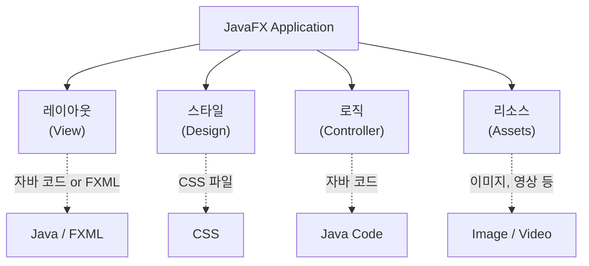

# 01. JavaFX 개요

JavaFX는 자바 기반 **UI 애플리케이션(Rich Client Application)**을 개발할 때 사용할 수 있는 그래픽과 미디어 모듈입니다.

## 1. 자바 UI 라이브러리의 변천사

### AWT (Abstract Window Toolkit)
자바 언어가 탄생한 1995년에 제공된 라이브러리입니다.
- 운영체제(OS)가 제공하는 **네이티브(Native) UI 컴포넌트**를 이용합니다 (Heavyweight).
- OS에 따라 UI의 모양이 다르고, 종류가 제한적입니다.

### Swing
AWT의 단점을 극복하기 위해 등장했습니다.
- 네이티브 UI를 사용하지 않고, **자바가 직접 UI를 그립니다** (Lightweight).
- 모든 OS에서 동일한 UI(Look and Feel)를 가집니다.
- 초기에는 성능 이슈가 있었고, 네이티브 UI에 비해 디자인 만족도가 떨어지는 경향이 있었습니다.

### JavaFX
데스크톱, 모바일 및 임베디드 시스템을 위한 **오픈 소스 차세대 UI 클라이언트 플랫폼**입니다.
- **가볍고(Lightweight)** 하드웨어 가속을 지원합니다.
- **CSS**를 사용하여 디자인(테마)을 쉽게 변경할 수 있습니다.
- **FXML**을 사용하여 레이아웃과 비즈니스 로직을 분리할 수 있습니다 (MVC 패턴 용이).

---

## 2. JavaFX 애플리케이션 구성 요소

JavaFX 애플리케이션은 크게 레이아웃, 스타일, 로직, 리소스로 구성됩니다.

---

## 3. JavaFX 설치

Java 11부터는 JavaFX가 JDK에서 분리되어 별도의 모듈(SDK)로 제공됩니다.

### 1) SDK 다운로드
1. [Gluon JavaFX 다운로드 사이트](https://gluonhq.com/products/javafx/)에 접속합니다.
2. **버전**: `21.0.1 (LTS)` (또는 최신 LTS 버전)
3. **타입**: `SDK`
4. 다운로드 후 압축을 해제하고 원하는 경로로 이동합니다.
   - 예: `C:\ThisisJava\javafx-sdk-21.0.1`

### 2) 문서(Javadoc) 확인
- [JavaFX API 문서](https://openjfx.io/javadoc/21/)

---

## 4. 개발 도구 설치

### 1) Scene Builder
드래그 앤 드롭 방식으로 FXML 레이아웃을 생성해주는 도구입니다.
1. [Scene Builder 다운로드](https://gluonhq.com/products/scene-builder/)에서 설치 파일을 다운로드합니다.
2. 설치 경로를 기억해 둡니다 (예: `C:\ThisisJava\javafx-sdk-21.0.1\SceneBuilder`).
3. 실행 파일: `SceneBuilder.exe`

### 2) e(fx)clipse (이클립스 플러그인)
이클립스에서 JavaFX 프로젝트 생성, 자동 완성, FXML 편집 등을 지원하는 플러그인입니다.

1. 이클립스 메뉴: **Help > Install New Software...**
2. **Work with**: `https://download.eclipse.org/efxclipse/updates-nightly/site/`
3. **Name**: `efxclipse` 입력 후 **Add**.
4. 항목을 선택하고 설치를 진행합니다.

### 3) 이클립스 환경 설정
Scene Builder와 JavaFX SDK 경로를 이클립스에 등록합니다.
1. **Window > Preferences > JavaFX**
2. **SceneBuilder executable**: Scene Builder 실행 파일 경로 선택
   - 예: `C:\ThisisJava\javafx-sdk-21.0.1\SceneBuilder\SceneBuilder.exe`
3. **JavaFX 11+ SDK**: SDK의 `lib` 폴더 선택
   - 예: `C:\ThisisJava\javafx-sdk-21.0.1\lib`
4. **Apply and Close**.

