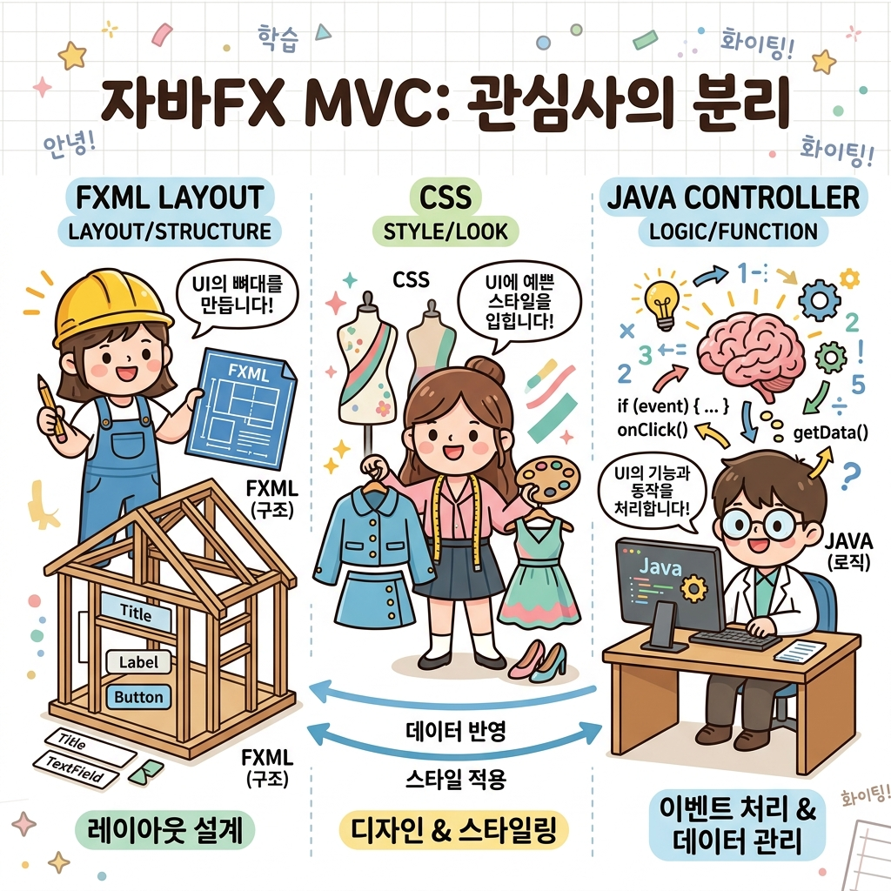

# 01. JavaFX 개요

자바 GUI 프로그래밍의 현대적 완성판, **JavaFX**에 오신 것을 환영합니다! 🚀 JavaFX가 어떤 특징을 가졌고, 기존의 AWT/Swing과는 무엇이 다른지 알아봅시다.

---

## 1. 자바 UI 라이브러리의 변천사

자바는 시대 흐름에 발맞추어 GUI 라이브러리를 지속적으로 업그레이드해 왔습니다.

* **🧱 AWT (Abstract Window Toolkit - JDK 1.0, 1995년)**
  OS의 기본 UI 부품을 빌려 화면에 표시하는 **Heavyweight** 방식입니다. 속도는 빠르지만 운영체제마다 화면이 삐뚤어지고 디자인이 너무 클래식(구식)하다는 한계가 있었습니다.
* **🎨 Swing (Java SE 1.2, 1998년)**
  OS에 의존하지 않고 자바 캔버스에 직접 버튼을 그리는 **Lightweight** 방식입니다. 모든 OS에서 한결같은 디자인을 보장했지만, 하드웨어 가속이 없어 초기에는 다소 느렸고, 화면 디자인을 변경하려면 복잡한 자바 코드를 깊이 고쳐야만 했습니다.
* **✨ JavaFX (Java SE 8 이후 별도 모듈 분리, 현재)**
  데스크톱, 모바일, 웹 임베디드를 모두 아우르는 **오픈소스 차세대 UI 클라이언트 플랫폼**입니다. 하드웨어 가속(GPU)을 적극 사용해 극도로 부드럽고 가벼우며, 현대 프런트엔드 웹 기술의 이점을 차용해 화면 구성과 디자인을 깔끔하게 나눌 수 있습니다.

---

## 2. JavaFX의 3대 핵심 기둥 (MVC 구조)

JavaFX 애플리케이션의 가장 강력한 무기는 **화면(FXML)**, **옷(CSS)**, **생각(Java)**을 분리해서 설계할 수 있다는 점입니다.

### 💡 집을 짓고 단장하는 과정에 비유해 볼까요?
1. **FXML (View - 설계 도면) 🏠**: 
   - XML 형식으로 화면에 버튼이 어디 있고, 텍스트 상자가 어디 있는지 구조를 뼈대만 배치해 둔 집 도면입니다.
2. **CSS (Style - 인테리어 디자이너) 🎨**: 
   - 벽지 색깔, 버튼 테두리의 둥글기, 폰트 종류 등 시각적인 데코레이션을 전담하는 옷과 같습니다. FXML이나 자바 코드를 한 줄도 바꾸지 않고 CSS 파일 교체만으로 다크 모드 등을 지원할 수 있습니다.
3. **Java Controller (Logic - 두뇌/집주인) 🧠**: 
   - 사용자가 버튼을 클릭하면 불이 켜지게 하거나 서버와 통신하는 등 실제 프로그램을 굴려주는 연산과 논리 회로 역할을 전담합니다.

위 그림처럼 화면 레이아웃, 인테리어 디자인, 브레인 로직이 분리되어 개발자와 디자이너가 소스 코드가 꼬이지 않고 완벽하게 협업할 수 있습니다!

---

## 3. JavaFX 개발 환경 준비하기

Java 11 버전 이후부터는 JavaFX가 JDK 코어에서 떨어져 나와 **OpenJFX**라는 독립된 라이브러리 모듈(SDK)로 배포됩니다.

### 1) JavaFX SDK 다운로드
1. [Gluon JavaFX 다운로드 사이트](https://gluonhq.com/products/javafx/)에 접속합니다.
2. 사용 중인 JDK 버전에 맞게 **SDK** 패키지를 다운로드한 뒤 적당한 폴더에 압축을 풉니다.
   - 예: `C:\ThisisJava\javafx-sdk-21.0.1`
3. 개발 공식 API 문서는 [OpenJFX API 문서](https://openjfx.io/javadoc/21/)에서 실시간으로 찾아볼 수 있습니다.

### 2) FXML 제작 비서: Scene Builder 설치
XML 파일의 코드를 직접 타자로 치지 않고, 마우스로 위젯을 드래그해서 FXML을 자동 조립해 주는 시각적 디자인 프로그램입니다.
1. [Scene Builder 다운로드](https://gluonhq.com/products/scene-builder/)에 접속해 설치 파일을 받아 깝니다.
2. 설치된 경로(예: `C:\Users\유저명\AppData\Local\SceneBuilder\SceneBuilder.exe`)를 꼭 기억해 둡니다. IDE 연동에 쓰이기 때문입니다!

### 3) 이클립스(IDE) 환경 연동
이클립스에서 JavaFX를 부드럽게 코딩하기 위해 플러그인을 설치해 줍니다.
1. **Help > Install New Software...** 메뉴에 들어갑니다.
2. **Work with** 칸에 `https://download.eclipse.org/efxclipse/updates-nightly/site/` 주소를 붙여넣고 e(fx)clipse 플러그인을 활성화하여 설치합니다.
3. **Window > Preferences > JavaFX**에 접속해 앞서 기억해 둔 **SceneBuilder.exe** 실행 파일 경로와 SDK의 **lib 폴더** 경로를 알려줍니다. 이제 이클립스가 똑똑하게 코드를 자동 완성해 줄 것입니다!

---

## 🔤 코딩 영단어 학습

JavaFX 아키텍처 이해에 필요한 필수 IT 단어들을 짚고 넘어갑니다.

* **Application (애플리케이션)**
  * **뜻**: 응용 프로그램, 웹/앱 소프트웨어
  * **설명**: 사용자가 실질적으로 유용한 작업을 할 수 있게 돕는 완성형 소프트웨어를 통칭합니다. 자바에서는 `Application` 클래스가 프로그램의 심장이 됩니다.
* **Architecture (아키텍처)**
  * **뜻**: 건축학, 시스템 설계 구조
  * **설명**: 소프트웨어를 구성하는 데이터, 뷰, 로직 컴포넌트들을 유기적으로 배치하는 뼈대 설계를 가리킵니다. (예: MVC 아키텍처)
* **Platform (플랫폼)**
  * **뜻**: 정거장, 기반 환경, 토대
  * **설명**: 소프트웨어가 구동될 수 있도록 기본적인 하드웨어나 런타임 시스템이 갖추어진 작업 기반을 뜻합니다.
* **Modularity (모듈러리티)**
  * **뜻**: 모듈화 성질, 조립성
  * **설명**: 하나의 큰 덩어리 대신, 기능별로 독립된 부품(모듈) 단위로 나누어 설계하는 방식을 말합니다. JavaFX는 모듈 시스템(`module-info.java`)을 필수로 씁니다.
