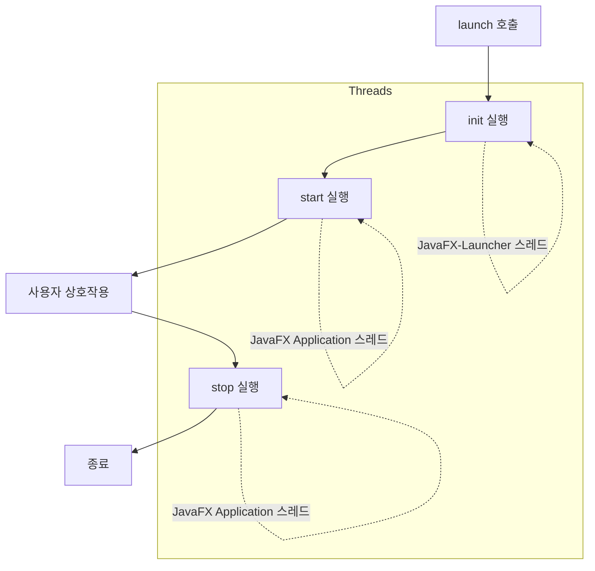

# 02. JavaFX 프로젝트 생성 및 실행

JavaFX 애플리케이션 개발을 위한 프로젝트 생성 방법과 실행 구조를 학습합니다.

## 1. 프로젝트 생성

### Java Project로 생성 (권장)
처음 학습할 때는 일반 **Java Project**로 생성하고, 추후 익숙해지면 JavaFX Project 마법사를 사용하는 것이 좋습니다.

1. **File > New > Java Project** 선택.
2. **Project name**: `thisisjava_appendix_javafx`
3. **Create module-info.java file**: 체크 (Java 9+ 모듈 시스템 사용).
4. **Finish**.

### 라이브러리 추가 (Build Path)
1. 프로젝트 우클릭 > **Build Path > Configure Build Path**.
2. **Libraries** 탭 > **Modulepath** 선택.
3. **Add External JARs** 클릭.
4. JavaFX SDK의 `lib` 폴더 내의 모든 `.jar` 파일 선택 및 추가.
   - 경로 예: `C:\ThisisJava\javafx-sdk-21.0.1\lib`

---

## 2. 모듈 의존성 설정 (`module-info.java`)

프로젝트에서 사용할 JavaFX 모듈들을 `requires` 키워드로 선언해야 합니다. 또한, JavaFX 런타임이 리플렉션을 통해 애플리케이션 클래스에 접근할 수 있도록 `open` 키워드를 사용하거나 패키지를 `opens` 해야 합니다.

```java
open module thisisjava_appendix_javafx {
    requires java.se;
    requires javafx.controls;
    requires javafx.fxml;
    requires javafx.media;
}
```
- `open`: 모듈 내부의 모든 패키지에 대해 리플렉션 허용 (JavaFX가 FXML 로딩, 컨트롤러 주입 등을 위해 필요).
- `requires java.se`: JDK의 기본 모듈 사용.
- `requires javafx.*`: 필요한 JavaFX 모듈 명시.

---

## 3. 메인 클래스 작성 (`AppMain.java`)

JavaFX 애플리케이션의 진입점(Entry Point)입니다.
- **상속**: `javafx.application.Application` 클래스를 상속받아야 합니다.
- **start()**: 메인 윈도우(Stage)를 설정하고 보여주는 메서드로, 반드시 재정의해야 합니다.
- **main()**: `launch(args)`를 호출하여 애플리케이션을 시작합니다.

```java
package sec02.exam01_application_start;

import javafx.application.Application;
import javafx.stage.Stage;

public class AppMain extends Application {
    @Override
    public void start(Stage primaryStage) throws Exception {
        primaryStage.show();   // 윈도우 보여주기
    }

    public static void main(String[] args) {
        launch(args);   // AppMain 객체 생성 및 메인 윈도우 생성 -> start() 호출
    }
}
```

---

## 4. JavaFX 라이프사이클

JavaFX 애플리케이션은 `launch()` 메서드 호출부터 종료까지 명확한 생명주기를 가집니다.



### 단계별 설명
1. **init()**: 애플리케이션 초기화. (JavaFX-Launcher 스레드)
   - 실행 매개값 처리 등에 사용.
   - **주의**: UI 생성/변경 코드를 작성하면 안 됨.
2. **start()**: UI 생성 및 메인 윈도우 출력. (JavaFX Application 스레드)
   - `primaryStage`가 매개값으로 전달됨.
3. **stop()**: 애플리케이션 종료 시 자원 정리. (JavaFX Application 스레드)
   - `Platform.exit()` 호출 또는 마지막 윈도우가 닫힐 때 실행됨.

### 실행 매개값 얻기 (`init` 메서드 내)
```java
@Override
public void init() {
    Parameters params = getParameters();
    Map<String, String> map = params.getNamed();
    String ip = map.get("ip"); // --ip=... 값
    String port = map.get("port"); // --port=... 값
}
```

---

## 5. 무대(Stage)와 장면(Scene)

JavaFX는 연극 무대 용어를 사용하여 UI 구조를 표현합니다.

- **Stage (무대)**: 윈도우(Window) 자체를 의미합니다. 한 번에 하나의 장면(Scene)을 보여줍니다.
- **Scene (장면)**: 윈도우 안에 배치되는 UI의 내용입니다. 루트 컨테이너(Parent)를 포함합니다.
- **Parent (루트 컨테이너)**: 실제 컨트롤(버튼, 라벨 등)을 담는 그릇입니다.

```mermaid
graph TD
    Stage[Stage (Window)]
    Scene[Scene]
    Parent[Parent (Root Container)]
    Ctrl1[Control (Label)]
    Ctrl2[Control (Button)]

    Stage --> Scene
    Scene --> Parent
    Parent --> Ctrl1
    Parent --> Ctrl2
```

### 예제 코드 (`Stage`와 `Scene` 설정)
```java
package sec02.exam03_stage_scene;

import javafx.application.Application;
import javafx.application.Platform;
import javafx.geometry.Pos;
import javafx.scene.Scene;
import javafx.scene.control.Button;
import javafx.scene.control.Label;
import javafx.scene.layout.VBox;
import javafx.scene.text.Font;
import javafx.stage.Stage;

public class AppMain extends Application {
    @Override
    public void start(Stage primaryStage) throws Exception {
        // 1. 루트 컨테이너(Parent) 생성 - VBox (수직 배치)
        VBox root = new VBox();
        root.setPrefWidth(350);
        root.setPrefHeight(150);
        root.setAlignment(Pos.CENTER);
        root.setSpacing(20);

        // 2. 컨트롤 생성 및 추가
        Label label = new Label();
        label.setText("Hello, JavaFX");
        label.setFont(new Font(50));

        Button button = new Button();
        button.setText("확인");
        button.setOnAction(event -> Platform.exit()); // 종료 이벤트

        root.getChildren().add(label);
        root.getChildren().add(button);

        // 3. 장면(Scene) 생성
        Scene scene = new Scene(root);

        // 4. 무대(Stage)에 장면 설정 및 출력
        primaryStage.setTitle("AppMain");
        primaryStage.setScene(scene);
        primaryStage.show();
    }

    public static void main(String[] args) {
        launch(args);
    }
}
```


