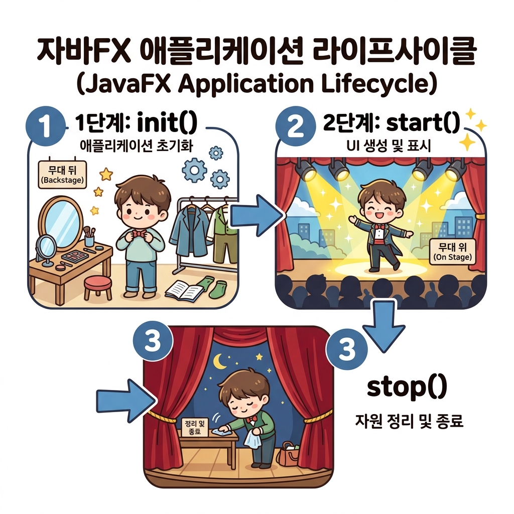

# 02. JavaFX 프로젝트 생성 및 실행

자바 환경에서 첫 번째 JavaFX 프로젝트를 만들고, 프로그램이 시작되고 끝날 때까지의 **생명주기(Lifecycle)** 원리를 해부해 봅시다! ⚙️

---

## 1. 첫 JavaFX 프로젝트 빌드하기

처음 배울 때는 복잡한 마법사 도구 대신 기본 **Java Project**를 생성한 뒤, 외부 라이브러리를 직접 끌고 오는 방식으로 설정하면 구조를 명확히 배울 수 있어 권장합니다.

### 🛠️ 이클립스 기준 3단계 설정법
1. **프로젝트 생성**: `File > New > Java Project`를 누르고, 모듈식 자바를 위한 `Create module-info.java`를 꼭 체크합니다.
2. **라이브러리(JARs) 추가**: 프로젝트 우클릭 > `Build Path > Configure Build Path`로 갑니다. **Libraries** 탭의 **Modulepath**를 선택하고 `Add External JARs`를 클릭해 다운로드한 JavaFX SDK의 `lib` 폴더 안의 모든 `.jar` 파일들을 통째로 추가합니다.
3. **모듈 등록**: 아래처럼 `module-info.java` 파일에 JavaFX를 열고 허용하도록 코드를 입력합니다.

```java
open module thisisjava_appendix_javafx {
    requires java.se;
    requires javafx.controls;
    requires javafx.fxml;
    requires javafx.media;
}
```
> **💡 여기서 잠깐! `open` 키워드를 왜 쓸까요?**
> JavaFX는 FXML 설계도를 읽어서 내 자바 클래스의 변수에 자동으로 값을 꽂아주는 **리플렉션(Reflection)**이라는 마법 같은 기능을 씁니다. 그러려면 내 방(패키지)의 내부 정보를 JavaFX 모듈이 훤히 들여다볼 수 있게 열어주어야 하므로 모듈명 앞에 `open`을 꼭 적어주어야 합니다!

---

## 2. JavaFX 애플리케이션 생명주기 (Lifecycle)

모든 JavaFX 메인 클래스는 자바 런타임의 안전 관리를 위해 반드시 `javafx.application.Application` 클래스를 부모로 삼아 태어납니다. 그리고 다음과 같이 명확한 연극 진행 단계(Lifecycle)를 거쳐 가동됩니다.

### 🎭 배우와 연극 무대로 비유하는 생명주기 흐름



1. **`launch(args)` (기획사 호출)**
   - 자바 `main` 메서드에서 이 호출 신호를 받으면, 자바가 JavaFX 전용 스레드를 소환하고 윈도우 무대를 차릴 준비를 끝냅니다.
2. **`init()` (배우 분장 및 소품 준비) 💄**
   - 연극 시작 전, 대기실(Backstage)에서 실행 매개값 처리 등 사전 데이터를 로드하는 초기화 단계입니다.
   - *주의*: 이 단계는 아직 스크린 무대가 가동되지 않은 백스테이지이므로, UI 창을 조작하거나 그리는 코드를 넣으면 오류가 납니다!
3. **`start(Stage primaryStage)` (공연 시작! Curtain Up) 🌟**
   - 드디어 무대(Stage) 장막이 걷히며 진짜 UI를 그려서 창을 띄우는 단계입니다. 우리가 반드시 화면 설계 코드로 채워넣어야 하는 핵심 오버라이딩 메서드입니다.
4. **`stop()` (폐막 및 무대 정리) 🧹**
   - 사용자가 창의 닫기(X) 버튼을 누르면 연극이 끝나면서 열린 파일이나 DB 접속 같은 컴퓨터 자원들을 안전하게 수거하고 끝내는 뒷정리 단계입니다.

---

## 3. 첫 프로그램 코드 살펴보기 (`AppMain.java`)

화면에 제목이 깔끔하게 표시되는 심플한 빈 창을 하나 띄우는 완전한 소스 코드입니다.

### 📄 실습 예제 소스 코드
* **실습 예제 파일**: [AppMain.java](sample/sec02/exam01_application_start/AppMain.java)

```java
package sec02.exam01_application_start;

import javafx.application.Application;
import javafx.stage.Stage;

public class AppMain extends Application {
    // 1. 생명주기 중 '배우 분장 단계' (생략 가능)
    @Override
    public void init() throws Exception {
        System.out.println("init() 호출 - 초기화 대기실!");
    }

    // 2. 생명주기 중 '진짜 연극 무대(Stage) 개막!' (필수 구현)
    @Override
    public void start(Stage primaryStage) throws Exception {
        System.out.println("start() 호출 - 무대 오픈!");
        primaryStage.setTitle("My First JavaFX"); // 창의 제목 설정
        primaryStage.show();   // 윈도우를 화면에 투영!
    }

    // 3. 생명주기 중 '연극이 끝나고 테두리 수거' (생략 가능)
    @Override
    public void stop() throws Exception {
        System.out.println("stop() 호출 - 청소하고 퇴장!");
    }

    public static void main(String[] args) {
        launch(args);   // JavaFX 엔진 가동 및 AppMain 객체 생성!
    }
}
```

---

## 🔤 코딩 영단어 학습

프로젝트 설정과 생명주기 단계에 필요한 IT 영단어를 학습합니다.

* **Lifecycle (라이프사이클)**
  * **뜻**: 생명주기, 수명 주기
  * **설명**: 어떤 프로그램 객체가 메모리에 적재되어 생성되고(init), 활성화되고(start), 소멸하기(stop)까지 거치는 일생의 고유 단계를 일컫는 용어입니다.
* **Initialize (이니셜라이즈)**
  * **뜻**: 초기화하다, 시작 준비를 하다
  * **설명**: 변수나 시스템이 구동을 시작하기 직전, 초기 값을 알맞게 채워주고 소품을 세팅하는 사전 준비 동작을 말합니다.
* **Reflection (리플렉션)**
  * **뜻**: 반사, 투영, 거울 비침
  * **설명**: 코딩에서는 '런타임 도중에 소스 코드 자체를 거울 비추듯 훤히 분석하여 속성이나 메서드를 동적으로 실행해 주는 자바의 고급 분석 기법'을 지칭합니다.
* **Dependency (디펜던시)**
  * **뜻**: 의존성, 종속성
  * **설명**: 어떤 라이브러리가 굴러가기 위해 다른 추가 라이브러리나 JAR 파일의 도움을 반드시 받아야 하는 관계성을 가리킵니다.
