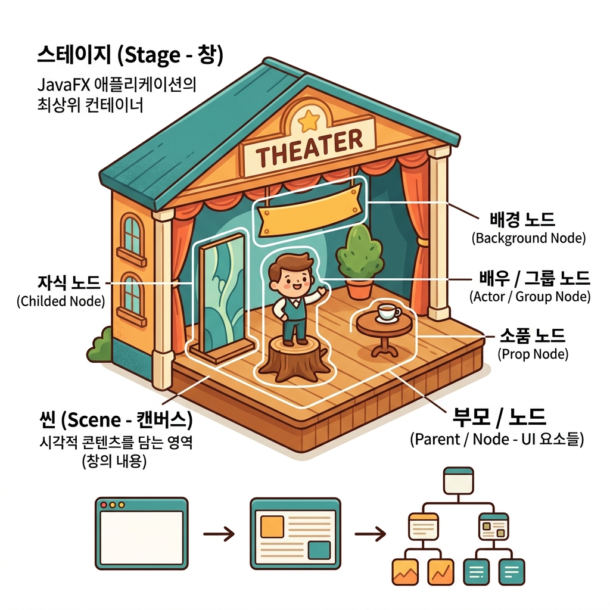

# 03. JavaFX 레이아웃 (Layout)

장면을 가득 채우는 부품들을 어떻게 체계적으로 얹고 정렬하는지, 그리고 극장 연극 구조를 빼 닮은 JavaFX의 뼈대 계층 구조를 정복해 봅시다! 📐

---

## 1. 극장 무대로 이해하는 JavaFX 화면 계층 구조

JavaFX는 화면을 띄울 때 실제 극장의 연극 구조를 모방한 단어를 그대로 사용합니다. 이 개념을 먼저 정립하면 구조가 한눈에 들어옵니다!

> **🎭 극장으로 비유하는 GUI 화면 뼈대**
> 1. **Stage (무대 ➡️ 윈도우 창)**: 테두리가 둘러진 독립된 OS 윈도우 창입니다. 극장 건물이나 무대 틀 자체를 뜻합니다.
> 2. **Scene (장면 ➡️ 도화지/캠버스)**: 윈도우 창 안을 꽉 채우는 화면 내용물입니다. 연극의 '1막', '2막' 할 때의 그 장면입니다. 무대(Stage)는 한 번에 단 하나의 장면(Scene)만 관객에게 보여줄 수 있습니다.
> 3. **Parent/Node (컨테이너 & 소품/배우) 🧱**: 장면 안을 장식하는 모든 가구, 소품, 출연 배우들입니다. 다른 소품들을 가두고 묶는 그릇(`Parent` - 레이아웃 컨테이너)과 개별 버튼/라벨 같은 위젯(`Node`)들로 이루어집니다.



---

## 2. 화면을 구성하는 두 가지 코딩 방식

JavaFX에서는 화면을 짜 맞추는 방법으로 **자바 코딩** 방식과 **FXML 마크업** 방식 두 가지를 다 지원합니다.

### 💻 1) 프로그램적 레이아웃 (Java Code)
자바 객체를 직접 new 생성하여 좌표를 맞추는 직관적인 고전 코딩입니다.
- **장점**: 문법 오류가 컴파일 타임에 즉시 체크되고, 간단한 구조는 빠르게 작성할 수 있습니다.
- **단점**: 디자인이 조금이라도 복잡해지면 코드가 너무 길어지고, 픽셀 1개를 늘리기 위해 프로그램을 매번 껐다 켜서 다시 컴파일해야 하므로 디자이너와 협업하기 어렵습니다.

```java
// 자바로 직접 수평 박스(HBox) 레이아웃 구성하기
HBox hbox = new HBox();
hbox.setSpacing(10);

TextField textField = new TextField();
Button button = new Button("확인");

hbox.getChildren().add(textField);
hbox.getChildren().add(button);
```

### 📄 2) FXML 레이아웃 (선언적 XML 설계도)
XML 형식의 전용 설계 파일(`*.fxml`)에 화면 모양을 코딩하고, 실행할 때 불러와서 사용하는 현대식 분리 모델입니다.
- **장점**: 디자인(FXML)과 자바 동작 코드(Controller)가 완전히 격리되어 코드가 깨끗해지고, Scene Builder 도구를 써서 그림 그리듯 화면을 끌어다 맞출 수 있습니다.
- **단점**: XML 텍스트이므로 괄호를 잘못 닫으면 런타임에 에러가 튀어나오므로 오타 주의가 필요합니다.

```xml
<!-- root.fxml 파일로 구성한 동일한 레이아웃 설계도 -->
<HBox xmlns:fx="http://javafx.com/fxml" spacing="10">
    <children>
        <TextField prefWidth="200" />
        <Button text="확인" />
    </children>
</HBox>
```

자바에서는 아래 단 두 줄의 코드로 이 FXML 설계도를 적재(Load)하여 화면에 띄울 수 있습니다.
```java
Parent root = FXMLLoader.load(getClass().getResource("root.fxml"));
Scene scene = new Scene(root);
```

---

## 3. FXML 태그와 자바 클래스 매핑 규칙

FXML 코드를 작성할 때 헷갈리지 않게, 자바 객체의 명령어가 XML 태그로 어떻게 변하는지 이해해 둡니다.

| 자바 명령법 (Java) | FXML 태그 번역법 |
| :--- | :--- |
| **패키지 임포트**<br>`import javafx.scene.control.Button;` | **XML 임포트 처리**<br>`<?import javafx.scene.control.Button?>` |
| **객체 인스턴스 생성**<br>`new Button()` | **시작/끝 태그 생성**<br>`<Button> ... </Button>` |
| **속성 세터(Setter) 세팅**<br>`btn.setText("확인");` | **태그 안의 속성 명시**<br>`<Button text="확인" />` |
| **그릇에 자식 부품 넣기**<br>`hbox.getChildren().add(btn);` | **자식 노드 태그**<br>`<children> <Button /> </children>` |

---

## 🛠️ 여백의 마법: 패딩(Padding)과 마진(Margin)

컴포넌트들이 너무 테두리에 닥닥 붙어있으면 답답해 보입니다. 정돈된 화면을 위해 여백 조절 속성을 마스터합시다.

* **패딩 (Padding) 📥**
  - **설명**: 컨테이너 그릇의 **안쪽** 쿠션 여백입니다. 컨테이너 내부 벽면과 알맹이들 사이의 여유 공간을 띄워줍니다.
  - **FXML**: `<padding><Insets top="10" right="10" bottom="10" left="10" /></padding>` (시계방향 순서로 지정)
* **마진 (Margin) 📤**
  - **설명**: 개별 컴포넌트의 **바깥쪽** 보호막 여백입니다. 특정 버튼이나 라벨이 옆에 있는 다른 위젯을 밀쳐내며 확보하는 개인 영역입니다.
  - **FXML**: `<HBox.margin><Insets top="20" /></HBox.margin>`
