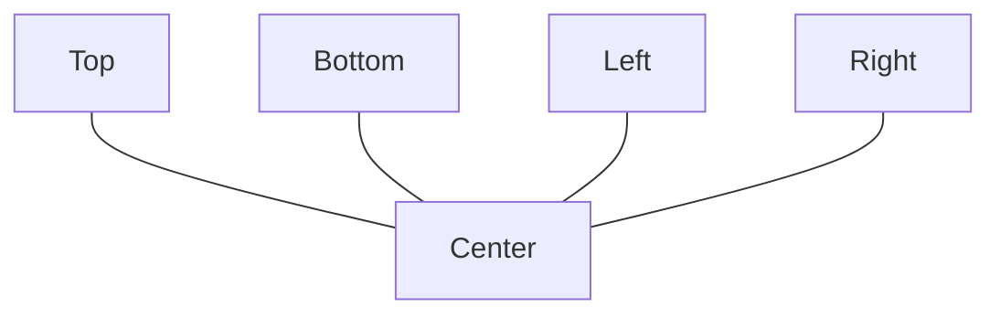

# 04. JavaFX 컨테이너

컨테이너는 컨트롤들을 쉽게 배치하고 관리할 수 있도록 도와주는 클래스입니다. `javafx.scene.layout` 패키지는 다양한 레이아웃 컨테이너를 제공합니다.

| 컨테이너         | 설명                                                    |
| :--------------- | :------------------------------------------------------ |
| **`AnchorPane`** | 좌표를 이용하여 컨트롤을 배치합니다.                    |
| **`BorderPane`** | 상, 하, 좌, 우, 중앙 5개 영역에 컨트롤을 배치합니다.    |
| **`FlowPane`**   | 행으로 배치하되 공간이 부족하면 새로운 행에 배치합니다. |
| **`GridPane`**   | 그리드(격자)로 배치하되 셀의 크기가 유동적입니다.       |
| **`StackPane`**  | 컨트롤을 겹쳐서 배치합니다.                             |
| **`TilePane`**   | 그리드로 배치하되 셀의 크기가 고정적입니다.             |
| **`HBox`**       | 컨트롤을 수평으로 배치합니다.                           |
| **`VBox`**       | 컨트롤을 수직으로 배치합니다.                           |

---

## 1. AnchorPane
좌표(x, y)를 이용하여 컨트롤을 배치합니다.

- **주요 속성**: `layoutX`, `layoutY`, `prefWidth`, `prefHeight`
- **특징**: 윈도우 크기 변경 시 컨트롤 위치가 고정되므로, `setResizable(false)`와 함께 사용하는 것이 일반적입니다.

### 예제 (`root.fxml`)
```xml
<?xml version="1.0" encoding="UTF-8"?>

<?import javafx.scene.layout.*?>
<?import javafx.scene.control.*?>

<AnchorPane xmlns:fx="http://javafx.com/fxml" 
            prefHeight="150.0" prefWidth="300.0">
    <children>
        <Label layoutX="42.0" layoutY="28.0" text="아이디" />
        <Label layoutX="42.0" layoutY="66.0" text="패스워드" />
        <TextField layoutX="120.0" layoutY="24.0" />
        <PasswordField layoutX="120.0" layoutY="62.0" />
        <Button layoutX="97.0" layoutY="106.0" text="로그인" />
        <Button layoutX="164.0" layoutY="106.0" text="취소" />
    </children>
</AnchorPane>
```

---

## 2. HBox와 VBox
수평(`HBox`) 또는 수직(`VBox`)으로 컨트롤을 단순 배치합니다.

### 주요 속성
| 속성                       | 설명                                    |
| :------------------------- | :-------------------------------------- |
| `prefWidth` / `prefHeight` | 폭 / 높이 설정                          |
| `alignment`                | 컨트롤 정렬 (예: `CENTER`, `TOP_LEFT`)  |
| `spacing`                  | 컨트롤 간의 간격                        |
| `fillWidth` (VBox)         | `true`일 경우 컨트롤이 폭을 가득 채움   |
| `fillHeight` (HBox)        | `true`일 경우 컨트롤이 높이를 가득 채움 |

### 확장 속성 (Priority)
컨테이너의 남은 공간을 특정 컨트롤이 채우도록 설정할 수 있습니다.
- `HBox.hgrow`: `Priority.ALWAYS`
- `VBox.vgrow`: `Priority.ALWAYS`

### 예제
```xml
<HBox alignment="CENTER" spacing="20.0">
    <children>
        <Button text="이전" />
        <!-- 남은 공간을 모두 차지하는 버튼 -->
        <Button text="다음">
            <HBox.hgrow><Priority fx:constant="ALWAYS"/></HBox.hgrow>
            <maxWidth><Double fx:constant="MAX_VALUE"/></maxWidth>
        </Button>
    </children>
</HBox>
```

---

## 3. BorderPane
화면을 `Top`, `Bottom`, `Left`, `Right`, `Center` 5개 영역으로 분할하여 배치합니다.



- **Top/Bottom**: 높이는 컨텐츠에 맞추고, 폭은 가득 채웁니다.
- **Left/Right**: 폭은 컨텐츠에 맞추고, 높이는 가득 채웁니다.
- **Center**: 남은 영역을 모두 차지합니다.

### 예제 (`root.fxml`)
```xml
<BorderPane prefHeight="200.0" prefWidth="300.0">
    <top>
        <ToolBar>
            <items>
                <Button text="File" />
            </items>
        </ToolBar>
    </top>
    <center>
        <TextArea/>
    </center>
    <bottom>
        <BorderPane>
            <center><TextField/></center>
            <right><Button text="Send"/></right>
        </BorderPane>
    </bottom>
</BorderPane>
```

---

## 4. FlowPane
컨트롤을 나열하다가 공간이 부족하면 자동으로 다음 줄(행)로 넘어가는 컨테이너입니다.
- **hgap**: 수평 간격
- **vgap**: 수직 간격

```xml
<FlowPane hgap="10.0" vgap="10.0" prefWidth="300.0">
    <children>
        <Button text="Button1" />
        <Button text="Button2" />
        <!-- ... -->
    </children>
</FlowPane>
```

---

## 5. TilePane
그리드 형태지만 모든 셀(타일)의 크기가 동일한 컨테이너입니다.
- **prefTileWidth**: 타일 폭
- **prefTileHeight**: 타일 높이

```xml
<TilePane prefTileHeight="100" prefTileWidth="100">
    <children>
        <ImageView><image><Image url="@img/1.jpg"/></image></ImageView>
        <ImageView><image><Image url="@img/2.jpg"/></image></ImageView>
    </children>
</TilePane>
```

---

## 6. GridPane
HTML의 Table과 유사하게 행(Row)과 열(Column)로 레이아웃을 구성합니다. 셀 병합이 가낭하여 유연한 폼(Form) 제작에 적합합니다.

### 주요 속성
- **RowConstraints**: 행의 높이 제어.
- **ColumnConstraints**: 열의 폭 제어.
- **GridPane.columnIndex / rowIndex**: 컨트롤이 위치할 셀 좌표.
- **GridPane.columnSpan / rowSpan**: 셀 병합.

### 예제
```xml
<GridPane hgap="10" vgap="10">
    <columnConstraints>
        <ColumnConstraints prefWidth="100" />
        <ColumnConstraints prefWidth="200" />
    </columnConstraints>
    <children>
        <Label text="아이디" GridPane.rowIndex="0" GridPane.columnIndex="0" />
        <TextField GridPane.rowIndex="0" GridPane.columnIndex="1" />
        
        <Label text="비밀번호" GridPane.rowIndex="1" GridPane.columnIndex="0" />
        <PasswordField GridPane.rowIndex="1" GridPane.columnIndex="1" />
        
        <HBox GridPane.rowIndex="2" GridPane.columnIndex="0" GridPane.columnSpan="2" 
              alignment="CENTER" spacing="10">
             <children>
                 <Button text="로그인" />
                 <Button text="취소" />
             </children>
        </HBox>
    </children>
</GridPane>
```

---

## 7. StackPane
카드를 쌓듯이 컨트롤을 겹쳐서 배치합니다. 가장 나중에 추가된 컨트롤이 가장 위에 표시됩니다. 배경 이미지 위에 텍스트나 버튼을 올릴 때 유용합니다.

```xml
<StackPane>
    <children>
        <ImageView>
            <image><Image url="@bg.jpg"/></image>
        </ImageView>
        <Label text="Overlaid Text" textFill="WHITE"/>
    </children>
</StackPane>
```
수 있다.

다음은 GridPane에 적용 가능한 속성들이다.

태그 및 속성

prefWidth

prefHeight

hgap

vgap

설명

폭을 설정

높이를 설정

수평 컨트롤 간격을 설정

수직 컨트롤 간격을 설정

<children>

컨트롤을 포함

GridPane.rowIndex

컨트롤이 위치하는 행 인덱스를 설정

GridPane.columnIndex

컨트롤이 위치하는 컬럼 인덱스를 설정

GridPane.rowSpan

행 병합 수를 설정

GridPane.columnSpan

컬럼 병합 수를 설정

GridPane.hgrow

GridPane.vgrow

수평 빈 공간 채우기를 설정

수직 빈 공간 채우기를 설정

GridPane.halignment

컨트롤의 수평 정렬을 설정

GridPane.valignment

컨트롤의 수직 정렬을 설정

다음은 로그인 화면을 GridPane으로 배치한 것이다.


적용

GridPane

GridPane

GridPane

GridPane

GridPane

컨트롤

컨트롤

컨트롤

컨트롤

컨트롤

컨트롤

컨트롤

컨트롤

>>> root.fxml


```java
<?xml version ="1.0" encoding ="UTF-8"?>

<?import javafx.scene.layout.*?>
<?import javafx.geometry.*?>
<?import javafx.scene.control.*?>

<GridPane xmlns:fx ="http://javafx.com/fxml"
prefWidth ="300.0"  hgap ="10.0" vgap ="10.0" >
<padding>
<Insets topRightBottomLeft ="10.0"/>
</padding>
<children>
<Label text ="아이디"  GridPane.rowIndex ="0"  GridPane.columnIndex ="0" />
<TextField GridPane.rowIndex ="0"  GridPane.columnIndex ="1"
GridPane.hgrow ="ALWAYS"  />
```

<Label text ="패스워드"  GridPane.rowIndex="1"  GridPane.columnIndex="0" />
<TextField GridPane.columnIndex ="1" GridPane.rowIndex ="1"
GridPane.hgrow ="ALWAYS"  />

```java
<HBox  GridPane.rowIndex ="2" GridPane.columnIndex ="0"
GridPane.columnSpan ="2" GridPane.hgrow ="ALWAYS"
alignment ="CENTER" spacing ="20.0" >
<children>
<Button text ="로그인" />
<Button text ="취소" />
</children>
</HBox>
</children>
</GridPane>


>>> AppMain.java


package sec04.exam06_gridpane;

import javafx.application.Application;
import javafx.fxml.FXMLLoader;
import javafx.scene.Parent;
import javafx.scene.Scene;
import javafx.stage.Stage;

public class AppMain extends Application {
@Override
public void start(Stage primaryStage) throws Exception {
Parent root  =  FXMLLoader.load(getClass().getResource("root.fxml"));
Scene scene  =  new Scene(root);

primaryStage.setTitle("AppMain");
primaryStage.setScene(scene);
primaryStage.show();

}

public static void main(String[] args) {
launch(args);

}

}
```

StackPane 컨테이너

StackPane은 컨트롤을 겹쳐 배치하는 컨테이너이다. 흔히 카드 레이아웃이라고 하는데, 그림과 같

이 카드가 겹쳐 있는 것처럼 컨트롤도 겹쳐질 수 있다. 만약 위에 있는 컨트롤이 투명이라면 밑에 있

는 컨트롤이 겹쳐 보이게 된다.

StackPane

컨트롤 또는 컨테이너


다음은 두 개의 ImageView를 StackPane에 겹치도록 배치한 예제이다. 하단 이미지는 설경이고

상단 이미지는 투명한 배경을 가지고 있는 듀크이다. 실행해보면 듀크와 설경이 하나의 이미지처럼

보이지만, 상하로 겹쳐 있다.

>>> root.fxml


```java
<?xml version ="1.0" encoding ="UTF-8"?>

<?import javafx.scene.layout.*?>
<?import javafx.scene.image.*?>

<StackPane xmlns:fx ="http://javafx.com/fxml">
<children>
<ImageView  fitWidth ="500"  fitHeight ="300"  >
<image>
<Image url ="@images/snow.jpg" />
</image>
</ImageView>
<ImageView  preserveRatio ="true" >
<image>
<Image url ="@images/duke.gif" />
</image>
</ImageView>
</children>
</StackPane>
```

가로비와 세로비 상관없이

고정 길이로 설정

가로비와 세로비를 유지


>>> AppMain.java


```java
package sec04.exam07_stackpane;

import javafx.application.Application;
import javafx.fxml.FXMLLoader;
import javafx.scene.Parent;
import javafx.scene.Scene;
import javafx.stage.Stage;

public class AppMain extends Application {
@Override
public void start(Stage primaryStage) throws Exception {
Parent root  =  FXMLLoader.load(getClass().getResource("root.fxml"));
Scene scene  =  new Scene(root);

primaryStage.setTitle("AppMain");
primaryStage.setScene(scene);
primaryStage.show();

}

public static void main(String[] args) {
launch(args);

}

}
```

