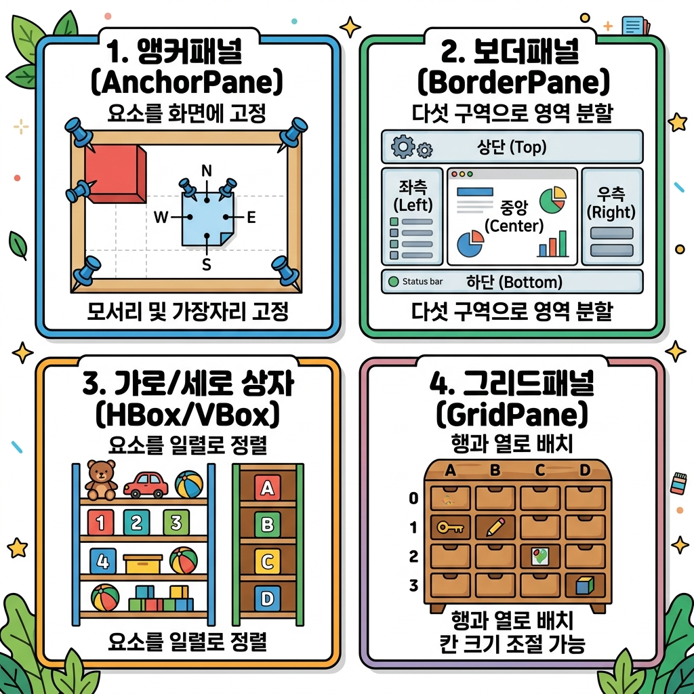

# 04. JavaFX 컨테이너 (Containers)

컴포넌트들을 일사불란하게 정리해 주는 보관함 패널들인 **컨테이너(Layout Panes)**를 마스터해 봅시다! 🗃️ 용도와 정렬 규칙에 맞춰 최적의 배치 그릇을 고르는 안목을 기르게 됩니다.

---

## 1. JavaFX 컨테이너 한눈에 비교하기

자바 JavaFX는 화면 정렬 방식에 따라 아래와 같이 정렬 특성이 뚜렷한 다양한 컨테이너 그릇(`Pane` 자식들)을 제공합니다.



| 컨테이너 이름 | 배치 메커니즘 (정렬 방식) | 추천 용도 |
| :--- | :--- | :--- |
| **HBox / VBox** | 수평(H) 또는 수직(V) 한 방향으로 정렬 | 버튼 모음 줄, 입력란 목록 등 단순 선형 배치 |
| **AnchorPane** | 고정 핀(layoutX, layoutY) 좌표로 절대 위치 정렬 | 크기를 변경할 수 없는 단순 로그인창, 카드 뷰 |
| **BorderPane** | 화면을 5개 구역(상, 하, 좌, 우, 중앙)으로 쪼갬 | 전형적인 데스크톱 메인 프로그램 레이아웃 |
| **FlowPane** | 흐르듯이 배치하다 공간이 좁아지면 줄 바꿈 정렬 | 이미지 갤러리 리스트, 동적 버튼 나열 |
| **GridPane** | 사물함 격자 셀 좌표로 자유로운 바둑판 정렬 | 유연한 행/열 정렬이 필요한 회원가입 입력 폼 |
| **StackPane** | 카드를 한 장씩 포개어 올리듯 컴포넌트 겹침 배치 | 배경 이미지 위에 반투명 글씨/버튼 덧씌우기 |

---

## 2. 핵심 컨테이너 상세 분석 및 FXML 예제

---

### 🌊 1) HBox와 VBox (선형 컨테이너)
컨트롤들을 가로 수평(`HBox`)이나 세로 수직(`VBox`)으로 단순하게 한 줄 나열할 때 사용합니다.

* **주요 속성**: 
  - `spacing`: 위젯 간의 여백 거리
  - `alignment`: 중앙 정렬(`CENTER`), 좌상단 정렬(`TOP_LEFT`) 등
* **HBox FXML 예제** (`root.fxml`):
```xml
<?xml version="1.0" encoding="UTF-8"?>
<?import javafx.scene.layout.HBox?>
<?import javafx.scene.control.Button?>

<HBox alignment="CENTER" spacing="20.0" prefHeight="80.0" prefWidth="250.0">
    <children>
        <Button text="이전 화면" />
        <!-- HBox.hgrow="ALWAYS"는 남은 가로 공간을 이 버튼이 가득 채우도록 늘려줍니다 -->
        <Button text="다음 화면" HBox.hgrow="ALWAYS" maxWidth="Infinity" />
    </children>
</HBox>
```

---

### 📌 2) AnchorPane (좌표 고정 컨테이너)
모든 컴포넌트를 정확한 `layoutX`와 `layoutY` 절대 픽셀 좌표값으로 배치합니다.

* **특징**: 화면 크기가 마우스로 늘어나도 컴포넌트 위치가 고정되어 겉돌기 때문에, 일반적으로 `stage.setResizable(false)`를 설정하여 창 크기 고정용 로그인 앱 등을 만들 때 유용합니다.
* **AnchorPane FXML 예제** (`root.fxml`):
```xml
<?xml version="1.0" encoding="UTF-8"?>
<?import javafx.scene.layout.AnchorPane?>
<?import javafx.scene.control.Label?>
<?import javafx.scene.control.TextField?>
<?import javafx.scene.control.Button?>

<AnchorPane prefHeight="150.0" prefWidth="300.0" xmlns:fx="http://javafx.com/fxml">
    <children>
        <Label layoutX="40.0" layoutY="30.0" text="아이디" />
        <TextField layoutX="110.0" layoutY="26.0" />
        <Label layoutX="40.0" layoutY="70.0" text="비밀번호" />
        <TextField layoutX="110.0" layoutY="66.0" />
        <Button layoutX="110.0" layoutY="110.0" text="로그인" />
    </children>
</AnchorPane>
```

---

### 🧭 3) BorderPane (5구역 지향 컨테이너)
전체 레이아웃을 `top`, `bottom`, `left`, `right`, `center` 구역으로 쪼개서 조립합니다.
- `top`/`bottom`: 높이는 내용물에 맞추고 폭을 끝까지 늘립니다.
- `left`/`right`: 폭은 내용물에 맞추고 높이를 끝까지 채웁니다.
- `center`: 상하좌우가 차지하고 남은 중앙 전체 캔버스를 다 먹습니다.

* **BorderPane FXML 예제** (`root.fxml`):
```xml
<?xml version="1.0" encoding="UTF-8"?>
<?import javafx.scene.layout.BorderPane?>
<?import javafx.scene.control.ToolBar?>
<?import javafx.scene.control.Button?>
<?import javafx.scene.control.TextArea?>
<?import javafx.scene.control.TextField?>

<BorderPane prefHeight="250.0" prefWidth="400.0" xmlns:fx="http://javafx.com/fxml">
    <top>
        <ToolBar>
            <items>
                <Button text="새 파일" />
                <Button text="저장" />
            </items>
        </ToolBar>
    </top>
    <center>
        <TextArea promptText="이곳에 일기나 메모를 적어주세요." />
    </center>
    <bottom>
        <BorderPane>
            <center>
                <TextField promptText="채팅 메시지 입력..." />
            </center>
            <right>
                <Button text="전송" />
            </right>
        </BorderPane>
    </bottom>
</BorderPane>
```

---

### 🏁 4) GridPane (유연 격자 컨테이너)
컴포넌트를 사물함 바둑판 격자에 할당합니다. 셀(Cell) 병합이 가능하고, 각 칸의 넓이를 가변 조율할 수 있어서 회원가입용 폼 설계에 필수입니다.

* **주요 속성**:
  - `GridPane.rowIndex`: 컴포넌트가 세로로 들어갈 줄 인덱스 (0부터 시작)
  - `GridPane.columnIndex`: 컴포넌트가 가로로 들어갈 칸 인덱스 (0부터 시작)
  - `GridPane.columnSpan`: 가로로 여러 셀을 터서 합치기(병합)
* **GridPane FXML 예제** (`root.fxml`):
```xml
<?xml version="1.0" encoding="UTF-8"?>
<?import javafx.scene.layout.GridPane?>
<?import javafx.geometry.Insets?>
<?import javafx.scene.control.Label?>
<?import javafx.scene.control.TextField?>
<?import javafx.scene.layout.HBox?>
<?import javafx.scene.control.Button?>

<GridPane hgap="10.0" vgap="10.0" prefWidth="300.0" xmlns:fx="http://javafx.com/fxml">
    <padding>
        <Insets top="15.0" right="15.0" bottom="15.0" left="15.0" />
    </padding>
    <children>
        <Label text="이름 입력" GridPane.rowIndex="0" GridPane.columnIndex="0" />
        <TextField GridPane.rowIndex="0" GridPane.columnIndex="1" />
        
        <Label text="연락처" GridPane.rowIndex="1" GridPane.columnIndex="0" />
        <TextField GridPane.rowIndex="1" GridPane.columnIndex="1" />
        
        <HBox GridPane.rowIndex="2" GridPane.columnIndex="0" GridPane.columnSpan="2" 
              alignment="CENTER" spacing="10.0">
             <children>
                 <Button text="저장하기" />
                 <Button text="취소" />
             </children>
        </HBox>
    </children>
</GridPane>
```

---

### 🃏 5) StackPane (적층 포개기 컨테이너)
포토샵의 레이어 기능과 유사하게, 여러 개의 위젯을 동그란 호떡 올리듯 포개서 배치합니다. 투명 이미지를 아래에 두고 그 위에 라벨을 띄울 때 최적입니다.

* **StackPane FXML 예제** (`root.fxml`):
```xml
<?xml version="1.0" encoding="UTF-8"?>
<?import javafx.scene.layout.StackPane?>
<?import javafx.scene.image.ImageView?>
<?import javafx.scene.image.Image?>
<?import javafx.scene.control.Label?>
<?import javafx.scene.text.Font?>

<StackPane xmlns:fx="http://javafx.com/fxml">
    <children>
        <!-- 1층: 배경 설경 이미지 -->
        <ImageView fitWidth="400.0" fitHeight="250.0">
            <image>
                <Image url="@images/snow.jpg" />
            </image>
        </ImageView>
        
        <!-- 2층: 그 위에 포개지는 마스코트 이미지 (투명 배경) -->
        <ImageView preserveRatio="true">
            <image>
                <Image url="@images/duke.gif" />
            </image>
        </ImageView>
        
        <!-- 3층: 맨 위에 얹어지는 하얀색 자바 텍스트 -->
        <Label text="Merry Christmas!" textFill="WHITE">
            <font>
                <Font name="System Bold" size="24.0" />
            </font>
        </Label>
    </children>
</StackPane>
```
