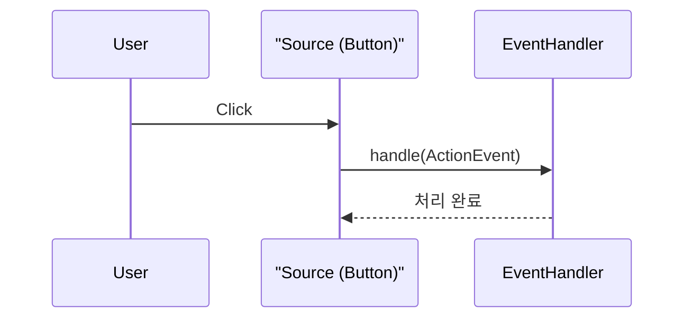

# 05. JavaFX 이벤트 처리

UI 애플리케이션은 사용자와 상호작용하면서 코드를 실행한다. 사용자가 UI 컨트롤을 사용하면 이

벤트event가 발생하고, 프로그램은 이벤트를 처리하기 위해 코드를 실행한다.

이벤트 핸들러

JavaFX는 이벤트 발생 컨트롤과 이벤트 처리를 분리하기 위해 위임형Delegation 방식을 사용한다. 위

임형 방식이란 컨트롤에서 이벤트가 발생하면 컨트롤이 직접 처리하지 않고 이벤트 핸들러에게 이벤

트 처리를 위임하는 방식이다.


예를 들어 사용자가 Button을 클릭하면 ActionEvent가 발생하고, Button에 등록된 EventHandler

가 ActionEvent를 처리한다.

이벤트 발생 컨트롤
(Button)

①

②

ActionEvent
이벤트 발생

④ 이벤트 처리 효과

1. 윈도우 닫기
2. 컨트롤 내용 변경
3. 다이얼로그 띄우기

이벤트 핸들러
(EventHandler)

이벤트 처리 메소드
실행

(cid:81)(cid:86)(cid:67)(cid:77)(cid:74)(cid:68)(cid:1)(cid:87)(cid:80)(cid:74)(cid:69)(cid:1)(cid:73)(cid:66)(cid:79)(cid:69)(cid:77)(cid:70)(cid:9)(cid:106)(cid:10)(cid:1)(cid:92)(cid:1)

③ 이벤트 처리

(cid:94)

EventHandler는 컨트롤에서 이벤트가 발생하면 자신의 handle ( ) 메소드를 실행시킨다. handle ( )

메소드에는 윈도우 닫기, 컨트롤 내용 변경, 다이얼로그 띄우기 등의 코드를 작성할 수 있다.

EventHandler는 제네릭 타입이기 때문에 타입 파라미터는 발생된 이벤트의 타입이 된다. 예를 들

어 ActionEvent를 처리하는 핸들러는 EventHandler<ActionEvent>가 되고, MouseEvent를

처리하는 핸들러는 EventHandler<MouseEvent>가 된다.

EventHandler가 컨트롤에서 발생된 이벤트를 처리하려면 먼저 컨트롤에 EventHandler를 등록

해야 한다. 컨트롤은 발생되는 이벤트에 따라서 EventHandler를 등록하는 다양한 메소드가 있는

데, 이 메소드들은 setOnXXX ( ) 이름을 가지고 있다. XXX는 보통 이벤트 이름과 동일하다.

몇 가지 예를 들어보자. Button을 클릭할 때 발생하는 ActionEvent를 처리하는 EventHandler

<ActionEvent>를 등록하려면 다음과 같이 setOnAction ( ) 메소드를 사용한다.

Button button  =  new Button();
button.setOnAction(new EventHandler<ActionEvent>() {
```java
@Override
public void handle(ActionEvent event) { … }

});
```

TableView의 행을 클릭할 때 발생하는 MouseEvent를 처리하는 EventHandler<MouseEvent>

를 등록하려면 다음과 같이 setOnMouseClicked ( ) 메소드를 사용한다.


TableView tableView  =  new TableView();
tableView.setOnMouseClicked(new EventHandler<MouseEvent>() {
```java
@Override
public void handle(MouseEvent event) { … }

});
```

윈도우Stage의 우측 상단 닫기(×) 버튼을 클릭했을 때 발생하는 WindowEvent를 처리하는

EventHandler<WindowEvent>를 등록하려면 다음과 같이 setOnCloseRequest ( ) 메소드를

사용한다.

stage.setOnCloseRequest(new EventHandler<WindowEvent>() {
```java
@Override
public void handle(WindowEvent event) { … }

});
```

JavaFX는 **위임형 이벤트 처리 모델(Delegation Event Model)**을 사용합니다. 이는 이벤트가 발생한 **소스(Source)**가 이벤트를 직접 처리하지 않고, 별도의 **핸들러(Handler)** 객체에게 처리를 위임하는 방식입니다.



---

## 1. 이벤트 핸들러 등록

이벤트 핸들러를 등록하려면 `setOn...` 메소드를 사용합니다. 예를 들어 버튼 클릭 시 발생하는 `ActionEvent`를 처리하려면 `setOnAction()` 메소드를 사용합니다.

### 1) 익명 구현 객체 사용
```java
Button btn = new Button("버튼");
btn.setOnAction(new EventHandler<ActionEvent>() {
    @Override
    public void handle(ActionEvent event) {
        System.out.println("버튼 클릭됨");
    }
});
```

### 2) 람다식 사용 (Java 8+)
`EventHandler`는 함수형 인터페이스이므로 람다식으로 간결하게 표현할 수 있습니다.
```java
btn.setOnAction(event -> {
    System.out.println("버튼 클릭됨");
});
```

---

## 2. FXML과 이벤트 처리 (Controller)

FXML로 UI를 구성할 경우, 이벤트 처리 코드는 **컨트롤러(Controller)**라는 별도의 클래스에서 담당합니다.

### 1) FXML 설정 (`root.fxml`)
- 루트 컨테이너에 `fx:controller` 속성으로 컨트롤러 클래스를 지정합니다.
- 이벤트가 발생할 컨트롤에 `onAction` 속성으로 컨트롤러의 메소드를 지정합니다 (예: `#handleBtnAction`).
- 컨트롤러에서 참조해야 할 컨트롤에는 `fx:id`를 부여합니다.

```xml
<HBox xmlns:fx="http://javafx.com/fxml" 
      fx:controller="sec05.exam01.RootController">
      
    <Button fx:id="btn1" text="버튼1" onAction="#handleBtn1Action" />
    <Button fx:id="btn2" text="버튼2" onAction="#handleBtn2Action" />
    
</HBox>
```

### 2) 컨트롤러 구현 (`RootController.java`)
- `Initializable` 인터페이스를 구현하여 초기화 작업(`initialize`)을 수행할 수 있습니다.
- `@FXML` 어노테이션을 사용하여 FXML에 정의된 컨트롤(`fx:id`)과 메소드(`onAction`)를 연결합니다.

```java
package sec05.exam01;

import java.net.URL;
import java.util.ResourceBundle;
import javafx.event.ActionEvent;
import javafx.fxml.FXML;
import javafx.fxml.Initializable;
import javafx.scene.control.Button;

public class RootController implements Initializable {
직접 EventHandler
생성 후 등록

}

});
btn2.setOnAction(event->handleBtn2Action(event));
btn3.setOnAction(event->handleBtn3Action(event));

람다식 이용


}

```java
public void handleBtn1Action(ActionEvent event) {
System.out.println("버튼1 클릭");

}
public void handleBtn2Action(ActionEvent event) {
System.out.println("버튼2 클릭");

}
public void handleBtn3Action(ActionEvent event) {
System.out.println("버튼3 클릭");

}

}
```

4) 이벤트 처리 메소드 매핑

컨트롤러에서 EventHandler를 생성하지 않고도 바로 이벤트 처리 메소드와 연결할 수 있는 방법

이 있다. Button 컨트롤을 작성할 때 다음과 같이 onAction 속성값으로 "#메소드명"을 주면 내부

적으로 EventHandler 객체가 생성되기 때문에 컨트롤러에서는 해당 메소드만 작성하면 된다.

FXML 파일

```java
<Button fx:id = "btn" text =  "버튼" onAction =  "#handleBtnAction"/>
```

Controller 클래스

```java
public void handleBtnAction(ActionEvent event) { … }
```

