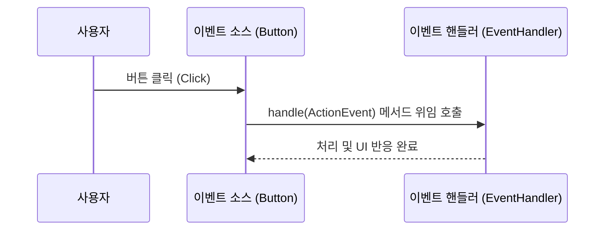

# 05. JavaFX 이벤트 처리 (Event Handling)

사용자가 버튼을 탭하고, 마우스를 클릭하고, 자판을 누를 때 화면이 생명력을 얻어 움직이게 만드는 마법인 **이벤트 처리(Event Handling)**를 마스터해 봅시다! ⚡

---

## 1. JavaFX 위임형 이벤트 모델

JavaFX는 화면(FXML)과 비즈니스 로직(자바 코드)을 격리시키기 위해 **위임형 이벤트 처리 모델(Delegation Event Model)**을 정식으로 채택하고 있습니다. 

### 💡 집사와 버튼 비유로 복습하기
사용자가 버튼을 클릭하면 `ActionEvent` 신호 객체가 생성됩니다. 버튼 자체가 직접 처리를 다 하는 대신, 미리 등록된 반응 전문가인 **이벤트 핸들러(EventHandler)**에게 이벤트를 안전하게 넘겨(위임) 처리합니다.



---

## 2. 코드에서 이벤트 핸들러를 등록하는 두 가지 기본 방식

자바 코드로 개별 위젯에 이벤트를 매칭하는 기본 작성법입니다.

### 1) 익명 구현 객체 사용법
자바의 전통적인 오버라이딩 등록 방식입니다.
```java
Button btn = new Button("확인");
btn.setOnAction(new EventHandler<ActionEvent>() {
    @Override
    public void handle(ActionEvent event) {
        System.out.println("확인 버튼이 클릭되었습니다.");
    }
});
```

### 2) 람다(Lambda) 식 사용법 (Java 8 이상 권장)
`EventHandler` 인터페이스는 구현해야 할 메서드가 `handle()` 오직 1개뿐인 **함수형 인터페이스**이므로, 화살표(`->`) 하나로 대폭 축소하여 코드를 눈부시게 깨끗하게 적을 수 있습니다.
```java
Button btn = new Button("확인");
btn.setOnAction(event -> System.out.println("확인 버튼 클릭됨 (람다)"));
```

---

## 3. FXML과 이벤트 처리의 정석: 컨트롤러 (Controller)

FXML로 디자인 뼈대를 만들 때는 자바 코드로 이벤트를 일일이 `setOnAction` 하는 대신, **컨트롤러(Controller)**라는 로직 보드 클래스를 매핑하여 자동으로 배선을 연결합니다.

### 1) FXML 설계도 작성 (`root.fxml`)
- 루트 레이아웃 태그에 `fx:controller` 속성으로 이 화면을 전담 제어할 컨트롤러 자바 클래스 경로를 명시합니다.
- 동작시킬 컨트롤에 `onAction` 속성값으로 `#메서드명`을 지정해 줍니다.
- 자바 코드에서 꺼내 써야 할 위젯들에는 고유식별자 `fx:id`를 붙여줍니다.

```xml
<?xml version="1.0" encoding="UTF-8"?>
<?import javafx.scene.layout.HBox?>
<?import javafx.scene.control.Button?>

<!-- 1. 컨트롤러 클래스 배선 연결 -->
<HBox xmlns:fx="http://javafx.com/fxml" 
      fx:controller="sec05.exam01.RootController"
      spacing="20.0" alignment="CENTER" prefHeight="100.0" prefWidth="300.0">
    <children>
        <!-- 2. 아이디 부여 및 메서드 매핑 -->
        <Button fx:id="btn1" text="버튼 1" onAction="#handleBtn1Action" />
        <Button fx:id="btn2" text="버튼 2" onAction="#handleBtn2Action" />
    </children>
</HBox>
```

### 2) 제어용 컨트롤러 구현 (`RootController.java`)
- `Initializable` 인터페이스를 상속받으면, FXML이 로딩될 때 초기 세팅을 진행하는 `initialize()` 메서드가 자동 가동됩니다.
- `@FXML` 어노테이션을 변수와 메서드 위에 얹으면, FXML의 `fx:id` 및 `onAction` 이름과 자바의 변수/메서드명이 마법처럼 서로 묶여 자동으로 동작합니다.

```java
package sec05.exam01;

import java.net.URL;
import java.util.ResourceBundle;
import javafx.event.ActionEvent;
import javafx.fxml.FXML;
import javafx.fxml.Initializable;
import javafx.scene.control.Button;

public class RootController implements Initializable {
    // FXML 파일의 fx:id="btn1", fx:id="btn2" 컴포넌트를 주입받습니다.
    @FXML private Button btn1;
    @FXML private Button btn2;

    @Override
    public void initialize(URL location, ResourceBundle resources) {
        // 필요시 FXML에서 자동 매핑하는 대신, 
        // 여기서 자바 코드로 동적 이벤트 처리를 한 번 더 묶어줄 수도 있습니다.
        btn1.setText("바뀐 버튼 1");
    }

    // FXML에서 설정한 onAction="#handleBtn1Action"과 자동 동기화되는 동작 메서드
    @FXML
    public void handleBtn1Action(ActionEvent event) {
        System.out.println("첫 번째 버튼이 클릭되었습니다!");
    }

    // FXML에서 설정한 onAction="#handleBtn2Action"과 자동 동기화되는 동작 메서드
    @FXML
    public void handleBtn2Action(ActionEvent event) {
        System.out.println("두 번째 버튼이 클릭되었습니다!");
    }
}
```
