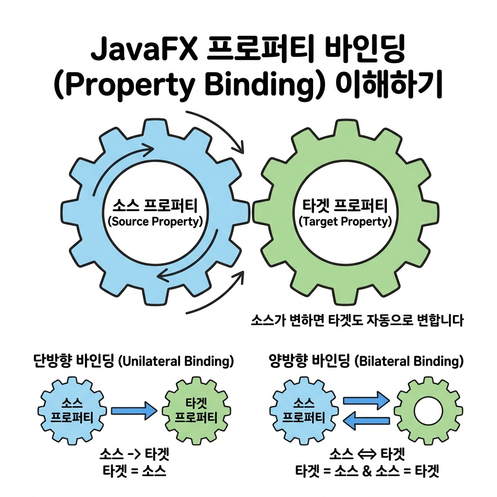

# 06. JavaFX 속성 감시와 바인딩

매번 자바 코드로 값을 확인해서 변경 값을 손수 대입하던 방식에서 벗어나, 데이터와 화면을 톱니바퀴처럼 엮어 자동으로 값이 전파되게 돕는 JavaFX의 꽃인 **속성(Property)**과 **바인딩(Binding)**에 대해 학습해 봅시다! 🔗

---

## 1. 속성 감시 (Property Monitoring)

자바 JavaFX 컨트롤러의 수많은 변수(폰트 크기, 텍스트 글자 등)는 모두 단순 타입이 아니라 `SimpleStringProperty`, `SimpleIntegerProperty` 등의 **Property 속성 객체**로 한 겹 포장되어 관리됩니다.
덕분에 우리는 속성 값이 변하는 모든 찰나의 순간을 감시하는 **리스너(Listener)**를 달아줄 수 있습니다.

### 💡 톱니바퀴 바인딩 비유
> **단방향 바인딩(Uni-directional)**: 구동 기어(A)가 돌면 피구동 기어(B)가 벨트에 엮여서 똑같이 돌지만, B를 손으로 억지로 돌릴 수는 없는 구조입니다.
> **양방향 바인딩(Bi-directional)**: 두 기어 A와 B가 완전히 맞물려 맞물린 기어 형태로 도는 것과 같아서, A를 돌리든 B를 돌리든 양쪽 모두 똑같은 값으로 회전합니다.



---

## 2. 속성 변경 감시 실습: ChangeListener

`Slider`(볼륨 조절 슬라이더 등)를 마우스로 조작해 값이 바뀌면, 리스너가 이를 캐치하여 `Label`의 폰트 크기를 연동해 키워주는 반응형 화면을 제작할 수 있습니다.

### 1) FXML 설계 (`root.fxml`)
```xml
<?xml version="1.0" encoding="UTF-8"?>
<?import javafx.scene.layout.BorderPane?>
<?import javafx.scene.control.Label?>
<?import javafx.scene.text.Font?>
<?import javafx.scene.control.Slider?>

<BorderPane xmlns:fx="http://javafx.com/fxml"
            fx:controller="sec06.exam01_property_listener.RootController"
            prefHeight="150.0" prefWidth="300.0">
    <center>
        <Label fx:id="label" text="자바스크립트">
            <font>
                <!-- 초기 폰트 크기 0 -->
                <Font size="10.0"/>
            </font>
        </Label>
    </center>
    <bottom>
        <!-- 값 조절용 슬라이더 바 -->
        <Slider fx:id="slider" min="10" max="60" showTickLabels="true" />
    </bottom>
</BorderPane>
```

### 2) 제어기 구현 (`RootController.java`)
```java
package sec06.exam01_property_listener;

import java.net.URL;
import java.util.ResourceBundle;
import javafx.beans.value.ChangeListener;
import javafx.beans.value.ObservableValue;
import javafx.fxml.FXML;
import javafx.fxml.Initializable;
import javafx.scene.control.Label;
import javafx.scene.control.Slider;
import javafx.scene.text.Font;

public class RootController implements Initializable {
    @FXML private Slider slider;
    @FXML private Label label;

    @Override
    public void initialize(URL location, ResourceBundle resources) {
        // Slider의 value 속성에 ChangeListener(변화 대기자) 등록
        slider.valueProperty().addListener(new ChangeListener<Number>() {
            @Override
            public void changed(ObservableValue<? extends Number> observable, 
                                Number oldValue, Number newValue) {
                // 슬라이더 값이 변하면 라벨 폰트 크기에 실시간 적용!
                label.setFont(new Font(newValue.doubleValue()));
            }
        });
    }
}
```

---

## 3. 속성 바인딩 (Property Binding)

리스너 코드마저 타이핑하지 않고 아예 두 개의 변수 통로를 끈으로 연결해 묶는 방식입니다.

### 1) 단방향 바인딩 (Unidirectional)
- **자바 식**: `target.bind(source);` (source가 바뀌면 target은 강제로 따라 바뀝니다. 단, target을 강제 코드로 바꾸려 하면 에러가 납니다.)
- **사용 예**:
```java
TextArea txt1 = new TextArea();
TextArea txt2 = new TextArea();
// txt1에 타이핑을 치면 txt2에 똑같이 복사되어 기입됩니다.
txt2.textProperty().bind(txt1.textProperty());
```

### 2) 양방향 바인딩 (Bidirectional)
- **자바 식**: `target.bindBidirectional(source);` (어느 한쪽을 수정하든 양측이 똑같은 값을 공유하여 동시 업데이트됩니다.)
- **사용 예**:
```java
txt2.textProperty().bindBidirectional(txt1.textProperty());
```

---

## 🛠️ Bindings 클래스의 연산 지원

`Bindings` 유틸리티 클래스를 사용하면 단순 대입 바인딩뿐 아니라, 곱하기, 더하기, 화면 중앙 구하기 같은 복합 사칙 연산 결과를 엮어 바인딩할 수 있습니다.

### 예: 원(Circle)을 창 한가운데에 고정하기 (반응형 창)
창의 너비(`width`)와 높이(`height`)를 마우스로 늘릴 때, 원의 가로세로 중심축을 항상 창의 **절반(2로 나누기)** 크기로 바인딩해 두면, 원이 알아서 화면 중앙을 찾아 고정됩니다.

```java
// Circle의 centerX를 root 너비의 절반 값으로 실시간 묶기
circle.centerXProperty().bind(Bindings.divide(root.widthProperty(), 2));
// Circle의 centerY를 root 높이의 절반 값으로 실시간 묶기
circle.centerYProperty().bind(Bindings.divide(root.heightProperty(), 2));
```

---

## 🔤 코딩 영단어 학습

데이터와 뷰의 자동 동기화를 위한 핵심 용어들을 공부합니다.

* **Observable (옵저버블)**
  * **뜻**: 관찰 가능한, 눈에 보이는
  * **설명**: 자바에서는 '내부 값이 변했을 때 감시 중인 리스너들에게 알림 신호를 보낼 수 있는 상태 객체'를 가리킵니다.
* **Binding (바인딩)**
  * **뜻**: 묶기, 결속, 일체화
  * **설명**: 두 개의 다른 부품 속성들을 체인처럼 연결해, 한쪽의 상태가 변경되면 다른 쪽도 코딩 없이 자동으로 동기화되게끔 제어하는 기술입니다.
* **Bidirectional (바이디렉셔널)**
  * **뜻**: 양방향의
  * **설명**: 한 방향으로만 물결이 흐르는 단방향(`Unidirectional`)과 달리, 양쪽 방향 모두에서 변경과 피드백을 수용하여 일체화하는 형태를 뜻합니다.
* **Listener (리스너)**
  * **뜻**: 들어주는 사람, 대기 수신원
  * **설명**: 감시 대상 속성에 딱 달라붙어 값이 오르내리는 변화가 감지되면 정해진 동작 메서드를 기동시키는 신호 대기 인터페이스입니다.
