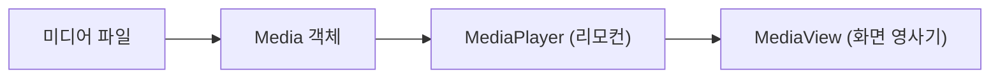

# 07. JavaFX 컨트롤 (Controls)

사용자가 화면에서 누르고, 치고, 선택하며 상호작용하는 주인공들인 **UI 컨트롤(Widgets)**을 알아봅시다! 🎛️ 기본 버튼부터 표(Table), 리스트(List), 차트(Chart) 및 미디어(Video) 재생까지 다양한 컨트롤의 조작 방법을 정복합니다.

---

## 1. 버튼 계열 컨트롤 (Button Controls)

사용자가 클릭하여 명령을 내릴 수 있는 컨트롤들로, 모두 `ButtonBase` 클래스를 공통으로 상속받아 만들어집니다.

* **Button (버튼)**: 단순 텍스트나 아이콘 이미지를 올려 클릭 신호를 보냅니다.
* **CheckBox (체크박스)**: 여러 선택지 중 동시에 여러 개를 체크하거나 풀 수 있습니다.
* **RadioButton (라디오 버튼)**: 반드시 하나만 골라야 하는 옵션에 쓰이며, 한 그룹 내에서 하나만 눌리게 하려면 `ToggleGroup`으로 묶어주어야 합니다.
* **ToggleButton (토글 버튼)**: 불을 켜고 끄듯이(On/Off) 눌려있는 상태와 튀어나온 상태를 유지하는 스위치 버튼입니다.

### 📄 RadioButton FXML 조립 예시 (`root.fxml`)
```xml
<VBox spacing="10.0" alignment="CENTER_LEFT" xmlns:fx="http://javafx.com/fxml">
    <!-- 1. 하나의 라디오 버튼 그룹 설정 -->
    <fx:define>
        <ToggleGroup fx:id="myGroup"/>
    </fx:define>
    <children>
        <!-- 2. 그룹을 할당하여 서로 상호 배타적으로 선택되게 함 -->
        <RadioButton text="짜장면" toggleGroup="$myGroup" userData="jajang" selected="true" />
        <RadioButton text="짬뽕" toggleGroup="$myGroup" userData="jjam" />
        <RadioButton text="탕수육" toggleGroup="$myGroup" userData="tangsuyuk" />
    </children>
</VBox>
```

### 🧠 Java Controller 연동 예시
```java
// 라디오 버튼 그룹에서 선택이 바뀔 때 실시간 모니터링하기
myGroup.selectedToggleProperty().addListener((observable, oldValue, newValue) -> {
    if (newValue != null) {
        System.out.println("주문 선택: " + newValue.getUserData());
    }
});
```

---

## 2. 입력 계열 컨트롤 (Input Controls)

사용자로부터 직접 문자, 날짜, 색상 등의 정보를 입력받는 필드들입니다.

| 컨트롤 이름 | 용도 | 주요 FXML 사용 태그 |
| :--- | :--- | :--- |
| **Label** | 수정 불가능한 단순 글자를 화면에 인쇄합니다. | `<Label text="아이디" />` |
| **TextField** | 사용자로부터 한 줄의 짧은 문자를 기입받습니다. | `<TextField promptText="이름 기입..." />` |
| **PasswordField** | 비밀번호 입력란으로, 글자가 `●` 기호로 마스킹됩니다. | `<PasswordField />` |
| **TextArea** | 여러 줄의 긴 장문을 입력받거나 보여줍니다. | `<TextArea prefHeight="100.0" />` |
| **ComboBox** | 눌렀을 때 팝업 선택창이 슥 열리며 하나를 고릅니다. | 아래 FXML 코드 예제 참고 |
| **DatePicker** | 캘린더 달력이 열리며 날짜를 편리하게 선택합니다. | `<DatePicker fx:id="birthDate" />` |
| **ColorPicker** | 색상 팔레트가 열려 원하는 색을 선택합니다. | `<ColorPicker fx:id="themeColor" />` |

### 📄 ComboBox FXML 사용 예시
```xml
<ComboBox fx:id="combobox" promptText="선택하세요">
    <items>
        <FXCollections fx:factory="observableArrayList">
            <String fx:value="자바" />
            <String fx:value="파이썬" />
            <String fx:value="C++" />
        </FXCollections>
    </items>
</ComboBox>
```

---

## 3. 리스트 및 테이블 뷰 컨트롤 (View Controls)

대량의 데이터를 목록이나 표 형식으로 정돈하여 관객에게 보여주는 컨트롤입니다.

### 1) ListView
데이터 목록을 가로/세로 스크롤 형태로 쭉 나열하여 한 칸 또는 여러 칸을 선택하게 합니다.
```java
// Java Controller에서 아이템 공급 및 선택 감시
ObservableList<String> fruits = FXCollections.observableArrayList("사과", "바나나", "체리");
listView.setItems(fruits);

listView.getSelectionModel().selectedItemProperty().addListener((obs, oldVal, newVal) -> {
    System.out.println("선택한 과일: " + newVal);
});
```

### 2) TableView
엑셀 표처럼 열(Column)과 행(Row)으로 이루어진 고급 뷰어입니다. 
- 데이터 정보를 담을 **모델 클래스**와 컬럼을 맵핑하는 `PropertyValueFactory`를 결합하여 구성합니다.

#### 📄 TableView FXML 예시 (`root.fxml`)
```xml
<TableView fx:id="tableView" prefHeight="200.0" prefWidth="300.0">
    <columns>
        <TableColumn fx:id="colName" text="스마트폰 모델명" prefWidth="150.0" />
        <TableColumn fx:id="colPrice" text="가격" prefWidth="130.0" />
    </columns>
</TableView>
```

#### 🧠 Java Controller 매핑 설정 (`RootController.java`)
```java
public class Phone {
    private String smartPhone;
    private int price;
    
    public Phone(String smartPhone, int price) {
        this.smartPhone = smartPhone;
        this.price = price;
    }
    public String getSmartPhone() { return smartPhone; }
    public int getPrice() { return price; }
}

// 초기화 블록에서 연결
@FXML private TableView<Phone> tableView;
@FXML private TableColumn<Phone, String> colName;
@FXML private TableColumn<Phone, Integer> colPrice;

@Override
public void initialize(URL location, ResourceBundle resources) {
    // Phone 클래스의 멤버 변수 이름과 매핑
    colName.setCellValueFactory(new PropertyValueFactory<>("smartPhone"));
    colPrice.setCellValueFactory(new PropertyValueFactory<>("price"));

    // 아이템 집어넣기
    ObservableList<Phone> phoneList = FXCollections.observableArrayList(
        new Phone("Galaxy S24", 1200000),
        new Phone("iPhone 15 Pro", 1550000)
    );
    tableView.setItems(phoneList);
}
```

---

## 4. 미디어 컨트롤 (Media Controls)

동영상 동화나 음악 오디오 파일을 재생할 수 있는 편리한 재생 환경을 제공합니다. JavaFX에서는 아래 3형제가 삼위일체로 맞물려 작동합니다.

1. **`Media`**: 오디오/비디오 소스 파일의 위치 경로 정보.
2. **`MediaPlayer`**: 재생(`play()`), 일시정지(`pause()`), 중지(`stop()`) 등 실질적인 오작동 제어 및 볼륨 조절 리모컨.
3. **`MediaView`**: 동영상 화면 프레임을 띄워 눈으로 보게 해주는 캔버스 (오디오만 들을 때는 생략).



### 🧠 미디어 기동 핵심 자바 코드
```java
// 1. 미디어 파일 경로 불러오기
Media media = new Media(getClass().getResource("media/video.mp4").toString());

// 2. 리모컨 플레이어 생성
MediaPlayer mediaPlayer = new MediaPlayer(media);

// 3. 영사기 화면 뷰에 리모컨 결합
mediaView.setMediaPlayer(mediaPlayer);

// 4. 자동 재생 개시
mediaPlayer.play();
```

---

## 5. 차트 컨트롤 (Chart Controls)

숫자 통계 정보를 바 형태로 예쁘게 뽑아주는 다양한 차트 위젯을 제공합니다. (`javafx.scene.chart` 패키지)

### 📈 원형 차트 (PieChart) 예제
```java
ObservableList<PieChart.Data> pieData = FXCollections.observableArrayList(
    new PieChart.Data("만족", 70),
    new PieChart.Data("보통", 20),
    new PieChart.Data("불만족", 10)
);
pieChart.setData(pieData);
```

### 📊 막대 차트 (BarChart) 예제
```java
XYChart.Series<String, Number> series = new XYChart.Series<>();
series.setName("2026 선호도");
series.getData().add(new XYChart.Data<>("Java", 85));
series.getData().add(new XYChart.Data<>("Kotlin", 60));

barChart.getData().add(series);
```
