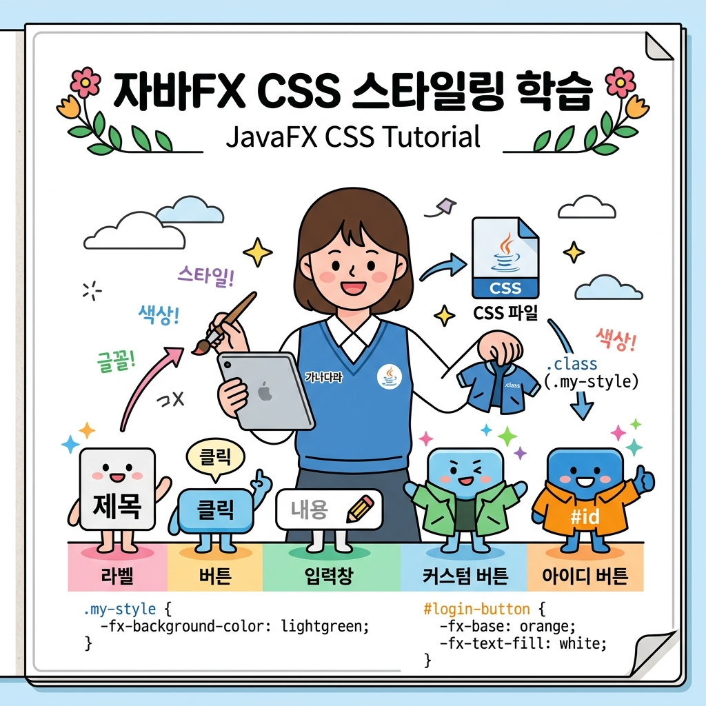

# 10. JavaFX CSS 스타일

자바 코드를 수정하거나 다시 컴파일할 필요 없이, 웹 문서처럼 화면 디자인을 멋지게 꾸미고 테마를 바꿀 수 있게 돕는 **CSS (Cascading Style Sheets)** 적용 기법을 정복합시다! 🎨

---

## 1. JavaFX CSS 스타일 기초

JavaFX의 CSS 문법은 웹 표준 CSS(W3C CSS 2.1) 스펙과 거의 흡사합니다. 
- 단 한 가지 큰 차이점은 자바 컴포넌트 전용 속성임을 명시하기 위해 모든 CSS 속성명 앞에 **`-fx-`** 접두사가 붙는다는 점입니다 (예: `background-color` ➡️ `-fx-background-color`).

### 💡 인형 옷 입히기 비유로 보는 선택자 (Selectors)
여러 컴포넌트에 디자인 옷을 입힐 때, 옷을 매칭하는 세 가지 기본 규칙이 있습니다.

1. **Type 선택자 (Label, Button) 🧥**: 라벨이나 버튼이라는 종류의 모든 위젯에게 일괄적으로 똑같은 교복을 입힙니다.
2. **id 선택자 (#welcome-text) 🏷️**: 특정 아이디 명찰(id="welcome-text")을 단 단 하나의 위젯에게만 개별 맞춤 정장을 입힙니다.
3. **class 선택자 (.lblClass) 👒**: 특수 분대 마크(styleClass="lblClass")를 붙인 여러 종류의 위젯들에게 단체복을 세트로 입힙니다.



---

## 2. CSS 적용 방식

### 1) 인라인 스타일 (Inline Style)
FXML 파일 태그 안에 `style` 속성으로 디자인 코드를 직접 주입합니다. 간편하지만 재사용이 불가능해 추천하지 않습니다.
```xml
<Label style="-fx-background-color: black; -fx-text-fill: yellow; -fx-padding: 8.0;" />
```

### 2) 외부 CSS 파일 적용 (External CSS - 권장)
별도의 스타일시트 파일(`app.css`)을 만들어 한곳에서 디자인을 제어하고, 자바 코드나 FXML에서 이를 링크하여 로드합니다.

**선택자 적용 규칙 (CSS):**
```css
/* 1. Type 선택자: 모든 Label에 적용 */
Label {
    -fx-font-size: 14px;
    -fx-font-family: "Malgun Gothic";
}

/* 2. id 선택자: 특정 아이디를 가진 노드에만 적용 */
#welcome-text {
    -fx-font-size: 30px;
    -fx-text-fill: linear-gradient(to right, navy, blue);
}

/* 3. class 선택자: 해당 styleClass를 가진 노드군에 적용 */
.button-custom {
    -fx-background-color: #2e7d32;
    -fx-text-fill: white;
    -fx-background-radius: 10.0;
}
.button-custom:hover {
    -fx-background-color: #4caf50; /* 마우스를 올렸을 때 색 변경 */
}
```

**자바 코드에서 CSS 파일 연결하기:**
```java
Scene scene = new Scene(root);
// app.css 파일을 화면 전체에 스타일 카드로 주입!
scene.getStylesheets().add(getClass().getResource("app.css").toString());
```

---

## 3. 대표적인 JavaFX CSS 주요 속성들

| 속성 분류 | JavaFX CSS 속성명 | 기능 및 사용 예시 |
| :--- | :--- | :--- |
| **테두리 (Border)** | `-fx-border-color`<br>`-fx-border-width`<br>`-fx-border-radius` | 테두리 색상, 굵기 및 모서리 둥글기 픽셀 설정<br>예: `-fx-border-radius: 5;` |
| **배경 (Background)** | `-fx-background-color`<br>`-fx-background-image` | 단색, 그라디언트 배경 설정 및 배경 이미지 링크<br>예: `-fx-background-color: linear-gradient(white, gray);` |
| **텍스트 (Text/Font)** | `-fx-font-family`<br>`-fx-font-size`<br>`-fx-text-fill` | 폰트 종류, 크기(px), 글씨 색상 설정<br>예: `-fx-text-fill: red;` |
| **그림자 (Shadow)** | `-fx-effect` | `dropshadow`나 `innershadow`로 입체감 부여 |

---

## 🔤 코딩 영단어 학습

디자인 코드 작성에 유용한 영단어 모음입니다.

* **Style (스타일)**
  * **뜻**: 모양, 양식, 장식
  * **설명**: 폰트, 테두리, 배경 등 시각적인 데코레이션을 묶어서 칭하는 용어입니다.
* **Inline (인라인)**
  * **뜻**: 일렬로 늘어선, 코드 내부에 직접 쓴
  * **설명**: 별도 파일을 분리하지 않고 FXML 태그 안의 한 줄 속성(`style="..."`)으로 바로 우겨넣는 방식을 뜻합니다.
* **Selector (선택자)**
  * **뜻**: 선택하는 도구/식별자
  * **설명**: CSS 파일 안에서 "어떤 컴포넌트들에게 이 옷을 입힐 것인가?"를 지목하여 지정해 주는 주소 표기법(Type, id, class)입니다.
* **Gradient (그라디언트)**
  * **뜻**: 점진적인 변화, 점강법
  * **설명**: 색상이 한쪽에서 다른 쪽으로 뚝 끊기지 않고 물 흐르듯 자연스럽고 예쁘게 물들며 변해가는 시각 효과를 의미합니다.
